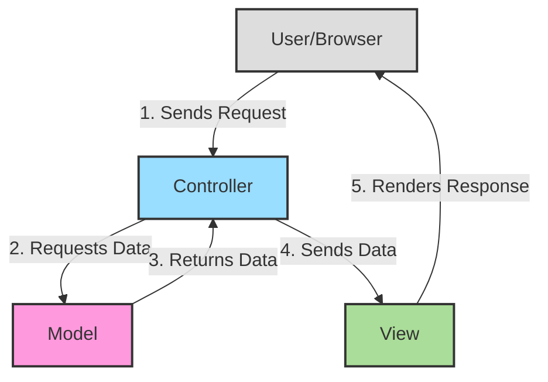
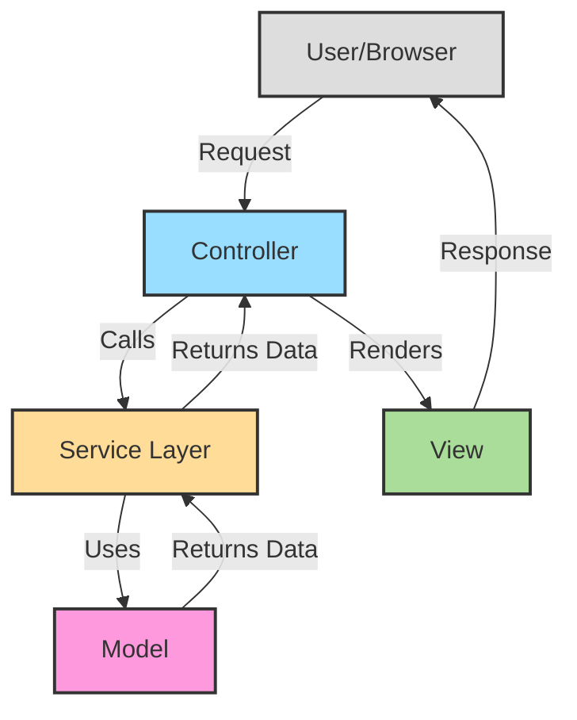

# PHP MVC Pattern

## Introduction

The Model-View-Controller (MVC) pattern is a fundamental architectural design pattern that helps developers organize their code in a structured and maintainable way. For PHP developers, understanding MVC is crucial, especially when working with popular frameworks like Laravel, CodeIgniter, or Symfony that implement this pattern.

In this tutorial, we'll explore the MVC pattern in PHP, understand its components, see how they interact, and build a simple MVC application from scratch. By the end, you'll understand why MVC is so widely used and how it can improve your PHP projects.

## What is MVC?

MVC is an architectural pattern that separates an application into three main logical components:

1. **Model**: Handles data logic and interacts with the database
2. **View**: Displays information to the user (the UI)
3. **Controller**: Processes user requests and acts as an intermediary between Model and View

This separation of concerns makes your code more organized, easier to maintain, and promotes code reusability.

Let's visualize the MVC pattern and how these components interact:



### Benefits of MVC in PHP

- **Separation of Concerns**: Each component has a specific responsibility
- **Code Organization**: Clear structure makes it easier to find and maintain code
- **Reusability**: Components can be reused across the application
- **Faster Development**: Multiple developers can work on different components simultaneously
- **Easier Testing**: Components can be tested independently
- **Better Security**: Input handling and validation can be centralized in controllers

## Components of MVC Pattern

### 1. Model

The Model represents your data structures and business logic. It:

- Interacts with the database
- Contains data validation rules
- Implements business logic
- Is independent of the user interface

Models should never directly interact with the View - this is the Controller's job.

### 2. View

The View is responsible for presenting data to the user. It:

- Contains HTML, CSS, and minimal PHP for displaying data
- Receives data from the Controller
- Should be passive and not contain business logic
- Can include templates and layout files

### 3. Controller

The Controller acts as the coordinator between Model and View. It:

- Processes user input
- Interacts with the Model to get or update data
- Selects the appropriate View to render
- Passes data from Model to View

## Building a Simple PHP MVC Application

Let's create a simple MVC application to manage a list of books. We'll build it step by step with a basic directory structure:

```
/simple-mvc-app/
├── config/
│   └── database.php
├── controllers/
│   ├── BookController.php
│   └── HomeController.php
├── models/
│   └── Book.php
├── views/
│   ├── books/
│   │   ├── index.php
│   │   ├── show.php
│   │   ├── create.php
│   │   └── edit.php
│   ├── home/
│   │   └── index.php
│   └── layouts/
│       └── main.php
├── .htaccess
└── index.php
```

### Step 1: Setting Up the Database Connection

First, let's create our database configuration:

```php
// config/database.php
<?php

return [
    'host' => 'localhost',
    'username' => 'root',
    'password' => '',
    'database' => 'mvc_books'
];
```

### Step 2: Creating the Model

Now let's create a Book model:

```php
// models/Book.php
<?php

class Book {
    private $db;
    
    public function __construct() {
        // Get database configuration
        $config = require_once 'config/database.php';
        
        // Connect to database
        $this->db = new mysqli(
            $config['host'],
            $config['username'],
            $config['password'],
            $config['database']
        );
        
        if ($this->db->connect_error) {
            die('Connection failed: ' . $this->db->connect_error);
        }
    }
    
    public function getAll() {
        $result = $this->db->query('SELECT * FROM books');
        return $result->fetch_all(MYSQLI_ASSOC);
    }
    
    public function getById($id) {
        $stmt = $this->db->prepare('SELECT * FROM books WHERE id = ?');
        $stmt->bind_param('i', $id);
        $stmt->execute();
        $result = $stmt->get_result();
        return $result->fetch_assoc();
    }
    
    public function create($title, $author, $description) {
        $stmt = $this->db->prepare('INSERT INTO books (title, author, description) VALUES (?, ?, ?)');
        $stmt->bind_param('sss', $title, $author, $description);
        return $stmt->execute();
    }
    
    public function update($id, $title, $author, $description) {
        $stmt = $this->db->prepare('UPDATE books SET title = ?, author = ?, description = ? WHERE id = ?');
        $stmt->bind_param('sssi', $title, $author, $description, $id);
        return $stmt->execute();
    }
    
    public function delete($id) {
        $stmt = $this->db->prepare('DELETE FROM books WHERE id = ?');
        $stmt->bind_param('i', $id);
        return $stmt->execute();
    }
}
```

### Step 3: Creating the Controllers

Let's create a HomeController and BookController:

```php
// controllers/HomeController.php
<?php

class HomeController {
    public function index() {
        // Load the view
        require_once 'views/layouts/main.php';
        require_once 'views/home/index.php';
    }
}
```

```php
// controllers/BookController.php
<?php

require_once 'models/Book.php';

class BookController {
    private $bookModel;
    
    public function __construct() {
        $this->bookModel = new Book();
    }
    
    public function index() {
        // Get all books from model
        $books = $this->bookModel->getAll();
        
        // Load the view with data
        require_once 'views/layouts/main.php';
        require_once 'views/books/index.php';
    }
    
    public function show($id) {
        // Get specific book from model
        $book = $this->bookModel->getById($id);
        
        // Load the view with data
        require_once 'views/layouts/main.php';
        require_once 'views/books/show.php';
    }
    
    public function create() {
        // Display the form
        require_once 'views/layouts/main.php';
        require_once 'views/books/create.php';
    }
    
    public function store() {
        // Get form data
        $title = $_POST['title'];
        $author = $_POST['author'];
        $description = $_POST['description'];
        
        // Validate form data
        if (empty($title) || empty($author)) {
            $error = "Title and author are required";
            require_once 'views/layouts/main.php';
            require_once 'views/books/create.php';
            return;
        }
        
        // Save to database via model
        $this->bookModel->create($title, $author, $description);
        
        // Redirect to book list
        header('Location: /books');
    }
    
    public function edit($id) {
        // Get book data
        $book = $this->bookModel->getById($id);
        
        // Load the form with book data
        require_once 'views/layouts/main.php';
        require_once 'views/books/edit.php';
    }
    
    public function update($id) {
        // Get form data
        $title = $_POST['title'];
        $author = $_POST['author'];
        $description = $_POST['description'];
        
        // Update via model
        $this->bookModel->update($id, $title, $author, $description);
        
        // Redirect to book details
        header('Location: /books/show/' . $id);
    }
    
    public function delete($id) {
        // Delete via model
        $this->bookModel->delete($id);
        
        // Redirect to book list
        header('Location: /books');
    }
}
```

### Step 4: Creating the Views

Let's create some views to display our data:

```php
// views/layouts/main.php
<!DOCTYPE html>
<html lang="en">
<head>
    <meta charset="UTF-8">
    <meta name="viewport" content="width=device-width, initial-scale=1.0">
    <title>PHP MVC Books</title>
    <link rel="stylesheet" href="https://cdn.jsdelivr.net/npm/bootstrap@5.2.3/dist/css/bootstrap.min.css">
</head>
<body>
    <nav class="navbar navbar-expand-lg navbar-dark bg-dark mb-4">
        <div class="container">
            <a class="navbar-brand" href="/">PHP MVC Example</a>
            <div class="collapse navbar-collapse">
                <ul class="navbar-nav me-auto">
                    <li class="nav-item">
                        <a class="nav-link" href="/">Home</a>
                    </li>
                    <li class="nav-item">
                        <a class="nav-link" href="/books">Books</a>
                    </li>
                </ul>
            </div>
        </div>
    </nav>
    
    <div class="container">
        <!-- Content will be inserted here -->
    </div>
    
    <script src="https://cdn.jsdelivr.net/npm/bootstrap@5.2.3/dist/js/bootstrap.bundle.min.js"></script>
</body>
</html>
```

```php
// views/home/index.php
<div class="jumbotron">
    <h1 class="display-4">Welcome to the PHP MVC Book Manager</h1>
    <p class="lead">This is a simple MVC application built in PHP.</p>
    <hr class="my-4">
    <p>Use the navigation to view, add, edit, and delete books.</p>
    <a class="btn btn-primary btn-lg" href="/books" role="button">View Books</a>
</div>
```

```php
// views/books/index.php
<h1>Book List</h1>

<a href="/books/create" class="btn btn-primary mb-3">Add New Book</a>

<?php if (empty($books)): ?>
    <div class="alert alert-info">No books available.</div>
<?php else: ?>
    <div class="row">
        <?php foreach ($books as $book): ?>
            <div class="col-md-4 mb-4">
                <div class="card">
                    <div class="card-body">
                        <h5 class="card-title"><?= htmlspecialchars($book['title']) ?></h5>
                        <h6 class="card-subtitle mb-2 text-muted">By <?= htmlspecialchars($book['author']) ?></h6>
                        <p class="card-text"><?= substr(htmlspecialchars($book['description']), 0, 100) ?>...</p>
                        <a href="/books/show/<?= $book['id'] ?>" class="btn btn-sm btn-info">View</a>
                        <a href="/books/edit/<?= $book['id'] ?>" class="btn btn-sm btn-warning">Edit</a>
                        <a href="/books/delete/<?= $book['id'] ?>" class="btn btn-sm btn-danger" onclick="return confirm('Are you sure?')">Delete</a>
                    </div>
                </div>
            </div>
        <?php endforeach; ?>
    </div>
<?php endif; ?>
```

```php
// views/books/show.php
<div class="card">
    <div class="card-header">
        <h1><?= htmlspecialchars($book['title']) ?></h1>
    </div>
    <div class="card-body">
        <h5 class="card-title">By <?= htmlspecialchars($book['author']) ?></h5>
        <p class="card-text"><?= nl2br(htmlspecialchars($book['description'])) ?></p>
        <a href="/books" class="btn btn-primary">Back to List</a>
        <a href="/books/edit/<?= $book['id'] ?>" class="btn btn-warning">Edit</a>
    </div>
</div>
```

```php
// views/books/create.php
<h1>Add New Book</h1>

<?php if (isset($error)): ?>
    <div class="alert alert-danger"><?= $error ?></div>
<?php endif; ?>

<form action="/books/store" method="post">
    <div class="mb-3">
        <label for="title" class="form-label">Title</label>
        <input type="text" class="form-control" id="title" name="title" value="<?= isset($_POST['title']) ? htmlspecialchars($_POST['title']) : '' ?>" required>
    </div>
    
    <div class="mb-3">
        <label for="author" class="form-label">Author</label>
        <input type="text" class="form-control" id="author" name="author" value="<?= isset($_POST['author']) ? htmlspecialchars($_POST['author']) : '' ?>" required>
    </div>
    
    <div class="mb-3">
        <label for="description" class="form-label">Description</label>
        <textarea class="form-control" id="description" name="description" rows="5"><?= isset($_POST['description']) ? htmlspecialchars($_POST['description']) : '' ?></textarea>
    </div>
    
    <button type="submit" class="btn btn-primary">Save Book</button>
    <a href="/books" class="btn btn-secondary">Cancel</a>
</form>
```

```php
// views/books/edit.php
<h1>Edit Book</h1>

<form action="/books/update/<?= $book['id'] ?>" method="post">
    <div class="mb-3">
        <label for="title" class="form-label">Title</label>
        <input type="text" class="form-control" id="title" name="title" value="<?= htmlspecialchars($book['title']) ?>" required>
    </div>
    
    <div class="mb-3">
        <label for="author" class="form-label">Author</label>
        <input type="text" class="form-control" id="author" name="author" value="<?= htmlspecialchars($book['author']) ?>" required>
    </div>
    
    <div class="mb-3">
        <label for="description" class="form-label">Description</label>
        <textarea class="form-control" id="description" name="description" rows="5"><?= htmlspecialchars($book['description']) ?></textarea>
    </div>
    
    <button type="submit" class="btn btn-primary">Update Book</button>
    <a href="/books" class="btn btn-secondary">Cancel</a>
</form>
```

### Step 5: Setting Up Routing

Finally, let's create a router in our main index.php file:

```php
// index.php
<?php

// Load controllers
require_once 'controllers/HomeController.php';
require_once 'controllers/BookController.php';

// Parse URL
$url = isset($_SERVER['PATH_INFO']) ? $_SERVER['PATH_INFO'] : '/';
$method = $_SERVER['REQUEST_METHOD'];

// Simple router
function route($url, $method) {
    // Home routes
    if ($url === '/' || $url === '/home') {
        $controller = new HomeController();
        $controller->index();
        return;
    }
    
    // Book routes
    if ($url === '/books') {
        $controller = new BookController();
        $controller->index();
        return;
    }
    
    if ($url === '/books/create') {
        $controller = new BookController();
        $controller->create();
        return;
    }
    
    if ($url === '/books/store' && $method === 'POST') {
        $controller = new BookController();
        $controller->store();
        return;
    }
    
    if (preg_match('/^\/books\/show\/(\d+)$/', $url, $matches)) {
        $controller = new BookController();
        $controller->show($matches[1]);
        return;
    }
    
    if (preg_match('/^\/books\/edit\/(\d+)$/', $url, $matches)) {
        $controller = new BookController();
        $controller->edit($matches[1]);
        return;
    }
    
    if (preg_match('/^\/books\/update\/(\d+)$/', $url, $matches) && $method === 'POST') {
        $controller = new BookController();
        $controller->update($matches[1]);
        return;
    }
    
    if (preg_match('/^\/books\/delete\/(\d+)$/', $url, $matches)) {
        $controller = new BookController();
        $controller->delete($matches[1]);
        return;
    }
    
    // 404 - Route not found
    echo 'Page not found';
}

// Process the route
route($url, $method);
```

### Step 6: Setting Up .htaccess

To make URLs cleaner, create an .htaccess file:

```
# .htaccess
RewriteEngine On
RewriteCond %{REQUEST_FILENAME} !-f
RewriteCond %{REQUEST_FILENAME} !-d
RewriteRule ^(.*)$ index.php/$1 [L]
```

### Step 7: Creating the Database

Don't forget to create your database:

```sql
CREATE DATABASE mvc_books;

USE mvc_books;

CREATE TABLE books (
    id INT AUTO_INCREMENT PRIMARY KEY,
    title VARCHAR(255) NOT NULL,
    author VARCHAR(255) NOT NULL,
    description TEXT,
    created_at TIMESTAMP DEFAULT CURRENT_TIMESTAMP
);

-- Sample data
INSERT INTO books (title, author, description) VALUES
('PHP Basics', 'John Doe', 'Learn the basics of PHP programming language'),
('MVC for Beginners', 'Jane Smith', 'A beginner-friendly guide to MVC pattern'),
('Database Design', 'Bob Johnson', 'How to design efficient databases for web applications');
```

## Real-World PHP MVC Frameworks

While building your own MVC framework is educational, in real-world projects, you'll likely use established PHP frameworks. Here are some popular ones:

1. **Laravel**: A full-featured framework with elegant syntax and built-in features
2. **Symfony**: A set of reusable PHP components and a framework
3. **CodeIgniter**: A lightweight framework known for its simplicity and performance
4. **Yii**: A high-performance framework that's ideal for large applications
5. **CakePHP**: A rapid development framework with built-in validation and security features

These frameworks implement the MVC pattern and provide additional tools like:

- Object-Relational Mapping (ORM)
- Template engines
- Authentication and authorization
- Routing systems
- Testing utilities
- Command-line interfaces

## Advanced MVC Concepts

### 1. Front Controller Pattern

Many PHP MVC frameworks use the Front Controller pattern where all requests go through a single entry point (usually index.php). This provides:
- Centralized request handling
- Consistent application flow
- Better security

### 2. Service Layer

Adding a Service Layer between Controllers and Models can:
- Further separate business logic from data access
- Make code more reusable and testable
- Allow for transaction management



### 3. Repository Pattern

The Repository pattern adds an abstraction layer between Models and the database:
- Makes switching database engines easier
- Centralizes data access logic
- Improves testability

## Summary

The MVC pattern is a powerful architectural approach that helps PHP developers build maintainable, scalable web applications. By separating concerns into Models, Views, and Controllers, your code becomes more organized and easier to manage.

In this tutorial, we've:
- Explored the core concepts of MVC
- Built a simple MVC application from scratch
- Examined how data flows through the different components
- Introduced advanced MVC concepts
- Looked at popular PHP MVC frameworks

By adopting MVC principles in your PHP projects, you'll create more structured, reusable, and maintainable code that can grow with your application's needs.

## Additional Resources

### Books
- "PHP Objects, Patterns, and Practice" by Matt Zandstra
- "Laravel: Up & Running" by Matt Stauffer
- "Modern PHP" by Josh Lockhart

### Online Resources
- [PHP.net Official Documentation](https://www.php.net/docs.php)
- [Laravel Documentation](https://laravel.com/docs)
- [Symfony Documentation](https://symfony.com/doc)
- [PHP The Right Way](https://phptherightway.com/)

## Exercises

1. **MVC Identification**: Look at a PHP project and identify which parts belong to Model, View, and Controller.
2. **Extend the Book Application**: Add features like user registration, comments on books, or book categories.
3. **Framework Exploration**: Install Laravel or CodeIgniter and explore how they implement MVC.
4. **Refactor a Project**: Take a procedural PHP project and refactor it to use MVC.
5. **Build a REST API**: Create a RESTful API using the MVC pattern that returns JSON responses.