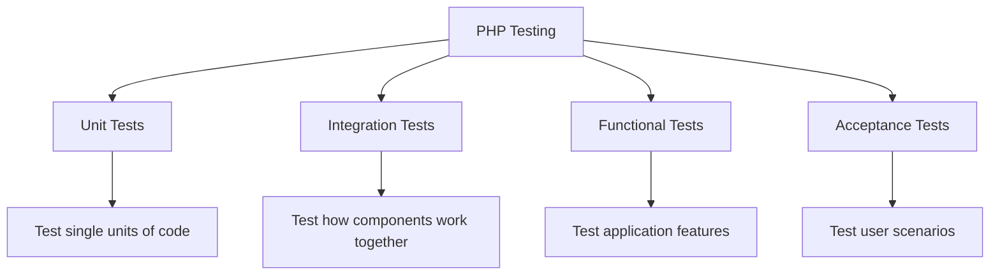
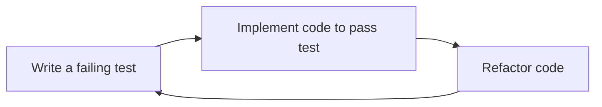

# PHP Testing Introduction

## What is Testing in PHP?

Testing is the process of evaluating a software application to find bugs, ensure functionality works as expected, and verify that the code meets specified requirements. In PHP development, testing is a crucial practice that helps maintain code quality and prevent regression issues as your application grows.

## Why Testing Matters

Imagine building a house without inspecting the foundation, electrical wiring, or plumbing. You might move in only to discover leaky pipes or faulty wiring weeks later. Similarly, releasing untested code can lead to:

- Unexpected bugs in production
- Security vulnerabilities
- Difficulty maintaining and extending code
- Poor user experience
- Higher long-term costs

### Benefits of Testing PHP Applications

- **Early Bug Detection**: Find and fix issues before they reach production
- **Code Confidence**: Make changes to existing code without fear of breaking functionality
- **Documentation**: Tests serve as executable documentation showing how code should work
- **Design Improvement**: Testing often leads to better, more modular code architecture
- **Easier Maintenance**: Well-tested code is easier to understand and modify

## Types of PHP Tests



### Unit Testing

Unit tests focus on testing individual units of code in isolation, typically a single function or method. These tests verify that each unit performs as expected.

```php
// Function to test
function add($a, $b) {
    return $a + $b;
}

// Unit test using PHPUnit
public function testAddFunction() {
    $result = add(2, 3);
    $this->assertEquals(5, $result);
}
```

### Integration Testing

Integration tests examine how different components of your application work together, such as testing database interactions or API calls.

```php
// Integration test example
public function testUserSavedToDatabase() {
    $user = new User('john_doe', 'secret123');
    $userRepository = new UserRepository($this->database);
    
    $userRepository->save($user);
    
    $savedUser = $userRepository->findByUsername('john_doe');
    $this->assertEquals('john_doe', $savedUser->username);
}
```

### Functional Testing

Functional tests verify that features work as expected from the user's perspective. They test complete functionality rather than individual components.

### Acceptance Testing

Acceptance tests ensure the application meets user requirements and behaves as expected in real-world scenarios.

## Testing Tools in PHP

PHP has several popular testing frameworks:

### PHPUnit

PHPUnit is the most widely used testing framework for PHP. It provides a comprehensive set of tools for writing and running unit tests.

#### Basic PHPUnit Example

Let's create a simple calculator class and test it with PHPUnit:

```php
// src/Calculator.php
class Calculator {
    public function add($a, $b) {
        return $a + $b;
    }
    
    public function subtract($a, $b) {
        return $a - $b;
    }
    
    public function multiply($a, $b) {
        return $a * $b;
    }
    
    public function divide($a, $b) {
        if ($b == 0) {
            throw new InvalidArgumentException('Cannot divide by zero');
        }
        return $a / $b;
    }
}
```

```php
// tests/CalculatorTest.php
use PHPUnit\Framework\TestCase;

class CalculatorTest extends TestCase {
    private $calculator;
    
    protected function setUp(): void {
        $this->calculator = new Calculator();
    }
    
    public function testAdd() {
        $result = $this->calculator->add(5, 3);
        $this->assertEquals(8, $result);
    }
    
    public function testSubtract() {
        $result = $this->calculator->subtract(10, 4);
        $this->assertEquals(6, $result);
    }
    
    public function testMultiply() {
        $result = $this->calculator->multiply(3, 4);
        $this->assertEquals(12, $result);
    }
    
    public function testDivide() {
        $result = $this->calculator->divide(10, 2);
        $this->assertEquals(5, $result);
    }
    
    public function testDivideByZero() {
        $this->expectException(InvalidArgumentException::class);
        $this->calculator->divide(10, 0);
    }
}
```

### Running PHPUnit Tests

Once you have PHPUnit installed via Composer, you can run your tests with:

```bash
# Run all tests
./vendor/bin/phpunit

# Run specific test file
./vendor/bin/phpunit tests/CalculatorTest.php
```

The output will show which tests passed and failed:

```
PHPUnit 9.5.10 by Sebastian Bergmann and contributors.

.....                                                               5 / 5 (100%)

Time: 00:00.003, Memory: 4.00 MB

OK (5 tests, 5 assertions)
```

### Other PHP Testing Tools

- **Pest**: A modern testing framework with a simpler syntax built on top of PHPUnit
- **Codeception**: End-to-end testing framework supporting unit, functional, and acceptance tests
- **PHPSpec**: A specification-oriented BDD (Behavior-Driven Development) framework
- **Behat**: A BDD framework for writing feature tests in plain language

## Test-Driven Development (TDD)

Test-Driven Development is a development approach where you:

1. Write a failing test for a new feature
2. Implement the code to make the test pass
3. Refactor the code while keeping tests passing



### TDD Example in PHP

Let's implement a `StringCalculator` class using TDD:

1. **Write a failing test first**:

```php
// tests/StringCalculatorTest.php
use PHPUnit\Framework\TestCase;

class StringCalculatorTest extends TestCase {
    public function testEmptyStringReturnsZero() {
        $calculator = new StringCalculator();
        $this->assertEquals(0, $calculator->add(""));
    }
}
```

2. **Implement the code to make the test pass**:

```php
// src/StringCalculator.php
class StringCalculator {
    public function add($numbers) {
        if (empty($numbers)) {
            return 0;
        }
    }
}
```

3. **Write another test**:

```php
public function testSingleNumberReturnsValue() {
    $calculator = new StringCalculator();
    $this->assertEquals(1, $calculator->add("1"));
}
```

4. **Update the implementation**:

```php
public function add($numbers) {
    if (empty($numbers)) {
        return 0;
    }
    return intval($numbers);
}
```

5. **Continue with more tests and implementation**:

```php
public function testTwoNumbersCommaDelimitedReturnsSum() {
    $calculator = new StringCalculator();
    $this->assertEquals(3, $calculator->add("1,2"));
}
```

```php
public function add($numbers) {
    if (empty($numbers)) {
        return 0;
    }
    
    $delimiters = [","];
    $nums = str_replace($delimiters, ",", $numbers);
    $nums = explode(",", $nums);
    
    return array_sum(array_map('intval', $nums));
}
```

## Setting Up a PHP Testing Environment

### Installing PHPUnit

1. **Using Composer**:

```bash
# Create composer.json if it doesn't exist
composer init

# Add PHPUnit as a dev dependency
composer require --dev phpunit/phpunit

# Create phpunit.xml configuration
```

2. **Sample phpunit.xml**:

```xml
<?xml version="1.0" encoding="UTF-8"?>
<phpunit bootstrap="vendor/autoload.php"
         colors="true"
         verbose="true">
    <testsuites>
        <testsuite name="Unit Tests">
            <directory>tests</directory>
        </testsuite>
    </testsuites>
    <coverage>
        <include>
            <directory suffix=".php">src</directory>
        </include>
    </coverage>
</phpunit>
```

3. **Directory Structure**:

```
project-root/
├── src/
│   └── Calculator.php
├── tests/
│   └── CalculatorTest.php
├── vendor/
├── composer.json
└── phpunit.xml
```

## Best Practices for PHP Testing

1. **Write Testable Code**: Keep classes small, follow SOLID principles
2. **Test in Isolation**: Use mocks and stubs for dependencies
3. **Descriptive Test Names**: Name tests to describe what they verify
4. **One Assertion Per Test**: Focus each test on a single behavior
5. **Keep Tests Fast**: Tests should run quickly to provide rapid feedback
6. **Test Edge Cases**: Include tests for boundary and error conditions
7. **Maintain Test Coverage**: Aim for high code coverage (70-80% or more)

## Example: Testing a User Registration System

Let's see a more complete example of testing a user registration system:

```php
// src/UserRegistration.php
class UserRegistration {
    private $userRepository;
    private $emailService;
    
    public function __construct(UserRepository $userRepository, EmailService $emailService) {
        $this->userRepository = $userRepository;
        $this->emailService = $emailService;
    }
    
    public function register($username, $email, $password) {
        // Validate inputs
        if (strlen($username) < 3) {
            throw new InvalidArgumentException('Username must be at least 3 characters');
        }
        
        if (!filter_var($email, FILTER_VALIDATE_EMAIL)) {
            throw new InvalidArgumentException('Invalid email format');
        }
        
        if (strlen($password) < 8) {
            throw new InvalidArgumentException('Password must be at least 8 characters');
        }
        
        // Check if user already exists
        if ($this->userRepository->findByEmail($email)) {
            throw new Exception('Email already registered');
        }
        
        // Create user
        $user = new User($username, $email, password_hash($password, PASSWORD_DEFAULT));
        $this->userRepository->save($user);
        
        // Send welcome email
        $this->emailService->sendWelcomeEmail($email, $username);
        
        return $user;
    }
}
```

```php
// tests/UserRegistrationTest.php
use PHPUnit\Framework\TestCase;

class UserRegistrationTest extends TestCase {
    private $userRepository;
    private $emailService;
    private $registration;
    
    protected function setUp(): void {
        // Create mock objects
        $this->userRepository = $this->createMock(UserRepository::class);
        $this->emailService = $this->createMock(EmailService::class);
        
        // Create system under test
        $this->registration = new UserRegistration(
            $this->userRepository,
            $this->emailService
        );
    }
    
    public function testValidUserRegistration() {
        // Configure mocks
        $this->userRepository->method('findByEmail')
            ->with('john@example.com')
            ->willReturn(null); // User doesn't exist yet
            
        $this->userRepository->expects($this->once())
            ->method('save');
            
        $this->emailService->expects($this->once())
            ->method('sendWelcomeEmail')
            ->with('john@example.com', 'john_doe');
        
        // Execute test
        $user = $this->registration->register('john_doe', 'john@example.com', 'password123');
        
        // Assertions
        $this->assertEquals('john_doe', $user->getUsername());
        $this->assertEquals('john@example.com', $user->getEmail());
    }
    
    public function testUsernameTooShort() {
        $this->expectException(InvalidArgumentException::class);
        $this->expectExceptionMessage('Username must be at least 3 characters');
        
        $this->registration->register('jo', 'john@example.com', 'password123');
    }
    
    public function testInvalidEmail() {
        $this->expectException(InvalidArgumentException::class);
        $this->expectExceptionMessage('Invalid email format');
        
        $this->registration->register('john_doe', 'invalid-email', 'password123');
    }
    
    public function testPasswordTooShort() {
        $this->expectException(InvalidArgumentException::class);
        $this->expectExceptionMessage('Password must be at least 8 characters');
        
        $this->registration->register('john_doe', 'john@example.com', 'short');
    }
    
    public function testEmailAlreadyRegistered() {
        // Configure mock to simulate existing user
        $this->userRepository->method('findByEmail')
            ->with('john@example.com')
            ->willReturn(new User('existing_user', 'john@example.com', 'hashed_password'));
            
        $this->expectException(Exception::class);
        $this->expectExceptionMessage('Email already registered');
        
        $this->registration->register('john_doe', 'john@example.com', 'password123');
    }
}
```

## Summary

Testing is an essential part of modern PHP development that ensures code quality, prevents bugs, and makes maintenance easier. In this introduction, we've covered:

- The importance and benefits of testing
- Different types of PHP tests (unit, integration, functional, acceptance)
- Popular PHP testing frameworks, with a focus on PHPUnit
- Test-Driven Development (TDD) approach
- Setting up a PHP testing environment
- Best practices for effective testing
- Real-world examples of testing PHP code

By implementing testing in your PHP projects, you'll build more reliable applications, catch issues early, and gain confidence in your code as it evolves.

## Additional Resources

- [PHPUnit Documentation](https://phpunit.de/documentation.html)
- [PHP Testing Jargon](https://phpunit.de/resources.html)
- [Test-Driven Development by Example](https://www.amazon.com/Test-Driven-Development-Kent-Beck/dp/0321146530) by Kent Beck
- [Pest PHP Testing Framework](https://pestphp.com/)
- [Codeception PHP Testing Framework](https://codeception.com/)

## Exercises

1. Install PHPUnit in an existing PHP project and write your first test
2. Create a simple `StringUtility` class with methods for `reverse()`, `capitalize()`, and `countWords()` - then write tests for each method
3. Practice TDD by writing tests first for a `ShoppingCart` class that should support adding items, removing items, and calculating the total
4. Create mocks to test a class that depends on a database or API service
5. Add PHPUnit to your continuous integration pipeline (GitHub Actions, Travis CI, etc.)