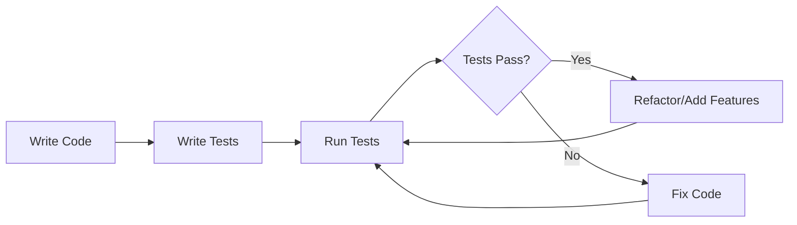
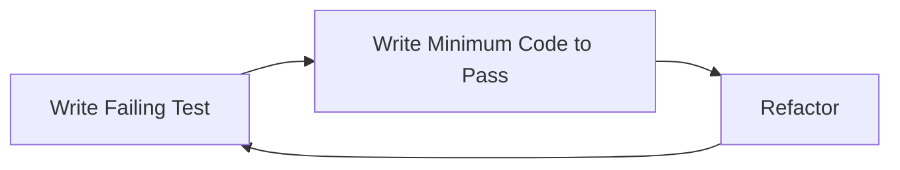
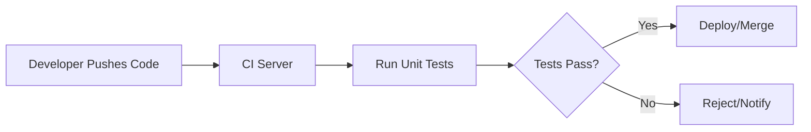

# PHP Unit Testing

## Introduction

Unit testing is a fundamental practice in modern software development that involves testing individual components or "units" of code in isolation. In PHP, unit testing helps ensure that each function, method, or class behaves exactly as expected, making your applications more reliable and easier to maintain.

This guide will introduce you to PHP unit testing using PHPUnit, the most popular testing framework for PHP. By the end, you'll understand how to write effective unit tests, run them, and interpret their results.

## What is Unit Testing?

Unit testing is the practice of testing small, isolated pieces of code (units) to verify they function correctly. A "unit" typically refers to a single function, method, or class. By testing each unit in isolation, you can:

- Catch bugs early in the development process
- Refactor with confidence
- Document how your code should behave
- Create more maintainable and modular code



## Getting Started with PHPUnit

[PHPUnit](https://phpunit.de/) is the de facto standard for unit testing in PHP. Let's start by setting it up in your project.

### Installation

The recommended way to install PHPUnit is through Composer:

```bash
composer require --dev phpunit/phpunit ^10.0
```

This adds PHPUnit as a development dependency to your project.

### Creating Your First Test

Let's create a simple PHP class to test. Save this as `src/Calculator.php`:

```php
<?php
// src/Calculator.php
namespace App;

class Calculator
{
    public function add($a, $b)
    {
        return $a + $b;
    }
    
    public function subtract($a, $b)
    {
        return $a - $b;
    }
    
    public function multiply($a, $b)
    {
        return $a * $b;
    }
    
    public function divide($a, $b)
    {
        if ($b == 0) {
            throw new \InvalidArgumentException("Cannot divide by zero");
        }
        return $a / $b;
    }
}
```

Now, let's write a test for this class. Save this as `tests/CalculatorTest.php`:

```php
<?php
// tests/CalculatorTest.php
use PHPUnit\Framework\TestCase;
use App\Calculator;

class CalculatorTest extends TestCase
{
    private $calculator;
    
    protected function setUp(): void
    {
        $this->calculator = new Calculator();
    }
    
    public function testAdd()
    {
        $this->assertEquals(4, $this->calculator->add(2, 2));
        $this->assertEquals(0, $this->calculator->add(-2, 2));
        $this->assertEquals(-4, $this->calculator->add(-2, -2));
    }
    
    public function testSubtract()
    {
        $this->assertEquals(0, $this->calculator->subtract(2, 2));
        $this->assertEquals(-4, $this->calculator->subtract(-2, 2));
        $this->assertEquals(0, $this->calculator->subtract(-2, -2));
    }
}
```

### Running Your Tests

Create a file named `phpunit.xml` in your project root:

```xml
<?xml version="1.0" encoding="UTF-8"?>
<phpunit
    bootstrap="vendor/autoload.php"
    colors="true"
    verbose="true">
    <testsuites>
        <testsuite name="My Test Suite">
            <directory>tests</directory>
        </testsuite>
    </testsuites>
</phpunit>
```

Now run PHPUnit from the command line:

```bash
./vendor/bin/phpunit
```

You should see output similar to:

```
PHPUnit 10.0.0 by Sebastian Bergmann and contributors.

..                                                                  2 / 2 (100%)

Time: 00:00.002, Memory: 4.00 MB

OK (2 tests, 6 assertions)
```

Congratulations! You've just written and run your first PHP unit tests.

## Understanding PHPUnit Assertions

Assertions are how you verify that your code behaves as expected. PHPUnit provides many assertion methods:

| Assertion | Description |
|-----------|-------------|
| `assertEquals($expected, $actual)` | Checks if two values are equal |
| `assertTrue($condition)` | Checks if a condition is true |
| `assertFalse($condition)` | Checks if a condition is false |
| `assertNull($actual)` | Checks if a value is null |
| `assertContains($needle, $haystack)` | Checks if an array contains a value |
| `assertCount($expectedCount, $haystack)` | Checks if an array has the expected number of elements |
| `expectException($exceptionName)` | Verifies that a specific exception is thrown |

Let's add more tests to our `CalculatorTest.php`:

```php
public function testMultiply()
{
    $this->assertEquals(4, $this->calculator->multiply(2, 2));
    $this->assertEquals(-4, $this->calculator->multiply(2, -2));
    $this->assertEquals(0, $this->calculator->multiply(0, 5));
}

public function testDivide()
{
    $this->assertEquals(1, $this->calculator->divide(2, 2));
    $this->assertEquals(2.5, $this->calculator->divide(5, 2));
}

public function testDivideByZero()
{
    $this->expectException(\InvalidArgumentException::class);
    $this->calculator->divide(5, 0);
}
```

## Test-Driven Development (TDD)

Test-Driven Development is a development approach where you write tests before writing the actual code. The process follows these steps:

1. Write a failing test for a feature
2. Write the minimum code required to make the test pass
3. Refactor the code while ensuring the tests continue to pass



### TDD Example

Let's add a new feature to our `Calculator` class using TDD. We want to add a `power` method that calculates a number raised to a power.

First, write the test:

```php
public function testPower()
{
    $this->assertEquals(4, $this->calculator->power(2, 2));
    $this->assertEquals(1, $this->calculator->power(5, 0));
    $this->assertEquals(25, $this->calculator->power(5, 2));
    $this->assertEquals(0.25, $this->calculator->power(2, -2));
}
```

If you run this test, it will fail because we haven't implemented the `power` method yet. Now, let's implement the minimum code required to make the test pass:

```php
// Add this to the Calculator class
public function power($a, $b)
{
    return pow($a, $b);
}
```

Now the test should pass!

## Testing More Complex Scenarios

Real-world applications often have more complex dependencies and behaviors. Let's explore some more advanced testing techniques.

### Mocking Dependencies

When a class depends on other classes, you might want to replace those dependencies with mock objects to isolate the unit being tested.

Let's create a `ProductService` class that depends on a `ProductRepository`:

```php
<?php
// src/ProductRepository.php
namespace App;

class ProductRepository
{
    public function findById($id)
    {
        // In a real application, this would query a database
        // For simplicity, we'll return hardcoded data
        $products = [
            1 => ['id' => 1, 'name' => 'iPhone', 'price' => 999],
            2 => ['id' => 2, 'name' => 'iPad', 'price' => 799],
        ];
        
        return isset($products[$id]) ? $products[$id] : null;
    }
}

// src/ProductService.php
namespace App;

class ProductService
{
    private $repository;
    
    public function __construct(ProductRepository $repository)
    {
        $this->repository = $repository;
    }
    
    public function getProductPrice($id)
    {
        $product = $this->repository->findById($id);
        
        if (!$product) {
            throw new \Exception("Product not found");
        }
        
        return $product['price'];
    }
    
    public function applyDiscount($id, $percentage)
    {
        $product = $this->repository->findById($id);
        
        if (!$product) {
            throw new \Exception("Product not found");
        }
        
        return $product['price'] * (1 - $percentage / 100);
    }
}
```

Now, let's test the `ProductService` using mocks:

```php
<?php
// tests/ProductServiceTest.php
use PHPUnit\Framework\TestCase;
use App\ProductService;
use App\ProductRepository;

class ProductServiceTest extends TestCase
{
    public function testGetProductPrice()
    {
        // Create a mock of the ProductRepository
        $repository = $this->createMock(ProductRepository::class);
        
        // Configure the mock to return a specific value when findById is called with argument 1
        $repository->method('findById')
            ->with(1)
            ->willReturn(['id' => 1, 'name' => 'iPhone', 'price' => 999]);
        
        // Inject the mock into the ProductService
        $service = new ProductService($repository);
        
        // Call the method we want to test
        $price = $service->getProductPrice(1);
        
        // Assert that the result is what we expect
        $this->assertEquals(999, $price);
    }
    
    public function testGetProductPriceForNonExistentProduct()
    {
        // Create a mock of the ProductRepository
        $repository = $this->createMock(ProductRepository::class);
        
        // Configure the mock to return null (product not found)
        $repository->method('findById')
            ->with(999)
            ->willReturn(null);
        
        // Inject the mock into the ProductService
        $service = new ProductService($repository);
        
        // Expect an exception when trying to get the price of a non-existent product
        $this->expectException(\Exception::class);
        $this->expectExceptionMessage("Product not found");
        
        // Call the method that should throw an exception
        $service->getProductPrice(999);
    }
    
    public function testApplyDiscount()
    {
        // Create a mock of the ProductRepository
        $repository = $this->createMock(ProductRepository::class);
        
        // Configure the mock to return a specific value
        $repository->method('findById')
            ->with(1)
            ->willReturn(['id' => 1, 'name' => 'iPhone', 'price' => 1000]);
        
        // Inject the mock into the ProductService
        $service = new ProductService($repository);
        
        // Call the method we want to test with a 20% discount
        $discountedPrice = $service->applyDiscount(1, 20);
        
        // Assert that the result is what we expect (1000 * 0.8 = 800)
        $this->assertEquals(800, $discountedPrice);
    }
}
```

### Data Providers

When you need to run the same test with different sets of data, you can use data providers:

```php
<?php
// tests/CalculatorTest.php (additional method)

/**
 * @dataProvider additionProvider
 */
public function testAddWithDataProvider($a, $b, $expected)
{
    $this->assertEquals($expected, $this->calculator->add($a, $b));
}

public function additionProvider()
{
    return [
        'positive numbers' => [1, 2, 3],
        'negative numbers' => [-1, -2, -3],
        'mixed numbers' => [-1, 2, 1],
        'zeros' => [0, 0, 0],
    ];
}
```

## Best Practices for Unit Testing

1. **Follow the AAA pattern**: Arrange, Act, Assert
   - Arrange: Set up your test environment
   - Act: Perform the action you're testing
   - Assert: Verify the results

2. **Test one thing per test**: Each test method should test one specific behavior

3. **Use meaningful test names**: The test name should clearly indicate what's being tested

4. **Make tests independent**: Each test should be able to run independently without relying on other tests

5. **Keep tests fast**: Unit tests should execute quickly to provide rapid feedback

6. **Use test fixtures**: Use the setUp and tearDown methods to prepare and clean up the test environment

## Continuous Integration

Integrate unit tests into your continuous integration pipeline to run them automatically every time you push code:



## Common Testing Tools and Extensions

- **PHPUnit_MockObject**: Included with PHPUnit for creating mock objects
- **Prophecy**: An alternative mocking framework
- **PHP_CodeCoverage**: Generates code coverage reports to see how much of your code is tested
- **Infection**: A mutation testing framework to ensure the quality of your tests

## Summary

Unit testing is a crucial practice for building reliable PHP applications. In this guide, we've covered:

- The basics of unit testing and its benefits
- Setting up PHPUnit and writing your first tests
- Using assertions to verify expected behavior
- Test-Driven Development (TDD)
- Testing complex code with mock objects
- Using data providers for more efficient tests
- Best practices for effective unit testing

By implementing unit tests in your PHP projects, you'll catch bugs earlier, improve your code quality, and build more maintainable applications.

## Additional Resources

- [PHPUnit Documentation](https://phpunit.de/documentation.html)
- [Test-Driven Development by Example](https://www.amazon.com/Test-Driven-Development-Kent-Beck/dp/0321146530) by Kent Beck
- [PHP Testing Jargon](https://phpunit.de/resources.html)
- [Mockery Documentation](http://docs.mockery.io/en/latest/) - Alternative mocking library

## Exercises

1. Add more tests to the `Calculator` class (e.g., for a square root method)
2. Create a `User` class with validation methods and write tests for it
3. Practice TDD by writing tests first for a `StringHelper` class with methods like `reverse()`, `isPalindrome()`, and `countWords()`
4. Extend the `ProductService` to include methods for calculating tax and shipping, and write tests for them
5. Create a simple API client class that makes HTTP requests and test it using mocks