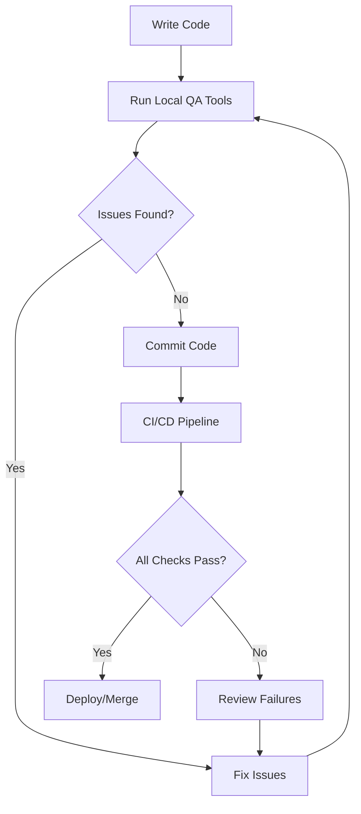

# PHP Quality Assurance

## Introduction

Quality Assurance (QA) is a critical aspect of PHP development that ensures your applications are reliable, maintainable, and free from defects. Unlike testing, which focuses on identifying bugs, quality assurance encompasses a broader set of practices aimed at preventing issues before they occur. For beginners embarking on their PHP journey, understanding QA principles will help you develop better code from the start and build a solid foundation for your programming career.

In this guide, we'll explore various quality assurance techniques and tools specifically for PHP development. You'll learn how to implement code standards, perform static analysis, measure code coverage, and integrate these practices into your development workflow.

## Why Quality Assurance Matters in PHP

PHP's flexibility can be both a blessing and a curse. Without proper quality control measures, PHP projects can quickly become difficult to maintain. Here's why QA is particularly important for PHP development:

1. **PHP is dynamically typed**: Variables can change type during execution, making it easier to introduce subtle bugs
2. **PHP has evolved rapidly**: Different coding styles exist across versions and projects
3. **PHP powers many critical web applications**: Ensuring their reliability is essential

## Essential PHP Quality Assurance Practices

### 1. Coding Standards

Consistent coding standards make your code more readable and easier to maintain. In the PHP world, PSR (PHP Standards Recommendations) provides widely-accepted standards.

#### Example: Implementing PSR-12 Coding Style

```php
// Bad practice - inconsistent style
function calculateTotal($items) {
    $total=0;
    foreach($items as $item){
        $total+=$item->price;
    }
    return $total;
}

// Good practice - following PSR-12
function calculateTotal(array $items): float
{
    $total = 0.0;
    
    foreach ($items as $item) {
        $total += $item->price;
    }
    
    return $total;
}
```

### 2. Static Code Analysis

Static analysis tools examine your code without executing it, identifying potential bugs, security vulnerabilities, and style issues.

#### PHP Code Sniffer

PHP_CodeSniffer is a tool that detects violations of coding standards.

```bash
# Installing PHP_CodeSniffer
composer require --dev squizlabs/php_codesniffer

# Running PHP_CodeSniffer
./vendor/bin/phpcs --standard=PSR12 src/
```

Example output:

```
FILE: src/Calculator.php
----------------------------------------------------------------------
FOUND 3 ERRORS AFFECTING 2 LINES
----------------------------------------------------------------------
 12 | ERROR | [x] Line indented incorrectly; expected 4 spaces, found 2
 15 | ERROR | [x] Expected 1 space after comma in function call
 15 | ERROR | [x] Space after opening parenthesis of function call prohibited
----------------------------------------------------------------------
```

#### PHPStan

PHPStan performs deep static analysis to find errors that aren't immediately obvious.

```bash
# Installing PHPStan
composer require --dev phpstan/phpstan

# Running PHPStan
./vendor/bin/phpstan analyse src/ --level=5
```

Example output:

```
 ------ ---------------------------------------------------------------------------- 
  Line   src/Calculator.php                                                          
 ------ ---------------------------------------------------------------------------- 
  23     Parameter #1 $price of method Calculator::applyDiscount() expects float,    
         int given.                                                                  
 ------ ---------------------------------------------------------------------------- 
```

### 3. PHP Mess Detector (PHPMD)

PHPMD identifies potential problems like:
- Unused variables or parameters
- Overcomplicated expressions
- Suboptimal code

```bash
# Installing PHPMD
composer require --dev phpmd/phpmd

# Running PHPMD
./vendor/bin/phpmd src/ text cleancode,codesize,controversial,design,naming
```

Example output:

```
src/UserManager.php:56  The method createUser() has 15 lines of code. Consider refactoring.
src/UserManager.php:78  Avoid variables with short names like $u. Configured minimum length is 3.
```

### 4. Code Coverage Analysis

Code coverage helps you understand how much of your code is tested.

```php
// UserValidator.php
class UserValidator
{
    public function validateEmail(string $email): bool
    {
        if (empty($email)) {
            return false;
        }
        
        return filter_var($email, FILTER_VALIDATE_EMAIL) !== false;
    }
    
    public function validateUsername(string $username): bool
    {
        return strlen($username) >= 5 && preg_match('/^[a-zA-Z0-9_]+$/', $username);
    }
}
```

```php
// UserValidatorTest.php
use PHPUnit\Framework\TestCase;

class UserValidatorTest extends TestCase
{
    private UserValidator $validator;
    
    protected function setUp(): void
    {
        $this->validator = new UserValidator();
    }
    
    public function testValidEmail(): void
    {
        $this->assertTrue($this->validator->validateEmail('user@example.com'));
    }
    
    public function testInvalidEmail(): void
    {
        $this->assertFalse($this->validator->validateEmail('not-an-email'));
    }
    
    // Missing test for empty email
    // Missing tests for validateUsername
}
```

Running PHPUnit with coverage:

```bash
./vendor/bin/phpunit --coverage-html coverage/ tests/
```

This would generate a report showing that `validateUsername()` is not tested at all, and the empty email case in `validateEmail()` is also not covered.

## Continuous Integration for PHP Projects

Continuous Integration (CI) automates the process of quality checks whenever code changes are made.

Here's a simple GitHub Actions workflow for a PHP project:

```yaml
name: PHP QA

on:
  push:
    branches: [ main ]
  pull_request:
    branches: [ main ]

jobs:
  quality:
    runs-on: ubuntu-latest
    
    steps:
    - uses: actions/checkout@v3
    
    - name: Setup PHP
      uses: shivammathur/setup-php@v2
      with:
        php-version: '8.1'
        tools: composer:v2
        
    - name: Install dependencies
      run: composer install --prefer-dist --no-progress
      
    - name: Check coding standards
      run: vendor/bin/phpcs --standard=PSR12 src/
      
    - name: Static analysis
      run: vendor/bin/phpstan analyse src/ --level=5
      
    - name: Run tests
      run: vendor/bin/phpunit
```

## Setting Up a Complete QA Workflow

Let's put everything together into a comprehensive QA workflow for a PHP project:



### Practical Example: Implementing QA in a PHP Project

Let's walk through setting up QA for a simple PHP project:

1. **Initialize a new project**

```bash
mkdir my-php-project
cd my-php-project
composer init
```

2. **Install QA tools**

```bash
composer require --dev phpunit/phpunit
composer require --dev squizlabs/php_codesniffer
composer require --dev phpstan/phpstan
composer require --dev phpmd/phpmd
```

3. **Create configuration files**

Create `phpcs.xml`:

```xml
<?xml version="1.0"?>
<ruleset name="PHP_CodeSniffer">
    <description>The coding standard for our project.</description>
    <rule ref="PSR12"/>
    <file>src</file>
    <exclude-pattern>vendor/*</exclude-pattern>
</ruleset>
```

Create `phpstan.neon`:

```yaml
parameters:
    level: 5
    paths:
        - src
```

4. **Add Composer scripts**

Update `composer.json`:

```json
{
    "scripts": {
        "test": "phpunit",
        "phpcs": "phpcs",
        "phpstan": "phpstan analyse",
        "phpmd": "phpmd src text cleancode,codesize,controversial,design,naming",
        "qa": [
            "@phpcs",
            "@phpstan",
            "@phpmd",
            "@test"
        ]
    }
}
```

5. **Use it**

```bash
# Run all QA checks
composer qa

# Or run individual checks
composer phpcs
composer phpstan
composer test
```

## Quality Assurance Tools Summary

Here's a quick reference to the most important PHP QA tools:

| Tool | Purpose | Installation |
|------|---------|-------------|
| PHPUnit | Testing framework | `composer require --dev phpunit/phpunit` |
| PHP_CodeSniffer | Coding standards | `composer require --dev squizlabs/php_codesniffer` |
| PHPStan | Static analysis | `composer require --dev phpstan/phpstan` |
| PHPMD | Mess detection | `composer require --dev phpmd/phpmd` |
| PHP-CS-Fixer | Auto-fix coding standards | `composer require --dev friendsofphp/php-cs-fixer` |
| Psalm | Static analysis | `composer require --dev vimeo/psalm` |

## Common Quality Issues in PHP Code

Beginners often encounter these quality issues:

1. **Inconsistent naming conventions**
   ```php
   // Inconsistent
   function get_user_data() { /* ... */ }
   function fetchOrderDetails() { /* ... */ }
   
   // Consistent (camelCase)
   function getUserData() { /* ... */ }
   function fetchOrderDetails() { /* ... */ }
   ```

2. **Poor error handling**
   ```php
   // Poor error handling
   $result = $database->query($sql);
   $row = $result->fetch_assoc();
   
   // Better error handling
   $result = $database->query($sql);
   if ($result === false) {
       throw new DatabaseException($database->error);
   }
   $row = $result->fetch_assoc();
   ```

3. **Magic numbers and strings**
   ```php
   // Magic numbers
   if ($status === 1) { /* ... */ }
   
   // Better approach
   const STATUS_ACTIVE = 1;
   if ($status === STATUS_ACTIVE) { /* ... */ }
   ```

## Summary

Quality Assurance in PHP development is about more than just finding bugs—it's about establishing processes and using tools that help maintain code quality throughout the development lifecycle. By implementing coding standards, static analysis, automated testing, and continuous integration, you can significantly improve the reliability and maintainability of your PHP applications.

For beginners, start small by incorporating one tool at a time into your workflow. As you become more comfortable with these practices, you'll find that quality assurance becomes a natural part of your development process rather than an afterthought.

## Additional Resources

- [PSR Standards](https://www.php-fig.org/psr/)
- [PHPUnit Documentation](https://phpunit.de/documentation.html)
- [PHPStan Documentation](https://phpstan.org/user-guide/getting-started)
- [PHP_CodeSniffer Wiki](https://github.com/squizlabs/PHP_CodeSniffer/wiki)
- [PHP Mess Detector Rules](https://phpmd.org/rules/index.html)

## Exercises

1. Set up PHP_CodeSniffer in an existing project and fix all coding standard violations.
2. Configure PHPStan at level 0, then gradually increase the level to identify and fix type-related issues.
3. Create a GitHub Actions workflow file for a PHP project that runs coding standards checks, static analysis, and unit tests.
4. Add code coverage reports to your PHPUnit tests and aim to achieve at least 80% coverage.
5. Review an existing PHP project using PHPMD and address the most critical issues identified.