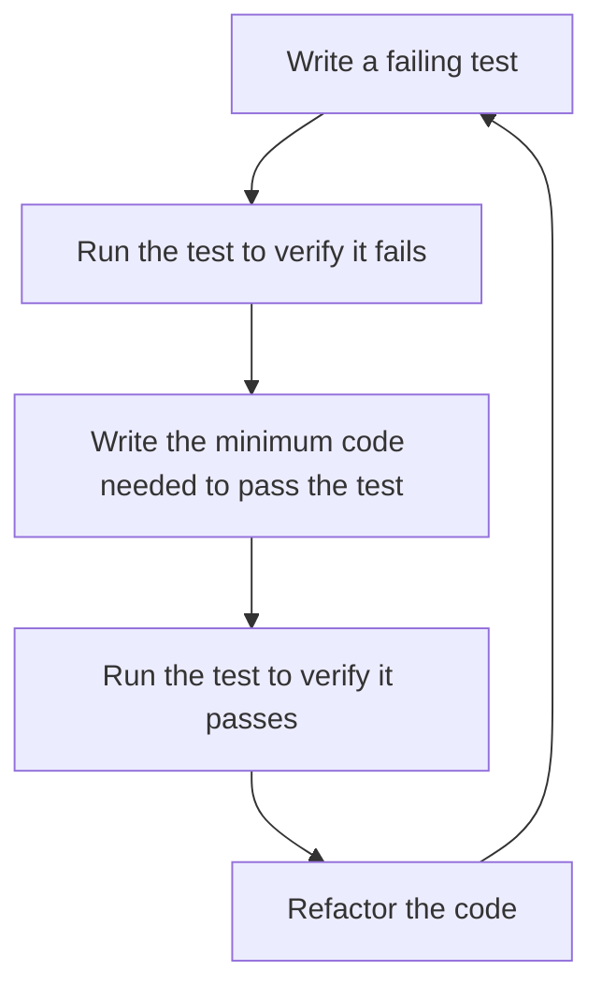

# PHP PHPUnit

## Introduction

Testing is a crucial part of software development that helps ensure your code works as expected. PHPUnit is the most popular testing framework for PHP, designed to make unit testing straightforward and effective. This guide will walk you through the basics of PHPUnit, how to set it up, write your first tests, and incorporate testing into your PHP development workflow.

PHPUnit follows the xUnit architecture and implements the Test-Driven Development (TDD) approach, where you write tests before implementing the actual code. This methodology helps you design better code and catch bugs early in the development process.

## Getting Started with PHPUnit

### Installation

The recommended way to install PHPUnit is through Composer, PHP's dependency manager.

```bash
# Create a new project or navigate to your existing one
mkdir my-php-project
cd my-php-project

# Initialize Composer if you haven't already
composer init

# Install PHPUnit as a development dependency
composer require --dev phpunit/phpunit ^10.0
```

After installation, you can run PHPUnit from your project's vendor directory:

```bash
./vendor/bin/phpunit
```

### Basic Configuration

Create a `phpunit.xml` file in your project's root directory to configure PHPUnit:

```xml
<?xml version="1.0" encoding="UTF-8"?>
<phpunit bootstrap="vendor/autoload.php"
         colors="true"
         verbose="true">
    <testsuites>
        <testsuite name="My Test Suite">
            <directory>tests</directory>
        </testsuite>
    </testsuites>
    <php>
        <ini name="error_reporting" value="-1" />
        <ini name="display_errors" value="On" />
    </php>
</phpunit>
```

This configuration:
- Loads Composer's autoloader
- Enables colored output for better readability
- Specifies that your tests are located in the `tests` directory
- Sets PHP to report all errors

## Writing Your First Test

Let's create a simple calculator class and then write tests for it.

### Step 1: Create the Calculator Class

Create a file named `src/Calculator.php`:

```php
<?php

namespace App;

class Calculator
{
    public function add($a, $b)
    {
        return $a + $b;
    }

    public function subtract($a, $b)
    {
        return $a - $b;
    }

    public function multiply($a, $b)
    {
        return $a * $b;
    }

    public function divide($a, $b)
    {
        if ($b == 0) {
            throw new \InvalidArgumentException("Cannot divide by zero");
        }
        return $a / $b;
    }
}
```

### Step 2: Create a Test Case

Create a file named `tests/CalculatorTest.php`:

```php
<?php

namespace Tests;

use App\Calculator;
use PHPUnit\Framework\TestCase;

class CalculatorTest extends TestCase
{
    protected $calculator;

    // This method is called before each test
    protected function setUp(): void
    {
        $this->calculator = new Calculator();
    }

    public function testAdd()
    {
        $this->assertEquals(4, $this->calculator->add(2, 2));
        $this->assertEquals(0, $this->calculator->add(-2, 2));
        $this->assertEquals(-4, $this->calculator->add(-2, -2));
    }

    public function testSubtract()
    {
        $this->assertEquals(0, $this->calculator->subtract(2, 2));
        $this->assertEquals(-4, $this->calculator->subtract(2, 6));
        $this->assertEquals(8, $this->calculator->subtract(10, 2));
    }

    public function testMultiply()
    {
        $this->assertEquals(4, $this->calculator->multiply(2, 2));
        $this->assertEquals(-4, $this->calculator->multiply(2, -2));
        $this->assertEquals(0, $this->calculator->multiply(0, 5));
    }

    public function testDivide()
    {
        $this->assertEquals(1, $this->calculator->divide(2, 2));
        $this->assertEquals(2.5, $this->calculator->divide(5, 2));
        $this->assertEquals(-2, $this->calculator->divide(10, -5));
    }

    public function testDivideByZero()
    {
        $this->expectException(\InvalidArgumentException::class);
        $this->calculator->divide(10, 0);
    }
}
```

### Step 3: Run the Tests

Run PHPUnit to execute your tests:

```bash
./vendor/bin/phpunit
```

Example output:

```
PHPUnit 10.0.0 by Sebastian Bergmann and contributors.

.....                                                               5 / 5 (100%)

Time: 00:00.002, Memory: 10.00 MB

OK (5 tests, 13 assertions)
```

## Understanding PHPUnit Features

### Test Fixtures

Test fixtures help establish a known state before and after your tests run. PHPUnit provides several methods for this:

- `setUp()`: Runs before each test method
- `tearDown()`: Runs after each test method
- `setUpBeforeClass()`: Runs once before all test methods in the class
- `tearDownAfterClass()`: Runs once after all test methods in the class

Example of a more complete test fixture:

```php
<?php

namespace Tests;

use PHPUnit\Framework\TestCase;

class DatabaseTest extends TestCase
{
    protected static $dbConnection;

    public static function setUpBeforeClass(): void
    {
        // Set up database connection once for all tests
        self::$dbConnection = new DatabaseConnection();
    }

    protected function setUp(): void
    {
        // Prepare database state for each test
        self::$dbConnection->beginTransaction();
    }

    protected function tearDown(): void
    {
        // Reset database state after each test
        self::$dbConnection->rollback();
    }

    public static function tearDownAfterClass(): void
    {
        // Close database connection after all tests
        self::$dbConnection->close();
    }

    // Test methods go here
}
```

### Assertions

Assertions are methods that verify expected outcomes. PHPUnit provides numerous assertion methods:

| Method                   | Purpose                                                    |
|--------------------------|-----------------------------------------------------------|
| `assertEquals($e, $a)`   | Verify that `$a` equals `$e`                              |
| `assertSame($e, $a)`     | Verify that `$a` equals `$e` and is the same type         |
| `assertTrue($a)`         | Verify that `$a` is true                                  |
| `assertFalse($a)`        | Verify that `$a` is false                                 |
| `assertNull($a)`         | Verify that `$a` is null                                  |
| `assertContains($e, $a)` | Verify that array `$a` contains element `$e`              |
| `assertCount($e, $a)`    | Verify that array `$a` has `$e` elements                  |
| `assertEmpty($a)`        | Verify that `$a` is empty                                 |
| `assertInstanceOf($e, $a)` | Verify that `$a` is an instance of class `$e`           |

Example assertion usage:

```php
public function testUser()
{
    $user = new User("John", "Doe", 30);
    
    $this->assertEquals("John", $user->getFirstName());
    $this->assertSame(30, $user->getAge());
    $this->assertTrue($user->isAdult());
    $this->assertFalse($user->isChild());
    $this->assertNull($user->getMiddleName());
    
    $roles = $user->getRoles();
    $this->assertContains("member", $roles);
    $this->assertCount(2, $roles);
    
    $emptyArray = $user->getPermissions();
    $this->assertEmpty($emptyArray);
    
    $this->assertInstanceOf(User::class, $user);
}
```

### Data Providers

Data providers allow you to run a test multiple times with different input data, making your tests more comprehensive without duplicating code.

```php
<?php

namespace Tests;

use App\Calculator;
use PHPUnit\Framework\TestCase;

class CalculatorDataProviderTest extends TestCase
{
    protected $calculator;

    protected function setUp(): void
    {
        $this->calculator = new Calculator();
    }

    /**
     * @dataProvider additionProvider
     */
    public function testAdd($a, $b, $expected)
    {
        $this->assertEquals($expected, $this->calculator->add($a, $b));
    }

    public function additionProvider()
    {
        return [
            'positive numbers' => [2, 2, 4],
            'negative and positive' => [-2, 5, 3],
            'negative numbers' => [-2, -2, -4],
            'zero and positive' => [0, 5, 5],
            'zero and negative' => [0, -5, -5],
            'zero and zero' => [0, 0, 0],
            'decimals' => [1.5, 2.5, 4.0]
        ];
    }
}
```

### Testing Exceptions

PHPUnit provides methods to test if your code throws expected exceptions:

```php
public function testDivideByZero()
{
    $this->expectException(\InvalidArgumentException::class);
    $this->expectExceptionMessage("Cannot divide by zero");
    
    $this->calculator->divide(10, 0);
}
```

## Test-Driven Development with PHPUnit

Test-Driven Development (TDD) follows a simple cycle:



Let's implement a Password Validator using TDD:

### Step 1: Write the Test First

```php
<?php

namespace Tests;

use App\PasswordValidator;
use PHPUnit\Framework\TestCase;

class PasswordValidatorTest extends TestCase
{
    protected $validator;

    protected function setUp(): void
    {
        $this->validator = new PasswordValidator();
    }

    public function testMinimumLength()
    {
        $this->assertFalse($this->validator->isValid("short"));  // Fewer than 8 characters
        $this->assertTrue($this->validator->isValid("password1")); // 9 characters
    }
}
```

### Step 2: Run the Test (It Will Fail)

The test will fail since we haven't created the `PasswordValidator` class yet.

### Step 3: Implement the Code

```php
<?php

namespace App;

class PasswordValidator
{
    public function isValid($password)
    {
        // Implement minimum length check
        return strlen($password) >= 8;
    }
}
```

### Step 4: Run the Test Again (Should Pass)

Now the test should pass as we've implemented the minimum length check.

### Step 5: Add More Tests, Then Implement

Let's add tests for additional password requirements:

```php
public function testRequiresNumber()
{
    $this->assertFalse($this->validator->isValid("password")); // No numbers
    $this->assertTrue($this->validator->isValid("password1")); // Contains a number
}

public function testRequiresUppercase()
{
    $this->assertFalse($this->validator->isValid("password1")); // No uppercase
    $this->assertTrue($this->validator->isValid("Password1")); // Contains uppercase
}
```

Then update the implementation:

```php
public function isValid($password)
{
    // Check minimum length
    if (strlen($password) < 8) {
        return false;
    }
    
    // Check for at least one number
    if (!preg_match('/[0-9]/', $password)) {
        return false;
    }
    
    // Check for at least one uppercase letter
    if (!preg_match('/[A-Z]/', $password)) {
        return false;
    }
    
    return true;
}
```

## Mocking Dependencies

When testing classes that depend on external services, databases, or APIs, you want to isolate your tests by mocking those dependencies.

Let's create a `UserService` that depends on a `UserRepository`:

```php
<?php

namespace App;

class UserService
{
    private $repository;
    
    public function __construct(UserRepository $repository)
    {
        $this->repository = $repository;
    }
    
    public function getUserById($id)
    {
        return $this->repository->findById($id);
    }
    
    public function isAdmin($id)
    {
        $user = $this->repository->findById($id);
        if (!$user) {
            return false;
        }
        
        return in_array('admin', $user->getRoles());
    }
}
```

Now, we can test `UserService` without needing a real `UserRepository`:

```php
<?php

namespace Tests;

use App\UserService;
use App\UserRepository;
use App\User;
use PHPUnit\Framework\TestCase;

class UserServiceTest extends TestCase
{
    public function testGetUserById()
    {
        // Create a mock user object
        $user = new User("John", "Doe", 30);
        
        // Create a mock repository
        $repository = $this->createMock(UserRepository::class);
        
        // Configure the mock to return the user when findById is called with parameter 1
        $repository->method('findById')
                 ->with(1)
                 ->willReturn($user);
        
        // Inject the mock into the service
        $service = new UserService($repository);
        
        // Assert that the service returns the expected user
        $this->assertSame($user, $service->getUserById(1));
    }
    
    public function testIsAdminWithAdminUser()
    {
        // Create a mock user with admin role
        $user = new User("Admin", "User", 35);
        $user->setRoles(['user', 'admin']);
        
        // Create a mock repository
        $repository = $this->createMock(UserRepository::class);
        $repository->method('findById')
                   ->with(1)
                   ->willReturn($user);
        
        $service = new UserService($repository);
        $this->assertTrue($service->isAdmin(1));
    }
    
    public function testIsAdminWithRegularUser()
    {
        // Create a mock user without admin role
        $user = new User("Regular", "User", 25);
        $user->setRoles(['user']);
        
        // Create a mock repository
        $repository = $this->createMock(UserRepository::class);
        $repository->method('findById')
                   ->with(2)
                   ->willReturn($user);
        
        $service = new UserService($repository);
        $this->assertFalse($service->isAdmin(2));
    }
    
    public function testIsAdminWithNonExistentUser()
    {
        // Create a mock repository that returns null
        $repository = $this->createMock(UserRepository::class);
        $repository->method('findById')
                   ->with(999)
                   ->willReturn(null);
        
        $service = new UserService($repository);
        $this->assertFalse($service->isAdmin(999));
    }
}
```

## Code Coverage

PHPUnit can generate code coverage reports to show how much of your code is being tested.

### Enable Code Coverage

First, make sure you have the Xdebug extension installed for PHP. Then, update your `phpunit.xml` configuration:

```xml
<phpunit bootstrap="vendor/autoload.php"
         colors="true"
         verbose="true">
    <!-- ... other config ... -->
    <coverage>
        <include>
            <directory suffix=".php">src</directory>
        </include>
        <report>
            <html outputDirectory="coverage"/>
        </report>
    </coverage>
</phpunit>
```

### Run Tests with Coverage

```bash
./vendor/bin/phpunit --coverage-html coverage
```

This command generates an HTML coverage report in the `coverage` directory. Open `coverage/index.html` in your browser to view the results.

## Best Practices for PHPUnit Testing

1. **Follow Naming Conventions**:
   - Test classes should end with `Test` (e.g., `UserTest`)
   - Test methods should start with `test` or use the `@test` annotation
   - Use meaningful names that describe the test's purpose

2. **One Assert Per Test Method** (when possible):
   - Each test should verify one specific behavior
   - Makes it easier to identify what failed
   - Exceptions: When testing related conditions or a sequence of operations

3. **Keep Tests Fast**:
   - Avoid unnecessary database operations
   - Use mocks for external dependencies
   - Fast tests encourage more frequent testing

4. **Tests Should Be Independent**:
   - A test should not depend on another test
   - Tests should be able to run in any order
   - Always reset state between tests

5. **Test Edge Cases**:
   - Test with valid, invalid, boundary, and extreme inputs
   - Test error conditions and exception handling
   - Use data providers for comprehensive testing

6. **Keep Tests Simple**:
   - Tests should be easy to understand
   - Complex test logic can introduce its own bugs
   - Focus on clarity over cleverness

7. **Use Fixtures Sparingly**:
   - Only set up what you need for the test
   - Large fixtures make tests harder to understand
   - Consider data providers for multiple test cases

## Real-World Example: Testing a Blog System

Let's create a more complex example of a blog post system:

```php
<?php
// src/Post.php
namespace App;

class Post
{
    private $id;
    private $title;
    private $content;
    private $author;
    private $createdAt;
    private $published = false;
    private $comments = [];

    public function __construct($title, $content, $author)
    {
        $this->title = $title;
        $this->content = $content;
        $this->author = $author;
        $this->createdAt = new \DateTime();
    }

    // Getters
    public function getId() { return $this->id; }
    public function getTitle() { return $this->title; }
    public function getContent() { return $this->content; }
    public function getAuthor() { return $this->author; }
    public function getCreatedAt() { return $this->createdAt; }
    public function getComments() { return $this->comments; }
    public function isPublished() { return $this->published; }

    // Setters & Methods
    public function setId($id) { $this->id = $id; }
    
    public function publish() 
    { 
        $this->published = true; 
    }
    
    public function unpublish() 
    { 
        $this->published = false; 
    }
    
    public function addComment($comment) 
    {
        if (!$this->published) {
            throw new \LogicException("Cannot comment on unpublished posts");
        }
        $this->comments[] = $comment;
    }
    
    public function getExcerpt($length = 100) 
    {
        if (strlen($this->content) <= $length) {
            return $this->content;
        }
        
        $excerpt = substr($this->content, 0, $length);
        return $excerpt . "...";
    }
}
```

Now let's write tests for this `Post` class:

```php
<?php
// tests/PostTest.php
namespace Tests;

use App\Post;
use PHPUnit\Framework\TestCase;

class PostTest extends TestCase
{
    private $post;
    
    protected function setUp(): void
    {
        $this->post = new Post(
            "Test Post Title", 
            "This is the content of the test post. It has multiple sentences to test the excerpt functionality.",
            "John Doe"
        );
    }
    
    public function testPostCreation()
    {
        $this->assertEquals("Test Post Title", $this->post->getTitle());
        $this->assertEquals("This is the content of the test post. It has multiple sentences to test the excerpt functionality.", $this->post->getContent());
        $this->assertEquals("John Doe", $this->post->getAuthor());
        $this->assertInstanceOf(\DateTime::class, $this->post->getCreatedAt());
        $this->assertFalse($this->post->isPublished());
        $this->assertEmpty($this->post->getComments());
    }
    
    public function testPublishUnpublish()
    {
        $this->assertFalse($this->post->isPublished());
        
        $this->post->publish();
        $this->assertTrue($this->post->isPublished());
        
        $this->post->unpublish();
        $this->assertFalse($this->post->isPublished());
    }
    
    public function testAddComment()
    {
        $this->post->publish();
        
        $comment1 = "First comment";
        $comment2 = "Second comment";
        
        $this->post->addComment($comment1);
        $this->post->addComment($comment2);
        
        $comments = $this->post->getComments();
        $this->assertCount(2, $comments);
        $this->assertEquals($comment1, $comments[0]);
        $this->assertEquals($comment2, $comments[1]);
    }
    
    public function testCannotCommentOnUnpublishedPost()
    {
        $this->expectException(\LogicException::class);
        $this->expectExceptionMessage("Cannot comment on unpublished posts");
        
        $this->post->addComment("This should fail");
    }
    
    public function testExcerpt()
    {
        $post = new Post(
            "Excerpt Test",
            "This is a very long post content that should be truncated when getting the excerpt. " .
            "We need to make sure it's longer than 100 characters to test the functionality properly.",
            "Jane Doe"
        );
        
        $this->assertEquals(
            "This is a very long post content that should be truncated when getting the excerpt. We need to make sure it's...",
            $post->getExcerpt()
        );
    }
    
    public function testShortExcerpt()
    {
        $post = new Post(
            "Short Post",
            "This is a short post.",
            "Short Author"
        );
        
        $this->assertEquals("This is a short post.", $post->getExcerpt());
    }
    
    public function testCustomExcerptLength()
    {
        $post = new Post(
            "Custom Excerpt",
            "This text should be truncated at exactly 20 characters and then have ellipsis added.",
            "Custom Author"
        );
        
        $this->assertEquals("This text should be...", $post->getExcerpt(20));
    }
}
```

## Summary

PHPUnit is an essential tool for PHP developers who want to ensure their code works as expected and continues to work after changes. In this guide, we've covered:

- Setting up PHPUnit with Composer
- Writing basic tests with assertions
- Using test fixtures for setup and teardown
- Testing with data providers for multiple test cases
- Working with exceptions
- Implementing Test-Driven Development
- Mocking dependencies
- Generating code coverage reports
- Best practices for writing effective tests
- A real-world example of testing a blog system

By incorporating PHPUnit into your development workflow, you'll catch bugs earlier, improve your code design, and build more reliable PHP applications.

## Additional Resources

- [PHPUnit Official Documentation](https://phpunit.de/documentation.html)
- [Test-Driven Development: By Example](https://www.amazon.com/Test-Driven-Development-Kent-Beck/dp/0321146530) by Kent Beck
- [Practical PHPUnit Testing](https://phpunit.de/presentations.html)
- [PHP The Right Way: Testing](https://phptherightway.com/#testing)

## Exercises

1. **Basic PHPUnit Setup**
   - Set up PHPUnit in a new PHP project
   - Create a simple `StringUtils` class with methods to reverse, capitalize, and count words in a string
   - Write tests for each method

2. **TDD Practice**
   - Use TDD to create an `EmailValidator` class that validates email addresses based on format, domain, and other rules
   - Write tests first, then implement the code

3. **Dependency Mocking**
   - Create a `WeatherService` class that depends on a `WeatherAPIClient`
   - Write tests using mocks to verify the service works correctly without calling the real API

4. **Advanced Testing Scenario**
   - Implement and test a `ShoppingCart` class with methods to add items, remove items, apply discounts, and calculate totals
   - Test various scenarios including edge cases