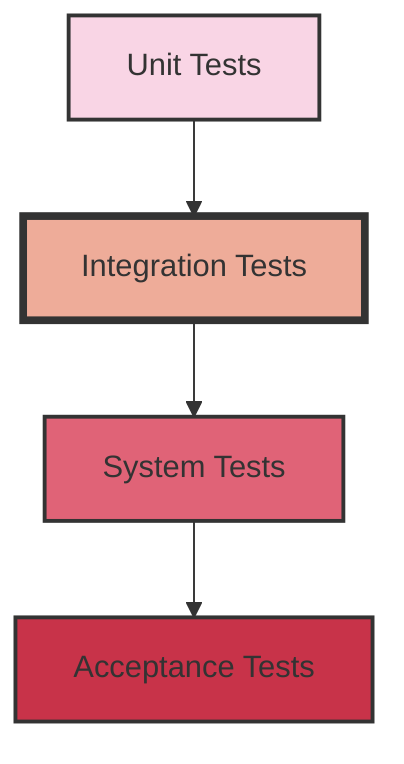

# PHP Integration Testing

## Introduction

Welcome to our guide on PHP Integration Testing! While unit tests verify that individual components of your code work correctly in isolation, integration tests ensure that these components work together as expected. This is a crucial part of the testing pyramid that helps catch bugs that might not be visible when testing components in isolation.

In this tutorial, you'll learn:
- What integration testing is and why it's important
- How to set up integration tests in PHP
- Tools and frameworks for PHP integration testing
- Best practices for writing effective integration tests
- Real-world examples and scenarios

## What is Integration Testing?

Integration testing examines how different modules or services in your application work together. Unlike unit tests that isolate specific functions, integration tests verify that different parts of your application communicate correctly.



Common integration test scenarios include:
- Database interactions
- API calls
- Service communications
- File system operations
- External service dependencies

## Setting Up Your PHP Integration Testing Environment

### Tools You'll Need

The most popular tools for PHP integration testing are:

1. **PHPUnit**: The standard testing framework for PHP
2. **Codeception**: Built on top of PHPUnit with added features
3. **Laravel's Testing Tools**: For Laravel applications
4. **Symfony's Testing Components**: For Symfony applications

For our examples, we'll focus on PHPUnit as it's the most widely used.

### Basic Setup

First, ensure you have PHPUnit installed. If you're using Composer (which you should be!), add it to your project:

```bash
composer require --dev phpunit/phpunit
```

Create a basic `phpunit.xml` configuration file in your project root:

```xml
<?xml version="1.0" encoding="UTF-8"?>
<phpunit bootstrap="vendor/autoload.php"
         colors="true"
         verbose="true">
    <testsuites>
        <testsuite name="Integration Tests">
            <directory>tests/Integration</directory>
        </testsuite>
    </testsuites>
</phpunit>
```

Now, create a directory structure for your tests:

```
your-project/
├── src/
└── tests/
    ├── Unit/
    └── Integration/
```

## Writing Your First Integration Test

Let's create a simple example. Imagine we have a `UserService` that depends on a `UserRepository` to save users to a database.

### The Classes We're Testing

```php
// src/UserRepository.php
class UserRepository {
    private $pdo;
    
    public function __construct(PDO $pdo) {
        $this->pdo = $pdo;
    }
    
    public function save(array $userData): int {
        $stmt = $this->pdo->prepare(
            "INSERT INTO users (name, email) VALUES (:name, :email)"
        );
        
        $stmt->execute([
            'name' => $userData['name'],
            'email' => $userData['email']
        ]);
        
        return $this->pdo->lastInsertId();
    }
    
    public function findById(int $id): ?array {
        $stmt = $this->pdo->prepare("SELECT * FROM users WHERE id = :id");
        $stmt->execute(['id' => $id]);
        
        $result = $stmt->fetch(PDO::FETCH_ASSOC);
        return $result ?: null;
    }
}

// src/UserService.php
class UserService {
    private $repository;
    
    public function __construct(UserRepository $repository) {
        $this->repository = $repository;
    }
    
    public function registerUser(string $name, string $email): int {
        // Validate input
        if (empty($name) || empty($email)) {
            throw new InvalidArgumentException('Name and email are required');
        }
        
        if (!filter_var($email, FILTER_VALIDATE_EMAIL)) {
            throw new InvalidArgumentException('Invalid email format');
        }
        
        // Save user
        return $this->repository->save([
            'name' => $name,
            'email' => $email
        ]);
    }
}
```

### The Integration Test

Now let's write an integration test that verifies these components work together:

```php
// tests/Integration/UserServiceTest.php
use PHPUnit\Framework\TestCase;

class UserServiceTest extends TestCase {
    private $pdo;
    private $userRepository;
    private $userService;
    
    protected function setUp(): void {
        // Set up a SQLite in-memory database for testing
        $this->pdo = new PDO('sqlite::memory:');
        
        // Create the users table
        $this->pdo->exec('
            CREATE TABLE users (
                id INTEGER PRIMARY KEY AUTOINCREMENT,
                name TEXT NOT NULL,
                email TEXT NOT NULL UNIQUE
            )
        ');
        
        // Initialize the components we want to test together
        $this->userRepository = new UserRepository($this->pdo);
        $this->userService = new UserService($this->userRepository);
    }
    
    public function testUserRegistrationAndRetrieval() {
        // 1. Register a new user through the service
        $name = 'John Doe';
        $email = 'john@example.com';
        
        $userId = $this->userService->registerUser($name, $email);
        
        // 2. Verify the user was saved with the correct ID
        $this->assertIsInt($userId);
        $this->assertGreaterThan(0, $userId);
        
        // 3. Retrieve the user directly from the repository
        $savedUser = $this->userRepository->findById($userId);
        
        // 4. Verify the retrieved data matches what we saved
        $this->assertNotNull($savedUser);
        $this->assertEquals($name, $savedUser['name']);
        $this->assertEquals($email, $savedUser['email']);
    }
    
    public function testInvalidEmailRejection() {
        // 1. Try to register with invalid email
        $this->expectException(InvalidArgumentException::class);
        $this->userService->registerUser('Jane Doe', 'invalid-email');
        
        // 2. Verify no user was added to the database
        $stmt = $this->pdo->query('SELECT COUNT(*) FROM users');
        $count = $stmt->fetchColumn();
        $this->assertEquals(0, $count);
    }
}
```

When you run this test:

```bash
./vendor/bin/phpunit tests/Integration/UserServiceTest.php
```

It will:
1. Create an in-memory SQLite database
2. Set up the database schema
3. Initialize both the repository and service
4. Test that they work together correctly

This is integration testing because we're testing how the `UserService` integrates with the `UserRepository` and how the `UserRepository` integrates with the database.

## Working with Real Databases

For more realistic tests, you might want to use a real test database instead of SQLite in-memory. Here's how to approach it:

```php
// tests/Integration/RealDatabaseTest.php
class RealDatabaseTest extends TestCase {
    private static $pdo;
    
    public static function setUpBeforeClass(): void {
        // Connect to a test database (could be MySQL, PostgreSQL, etc.)
        self::$pdo = new PDO(
            'mysql:host=localhost;dbname=test_db',
            'test_user',
            'test_password'
        );
        
        // Create fresh tables
        self::$pdo->exec('DROP TABLE IF EXISTS users');
        self::$pdo->exec('
            CREATE TABLE users (
                id INT AUTO_INCREMENT PRIMARY KEY,
                name VARCHAR(255) NOT NULL,
                email VARCHAR(255) NOT NULL UNIQUE
            )
        ');
    }
    
    protected function setUp(): void {
        // Clean data before each test
        self::$pdo->exec('TRUNCATE TABLE users');
        
        $this->userRepository = new UserRepository(self::$pdo);
        $this->userService = new UserService($this->userRepository);
    }
    
    // Tests continue as before...
}
```

## Testing Database Transactions

Integration tests are perfect for verifying transaction behavior:

```php
public function testTransactionRollback() {
    // Start with an empty DB
    $count = $this->pdo->query('SELECT COUNT(*) FROM users')->fetchColumn();
    $this->assertEquals(0, $count);
    
    try {
        $this->pdo->beginTransaction();
        
        // Add a user
        $this->userRepository->save([
            'name' => 'Transaction User',
            'email' => 'transaction@example.com'
        ]);
        
        // Verify the user exists inside the transaction
        $count = $this->pdo->query('SELECT COUNT(*) FROM users')->fetchColumn();
        $this->assertEquals(1, $count);
        
        // Simulate an error
        throw new Exception('Something went wrong');
        
        $this->pdo->commit();
    } catch (Exception $e) {
        $this->pdo->rollBack();
    }
    
    // Verify the user doesn't exist after rollback
    $count = $this->pdo->query('SELECT COUNT(*) FROM users')->fetchColumn();
    $this->assertEquals(0, $count);
}
```

## Testing API Integrations

Integration tests often verify that your code correctly interacts with external APIs. For testing purposes, you should mock these external services.

Here's an example using a payment gateway:

```php
// src/PaymentGateway.php
interface PaymentGateway {
    public function processPayment(float $amount, string $creditCard): array;
}

// src/StripeGateway.php
class StripeGateway implements PaymentGateway {
    private $apiKey;
    
    public function __construct(string $apiKey) {
        $this->apiKey = $apiKey;
    }
    
    public function processPayment(float $amount, string $creditCard): array {
        // In a real implementation, this would call the Stripe API
        // But for our example, we're keeping it simple
        $response = [
            'success' => true,
            'transaction_id' => 'tx_' . uniqid(),
            'amount' => $amount
        ];
        
        return $response;
    }
}

// src/OrderService.php
class OrderService {
    private $paymentGateway;
    private $orderRepository;
    
    public function __construct(
        PaymentGateway $paymentGateway,
        OrderRepository $orderRepository
    ) {
        $this->paymentGateway = $paymentGateway;
        $this->orderRepository = $orderRepository;
    }
    
    public function placeOrder(array $items, string $creditCard): array {
        // Calculate total
        $total = array_sum(array_column($items, 'price'));
        
        // Process payment
        $payment = $this->paymentGateway->processPayment($total, $creditCard);
        
        if (!$payment['success']) {
            throw new Exception('Payment failed');
        }
        
        // Save order
        $order = [
            'items' => $items,
            'total' => $total,
            'transaction_id' => $payment['transaction_id'],
            'status' => 'paid'
        ];
        
        $orderId = $this->orderRepository->save($order);
        
        return [
            'order_id' => $orderId,
            'status' => 'success',
            'total' => $total,
            'transaction_id' => $payment['transaction_id']
        ];
    }
}
```

Testing with a Mock Gateway:

```php
// tests/Integration/OrderServiceTest.php
class MockPaymentGateway implements PaymentGateway {
    private $shouldSucceed;
    
    public function __construct(bool $shouldSucceed = true) {
        $this->shouldSucceed = $shouldSucceed;
    }
    
    public function processPayment(float $amount, string $creditCard): array {
        return [
            'success' => $this->shouldSucceed,
            'transaction_id' => $this->shouldSucceed ? 'mock_tx_' . uniqid() : '',
            'amount' => $amount
        ];
    }
}

class OrderServiceTest extends TestCase {
    public function testSuccessfulOrder() {
        // Set up a mock payment gateway that always succeeds
        $paymentGateway = new MockPaymentGateway(true);
        
        // Set up a simple in-memory order repository
        $orderRepository = new class {
            private $orders = [];
            
            public function save(array $order): int {
                $id = count($this->orders) + 1;
                $this->orders[$id] = $order;
                return $id;
            }
            
            public function findById(int $id): ?array {
                return $this->orders[$id] ?? null;
            }
        };
        
        // Create the service with our test doubles
        $orderService = new OrderService($paymentGateway, $orderRepository);
        
        // Test placing an order
        $items = [
            ['name' => 'Book', 'price' => 15.99],
            ['name' => 'Pen', 'price' => 2.49]
        ];
        
        $result = $orderService->placeOrder($items, '4242424242424242');
        
        // Verify the result
        $this->assertEquals('success', $result['status']);
        $this->assertEquals(18.48, $result['total']);
        $this->assertStringStartsWith('mock_tx_', $result['transaction_id']);
        
        // Verify the order was saved
        $order = $orderRepository->findById($result['order_id']);
        $this->assertNotNull($order);
        $this->assertEquals('paid', $order['status']);
        $this->assertEquals($result['transaction_id'], $order['transaction_id']);
    }
    
    public function testFailedPayment() {
        // Set up a mock payment gateway that always fails
        $paymentGateway = new MockPaymentGateway(false);
        $orderRepository = new class { public function save(array $order): int { return 1; } };
        
        // Create the service with our test doubles
        $orderService = new OrderService($paymentGateway, $orderRepository);
        
        // Test placing an order with a payment that will fail
        $items = [
            ['name' => 'Book', 'price' => 15.99]
        ];
        
        $this->expectException(Exception::class);
        $this->expectExceptionMessage('Payment failed');
        
        $orderService->placeOrder($items, '4242424242424242');
    }
}
```

## Best Practices for PHP Integration Testing

### 1. Use a Dedicated Test Database

Never run integration tests against your production database. Set up a separate test database that can be reset between test runs.

### 2. Reset State Between Tests

Always start each test with a clean slate:
- Clear database tables
- Reset file systems
- Clear caches

### 3. Mock External Services

Don't call real third-party APIs in tests. Use mock implementations instead.

### 4. Test the Happy Path and Edge Cases

Make sure to test:
- Successful scenarios (the "happy path")
- Error conditions
- Edge cases (empty inputs, large data sets, etc.)

### 5. Use Test Data Builders

Create helper methods to build test data:

```php
private function createTestUser(): array {
    static $counter = 0;
    $counter++;
    
    return [
        'name' => "Test User {$counter}",
        'email' => "user{$counter}@example.com"
    ];
}
```

### 6. Use Database Transactions When Possible

You can speed up tests by wrapping each test in a transaction and rolling back at the end:

```php
protected function setUp(): void {
    parent::setUp();
    $this->pdo->beginTransaction();
}

protected function tearDown(): void {
    $this->pdo->rollBack();
    parent::tearDown();
}
```

### 7. Focus on Integration Points

Don't test every detail of your application in integration tests. Focus on the places where components connect:
- Database interactions
- API calls
- Service boundaries

## Integration Testing Frameworks for PHP

### PHPUnit

The standard testing framework for PHP.

```php
// Using data providers for multiple test cases
/**
 * @dataProvider validUserProvider
 */
public function testValidUsers(string $name, string $email) {
    $userId = $this->userService->registerUser($name, $email);
    $this->assertGreaterThan(0, $userId);
}

public function validUserProvider() {
    return [
        ['John Doe', 'john@example.com'],
        ['Jane Smith', 'jane@example.com'],
        ['Bob Johnson', 'bob@example.org']
    ];
}
```

### Codeception

Provides high-level testing with a more descriptive syntax.

```php
// Sample Codeception integration test
public function testUserCreation(IntegrationTester $I) {
    $I->wantTo('create a new user and verify it exists in the database');
    
    $name = 'John Doe';
    $email = 'john@example.com';
    
    $userId = $this->userService->registerUser($name, $email);
    
    $I->seeInDatabase('users', [
        'id' => $userId,
        'name' => $name,
        'email' => $email
    ]);
}
```

### Laravel Testing Tools

For Laravel applications:

```php
public function testUserApi() {
    // Creates a user in the database
    $user = User::factory()->create();
    
    // Test the GET /users/{id} endpoint
    $response = $this->get("/api/users/{$user->id}");
    
    $response->assertStatus(200)
             ->assertJson([
                 'name' => $user->name,
                 'email' => $user->email
             ]);
}
```

### Symfony PHPUnit Bridge

For Symfony applications:

```php
use Symfony\Bundle\FrameworkBundle\Test\WebTestCase;

class UserControllerTest extends WebTestCase {
    public function testShowUser() {
        $client = static::createClient();
        
        // Create a user in the test database
        $user = new User();
        $user->setName('John Doe');
        $user->setEmail('john@example.com');
        
        $entityManager = static::getContainer()->get('doctrine')->getManager();
        $entityManager->persist($user);
        $entityManager->flush();
        
        // Request the user page
        $client->request('GET', '/users/'.$user->getId());
        
        $this->assertResponseIsSuccessful();
        $this->assertSelectorTextContains('h1', 'John Doe');
    }
}
```

## Real-World Example: E-commerce Application

Let's look at a more complete example of integration testing for a simple e-commerce application:

```php
// tests/Integration/ShoppingCartTest.php
class ShoppingCartTest extends TestCase {
    private $pdo;
    private $productRepository;
    private $cartService;
    private $orderService;
    
    protected function setUp(): void {
        // Set up an in-memory SQLite database
        $this->pdo = new PDO('sqlite::memory:');
        
        // Create tables
        $this->pdo->exec('
            CREATE TABLE products (
                id INTEGER PRIMARY KEY AUTOINCREMENT,
                name TEXT NOT NULL,
                price REAL NOT NULL,
                stock INTEGER NOT NULL
            )
        ');
        
        $this->pdo->exec('
            CREATE TABLE orders (
                id INTEGER PRIMARY KEY AUTOINCREMENT,
                customer_email TEXT NOT NULL,
                total REAL NOT NULL,
                status TEXT NOT NULL
            )
        ');
        
        $this->pdo->exec('
            CREATE TABLE order_items (
                id INTEGER PRIMARY KEY AUTOINCREMENT,
                order_id INTEGER NOT NULL,
                product_id INTEGER NOT NULL,
                quantity INTEGER NOT NULL,
                price REAL NOT NULL,
                FOREIGN KEY (order_id) REFERENCES orders(id),
                FOREIGN KEY (product_id) REFERENCES products(id)
            )
        ');
        
        // Add some test products
        $stmt = $this->pdo->prepare('
            INSERT INTO products (name, price, stock) 
            VALUES (:name, :price, :stock)
        ');
        
        $products = [
            ['name' => 'PHP Testing Book', 'price' => 29.99, 'stock' => 10],
            ['name' => 'Mechanical Keyboard', 'price' => 149.99, 'stock' => 5],
            ['name' => 'Coffee Mug', 'price' => 12.99, 'stock' => 20]
        ];
        
        foreach ($products as $product) {
            $stmt->execute($product);
        }
        
        // Initialize repositories and services
        $this->productRepository = new class($this->pdo) {
            private $pdo;
            
            public function __construct(PDO $pdo) {
                $this->pdo = $pdo;
            }
            
            public function findById(int $id): ?array {
                $stmt = $this->pdo->prepare('SELECT * FROM products WHERE id = :id');
                $stmt->execute(['id' => $id]);
                return $stmt->fetch(PDO::FETCH_ASSOC) ?: null;
            }
            
            public function updateStock(int $id, int $newStock): bool {
                $stmt = $this->pdo->prepare('
                    UPDATE products SET stock = :stock WHERE id = :id
                ');
                return $stmt->execute([
                    'id' => $id,
                    'stock' => $newStock
                ]);
            }
        };
        
        $orderRepository = new class($this->pdo) {
            private $pdo;
            
            public function __construct(PDO $pdo) {
                $this->pdo = $pdo;
            }
            
            public function create(string $email, float $total): int {
                $stmt = $this->pdo->prepare('
                    INSERT INTO orders (customer_email, total, status)
                    VALUES (:email, :total, :status)
                ');
                
                $stmt->execute([
                    'email' => $email,
                    'total' => $total,
                    'status' => 'pending'
                ]);
                
                return $this->pdo->lastInsertId();
            }
            
            public function addOrderItem(int $orderId, int $productId, int $quantity, float $price) {
                $stmt = $this->pdo->prepare('
                    INSERT INTO order_items (order_id, product_id, quantity, price)
                    VALUES (:order_id, :product_id, :quantity, :price)
                ');
                
                return $stmt->execute([
                    'order_id' => $orderId,
                    'product_id' => $productId,
                    'quantity' => $quantity,
                    'price' => $price
                ]);
            }
            
            public function findById(int $id): ?array {
                $stmt = $this->pdo->prepare('SELECT * FROM orders WHERE id = :id');
                $stmt->execute(['id' => $id]);
                $order = $stmt->fetch(PDO::FETCH_ASSOC);
                
                if (!$order) {
                    return null;
                }
                
                // Get order items
                $stmt = $this->pdo->prepare('
                    SELECT * FROM order_items WHERE order_id = :order_id
                ');
                $stmt->execute(['order_id' => $id]);
                $order['items'] = $stmt->fetchAll(PDO::FETCH_ASSOC);
                
                return $order;
            }
        };
        
        // Create a cart service
        $this->cartService = new class() {
            private $items = [];
            
            public function addItem(int $productId, int $quantity = 1): void {
                if (!isset($this->items[$productId])) {
                    $this->items[$productId] = 0;
                }
                
                $this->items[$productId] += $quantity;
            }
            
            public function removeItem(int $productId): void {
                unset($this->items[$productId]);
            }
            
            public function getItems(): array {
                return $this->items;
            }
            
            public function clear(): void {
                $this->items = [];
            }
        };
        
        // Create an order service that integrates with products and cart
        $this->orderService = new class(
            $this->productRepository,
            $orderRepository,
            $this->cartService
        ) {
            private $productRepository;
            private $orderRepository;
            private $cartService;
            
            public function __construct(
                $productRepository,
                $orderRepository,
                $cartService
            ) {
                $this->productRepository = $productRepository;
                $this->orderRepository = $orderRepository;
                $this->cartService = $cartService;
            }
            
            public function checkout(string $customerEmail): array {
                $cartItems = $this->cartService->getItems();
                
                if (empty($cartItems)) {
                    throw new Exception('Cart is empty');
                }
                
                $total = 0;
                $orderItems = [];
                
                // Calculate total and prepare order items
                foreach ($cartItems as $productId => $quantity) {
                    $product = $this->productRepository->findById($productId);
                    
                    if (!$product) {
                        throw new Exception("Product {$productId} not found");
                    }
                    
                    if ($product['stock'] < $quantity) {
                        throw new Exception("Not enough stock for {$product['name']}");
                    }
                    
                    $itemTotal = $product['price'] * $quantity;
                    $total += $itemTotal;
                    
                    $orderItems[] = [
                        'product_id' => $productId,
                        'quantity' => $quantity,
                        'price' => $product['price']
                    ];
                }
                
                try {
                    // Start transaction
                    $this->pdo->beginTransaction();
                    
                    // Create order
                    $orderId = $this->orderRepository->create($customerEmail, $total);
                    
                    // Add order items
                    foreach ($orderItems as $item) {
                        $this->orderRepository->addOrderItem(
                            $orderId,
                            $item['product_id'],
                            $item['quantity'],
                            $item['price']
                        );
                        
                        // Update stock
                        $product = $this->productRepository->findById($item['product_id']);
                        $newStock = $product['stock'] - $item['quantity'];
                        $this->productRepository->updateStock($item['product_id'], $newStock);
                    }
                    
                    // Commit transaction
                    $this->pdo->commit();
                    
                    // Clear cart
                    $this->cartService->clear();
                    
                    return [
                        'order_id' => $orderId,
                        'total' => $total,
                        'items_count' => count($orderItems)
                    ];
                } catch (Exception $e) {
                    $this->pdo->rollBack();
                    throw $e;
                }
            }
        };
    }
    
    public function testCompleteOrderProcess() {
        // 1. Add items to cart
        $this->cartService->addItem(1, 2); // 2 PHP Testing Books
        $this->cartService->addItem(3, 1); // 1 Coffee Mug
        
        // 2. Checkout
        $result = $this->orderService->checkout('customer@example.com');
        
        // 3. Verify order was created correctly
        $this->assertIsArray($result);
        $this->assertArrayHasKey('order_id', $result);
        
        // 4. Check order in the database
        $order = $this->orderRepository->findById($result['order_id']);
        $this->assertNotNull($order);
        $this->assertEquals('customer@example.com', $order['customer_email']);
        $this->assertEquals(2 * 29.99 + 12.99, $order['total']);
        
        // 5. Verify order items
        $this->assertCount(2, $order['items']);
        
        // 6. Verify stock was updated
        $book = $this->productRepository->findById(1);
        $this->assertEquals(8, $book['stock']); // 10 - 2 = 8
        
        $mug = $this->productRepository->findById(3);
        $this->assertEquals(19, $mug['stock']); // 20 - 1 = 19
        
        // 7. Verify cart was cleared
        $this->assertEmpty($this->cartService->getItems());
    }
    
    public function testOutOfStockHandling() {
        // Try to order more than available stock
        $this->cartService->addItem(2, 10); // 10 Mechanical Keyboards (only 5 in stock)
        
        // Should throw an exception
        $this->expectException(Exception::class);
        $this->expectExceptionMessage('Not enough stock');
        
        $this->orderService->checkout('customer@example.com');
        
        // Verify no order was created and stock wasn't changed
        $keyboard = $this->productRepository->findById(2);
        $this->assertEquals(5, $keyboard['stock']); // Should still be 5
    }
}
```

This example demonstrates:
1. Setting up an in-memory database for testing
2. Testing the integration between multiple services
3. Testing transaction behavior
4. Verifying database state after operations
5. Testing error conditions

## Summary

Integration testing is a vital part of ensuring your PHP applications work correctly. By testing how components work together, you can catch bugs that unit tests might miss and ensure that your application functions properly as a whole.

Key takeaways:
- Integration tests verify that multiple components work together correctly
- Use real or in-memory databases for testing database interactions
- Mock external services to avoid dependencies
- Focus on testing the boundaries between components
- Use transactions to reset state between tests
- Test both successful scenarios and error conditions

## Additional Resources

For further learning, check out these resources:

1. [PHPUnit Documentation](https://phpunit.de/documentation.html)
2. [Codeception for Integration Testing](https://codeception.com/docs/05-FunctionalTests)
3. [Laravel Testing Guide](https://laravel.com/docs/testing)
4. [Symfony Testing Guide](https://symfony.com/doc/current/testing.html)
5. [PHP Testing Patterns](https://phptherightway.com/#testing)

## Exercises

To practice what you've learned, try these exercises:

1. Write an integration test for a user registration system that includes email validation and password hashing.
2. Create tests for a simple blog application that verifies post creation, retrieval, and comment functionality.
3. Test a file upload system that integrates with the filesystem and a database.
4. Write tests for an API client that interacts with an external service (using mocks).
5. Create a test suite for a payment processing system that handles different payment methods.