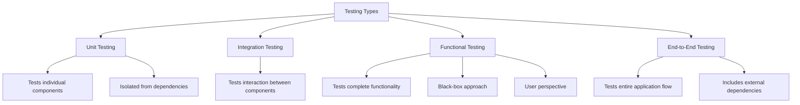

# PHP Functional Testing

## Introduction

Functional testing is a crucial part of the software development process that focuses on testing the complete functionality of an application. Unlike unit tests that verify individual components in isolation, functional tests ensure that different parts of your application work together correctly from a user's perspective.

In this guide, you'll learn how to implement functional testing in PHP applications. We'll cover popular tools, practical examples, and best practices to help you get started with functional testing in your PHP projects.

## What is Functional Testing?

Functional testing verifies that your application functions correctly according to its requirements. It tests the application as a whole, simulating how a real user would interact with it, without necessarily knowing the internal workings of the code.

Here's how functional testing differs from other testing types:



## Popular PHP Functional Testing Tools

### 1. PHPUnit with PHP Built-in Web Server

PHPUnit, primarily known for unit testing, can also be used for functional testing when combined with PHP's built-in web server.

### 2. Symfony's BrowserKit Component

For Symfony applications, the BrowserKit component provides a browser simulator to perform functional tests without a real browser.

### 3. Laravel's Testing Facilities

Laravel includes built-in testing tools that make functional testing straightforward.

### 4. Behat

Behat is a Behavior-Driven Development (BDD) framework that allows you to write tests in natural language.

### 5. Codeception

Codeception is a full-stack testing framework for PHP that simplifies functional testing.

## Getting Started with PHPUnit for Functional Testing

Let's start with a simple example using PHPUnit to perform functional tests on a basic PHP application.

### Example: Testing a Simple Contact Form

Imagine we have a simple contact form that submits data to a PHP script:

```php
// contact.php
<?php
$errors = [];
$success = false;

if ($_SERVER['REQUEST_METHOD'] === 'POST') {
    $name = $_POST['name'] ?? '';
    $email = $_POST['email'] ?? '';
    $message = $_POST['message'] ?? '';
    
    // Validate form data
    if (empty($name)) {
        $errors[] = 'Name is required';
    }
    
    if (empty($email)) {
        $errors[] = 'Email is required';
    } elseif (!filter_var($email, FILTER_VALIDATE_EMAIL)) {
        $errors[] = 'Invalid email format';
    }
    
    if (empty($message)) {
        $errors[] = 'Message is required';
    }
    
    // If no errors, process the form
    if (empty($errors)) {
        // In a real application, you would send an email or save to database
        $success = true;
    }
}
?>

<!DOCTYPE html>
<html>
<head>
    <title>Contact Form</title>
</head>
<body>
    <h1>Contact Us</h1>
    
    <?php if ($success): ?>
        <div class="success">Your message has been sent successfully!</div>
    <?php endif; ?>
    
    <?php if (!empty($errors)): ?>
        <div class="errors">
            <ul>
                <?php foreach ($errors as $error): ?>
                    <li><?= htmlspecialchars($error) ?></li>
                <?php endforeach; ?>
            </ul>
        </div>
    <?php endif; ?>
    
    <form method="post">
        <div>
            <label for="name">Name:</label>
            <input type="text" id="name" name="name">
        </div>
        <div>
            <label for="email">Email:</label>
            <input type="email" id="email" name="email">
        </div>
        <div>
            <label for="message">Message:</label>
            <textarea id="message" name="message"></textarea>
        </div>
        <button type="submit">Send Message</button>
    </form>
</body>
</html>
```

Now, let's write a functional test for this contact form using PHPUnit:

```php
// tests/ContactFormTest.php
<?php

use PHPUnit\Framework\TestCase;
use GuzzleHttp\Client;

class ContactFormTest extends TestCase
{
    private $http;
    private static $server;
    
    public static function setUpBeforeClass(): void
    {
        // Start PHP built-in server
        $command = 'php -S localhost:8000 -t ' . dirname(__DIR__) . ' > /dev/null 2>&1 & echo $!';
        self::$server = exec($command);
        sleep(1); // Wait for server to start
    }
    
    public static function tearDownAfterClass(): void
    {
        // Stop the PHP server
        exec('kill ' . self::$server);
    }
    
    protected function setUp(): void
    {
        $this->http = new Client([
            'base_uri' => 'http://localhost:8000',
            'http_errors' => false
        ]);
    }
    
    public function testContactFormReturnsSuccessMessage()
    {
        // Send a POST request with valid data
        $response = $this->http->post('/contact.php', [
            'form_params' => [
                'name' => 'John Doe',
                'email' => 'john@example.com',
                'message' => 'This is a test message'
            ]
        ]);
        
        $this->assertEquals(200, $response->getStatusCode());
        $this->assertStringContainsString('Your message has been sent successfully!', $response->getBody()->getContents());
    }
    
    public function testContactFormReturnsErrorsForMissingData()
    {
        // Send a POST request with missing data
        $response = $this->http->post('/contact.php', [
            'form_params' => [
                'name' => '',
                'email' => '',
                'message' => ''
            ]
        ]);
        
        $this->assertEquals(200, $response->getStatusCode());
        $content = $response->getBody()->getContents();
        $this->assertStringContainsString('Name is required', $content);
        $this->assertStringContainsString('Email is required', $content);
        $this->assertStringContainsString('Message is required', $content);
    }
}
```

In this example:
1. We start the PHP built-in web server before running our tests
2. We use GuzzleHttp to send HTTP requests to our application
3. We verify the response to ensure the form functions correctly

## Functional Testing with Symfony

Symfony provides powerful tools for functional testing through its BrowserKit component.

### Example: Testing a Symfony Controller

```php
// tests/Controller/ProductControllerTest.php
<?php

namespace App\Tests\Controller;

use Symfony\Bundle\FrameworkBundle\Test\WebTestCase;

class ProductControllerTest extends WebTestCase
{
    public function testListProducts()
    {
        $client = static::createClient();
        $client->request('GET', '/products');
        
        $this->assertResponseIsSuccessful();
        $this->assertSelectorTextContains('h1', 'Product List');
        
        // Test that we have product items on the page
        $this->assertCount(3, $client->getCrawler()->filter('.product-item'));
    }
    
    public function testAddProduct()
    {
        $client = static::createClient();
        $client->request('GET', '/products/new');
        
        // Submit the form
        $client->submitForm('Create', [
            'product[name]' => 'Test Product',
            'product[price]' => '19.99',
            'product[description]' => 'This is a test product'
        ]);
        
        // Check that we were redirected to the product list
        $this->assertResponseRedirects('/products');
        
        // Follow the redirect
        $client->followRedirect();
        
        // Check for success message
        $this->assertSelectorTextContains('.alert-success', 'Product created successfully');
        
        // Check that our new product is in the list
        $this->assertSelectorTextContains('.product-item', 'Test Product');
    }
}
```

## Behavior-Driven Development with Behat

Behat allows you to write tests in a human-readable format using Gherkin syntax.

### Example: Setting up Behat

First, install Behat and the Mink extension:

```bash
composer require --dev behat/behat behat/mink-extension behat/mink-goutte-driver
```

Create a `behat.yml` configuration file:

```yaml
default:
    suites:
        default:
            contexts:
                - FeatureContext
                - Behat\MinkExtension\Context\MinkContext
    extensions:
        Behat\MinkExtension:
            base_url: http://localhost:8000
            goutte: ~
```

Now, let's write a feature file for our contact form:

```gherkin
# features/contact.feature
Feature: Contact form
  In order to get in touch with the site owners
  As a website visitor
  I need to be able to submit a contact form

  Scenario: Successfully submitting the contact form
    Given I am on "/contact.php"
    When I fill in "name" with "John Doe"
    And I fill in "email" with "john@example.com"
    And I fill in "message" with "This is a test message"
    And I press "Send Message"
    Then I should see "Your message has been sent successfully!"

  Scenario: Submitting the form with missing data
    Given I am on "/contact.php"
    When I fill in "name" with ""
    And I fill in "email" with ""
    And I fill in "message" with ""
    And I press "Send Message"
    Then I should see "Name is required"
    And I should see "Email is required"
    And I should see "Message is required"
```

Create a FeatureContext class:

```php
// features/bootstrap/FeatureContext.php
<?php

use Behat\Behat\Context\Context;
use Behat\MinkExtension\Context\MinkContext;

class FeatureContext extends MinkContext implements Context
{
    // You can add custom steps here
}
```

Run the tests with:

```bash
vendor/bin/behat
```

## Functional Testing with Laravel

Laravel provides a clean, expressive testing API for functional testing.

### Example: Testing a Laravel Controller

```php
// tests/Feature/TaskControllerTest.php
<?php

namespace Tests\Feature;

use App\Models\Task;
use App\Models\User;
use Illuminate\Foundation\Testing\RefreshDatabase;
use Tests\TestCase;

class TaskControllerTest extends TestCase
{
    use RefreshDatabase;
    
    public function testUserCanSeeTaskList()
    {
        // Create a user and authenticate
        $user = User::factory()->create();
        
        // Create some tasks
        $tasks = Task::factory()->count(3)->create([
            'user_id' => $user->id
        ]);
        
        // Make the request as the authenticated user
        $response = $this->actingAs($user)
                         ->get('/tasks');
        
        // Assert the response
        $response->assertStatus(200);
        $response->assertViewIs('tasks.index');
        
        // Check that all tasks are displayed
        foreach ($tasks as $task) {
            $response->assertSee($task->title);
        }
    }
    
    public function testUserCanCreateTask()
    {
        $user = User::factory()->create();
        
        $taskData = [
            'title' => 'New Test Task',
            'description' => 'This is a test task',
            'due_date' => '2023-12-31'
        ];
        
        $response = $this->actingAs($user)
                         ->post('/tasks', $taskData);
        
        // Assert we're redirected to the tasks list
        $response->assertRedirect('/tasks');
        
        // Assert the task was created in the database
        $this->assertDatabaseHas('tasks', [
            'title' => 'New Test Task',
            'user_id' => $user->id
        ]);
        
        // Follow the redirect and check for success message
        $this->followRedirectPath($response)
             ->assertSee('Task created successfully');
    }
    
    private function followRedirectPath($response)
    {
        return $this->get($response->headers->get('Location'));
    }
}
```

## Best Practices for PHP Functional Testing

1. **Test Real User Scenarios**: Focus your tests on common user interactions and critical application flows.

2. **Use Fixtures and Factories**: Prepare test data efficiently using fixtures or factories.

3. **Keep Tests Independent**: Each test should be independent and not rely on the state from other tests.

4. **Clean Up After Tests**: Always clean up any test data or environment changes after your tests run.

5. **Test Both Success and Failure Cases**: Don't just test the happy path; also test what happens when things go wrong.

6. **Use Descriptive Test Names**: Name your tests clearly to describe what they're testing.

7. **Set Up Continuous Integration**: Run your functional tests automatically on each code change.

## Common Challenges and Solutions

### 1. Slow Tests

Functional tests are typically slower than unit tests. To address this:
- Run critical tests more frequently and comprehensive tests less often
- Use database transactions to speed up tests that interact with the database
- Consider running tests in parallel

### 2. Flaky Tests

Tests that sometimes pass and sometimes fail can be frustrating. To reduce flakiness:
- Add proper waits for page loading or AJAX requests
- Ensure your test environment is consistent
- Don't rely on timing assumptions

### 3. Maintaining Tests

As your application evolves, tests need to be updated:
- Extract common test logic to helper methods
- Use page objects or similar patterns to encapsulate page structure
- Keep tests focused on behavior, not implementation details

## Summary

Functional testing is an essential practice for ensuring your PHP applications work correctly from a user's perspective. In this guide, we've covered:

- What functional testing is and how it differs from other types of testing
- Popular PHP functional testing tools including PHPUnit, Symfony's BrowserKit, Laravel's testing facilities, Behat, and Codeception
- Practical examples of functional tests in different PHP frameworks
- Best practices and common challenges

By implementing functional tests in your PHP projects, you can catch bugs earlier, ensure your application meets its requirements, and maintain high code quality as your project evolves.

## Additional Resources

- [PHPUnit Documentation](https://phpunit.de/documentation.html)
- [Symfony Testing Documentation](https://symfony.com/doc/current/testing.html)
- [Laravel Testing Documentation](https://laravel.com/docs/testing)
- [Behat Documentation](https://docs.behat.org/)
- [Codeception Documentation](https://codeception.com/docs)

## Exercises

1. **Basic Contact Form Test**: Create a functional test for a simple contact form that validates inputs and displays success/error messages.

2. **API Endpoint Test**: Write a functional test for a RESTful API endpoint that creates a resource and verifies the response.

3. **Authentication Flow Test**: Create a functional test that verifies a user can register, log in, and access protected pages.

4. **E-commerce Cart Test**: Write a test that adds items to a shopping cart, updates quantities, and proceeds to checkout.

5. **Form Validation Test**: Create a test that verifies all validation rules on a complex form work correctly.