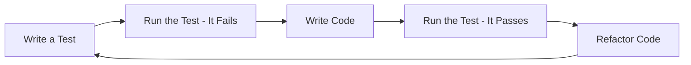

# PHP Test Driven Development

## Introduction

Test Driven Development (TDD) is a software development approach where tests are written before the actual code. This methodology helps developers create more reliable, maintainable, and bug-free applications. In the PHP ecosystem, TDD has gained significant popularity due to the maturity of testing frameworks like PHPUnit and the growing emphasis on code quality.

This guide will walk you through the principles of TDD in PHP, show you how to set up your testing environment, and demonstrate the TDD workflow with practical examples.

## What is Test Driven Development?

Test Driven Development follows a simple yet powerful cycle often referred to as "Red-Green-Refactor":

1. **Red**: Write a failing test that defines a function or improvement you want to make
2. **Green**: Write the minimum amount of code to make the test pass
3. **Refactor**: Clean up the code while ensuring the tests still pass



This approach provides several benefits:

- **Clearer requirements**: Tests serve as executable specifications
- **Better design**: Writing tests first forces you to think about your code's interface before implementation
- **Faster feedback**: Immediate validation of your code's correctness
- **Regression protection**: Tests catch bugs introduced by future changes
- **Documentation**: Tests demonstrate how the code should be used

## Setting Up PHP Testing Environment

Before we dive into TDD, let's set up our PHP testing environment with PHPUnit.

### Prerequisites

- PHP 7.4 or higher installed
- Composer installed

### Installation Steps

1. Create a new project directory:

```bash
mkdir php-tdd-demo
cd php-tdd-demo
```

2. Initialize a new Composer project:

```bash
composer init --name=yourname/php-tdd-demo
```

3. Install PHPUnit as a development dependency:

```bash
composer require --dev phpunit/phpunit
```

4. Create a basic project structure:

```bash
mkdir -p src tests
```

5. Configure PHPUnit by creating a `phpunit.xml` file in your project root:

```xml
<?xml version="1.0" encoding="UTF-8"?>
<phpunit bootstrap="vendor/autoload.php"
         colors="true"
         verbose="true">
    <testsuites>
        <testsuite name="PHP TDD Demo Test Suite">
            <directory>tests</directory>
        </testsuite>
    </testsuites>
    <coverage>
        <include>
            <directory suffix=".php">src</directory>
        </include>
    </coverage>
</phpunit>
```

6. Update your `composer.json` file to autoload your classes:

```json
{
    "autoload": {
        "psr-4": {
            "App\\": "src/"
        }
    },
    "autoload-dev": {
        "psr-4": {
            "Tests\\": "tests/"
        }
    }
}
```

7. Generate the autoloader files:

```bash
composer dump-autoload
```

Now your testing environment is ready for TDD!

## The TDD Process in PHP: A Simple Example

Let's apply TDD to build a simple Calculator class in PHP. We'll follow the Red-Green-Refactor cycle.

### Step 1: Write a Failing Test (Red)

Create a file `tests/CalculatorTest.php`:

```php
<?php

namespace Tests;

use App\Calculator;
use PHPUnit\Framework\TestCase;

class CalculatorTest extends TestCase
{
    public function testAdd()
    {
        $calculator = new Calculator();
        $result = $calculator->add(2, 3);
        $this->assertEquals(5, $result);
    }
}
```

Run the test:

```bash
./vendor/bin/phpunit
```

You should see an error because the Calculator class doesn't exist yet.

### Step 2: Write Code to Make the Test Pass (Green)

Create a file `src/Calculator.php`:

```php
<?php

namespace App;

class Calculator
{
    public function add($a, $b)
    {
        return $a + $b;
    }
}
```

Run the test again:

```bash
./vendor/bin/phpunit
```

The test should now pass.

### Step 3: Refactor Your Code

Our code is quite simple, but we might want to add type hints for better type safety:

```php
<?php

namespace App;

class Calculator
{
    public function add(float $a, float $b): float
    {
        return $a + $b;
    }
}
```

Run the tests again to make sure they still pass.

### Step 4: Add More Tests and Functionality

Let's add a test for subtraction:

```php
public function testSubtract()
{
    $calculator = new Calculator();
    $result = $calculator->subtract(5, 2);
    $this->assertEquals(3, $result);
}
```

Run the test (it will fail), then implement the subtract method:

```php
public function subtract(float $a, float $b): float
{
    return $a - $b;
}
```

Run the tests again to verify they pass.

## Real-World TDD Example: Building a User Authentication Class

Let's apply TDD to a more realistic example: a UserAuthenticator class that verifies user credentials against a database.

### Step 1: Write Test for User Authentication

Create a new file `tests/UserAuthenticatorTest.php`:

```php
<?php

namespace Tests;

use App\UserAuthenticator;
use App\UserRepository;
use PHPUnit\Framework\TestCase;

class UserAuthenticatorTest extends TestCase
{
    public function testAuthenticateValidCredentials()
    {
        // Create a mock of the UserRepository
        $userRepository = $this->createMock(UserRepository::class);
        
        // Configure the mock to return a hashed password when getUserPasswordHash is called with 'john@example.com'
        $userRepository->method('getUserPasswordHash')
                     ->with('john@example.com')
                     ->willReturn('$2y$10$vI8aWBnW3fID.ZQ4/zo1G.q1lRps.9cGLcZEiGDMVr5yUP1KUOYTa'); // Hash for 'password123'
        
        $authenticator = new UserAuthenticator($userRepository);
        
        $result = $authenticator->authenticate('john@example.com', 'password123');
        
        $this->assertTrue($result);
    }
    
    public function testAuthenticateInvalidCredentials()
    {
        $userRepository = $this->createMock(UserRepository::class);
        
        $userRepository->method('getUserPasswordHash')
                     ->with('john@example.com')
                     ->willReturn('$2y$10$vI8aWBnW3fID.ZQ4/zo1G.q1lRps.9cGLcZEiGDMVr5yUP1KUOYTa'); // Hash for 'password123'
        
        $authenticator = new UserAuthenticator($userRepository);
        
        $result = $authenticator->authenticate('john@example.com', 'wrongpassword');
        
        $this->assertFalse($result);
    }
    
    public function testAuthenticateNonexistentUser()
    {
        $userRepository = $this->createMock(UserRepository::class);
        
        $userRepository->method('getUserPasswordHash')
                     ->with('nonexistent@example.com')
                     ->willReturn(null);
        
        $authenticator = new UserAuthenticator($userRepository);
        
        $result = $authenticator->authenticate('nonexistent@example.com', 'anypassword');
        
        $this->assertFalse($result);
    }
}
```

### Step 2: Create the Interface for UserRepository

Create a file `src/UserRepository.php`:

```php
<?php

namespace App;

interface UserRepository
{
    /**
     * Get the hashed password for a user
     * 
     * @param string $email The user's email
     * @return string|null The hashed password or null if user doesn't exist
     */
    public function getUserPasswordHash(string $email): ?string;
}
```

### Step 3: Implement the UserAuthenticator

Create a file `src/UserAuthenticator.php`:

```php
<?php

namespace App;

class UserAuthenticator
{
    private UserRepository $userRepository;
    
    public function __construct(UserRepository $userRepository)
    {
        $this->userRepository = $userRepository;
    }
    
    /**
     * Authenticate a user with email and password
     * 
     * @param string $email The user's email
     * @param string $password The user's password (plain text)
     * @return bool True if authentication succeeded, false otherwise
     */
    public function authenticate(string $email, string $password): bool
    {
        $hashedPassword = $this->userRepository->getUserPasswordHash($email);
        
        if ($hashedPassword === null) {
            return false;
        }
        
        return password_verify($password, $hashedPassword);
    }
}
```

### Step 4: Run Tests and Refactor

Run the tests:

```bash
./vendor/bin/phpunit
```

All tests should pass now. The code is already quite clean, but we could add additional error handling or logging if needed.

## TDD Best Practices in PHP

To get the most out of TDD in your PHP projects, consider these best practices:

1. **Write minimal tests first**: Start with the simplest test case and gradually add complexity
2. **Keep tests focused**: Each test should verify one specific behavior
3. **Use descriptive test names**: Names like `testUserCannotLoginWithInvalidPassword()` document what you're testing
4. **Use data providers** for testing multiple inputs:

```php
/**
 * @dataProvider additionProvider
 */
public function testAdd(float $a, float $b, float $expected)
{
    $calculator = new Calculator();
    $result = $calculator->add($a, $b);
    $this->assertEquals($expected, $result);
}

public function additionProvider()
{
    return [
        [1, 1, 2],
        [0, 0, 0],
        [-1, 1, 0],
        [1.5, 2.5, 4.0]
    ];
}
```

5. **Test edge cases**: Empty strings, null values, zero, extremely large numbers, etc.
6. **Aim for high coverage**: Try to cover at least 80% of your code with tests
7. **Keep tests fast**: Slow tests discourage frequent test runs
8. **Use test doubles wisely**: Use mocks, stubs, and fakes to isolate the code you're testing

## Common TDD Patterns in PHP

### Arrange-Act-Assert (AAA)

Structure your tests with three distinct sections:

```php
public function testExample()
{
    // Arrange - set up the test case
    $calculator = new Calculator();
    $a = 5;
    $b = 3;
    
    // Act - perform the action being tested
    $result = $calculator->subtract($a, $b);
    
    // Assert - verify the results
    $this->assertEquals(2, $result);
}
```

### Test Doubles

PHPUnit offers several types of test doubles:

- **Stubs**: Return fixed values to provide inputs for your tests
- **Mocks**: Verify that methods were called with expected parameters
- **Fakes**: Implement simplified versions of complex dependencies
- **Spies**: Record method calls for later verification

Example of a mock:

```php
public function testEmailIsSent()
{
    // Create a mock of the mailer
    $mailer = $this->createMock(Mailer::class);
    
    // Set expectations on the mock
    $mailer->expects($this->once())
           ->method('sendEmail')
           ->with('user@example.com', 'Subject', 'Message');
    
    // Inject the mock
    $notifier = new UserNotifier($mailer);
    
    // Trigger the method that should call the mailer
    $notifier->notifyUser('user@example.com');
}
```

## Integrating TDD with Continuous Integration

To maximize the benefits of TDD, integrate your tests with a CI pipeline:

1. Set up a CI service (GitHub Actions, GitLab CI, Jenkins, etc.)
2. Configure it to run your PHPUnit tests on every push
3. Set quality gates that prevent merging if tests fail
4. Generate coverage reports to track test coverage

Example GitHub Actions workflow file (`.github/workflows/php.yml`):

```yaml
name: PHP Tests

on:
  push:
    branches: [ main ]
  pull_request:
    branches: [ main ]

jobs:
  test:
    runs-on: ubuntu-latest

    steps:
    - uses: actions/checkout@v2
    
    - name: Setup PHP
      uses: shivammathur/setup-php@v2
      with:
        php-version: '8.1'
        extensions: mbstring, intl
        coverage: xdebug
    
    - name: Validate composer.json
      run: composer validate
    
    - name: Install dependencies
      run: composer install --prefer-dist --no-progress
    
    - name: Run test suite
      run: vendor/bin/phpunit --coverage-clover=coverage.xml
    
    - name: Upload coverage to Codecov
      uses: codecov/codecov-action@v1
```

## Challenges and Solutions in PHP TDD

### Challenge: Testing Database Interactions

**Solution**: Use an in-memory SQLite database for tests:

```php
public function setUp(): void
{
    $this->pdo = new PDO('sqlite::memory:');
    $this->pdo->exec('CREATE TABLE users (id INTEGER PRIMARY KEY, email TEXT, password TEXT)');
    
    // Insert test data
    $stmt = $this->pdo->prepare('INSERT INTO users (email, password) VALUES (?, ?)');
    $stmt->execute(['test@example.com', password_hash('password123', PASSWORD_DEFAULT)]);
    
    $this->userRepository = new PDOUserRepository($this->pdo);
}
```

### Challenge: Testing Legacy Code

**Solution**: Use characterization tests to lock down current behavior before refactoring:

```php
public function testLegacyFunction()
{
    // Capture the current output of the function
    ob_start();
    legacy_function('input');
    $output = ob_get_clean();
    
    // Assert that this exact output is maintained
    $this->assertEquals("Expected output", $output);
}
```

### Challenge: Time-dependent Tests

**Solution**: Use dependency injection for time-related components:

```php
// Instead of:
public function isExpired()
{
    return time() > $this->expiryTime;
}

// Use:
public function isExpired(DateTimeInterface $now = null)
{
    $now = $now ?? new DateTime();
    return $now->getTimestamp() > $this->expiryTime;
}

// Then test with:
public function testIsExpired()
{
    $subscription = new Subscription(100); // Expires at timestamp 100
    $this->assertFalse($subscription->isExpired(new DateTime('@50')));
    $this->assertTrue($subscription->isExpired(new DateTime('@150')));
}
```

## Summary

Test Driven Development is a powerful approach for PHP developers that leads to more maintainable, better-designed, and more reliable code. By following the Red-Green-Refactor cycle, you can build software that's both well-tested and well-structured.

In this guide, we've covered:

- The fundamental principles of TDD
- Setting up a PHP testing environment with PHPUnit
- The TDD workflow with simple and real-world examples
- Best practices and common patterns for PHP TDD
- Integrating TDD with continuous integration
- Solving common TDD challenges in PHP

## Additional Resources

- [PHPUnit Documentation](https://phpunit.de/documentation.html)
- [Test-Driven Development: By Example](https://www.amazon.com/Test-Driven-Development-Kent-Beck/dp/0321146530) by Kent Beck
- [Mockery](https://github.com/mockery/mockery) - A complementary mocking framework for PHP
- [Infection](https://infection.github.io/) - Mutation testing framework for PHP

## Exercises

1. **Simple Calculator**: Extend the Calculator class with multiplication, division, and power functions using TDD
2. **String Utilities**: Create a StringUtils class with methods for common string operations (reverse, capitalize, truncate) using TDD
3. **Todo List**: Build a TodoList class with methods to add, remove, and mark items as complete using TDD
4. **User Registration**: Create a UserRegistration service that validates email and password strength using TDD
5. **API Client**: Build a simple API client that fetches and parses JSON data using TDD with mocked HTTP responses

By practicing these exercises, you'll strengthen your TDD skills and develop a test-first mindset that will serve you well in all your PHP projects.