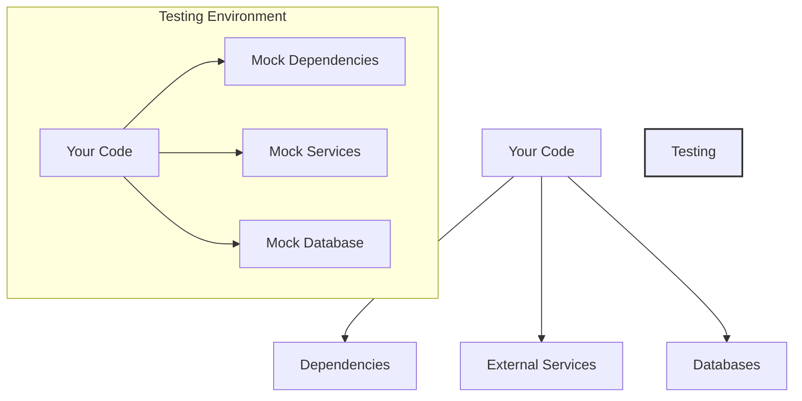

# PHP Mocking

## Introduction

When testing PHP applications, you'll often encounter scenarios where your code depends on external systems, databases, APIs, or complex objects that are difficult to set up in a test environment. This is where **mocking** comes into play.

Mocking is a technique used in unit testing where you replace real objects with simulated ones that mimic their behavior. These simulated objects—called "mocks"—allow you to test your code in isolation, making your tests faster, more reliable, and focused on specific functionality.

In this guide, we'll explore PHP mocking concepts, techniques, and tools that will help you write better tests for your PHP applications.

## Why Do We Need Mocking?

Before diving into how to implement mocks, let's understand why they're essential:

1. **Isolation**: Mocks help isolate the code being tested from its dependencies.
2. **Speed**: Tests run faster when they don't rely on slow external systems.
3. **Reliability**: Tests aren't affected by external factors like network issues.
4. **Control**: You can simulate different scenarios, including error conditions.
5. **Focus**: Test only the functionality you're interested in.

Let's visualize the concept of mocking in testing:



## PHP Mocking Tools

Several libraries can help with mocking in PHP. The most popular ones include:

1. **PHPUnit's built-in mocking framework**: Integrated with the popular testing framework.
2. **Mockery**: A standalone mocking library that can integrate with PHPUnit.
3. **Prophecy**: A more modern approach to mocking (previously integrated with PHPUnit).

In this guide, we'll focus primarily on PHPUnit's built-in mocking capabilities and briefly cover Mockery.

## Setting Up Your Environment

Before we start, make sure you have PHPUnit installed. If you're using Composer (which you should be!), add PHPUnit to your project:

```bash
composer require --dev phpunit/phpunit
```

If you want to use Mockery:

```bash
composer require --dev mockery/mockery
```

## Basic Mocking with PHPUnit

### Creating Simple Mocks

Let's start with a basic example. Imagine we have a `UserService` class that depends on a `UserRepository` to fetch users from a database:

```php
class UserService {
    private $userRepository;
    
    public function __construct(UserRepository $userRepository) {
        $this->userRepository = $userRepository;
    }
    
    public function getUserFullName($userId) {
        $user = $this->userRepository->findById($userId);
        if (!$user) {
            return null;
        }
        return $user->getFirstName() . ' ' . $user->getLastName();
    }
}
```

To test this without hitting the database, we'll mock the `UserRepository`:

```php
use PHPUnit\Framework\TestCase;

class UserServiceTest extends TestCase {
    public function testGetUserFullNameReturnsFormattedName() {
        // Create a mock of UserRepository
        $userRepository = $this->createMock(UserRepository::class);
        
        // Create a mock User object
        $user = $this->createMock(User::class);
        
        // Configure the mock User to return specific values for method calls
        $user->method('getFirstName')->willReturn('John');
        $user->method('getLastName')->willReturn('Doe');
        
        // Configure the repository mock to return our user mock
        $userRepository->method('findById')
            ->with(123)
            ->willReturn($user);
            
        // Create the service with our mock repository
        $userService = new UserService($userRepository);
        
        // Test the method
        $fullName = $userService->getUserFullName(123);
        
        // Assert the result is as expected
        $this->assertEquals('John Doe', $fullName);
    }
    
    public function testGetUserFullNameReturnsNullForNonExistentUser() {
        // Create a mock of UserRepository
        $userRepository = $this->createMock(UserRepository::class);
        
        // Configure the repository mock to return null
        $userRepository->method('findById')
            ->with(999)
            ->willReturn(null);
            
        // Create the service with our mock repository
        $userService = new UserService($userRepository);
        
        // Test the method
        $fullName = $userService->getUserFullName(999);
        
        // Assert the result is as expected
        $this->assertNull($fullName);
    }
}
```

In this example:
1. We created a mock of the `UserRepository` class
2. We configured what values it should return for specific method calls
3. We tested our `UserService` without needing a real database

### Expected Method Calls

Sometimes you want to verify that your code is calling the dependencies correctly. For this, you can set expectations on your mocks:

```php
public function testSaveUserCallsRepositoryMethod() {
    // Create a mock with expectations
    $userRepository = $this->createMock(UserRepository::class);
    
    // Expect that the save method will be called exactly once with this user
    $userRepository->expects($this->once())
        ->method('save')
        ->with($this->equalTo($user));
        
    $userService = new UserService($userRepository);
    $userService->registerUser($user);
}
```

## Advanced Mocking Techniques

### Partial Mocks

Sometimes you want to mock only specific methods of a class while keeping the rest of the functionality intact:

```php
public function testPartialMock() {
    // Create a partial mock, only mocking the "complicated" method
    $service = $this->createPartialMock(MyService::class, ['complicatedMethod']);
    
    // Set expectations on the mocked method
    $service->method('complicatedMethod')
        ->willReturn('simplified result');
        
    // Other methods on $service will work normally
    $result = $service->doSomethingUsingComplicatedMethod();
    
    $this->assertEquals('Expected Result', $result);
}
```

### Mocking Traits and Abstract Classes

PHPUnit can also mock traits and abstract classes:

```php
// Mocking an abstract class
$mock = $this->getMockBuilder(AbstractClass::class)
    ->disableOriginalConstructor()
    ->getMockForAbstractClass();
    
// Mocking a trait
$mock = $this->getMockBuilder(MyTrait::class)
    ->disableOriginalConstructor()
    ->getMockForTrait();
```

### Consecutive Calls

You can configure a mock to return different values on consecutive calls:

```php
$repository = $this->createMock(UserRepository::class);

$repository->method('count')
    ->willReturnOnConsecutiveCalls(3, 5, 10);
    
$this->assertEquals(3, $repository->count()); // First call
$this->assertEquals(5, $repository->count()); // Second call
$this->assertEquals(10, $repository->count()); // Third call
```

## Using Mockery

Mockery offers an alternative syntax that some developers find more readable. Here's the same example using Mockery:

```php
use Mockery;
use PHPUnit\Framework\TestCase;

class UserServiceTest extends TestCase {
    public function testGetUserFullNameReturnsFormattedName() {
        // Create a mock of UserRepository
        $userRepository = Mockery::mock(UserRepository::class);
        
        // Create a mock User object
        $user = Mockery::mock(User::class);
        
        // Configure the mock User to return specific values
        $user->shouldReceive('getFirstName')->andReturn('John');
        $user->shouldReceive('getLastName')->andReturn('Doe');
        
        // Configure the repository mock to return our user mock
        $userRepository->shouldReceive('findById')
            ->with(123)
            ->andReturn($user);
            
        // Create the service with our mock repository
        $userService = new UserService($userRepository);
        
        // Test the method
        $fullName = $userService->getUserFullName(123);
        
        // Assert the result is as expected
        $this->assertEquals('John Doe', $fullName);
    }
    
    protected function tearDown(): void {
        Mockery::close();
        parent::tearDown();
    }
}
```

Note the differences:
- `shouldReceive()` instead of `method()`
- `andReturn()` instead of `willReturn()`
- The need to call `Mockery::close()` in `tearDown()` to verify expectations

## Real-world Example: Testing an API Client

Let's look at a more realistic example. Imagine we have a weather API client:

```php
class WeatherApiClient {
    private $httpClient;
    private $apiKey;
    
    public function __construct(HttpClientInterface $httpClient, $apiKey) {
        $this->httpClient = $httpClient;
        $this->apiKey = $apiKey;
    }
    
    public function getCurrentTemperature($city) {
        $response = $this->httpClient->get(
            "https://api.weather.com/current",
            [
                'query' => [
                    'city' => $city,
                    'apiKey' => $this->apiKey
                ]
            ]
        );
        
        $data = json_decode($response->getBody()->getContents(), true);
        
        if (isset($data['temperature'])) {
            return $data['temperature'];
        }
        
        throw new \Exception("Could not retrieve temperature data");
    }
}
```

Here's how we would test it using mocks:

```php
class WeatherApiClientTest extends TestCase {
    public function testGetCurrentTemperatureReturnsCorrectValue() {
        // Create mocks
        $httpClient = $this->createMock(HttpClientInterface::class);
        $response = $this->createMock(ResponseInterface::class);
        $stream = $this->createMock(StreamInterface::class);
        
        // Configure stream mock to return JSON data
        $stream->method('getContents')
            ->willReturn('{"temperature": 25.5}');
        
        // Configure response mock to return stream
        $response->method('getBody')
            ->willReturn($stream);
            
        // Configure httpClient mock to return response
        $httpClient->method('get')
            ->with(
                $this->equalTo('https://api.weather.com/current'),
                $this->callback(function($options) {
                    return $options['query']['city'] === 'London' &&
                           $options['query']['apiKey'] === 'test-api-key';
                })
            )
            ->willReturn($response);
            
        // Create the API client with our mock
        $weatherClient = new WeatherApiClient($httpClient, 'test-api-key');
        
        // Call the method
        $temperature = $weatherClient->getCurrentTemperature('London');
        
        // Assert the result
        $this->assertEquals(25.5, $temperature);
    }
    
    public function testGetCurrentTemperatureThrowsExceptionOnMissingData() {
        // Create mocks
        $httpClient = $this->createMock(HttpClientInterface::class);
        $response = $this->createMock(ResponseInterface::class);
        $stream = $this->createMock(StreamInterface::class);
        
        // Configure stream mock to return JSON without temperature data
        $stream->method('getContents')
            ->willReturn('{"humidity": 80}');
        
        // Configure response mock to return stream
        $response->method('getBody')
            ->willReturn($stream);
            
        // Configure httpClient mock to return response
        $httpClient->method('get')
            ->willReturn($response);
            
        // Create the API client with our mock
        $weatherClient = new WeatherApiClient($httpClient, 'test-api-key');
        
        // Expect an exception
        $this->expectException(\Exception::class);
        
        // Call the method
        $weatherClient->getCurrentTemperature('London');
    }
}
```

This example shows how you can use mocking to test code that interacts with external APIs without making actual HTTP requests.

## Best Practices for Mocking

1. **Don't mock everything**: Only mock what's necessary to isolate your unit tests.
2. **Use dependency injection**: It makes your code more testable and easier to mock.
3. **Mock interfaces rather than concrete classes**: It's better practice and prevents brittle tests.
4. **Don't over-specify**: Only set expectations on method calls that are relevant to your test.
5. **Keep mocks simple**: Complex mock setups might indicate that your design needs improvement.
6. **Combine with integration tests**: Mocking is great for unit tests, but also include integration tests that use real dependencies.

## Common Pitfalls

1. **Mocking concrete classes**: This can lead to tests breaking when implementation details change.
2. **Mocking the system under test**: You should be testing the real system, not a mock of it.
3. **Mock verification overkill**: Verifying too many internal interactions makes tests brittle.
4. **Forgetting to reset mocks**: Static mocks or shared mocks can affect other tests if not reset.

## Summary

Mocking is a powerful technique for creating isolated, fast, and reliable unit tests in PHP. By replacing real dependencies with controlled test doubles, you can focus on testing specific functionality without worrying about external factors.

In this guide, we've covered:
- The basics of mocking in PHP
- Using PHPUnit's built-in mocking features
- Alternative mocking libraries like Mockery
- Advanced mocking techniques
- Real-world examples of mocking API clients
- Best practices and common pitfalls

With these techniques, you'll be able to write more effective unit tests and improve the quality of your PHP applications.

## Additional Resources

- [PHPUnit Documentation on Test Doubles](https://phpunit.de/manual/current/en/test-doubles.html)
- [Mockery Documentation](http://docs.mockery.io/en/latest/)
- [Martin Fowler's article on Mocks Aren't Stubs](https://martinfowler.com/articles/mocksArentStubs.html)

## Practice Exercises

1. Create a class that depends on a database connection and write tests for it using mocks.
2. Write tests for a class that sends emails, mocking the mailer service.
3. Test a payment processing class by mocking the payment gateway.
4. Create a mock that returns different values on consecutive calls and write tests that verify behavior.
5. Practice using Mockery instead of PHPUnit's built-in mocking framework for the same test cases.