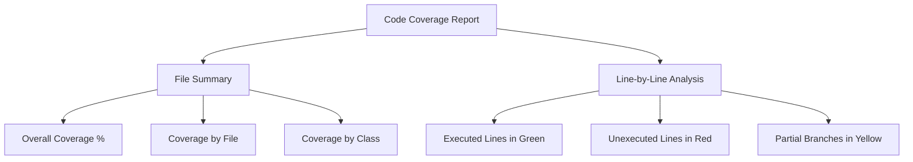

# PHP Code Coverage

## Introduction

Code coverage is a crucial metric in software testing that measures how much of your code is executed during tests. Think of it as a report card that shows which parts of your code have been tested and which haven't. In PHP development, code coverage helps you identify untested or undertested code, giving you confidence in your application's reliability and highlighting areas that need more testing attention.

This guide will walk you through:
- What code coverage is and why it matters
- Setting up code coverage tools in PHP
- Running and interpreting coverage reports
- Strategies to improve your coverage
- Real-world examples and best practices

Let's dive in and learn how to ensure your PHP applications are thoroughly tested!

## What is Code Coverage?

Code coverage is a measurement of how much of your source code is executed when your test suite runs. It's expressed as a percentage - for example, "80% code coverage" means that 80% of your code lines, functions, or branches were executed during testing.

Code coverage answers questions like:
- Which lines of code have been tested?
- Which methods or functions haven't been called during tests?
- Are there conditional branches (if/else statements) that haven't been executed?

### Types of Code Coverage

There are several types of code coverage metrics, each providing different insights:

1. **Line Coverage**: The percentage of code lines that were executed.
2. **Function Coverage**: The percentage of functions/methods that were called.
3. **Branch Coverage**: The percentage of conditional branches (like if/else statements) that were executed.
4. **Statement Coverage**: The percentage of statements that were executed.
5. **Path Coverage**: The percentage of possible paths through the code that were executed.

## Why Code Coverage Matters

Code coverage helps you:

- **Find Untested Code**: Discover parts of your application that haven't been tested yet.
- **Prevent Bugs**: More thorough testing generally means fewer bugs in production.
- **Improve Test Quality**: Writing tests to increase coverage often leads to better overall test design.
- **Build Confidence**: Higher coverage gives you more confidence to refactor or add features.
- **Document Code**: Tests serve as documentation, and coverage ensures this documentation is complete.

However, it's important to remember that code coverage isn't the only measure of test quality. 100% code coverage doesn't guarantee bug-free code - it only confirms that all code was executed during tests, not that all possible scenarios were tested.

## Setting Up Code Coverage in PHP

To measure code coverage in PHP, you'll need:

1. **PHPUnit**: The most popular PHP testing framework
2. **Xdebug**: A PHP extension that provides debugging and profiling capabilities
3. **pcov** (alternative): A lighter extension focused specifically on code coverage

Let's set these up step by step.

### Installing Prerequisites

First, ensure you have PHPUnit installed in your project:

```bash
# Using Composer
composer require --dev phpunit/phpunit

# Verify installation
./vendor/bin/phpunit --version
```

Next, install Xdebug:

```bash
# For PHP 7.x and 8.x
pecl install xdebug

# Add to php.ini
echo "zend_extension=xdebug.so" >> php.ini
```

Alternatively, you can use pcov which is lighter and faster:

```bash
pecl install pcov
```

### Configuring PHPUnit for Code Coverage

Create or update your `phpunit.xml` configuration file to enable code coverage:

```xml
<?xml version="1.0" encoding="UTF-8"?>
<phpunit xmlns:xsi="http://www.w3.org/2001/XMLSchema-instance"
         xsi:noNamespaceSchemaLocation="./vendor/phpunit/phpunit/phpunit.xsd"
         bootstrap="vendor/autoload.php"
         colors="true">
    <testsuites>
        <testsuite name="Unit">
            <directory suffix="Test.php">./tests/Unit</directory>
        </testsuite>
    </testsuites>
    
    <coverage processUncoveredFiles="true">
        <include>
            <directory suffix=".php">./src</directory>
        </include>
        <exclude>
            <directory suffix=".php">./vendor</directory>
        </exclude>
        <report>
            <html outputDirectory="coverage-report"/>
            <text outputFile="coverage.txt"/>
        </report>
    </coverage>
</phpunit>
```

This configuration tells PHPUnit:
- Which files to include in coverage analysis (`./src`)
- Which files to exclude (`./vendor`)
- Where to output the coverage reports (HTML and text formats)

## Running Your First Coverage Report

Now you're ready to generate a code coverage report:

```bash
./vendor/bin/phpunit --coverage-html coverage-report
```

This command runs your tests and generates an HTML report in the `coverage-report` directory. Open the `index.html` file in this directory to view your coverage report.

You can also generate reports in other formats:

```bash
# Generate Clover XML report (useful for CI tools)
./vendor/bin/phpunit --coverage-clover=coverage.xml

# Generate text report in the console
./vendor/bin/phpunit --coverage-text
```

## Understanding Coverage Reports

Let's look at an example PHP class and test to understand how coverage works:

```php
// src/Calculator.php
class Calculator {
    public function add($a, $b) {
        return $a + $b;
    }
    
    public function subtract($a, $b) {
        return $a - $b;
    }
    
    public function multiply($a, $b) {
        return $a * $b;
    }
    
    public function divide($a, $b) {
        if ($b == 0) {
            throw new InvalidArgumentException("Cannot divide by zero");
        }
        return $a / $b;
    }
}
```

Here's a simple test for this class:

```php
// tests/CalculatorTest.php
use PHPUnit\Framework\TestCase;

class CalculatorTest extends TestCase {
    public function testAdd() {
        $calculator = new Calculator();
        $this->assertEquals(5, $calculator->add(2, 3));
    }
    
    public function testSubtract() {
        $calculator = new Calculator();
        $this->assertEquals(1, $calculator->subtract(3, 2));
    }
}
```

If we run the coverage report, it would show:
- 50% method coverage (2 of 4 methods tested)
- Partial line coverage (the `divide` method's conditional branch isn't tested)

The HTML report would highlight tested lines in green and untested lines in red. This visual feedback helps you quickly identify which parts of your code need more tests.

## Interpreting Code Coverage Results

Here's what a typical code coverage report might show:

```
Code Coverage Report Summary:
  Lines: 67.74% (42/62)
  Methods: 85.71% (12/14)
  Classes: 100.00% (1/1)
```

This means:
- 67.74% of lines were executed (42 out of 62)
- 85.71% of methods were called (12 out of 14)
- 100% of classes were instantiated (1 out of 1)

The HTML report provides a more detailed breakdown, showing exactly which lines were executed and which weren't.

### Coverage Visualization

Let's visualize how coverage reports typically display your code:



## Strategies to Improve Code Coverage

Now that you can measure coverage, how do you improve it?

### 1. Focus on Uncovered Lines

The most straightforward approach is to write tests specifically for the uncovered lines. Using our Calculator example:

```php
// Add these tests to CalculatorTest.php
public function testMultiply() {
    $calculator = new Calculator();
    $this->assertEquals(6, $calculator->multiply(2, 3));
}

public function testDivide() {
    $calculator = new Calculator();
    $this->assertEquals(2, $calculator->divide(4, 2));
}

public function testDivideByZero() {
    $calculator = new Calculator();
    $this->expectException(InvalidArgumentException::class);
    $calculator->divide(4, 0);
}
```

These additional tests would increase our coverage to 100% for the Calculator class.

### 2. Test Edge Cases

Don't just test the "happy path" - also test edge cases and error conditions:

- Empty inputs
- Null values
- Boundary values (minimum/maximum)
- Invalid inputs
- Error conditions

### 3. Use Data Providers

Use PHPUnit's data providers to test multiple scenarios without repeating code:

```php
/**
 * @dataProvider additionProvider
 */
public function testAdd($a, $b, $expected) {
    $calculator = new Calculator();
    $this->assertEquals($expected, $calculator->add($a, $b));
}

public function additionProvider() {
    return [
        [0, 0, 0],
        [1, 1, 2],
        [-1, 1, 0],
        [1.5, 2.5, 4],
        // Add more test cases
    ];
}
```

### 4. Use Test Doubles

When testing code with dependencies, use mock objects, stubs, and test doubles to focus on the unit you're testing:

```php
public function testProcessPayment() {
    // Create a mock for the PaymentGateway
    $mockGateway = $this->createMock(PaymentGateway::class);
    
    // Configure the mock
    $mockGateway->expects($this->once())
                ->method('charge')
                ->willReturn(true);
    
    // Inject the mock
    $processor = new PaymentProcessor($mockGateway);
    
    // Test with the mock
    $result = $processor->processPayment(100, "4242424242424242");
    
    $this->assertTrue($result);
}
```

## Real-World Example: Testing a Blog Post Service

Let's look at a more complex example - a service class for managing blog posts:

```php
// src/BlogPostService.php
class BlogPostService {
    private $repository;
    
    public function __construct(BlogPostRepository $repository) {
        $this->repository = $repository;
    }
    
    public function createPost(string $title, string $content, int $authorId) {
        if (empty($title)) {
            throw new InvalidArgumentException("Title cannot be empty");
        }
        
        if (strlen($content) < 10) {
            throw new InvalidArgumentException("Content too short (minimum 10 characters)");
        }
        
        $post = new BlogPost();
        $post->setTitle($title);
        $post->setContent($content);
        $post->setAuthorId($authorId);
        $post->setCreatedAt(new DateTime());
        
        return $this->repository->save($post);
    }
    
    public function getPostById(int $id) {
        $post = $this->repository->find($id);
        
        if (!$post) {
            return null;
        }
        
        return $post;
    }
    
    public function updatePost(int $id, array $data) {
        $post = $this->repository->find($id);
        
        if (!$post) {
            throw new NotFoundException("Post not found");
        }
        
        if (isset($data['title'])) {
            if (empty($data['title'])) {
                throw new InvalidArgumentException("Title cannot be empty");
            }
            $post->setTitle($data['title']);
        }
        
        if (isset($data['content'])) {
            if (strlen($data['content']) < 10) {
                throw new InvalidArgumentException("Content too short");
            }
            $post->setContent($data['content']);
        }
        
        return $this->repository->save($post);
    }
}
```

To achieve high coverage for this class, we need to test:

1. All methods
2. All conditional branches
3. Error conditions

Here's a test class that achieves high coverage:

```php
// tests/BlogPostServiceTest.php
use PHPUnit\Framework\TestCase;

class BlogPostServiceTest extends TestCase {
    private $mockRepository;
    private $service;
    
    protected function setUp(): void {
        $this->mockRepository = $this->createMock(BlogPostRepository::class);
        $this->service = new BlogPostService($this->mockRepository);
    }
    
    public function testCreatePostSuccessfully() {
        // Arrange
        $mockPost = new BlogPost();
        $this->mockRepository->expects($this->once())
            ->method('save')
            ->willReturn($mockPost);
            
        // Act
        $result = $this->service->createPost("Test Title", "Test Content that is long enough", 1);
        
        // Assert
        $this->assertSame($mockPost, $result);
    }
    
    public function testCreatePostWithEmptyTitle() {
        $this->expectException(InvalidArgumentException::class);
        $this->service->createPost("", "Test Content", 1);
    }
    
    public function testCreatePostWithShortContent() {
        $this->expectException(InvalidArgumentException::class);
        $this->service->createPost("Test Title", "Too short", 1);
    }
    
    public function testGetPostByIdReturnsPost() {
        // Arrange
        $mockPost = new BlogPost();
        $this->mockRepository->expects($this->once())
            ->method('find')
            ->with(1)
            ->willReturn($mockPost);
            
        // Act
        $result = $this->service->getPostById(1);
        
        // Assert
        $this->assertSame($mockPost, $result);
    }
    
    public function testGetPostByIdReturnsNull() {
        // Arrange
        $this->mockRepository->expects($this->once())
            ->method('find')
            ->with(999)
            ->willReturn(null);
            
        // Act
        $result = $this->service->getPostById(999);
        
        // Assert
        $this->assertNull($result);
    }
    
    public function testUpdatePostSuccessfully() {
        // Arrange
        $mockPost = new BlogPost();
        $mockPost->setTitle("Original Title");
        $mockPost->setContent("Original Content");
        
        $this->mockRepository->expects($this->once())
            ->method('find')
            ->with(1)
            ->willReturn($mockPost);
            
        $this->mockRepository->expects($this->once())
            ->method('save')
            ->willReturn($mockPost);
            
        // Act
        $result = $this->service->updatePost(1, [
            'title' => 'Updated Title',
            'content' => 'Updated Content that is long enough'
        ]);
        
        // Assert
        $this->assertSame($mockPost, $result);
    }
    
    public function testUpdatePostNotFound() {
        // Arrange
        $this->mockRepository->expects($this->once())
            ->method('find')
            ->with(999)
            ->willReturn(null);
            
        // Act & Assert
        $this->expectException(NotFoundException::class);
        $this->service->updatePost(999, ['title' => 'New Title']);
    }
    
    public function testUpdatePostWithEmptyTitle() {
        // Arrange
        $mockPost = new BlogPost();
        $this->mockRepository->expects($this->once())
            ->method('find')
            ->with(1)
            ->willReturn($mockPost);
            
        // Act & Assert
        $this->expectException(InvalidArgumentException::class);
        $this->service->updatePost(1, ['title' => '']);
    }
    
    public function testUpdatePostWithShortContent() {
        // Arrange
        $mockPost = new BlogPost();
        $this->mockRepository->expects($this->once())
            ->method('find')
            ->with(1)
            ->willReturn($mockPost);
            
        // Act & Assert
        $this->expectException(InvalidArgumentException::class);
        $this->service->updatePost(1, ['content' => 'Short']);
    }
}
```

This test suite:
- Tests all methods of the BlogPostService
- Tests both success paths and error conditions
- Covers all conditional branches
- Uses mocks to isolate the service from its dependencies

## Code Coverage in CI/CD Pipelines

Integrating code coverage into your Continuous Integration/Continuous Deployment (CI/CD) pipeline helps maintain or improve coverage over time.

### GitHub Actions Example

Here's an example GitHub Actions workflow that runs tests and checks coverage:

```yaml
name: PHP Tests

on: [push, pull_request]

jobs:
  test:
    runs-on: ubuntu-latest
    
    steps:
    - uses: actions/checkout@v2
    
    - name: Setup PHP
      uses: shivammathur/setup-php@v2
      with:
        php-version: '8.1'
        extensions: xdebug
        coverage: xdebug
    
    - name: Install dependencies
      run: composer install --prefer-dist --no-progress
    
    - name: Run tests with coverage
      run: ./vendor/bin/phpunit --coverage-clover=coverage.xml
    
    - name: Upload coverage to Codecov
      uses: codecov/codecov-action@v1
      with:
        file: ./coverage.xml
        fail_ci_if_error: true
```

This workflow:
1. Sets up PHP with Xdebug
2. Installs dependencies
3. Runs tests with coverage
4. Uploads the coverage report to Codecov

You can also enforce minimum coverage thresholds:

```bash
./vendor/bin/phpunit --coverage-text --coverage-min=80
```

This command will fail if coverage falls below 80%, helping maintain code quality.

## Popular PHP Code Coverage Tools

Besides PHPUnit, there are other tools for PHP code coverage:

### 1. Infection

Infection is a PHP mutation testing framework that helps detect inadequate test coverage:

```bash
composer require --dev infection/infection
```

Mutation testing generates modified versions of your code (mutants) and runs your tests against them. If your tests pass even with the mutation, it means your tests aren't thorough enough.

### 2. PHP_CodeCoverage

PHPUnit's underlying coverage library can be used independently:

```php
use SebastianBergmann\CodeCoverage\CodeCoverage;
use SebastianBergmann\CodeCoverage\Driver\Xdebug2Driver;
use SebastianBergmann\CodeCoverage\Report\Html\Facade as HtmlReport;

$coverage = new CodeCoverage(new Xdebug2Driver());

$coverage->start('tests');

// Run your code here...

$coverage->stop();

(new HtmlReport())->process($coverage, '/path/to/coverage');
```

### 3. PCOV

PCOV is a newer code coverage driver that's faster than Xdebug:

```bash
pecl install pcov
```

Configure PHPUnit to use it:

```xml
<phpunit cacheResult="false">
    <coverage>
        <include>
            <directory suffix=".php">src</directory>
        </include>
        <report>
            <html outputDirectory="coverage" lowUpperBound="50" highLowerBound="90"/>
        </report>
    </coverage>
</phpunit>
```

## Code Coverage Best Practices

To get the most out of code coverage in your PHP projects:

1. **Set realistic coverage targets**: Aim for 70-80% coverage initially, then improve over time.

2. **Focus on critical code paths**: Prioritize coverage for core business logic and error-prone areas.

3. **Don't chase 100% coverage blindly**: Some code might be trivial or difficult to test.

4. **Combine with other quality metrics**: Use code coverage alongside static analysis and code reviews.

5. **Write meaningful tests**: Don't just write tests to increase coverage; write tests that validate behavior.

6. **Test both positive and negative scenarios**: Ensure your tests cover success paths and error conditions.

7. **Exclude generated or third-party code**: Focus on covering your own business logic.

8. **Track coverage trends over time**: Monitor whether coverage is increasing or decreasing.

## Common Coverage Pitfalls

Beware of these common pitfalls when working with code coverage:

1. **Testing implementation, not behavior**: Focus on testing what the code does, not how it does it.

2. **Over-mocking**: Excessive use of mocks can lead to tests that pass but don't validate real behavior.

3. **Ignoring untested code**: Don't ignore code that's difficult to test; refactor it to make it testable.

4. **Testing trivial code**: Spending time testing getters and setters adds little value.

5. **Not testing error paths**: Ensure you test exception scenarios and error handling.

## Summary

Code coverage is a valuable tool in PHP testing that helps you:

- Measure how thoroughly your code is tested
- Identify areas that need more testing
- Gain confidence in your test suite
- Improve code quality over time

By setting up PHPUnit with Xdebug or PCOV, you can generate detailed coverage reports that guide your testing efforts. Remember that coverage is just one metric - it should be combined with other quality practices for the best results.

## Additional Resources

- [PHPUnit Documentation](https://phpunit.de/documentation.html)
- [Xdebug Code Coverage](https://xdebug.org/docs/code_coverage)
- [PCOV GitHub Repository](https://github.com/krakjoe/pcov)
- [Infection Mutation Testing](https://infection.github.io/)
- [PHP Quality Assurance Tools](https://phpqa.io/)

## Exercises

1. Set up PHPUnit and Xdebug in a simple PHP project and generate a coverage report.
2. Write tests to achieve at least 80% line coverage for a class of your choice.
3. Use data providers to test multiple scenarios without code duplication.
4. Add code coverage checking to a CI/CD pipeline.
5. Try mutation testing with Infection to identify weak spots in your test suite.