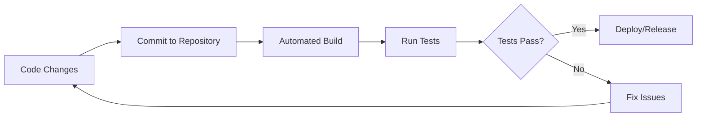

# PHP Continuous Integration

## Introduction

Continuous Integration (CI) is a development practice where developers regularly merge their code changes into a central repository, after which automated builds and tests are run. For PHP projects, implementing CI helps detect problems early, ensures code quality, and streamlines the development process.

In this guide, we'll explore how to set up continuous integration for PHP projects, the tools available, and best practices to follow. By the end, you'll understand how CI fits into your PHP testing strategy and be ready to implement it in your own projects.

## What is Continuous Integration?

Continuous Integration is a software development practice where team members integrate their work frequently, usually several times a day. Each integration is verified by an automated build and automated tests to detect integration errors as quickly as possible.



### Benefits of CI for PHP Projects

- **Early Bug Detection**: Problems are found and fixed early in the development process
- **Reduced Integration Problems**: Continuous merging means fewer integration conflicts
- **Improved Code Quality**: Automated tests ensure code meets quality standards
- **Faster Release Cycles**: Automation reduces manual work and speeds up releases
- **Better Collaboration**: Team members can see and incorporate each other's changes quickly

## Setting Up CI for PHP Projects

Let's walk through the steps to implement continuous integration for a PHP project:

### 1. Choose a CI Service

Several CI services work well with PHP projects:

- **GitHub Actions**: Integrated with GitHub repositories
- **Travis CI**: Popular open-source focused CI service
- **CircleCI**: Flexible CI/CD platform 
- **Jenkins**: Self-hosted automation server
- **GitLab CI**: Integrated with GitLab repositories

For this guide, we'll focus on GitHub Actions as it's widely used and easy to set up.

### 2. Create a Workflow File

With GitHub Actions, you create a workflow file in the `.github/workflows` directory of your repository. Here's a basic example for a PHP project:

```yaml
name: PHP CI

on:
  push:
    branches: [ main ]
  pull_request:
    branches: [ main ]

jobs:
  build:
    runs-on: ubuntu-latest
    
    steps:
    - uses: actions/checkout@v3
    
    - name: Setup PHP
      uses: shivammathur/setup-php@v2
      with:
        php-version: '8.1'
        extensions: mbstring, intl
        coverage: xdebug
        
    - name: Validate composer.json and composer.lock
      run: composer validate --strict
      
    - name: Install dependencies
      run: composer install --prefer-dist --no-progress
      
    - name: Run PHP_CodeSniffer
      run: vendor/bin/phpcs
      
    - name: Run PHPStan
      run: vendor/bin/phpstan analyse src tests
      
    - name: Run test suite
      run: vendor/bin/phpunit
```

This workflow:
1. Triggers on pushes to the main branch or pull requests
2. Sets up PHP 8.1 with necessary extensions
3. Validates the composer files
4. Installs project dependencies
5. Runs code quality tools (PHP_CodeSniffer and PHPStan)
6. Executes PHPUnit tests

### 3. Configure Testing Tools

To make the CI workflow effective, you need to configure the testing tools:

#### PHPUnit Configuration

Create a `phpunit.xml` file in your project root:

```xml
<?xml version="1.0" encoding="UTF-8"?>
<phpunit xmlns:xsi="http://www.w3.org/2001/XMLSchema-instance"
         xsi:noNamespaceSchemaLocation="vendor/phpunit/phpunit/phpunit.xsd"
         bootstrap="vendor/autoload.php"
         colors="true">
    <testsuites>
        <testsuite name="Unit">
            <directory>tests/Unit</directory>
        </testsuite>
        <testsuite name="Feature">
            <directory>tests/Feature</directory>
        </testsuite>
    </testsuites>
    <coverage>
        <include>
            <directory suffix=".php">src</directory>
        </include>
    </coverage>
</phpunit>
```

#### PHP_CodeSniffer Configuration

Create a `phpcs.xml` file:

```xml
<?xml version="1.0"?>
<ruleset name="PHP Standard">
    <description>PHP coding standard</description>
    
    <file>src</file>
    <file>tests</file>
    
    <arg name="colors"/>
    <arg value="p"/>
    
    <rule ref="PSR12"/>
</ruleset>
```

#### PHPStan Configuration

Create a `phpstan.neon` file:

```yaml
parameters:
    level: 5
    paths:
        - src
        - tests
```

## Practical Example: Setting Up CI for a Simple PHP Library

Let's look at a practical example of setting up continuous integration for a simple PHP calculator library.

### Project Structure

```
my-calculator/
├── .github/
│   └── workflows/
│       └── php-ci.yml
├── src/
│   └── Calculator.php
├── tests/
│   └── CalculatorTest.php
├── composer.json
├── phpunit.xml
├── phpcs.xml
└── phpstan.neon
```

### The Calculator Class

```php
// src/Calculator.php
namespace MyCalculator;

class Calculator
{
    public function add(float $a, float $b): float
    {
        return $a + $b;
    }
    
    public function subtract(float $a, float $b): float
    {
        return $a - $b;
    }
    
    public function multiply(float $a, float $b): float
    {
        return $a * $b;
    }
    
    public function divide(float $a, float $b): float
    {
        if ($b === 0.0) {
            throw new \InvalidArgumentException('Division by zero');
        }
        
        return $a / $b;
    }
}
```

### The Unit Tests

```php
// tests/CalculatorTest.php
namespace Tests;

use MyCalculator\Calculator;
use PHPUnit\Framework\TestCase;

class CalculatorTest extends TestCase
{
    private Calculator $calculator;
    
    protected function setUp(): void
    {
        $this->calculator = new Calculator();
    }
    
    public function testAdd(): void
    {
        $this->assertEquals(4, $this->calculator->add(2, 2));
        $this->assertEquals(0, $this->calculator->add(-2, 2));
        $this->assertEquals(2.5, $this->calculator->add(1.0, 1.5));
    }
    
    public function testSubtract(): void
    {
        $this->assertEquals(0, $this->calculator->subtract(2, 2));
        $this->assertEquals(-4, $this->calculator->subtract(-2, 2));
    }
    
    public function testMultiply(): void
    {
        $this->assertEquals(4, $this->calculator->multiply(2, 2));
        $this->assertEquals(-4, $this->calculator->multiply(-2, 2));
    }
    
    public function testDivide(): void
    {
        $this->assertEquals(1, $this->calculator->divide(2, 2));
        $this->assertEquals(-1, $this->calculator->divide(-2, 2));
    }
    
    public function testDivideByZero(): void
    {
        $this->expectException(\InvalidArgumentException::class);
        $this->calculator->divide(2, 0);
    }
}
```

### Composer Configuration

```json
{
    "name": "my/calculator",
    "description": "A simple PHP calculator library",
    "type": "library",
    "require": {
        "php": ">=8.0"
    },
    "require-dev": {
        "phpunit/phpunit": "^9.5",
        "squizlabs/php_codesniffer": "^3.6",
        "phpstan/phpstan": "^1.0"
    },
    "autoload": {
        "psr-4": {
            "MyCalculator\\": "src/"
        }
    },
    "autoload-dev": {
        "psr-4": {
            "Tests\\": "tests/"
        }
    },
    "scripts": {
        "test": "phpunit",
        "phpcs": "phpcs",
        "phpstan": "phpstan analyse"
    }
}
```

### CI Workflow in Action

When you push changes to your repository, the CI workflow will:

1. Install PHP and dependencies
2. Run code style checks with PHP_CodeSniffer
3. Run static analysis with PHPStan
4. Execute PHPUnit tests

If any step fails, you'll receive a notification, and the build will be marked as failed. This helps catch issues before they reach production.

## Advanced CI Techniques for PHP Projects

Once you have basic CI set up, you can add more advanced features:

### 1. Code Coverage Reports

Add code coverage reporting to your CI pipeline:

```yaml
- name: Run test suite with coverage
  run: vendor/bin/phpunit --coverage-clover=coverage.xml

- name: Upload coverage to Codecov
  uses: codecov/codecov-action@v2
  with:
    files: ./coverage.xml
```

### 2. Matrix Testing

Test across multiple PHP versions:

```yaml
jobs:
  build:
    runs-on: ubuntu-latest
    strategy:
      matrix:
        php-versions: ['7.4', '8.0', '8.1']
    
    steps:
    - uses: actions/checkout@v3
    
    - name: Setup PHP
      uses: shivammathur/setup-php@v2
      with:
        php-version: ${{ matrix.php-versions }}
```

### 3. Dependency Security Checks

Add security scanning for dependencies:

```yaml
- name: Security check for dependencies
  run: composer require --dev roave/security-advisories:dev-latest
```

### 4. Automated Deployment

For a complete CI/CD pipeline, add automated deployments:

```yaml
- name: Deploy to production
  if: github.ref == 'refs/heads/main' && job.status == 'success'
  run: |
    # Deployment commands here
```

## Best Practices for PHP CI

Here are some best practices to follow when setting up CI for PHP projects:

### 1. Keep Build Times Short

- Cache dependencies between runs
- Use parallel testing where possible
- Only run tests affected by changes

Example of caching in GitHub Actions:

```yaml
- name: Cache Composer packages
  uses: actions/cache@v3
  with:
    path: vendor
    key: ${{ runner.os }}-php-${{ hashFiles('**/composer.lock') }}
    restore-keys: ${{ runner.os }}-php-
```

### 2. Maintain High Test Coverage

- Aim for at least 80% code coverage
- Test both happy paths and edge cases
- Include unit, integration, and functional tests

### 3. Run CI on All Pull Requests

- Block merging if tests fail
- Require code review approval
- Enforce coding standards

### 4. Monitor and Optimize

- Track build times and test failures
- Regularly update dependencies
- Refactor tests if they become slow or flaky

## Popular PHP CI Tools

Here are some tools commonly used in PHP CI pipelines:

| Tool | Purpose |
|------|---------|
| PHPUnit | Unit testing framework |
| PHP_CodeSniffer | Code style checker |
| PHPStan | Static analysis tool |
| Psalm | Type checking and static analysis |
| Infection | Mutation testing |
| PHP Mess Detector | Detects code smells and complexity |
| PHP Copy/Paste Detector | Finds duplicated code |

## Troubleshooting Common CI Issues

### Tests Run Locally But Fail in CI

- Check for environment differences
- Ensure all dependencies are specified
- Look for race conditions in tests

### Slow CI Builds

- Optimize test suite
- Use caching
- Run tests in parallel
- Consider incremental testing

### Flaky Tests

- Identify and fix tests that sometimes pass and sometimes fail
- Add retries for network-dependent tests
- Use clean isolated environments for each test

## Summary

Continuous Integration is an essential practice for modern PHP development. By automating testing and ensuring code quality, CI helps teams deliver more reliable software faster. In this guide, you've learned:

- The fundamentals of CI and its benefits for PHP projects
- How to set up a basic CI pipeline using GitHub Actions
- How to configure essential PHP testing tools
- Advanced CI techniques for PHP projects
- Best practices for maintaining an effective CI process

Implementing CI in your PHP projects will help you catch bugs earlier, ensure code quality, and streamline your development workflow.

## Additional Resources

- [PHP Unit Documentation](https://phpunit.de/documentation.html)
- [GitHub Actions Documentation](https://docs.github.com/en/actions)
- [PHP_CodeSniffer Documentation](https://github.com/squizlabs/PHP_CodeSniffer/wiki)
- [PHPStan Documentation](https://phpstan.org/user-guide/getting-started)

## Exercises

1. Set up a CI pipeline for an existing PHP project
2. Add code coverage reporting to your CI workflow
3. Configure matrix testing for multiple PHP versions
4. Implement automated deployment to a staging environment
5. Add security scanning for dependencies to your CI pipeline