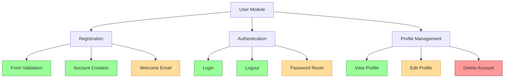

# PHP Test Documentation

## Introduction

Documentation is a crucial but often overlooked aspect of PHP testing. Well-documented tests not only help other developers understand what your code is supposed to do, but also serve as living specifications for your application. This guide will walk you through the process of creating effective documentation for your PHP tests, whether you're using PHPUnit, Codeception, or other testing frameworks.

## Why Document Tests?

Before diving into how to document tests, let's understand why it's important:

1. **Knowledge Transfer** - Makes it easier for new team members to understand the codebase
2. **Maintenance** - Helps future developers (including yourself) understand test intent when refactoring
3. **Specifications** - Acts as executable specifications of how your code should behave
4. **Quality Assurance** - Demonstrates test coverage and compliance with requirements

## Types of PHP Test Documentation

There are several levels of test documentation you should consider:

### 1. Code-Level Documentation

This includes docblocks and comments within your test files.

```php
/**
 * UserTest tests the User class functionality
 * 
 * @group user
 * @covers User
 */
class UserTest extends TestCase
{
    /**
     * Test that a user can be created with valid data
     *
     * @test
     * @covers User::__construct
     */
    public function userCanBeCreatedWithValidData()
    {
        // Arrange
        $userData = [
            'name' => 'John Doe',
            'email' => 'john@example.com',
            'age' => 30
        ];
        
        // Act
        $user = new User($userData);
        
        // Assert
        $this->assertEquals('John Doe', $user->getName());
        $this->assertEquals('john@example.com', $user->getEmail());
        $this->assertEquals(30, $user->getAge());
    }
}
```

#### Key Elements of Code-Level Documentation:

- **Class Docblock**: Describes the purpose of the test class
- **Method Docblock**: Explains what each test method verifies
- **Annotations**: `@test`, `@covers`, `@group`, etc., to categorize and clarify test purpose
- **Arrange-Act-Assert Comments**: Structure comments to clarify test stages

### 2. README Files

Each test directory should include a README.md file that explains:

```markdown
# User Module Tests

This directory contains tests for the User module.

## Directory Structure

- `Unit/` - Unit tests for individual User components
- `Integration/` - Tests for User interactions with other modules
- `Functional/` - End-to-end tests for User features

## Running the Tests

```bash
# Run all User tests
./vendor/bin/phpunit --testsuite=User

# Run only User unit tests
./vendor/bin/phpunit --testsuite=User-Unit
```

## Test Data

Test fixtures are located in `_fixtures` directory.
```

### 3. Test Plan Documentation

For larger projects, consider maintaining a test plan document:

```php
/**
 * Test Plan: User Authentication
 *
 * Feature: User authentication system
 * Priority: High
 * Components: User, Auth, Session
 *
 * Test Cases:
 * - Registration with valid data
 * - Registration with invalid data
 * - Login with correct credentials
 * - Login with incorrect credentials
 * - Password reset flow
 * - Account lockout after failed attempts
 */
```

## Best Practices for PHP Test Documentation

### 1. Follow the AAA Pattern

Structure your tests and documentation using the Arrange-Act-Assert pattern:

```php
/**
 * Tests that a user account is locked after 5 failed login attempts
 */
public function testAccountLockAfterFailedAttempts()
{
    // Arrange: Set up the test conditions
    $user = new User(['email' => 'test@example.com', 'password' => 'secret']);
    $auth = new Authenticator();
    
    // Act: Perform 5 failed login attempts
    for ($i = 0; $i < 5; $i++) {
        $auth->attempt(['email' => 'test@example.com', 'password' => 'wrong']);
    }
    
    // Assert: Verify the account is now locked
    $this->assertTrue($user->isLocked());
    $this->assertEquals(5, $user->failedLoginAttempts);
}
```

### 2. Use Meaningful Test Names

Your test method names should describe what they're testing:

```php
// Bad
public function testUser()

// Good
public function testUserCannotLoginWithIncorrectPassword()
```

### 3. Document Edge Cases

Explicitly document why you're testing certain edge cases:

```php
/**
 * Test that email validation rejects almost-valid emails
 * 
 * This test ensures our validation doesn't allow edge cases like:
 * - Missing TLD (.com, .org, etc.)
 * - Spaces in emails
 * - Unicode characters that look like ASCII
 */
public function testEmailValidationRejectsAlmostValidEmails()
{
    // Test implementation
}
```

### 4. Document Test Data

Explain why specific test data was chosen:

```php
/**
 * Test pagination with a prime number of items
 * 
 * We use 17 items because it's a prime number that will
 * force an uneven distribution across pages, testing
 * our pagination edge cases.
 */
public function testPaginationWithPrimeNumberOfItems()
{
    $items = $this->generateItems(17);
    $paginator = new Paginator($items, 5); // 5 items per page
    
    $this->assertEquals(4, $paginator->getPageCount());
    $this->assertEquals(2, $paginator->getItemsOnLastPage());
}
```

## Automating Documentation

You can automate parts of your test documentation with tools like:

1. **PHPDocumentor** - Generates API documentation from docblocks
2. **Doxygen** - Creates HTML documentation from code comments
3. **PHPUnit's --testdox** - Generates readable test documentation

Example of PHPUnit's testdox output:

```
$ phpunit --testdox

User
 [x] Can be created with valid data
 [x] Cannot be created with invalid email
 [x] Can change password
 [x] Cannot login with incorrect password
```

## Documenting Test Coverage

It's important to document your test coverage to identify gaps:



## Real-World Example: E-commerce Application Test Documentation

Let's look at a comprehensive example for an e-commerce application:

```php
<?php
/**
 * CartTest - Tests for the shopping cart functionality
 *
 * @group shopping
 * @group critical-path
 */
class CartTest extends TestCase
{
    /**
     * Test that products can be added to the cart
     *
     * @test
     * @covers Cart::addItem
     */
    public function productsCanBeAddedToCart()
    {
        // Arrange
        $cart = new Cart();
        $product = new Product(1, 'Phone', 499.99);
        
        // Act
        $cart->addItem($product, 2); // Add 2 phones
        
        // Assert
        $this->assertEquals(2, $cart->getItemQuantity($product));
        $this->assertEquals(999.98, $cart->getTotal());
    }
    
    /**
     * Test that product quantity is updated when adding existing product
     *
     * @test
     * @covers Cart::addItem
     */
    public function addingExistingProductUpdatesQuantity()
    {
        // Arrange
        $cart = new Cart();
        $product = new Product(1, 'Phone', 499.99);
        $cart->addItem($product, 1);
        
        // Act
        $cart->addItem($product, 2);
        
        // Assert
        $this->assertEquals(3, $cart->getItemQuantity($product));
    }
    
    /**
     * Test that products can be removed from the cart
     *
     * @test
     * @covers Cart::removeItem
     */
    public function productsCanBeRemovedFromCart()
    {
        // Arrange
        $cart = new Cart();
        $product = new Product(1, 'Phone', 499.99);
        $cart->addItem($product, 2);
        
        // Act
        $cart->removeItem($product);
        
        // Assert
        $this->assertEquals(0, $cart->getItemQuantity($product));
        $this->assertEquals(0, $cart->getTotal());
    }
}
```

## Documentation Maintenance

Test documentation needs regular maintenance:

1. **Review during code reviews** - Documentation should be reviewed alongside code
2. **Update when tests change** - Keep documentation in sync with code
3. **Automated checks** - Use tools to ensure documentation standards are maintained
4. **Regular audits** - Periodically review all test documentation for quality and accuracy

## Summary

Effective PHP test documentation is a critical part of maintaining a healthy codebase. By documenting your tests at various levels (code, README files, test plans) and following best practices, you create a more maintainable and understandable testing suite.

Remember these key points:
- Document the purpose of each test
- Use the AAA pattern consistently
- Create clear, descriptive test names
- Document edge cases and test data choices
- Automate documentation where possible
- Maintain documentation as code evolves

## Additional Resources

- [PHPUnit Documentation](https://phpunit.de/documentation.html)
- [PHPDocumentor](https://phpdoc.org/)
- [Clean Code: A Handbook of Agile Software Craftsmanship](https://www.amazon.com/Clean-Code-Handbook-Software-Craftsmanship/dp/0132350882)
- [Test Driven Development: By Example](https://www.amazon.com/Test-Driven-Development-Kent-Beck/dp/0321146530)

## Exercises

1. Take an existing test class and improve its documentation using the guidelines from this article.
2. Create a README.md file for your test directory that explains the purpose and structure of your tests.
3. Use PHPUnit's --testdox option to generate documentation for your tests and review the output.
4. Create a test coverage diagram for one module of your application.
5. Document a complex edge case that your tests cover, explaining why the test is necessary.