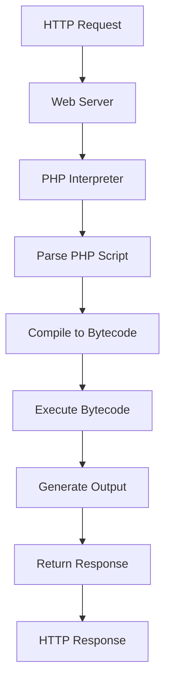

# PHP Performance Overview

## Introduction

Performance is a critical aspect of web development that directly impacts user experience, server costs, and application scalability. In PHP applications, understanding performance fundamentals helps you build faster, more efficient websites and applications that can handle more users with fewer resources.

This guide provides an overview of PHP performance concepts, common bottlenecks, and optimization techniques that every beginner should understand. We'll explore how PHP works behind the scenes and learn practical approaches to identify and resolve performance issues.

## Why Performance Matters

Before diving into technical details, let's understand why PHP performance should be a priority:

- **User Experience**: Faster sites lead to higher user satisfaction and retention
- **SEO Rankings**: Page speed is a ranking factor for search engines
- **Server Costs**: Optimized code requires fewer server resources, reducing hosting expenses
- **Scalability**: Efficient applications can handle more users without requiring architectural changes

## How PHP Works: The Execution Lifecycle

To understand performance optimization, you first need to know how PHP processes requests:



1. **Request Initiation**: The web server receives an HTTP request
2. **Script Loading**: PHP reads the requested script from disk
3. **Parsing**: PHP parses the script into tokens
4. **Compilation**: PHP compiles the tokens into bytecode
5. **Execution**: The bytecode is executed
6. **Output Generation**: PHP generates HTML output
7. **Response**: The output is sent back to the client

Each of these steps presents opportunities for optimization.

## Common Performance Bottlenecks

### 1. Database Operations

Database interactions are typically the most significant bottleneck in PHP applications.

```php
// Inefficient query example
$result = $db->query("SELECT * FROM products");
while ($row = $result->fetch_assoc()) {
    if ($row['category'] == 'electronics') {
        // Process electronics products
    }
}

// Optimized query
$result = $db->query("SELECT * FROM products WHERE category = 'electronics'");
while ($row = $result->fetch_assoc()) {
    // Process electronics products
}
```

### 2. Excessive File Operations

Reading from and writing to files is slow compared to memory operations.

```php
// Inefficient approach
for ($i = 0; $i < 1000; $i++) {
    file_put_contents('log.txt', "Log entry $i
", FILE_APPEND);
}

// Better approach
$logContent = '';
for ($i = 0; $i < 1000; $i++) {
    $logContent .= "Log entry $i
";
}
file_put_contents('log.txt', $logContent, FILE_APPEND);
```

### 3. Inefficient Loops and Data Structures

The way you structure your code and organize data can significantly impact performance.

```php
// Inefficient array search
$users = [/* thousands of user records */];
$foundUser = null;

foreach ($users as $user) {
    if ($user['id'] == 12345) {
        $foundUser = $user;
        break;
    }
}

// Better approach using associative array for direct access
$usersById = [];
foreach ($users as $user) {
    $usersById[$user['id']] = $user;
}
$foundUser = $usersById[12345] ?? null;
```

### 4. Memory Usage

PHP applications with high memory usage can cause performance degradation, especially under heavy load.

```php
// Memory-intensive approach
$data = file_get_contents('large_file.csv');
$rows = explode("
", $data);
// Process all rows at once

// More memory-efficient approach
$handle = fopen('large_file.csv', 'r');
while (($row = fgets($handle)) !== false) {
    // Process one row at a time
}
fclose($handle);
```

## Performance Measurement Techniques

Before optimizing, you need to identify actual bottlenecks:

### 1. Using the microtime() Function

```php
// Basic performance measurement
$start = microtime(true);

// Your code to measure
for ($i = 0; $i < 1000000; $i++) {
    $x = $i * 2;
}

$end = microtime(true);
$execution_time = ($end - $start);
echo "Execution time: $execution_time seconds";

// Output example:
// Execution time: 0.023876905441284 seconds
```

### 2. Memory Usage Tracking

```php
// Track memory usage
$start_memory = memory_get_usage();

// Your code to measure
$array = range(1, 100000);

$end_memory = memory_get_usage();
$memory_used = ($end_memory - $start_memory) / 1024 / 1024;
echo "Memory used: $memory_used MB";

// Output example:
// Memory used: 3.81475830078125 MB
```

## Key Optimization Techniques

### 1. Use PHP Opcode Caching

PHP's opcode cache (like OPcache) stores compiled bytecode in memory, eliminating the need to parse and compile scripts on each request.

```php
// Check if OPcache is enabled
if (function_exists('opcache_get_status')) {
    $status = opcache_get_status();
    echo "OPcache Enabled: " . ($status['opcache_enabled'] ? 'Yes' : 'No');
} else {
    echo "OPcache not available";
}
```

### 2. Optimize Database Queries

```php
// Using prepared statements for repeated queries
$stmt = $db->prepare("SELECT name, email FROM users WHERE status = ?");
$status = 'active';
$stmt->bind_param("s", $status);
$stmt->execute();
$result = $stmt->get_result();

// Using indexes
// Make sure frequently queried columns have proper indexes:
// CREATE INDEX idx_status ON users(status);
```

### 3. Implement Caching

```php
// Simple file-based caching example
function getCachedData($key, $ttl = 3600) {
    $cacheFile = 'cache/' . md5($key) . '.cache';
    
    if (file_exists($cacheFile) && (time() - filemtime($cacheFile) < $ttl)) {
        return unserialize(file_get_contents($cacheFile));
    }
    
    // If not cached or expired, compute the data
    $data = expensiveOperation();
    
    // Save to cache
    if (!file_exists('cache')) {
        mkdir('cache', 0755, true);
    }
    file_put_contents($cacheFile, serialize($data));
    
    return $data;
}

function expensiveOperation() {
    // Simulate an expensive operation
    sleep(2);
    return "Expensive data result";
}

// Usage
$data = getCachedData('unique_key');
echo $data;
```

### 4. Use Efficient Data Types and Structures

```php
// Associative arrays vs. objects performance comparison
$start = microtime(true);

// Using associative array
$array = [];
for ($i = 0; $i < 100000; $i++) {
    $array['property' . $i] = $i;
}
for ($i = 0; $i < 100000; $i++) {
    $value = $array['property' . $i];
}

$array_time = microtime(true) - $start;
echo "Array access time: $array_time seconds<br>";

// Using object
$start = microtime(true);
$object = new stdClass();
for ($i = 0; $i < 100000; $i++) {
    $object->{'property' . $i} = $i;
}
for ($i = 0; $i < 100000; $i++) {
    $value = $object->{'property' . $i};
}

$object_time = microtime(true) - $start;
echo "Object access time: $object_time seconds<br>";

// Output example:
// Array access time: 0.0432 seconds
// Object access time: 0.0512 seconds
```

## Real-World Application: Optimizing a Product Listing Page

Let's apply our performance concepts to optimize a common web application feature:

### Original Code (Unoptimized)

```php
// products.php - Unoptimized
$start = microtime(true);

// Database connection
$db = new mysqli('localhost', 'user', 'password', 'shop');

// Get all products
$result = $db->query("SELECT * FROM products");
$products = [];
while ($row = $result->fetch_assoc()) {
    $products[] = $row;
}

// Get category information for each product
foreach ($products as &$product) {
    $cat_result = $db->query("SELECT name FROM categories WHERE id = {$product['category_id']}");
    $category = $cat_result->fetch_assoc();
    $product['category'] = $category['name'];
}

// Generate HTML
$html = '<ul class="product-list">';
foreach ($products as $product) {
    $html .= '<li>';
    $html .= '<h3>' . htmlspecialchars($product['name']) . '</h3>';
    $html .= '<p>Category: ' . htmlspecialchars($product['category']) . '</p>';
    $html .= '<p>Price: $' . number_format($product['price'], 2) . '</p>';
    $html .= '</li>';
}
$html .= '</ul>';

echo $html;
$end = microtime(true);
echo "<!-- Page generated in " . ($end - $start) . " seconds -->";
```

### Optimized Version

```php
// products.php - Optimized
$start = microtime(true);

// Check if cached version exists and is fresh (less than 5 minutes old)
$cacheFile = 'cache/products.html';
if (file_exists($cacheFile) && (time() - filemtime($cacheFile) < 300)) {
    echo file_get_contents($cacheFile);
    $end = microtime(true);
    echo "<!-- Cached page served in " . ($end - $start) . " seconds -->";
    exit;
}

// Database connection
$db = new mysqli('localhost', 'user', 'password', 'shop');

// Get products with categories in a single query
$result = $db->query("
    SELECT p.*, c.name as category_name 
    FROM products p
    JOIN categories c ON p.category_id = c.id
    ORDER BY p.name
");

// Generate HTML
$html = '<ul class="product-list">';
while ($product = $result->fetch_assoc()) {
    $html .= '<li>';
    $html .= '<h3>' . htmlspecialchars($product['name']) . '</h3>';
    $html .= '<p>Category: ' . htmlspecialchars($product['category_name']) . '</p>';
    $html .= '<p>Price: $' . number_format($product['price'], 2) . '</p>';
    $html .= '</li>';
}
$html .= '</ul>';

// Save to cache
if (!file_exists('cache')) {
    mkdir('cache', 0755, true);
}
file_put_contents($cacheFile, $html);

echo $html;
$end = microtime(true);
echo "<!-- Page generated in " . ($end - $start) . " seconds -->";
```

The optimized version:
- Uses a JOIN to fetch product and category data in a single query
- Implements file caching to avoid database queries for frequently accessed content
- Processes results in a streaming fashion rather than loading everything into memory
- Uses proper indexing (implied in the database schema)

## Performance Testing and Profiling

For larger applications, consider using dedicated profiling tools:

1. **Xdebug**: Provides profiling, debugging, and code coverage analysis
2. **Blackfire.io**: Offers detailed performance insights and recommendations
3. **New Relic**: Provides application-wide monitoring and performance analysis

Simple installation check for Xdebug:

```php
// Check if Xdebug is installed
if (extension_loaded('xdebug')) {
    echo "Xdebug is installed. Version: " . phpversion('xdebug');
} else {
    echo "Xdebug is not installed";
}

// Output example:
// Xdebug is installed. Version: 3.1.2
```

## PHP Version Considerations

Newer PHP versions often include performance improvements:


A simple script to show your current PHP version:

```php
// Check PHP version
echo "Current PHP version: " . PHP_VERSION;
echo "<br>PHP Major version: " . PHP_MAJOR_VERSION;
echo "<br>PHP Minor version: " . PHP_MINOR_VERSION;

// Output example:
// Current PHP version: 8.2.7
// PHP Major version: 8
// PHP Minor version: 2
```

## Summary

PHP performance optimization is a multifaceted process that involves:

1. **Understanding the PHP execution lifecycle** to identify potential bottlenecks
2. **Measuring performance** to target optimization efforts where they matter most
3. **Implementing optimization techniques** like:
   - Using opcode caching
   - Optimizing database queries
   - Implementing appropriate caching strategies
   - Using efficient data structures
   - Minimizing file operations
   - Upgrading to newer PHP versions

By applying these principles, you can significantly improve your PHP application's performance, leading to better user experience, lower server costs, and more scalable applications.

## Exercises and Next Steps

1. **Exercise**: Profile a simple PHP script using `microtime()` before and after applying optimization techniques.
2. **Exercise**: Implement a caching system for database queries in a small PHP project.
3. **Exercise**: Compare the performance of PHP 7.4 vs PHP 8.2 for a computation-intensive task.

## Additional Resources

- [PHP Manual: Performance Tips](https://www.php.net/manual/en/features.gc.performance-considerations.php)
- [PHP The Right Way](https://phptherightway.com/)
- [Xdebug Documentation](https://xdebug.org/docs/)
- [OPcache Documentation](https://www.php.net/manual/en/book.opcache.php)
- [Database Indexing Fundamentals](https://www.mysqltutorial.org/mysql-index/mysql-create-index/)

In the next section, we'll dive deeper into database optimization techniques for PHP applications.