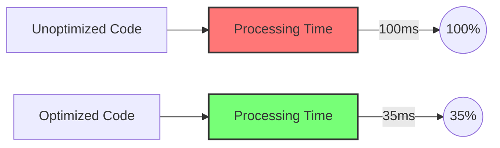

# PHP Code Optimization

## Introduction

PHP code optimization is the process of improving your PHP scripts to run faster, use fewer resources, and deliver better performance to users. For beginners, understanding these optimization techniques is crucial as you start developing PHP applications. Even small optimizations can significantly enhance user experience and reduce server costs.

In this guide, we'll explore several practical techniques to optimize your PHP code, with examples showing both unoptimized and optimized approaches.

## Why Optimize PHP Code?

Before diving into techniques, let's understand why optimization matters:

- **Faster page load times**: Optimized code executes more quickly
- **Reduced server resources**: Lower CPU and memory usage
- **Better user experience**: Responsive applications keep users engaged
- **Scalability**: Efficient code handles more users without requiring hardware upgrades
- **Lower hosting costs**: Less resource usage means cheaper hosting bills

## Essential PHP Optimization Techniques

### 1. Use Proper Variable Types

PHP is a dynamically typed language, but being mindful of variable types can improve performance.

#### Unoptimized Example:

```php
// Using strings for numeric operations
$total = "0";
for ($i = 0; $i < 1000; $i++) {
    $total = $total + $i;  // Type juggling happens repeatedly
}
echo "Total: " . $total;
```

#### Optimized Example:

```php
// Using proper numeric type
$total = 0;  // Integer instead of string
for ($i = 0; $i < 1000; $i++) {
    $total += $i;  // Also using += operator instead
}
echo "Total: " . $total;
```

Using the appropriate data type from the start prevents PHP from constantly converting between types (type juggling), which consumes extra processing time.

### 2. Optimize Loops

Loops are often performance bottlenecks. Optimizing them can yield significant improvements.

#### Unoptimized Example:

```php
$array = range(1, 10000);
$count = 0;

// Inefficient loop - calculating array size each iteration
for ($i = 0; $i < count($array); $i++) {
    $count += $array[$i];
}
echo "Count: $count";
```

#### Optimized Example:

```php
$array = range(1, 10000);
$count = 0;

// Store array length outside the loop
$length = count($array);
for ($i = 0; $i < $length; $i++) {
    $count += $array[$i];
}
echo "Count: $count";

// Even better - use foreach
$count = 0;
foreach ($array as $value) {
    $count += $value;
}
echo "Count: $count";

// Or most efficient for this particular case - use array_sum()
$count = array_sum($array);
echo "Count: $count";
```

By calculating the array size once before the loop or using more efficient loop structures, we avoid unnecessary function calls in each iteration.

### 3. Use Single Quotes for Strings When Possible

Double quotes (`"`) make PHP search for variables to interpolate, while single quotes (`'`) are taken literally.

#### Unoptimized Example:

```php
$name = "John";
$greeting = "Hello $name, welcome to our website!";  // PHP parses for variables
```

#### Optimized Example:

```php
$name = "John";
$greeting = 'Hello ' . $name . ', welcome to our website!';  // No parsing needed
```

For strings without variables, single quotes provide a small performance advantage.

### 4. Use Built-in Functions Instead of Custom Code

PHP's built-in functions are typically implemented in C and are highly optimized.

#### Unoptimized Example:

```php
// Custom function to find maximum value
function findMax($array) {
    $max = $array[0];
    foreach ($array as $value) {
        if ($value > $max) {
            $max = $value;
        }
    }
    return $max;
}

$numbers = [14, 56, 23, 78, 34, 99, 45];
echo "Maximum: " . findMax($numbers);
```

#### Optimized Example:

```php
// Using built-in function
$numbers = [14, 56, 23, 78, 34, 99, 45];
echo "Maximum: " . max($numbers);
```

Built-in functions like `array_sum()`, `max()`, `min()`, and others are significantly faster than custom PHP implementations.

### 5. Use Proper Database Queries

Database operations are often the biggest bottleneck in PHP applications. Optimizing these can have dramatic effects.

#### Unoptimized Example:

```php
// Fetching all data and filtering in PHP
$allUsers = $db->query("SELECT * FROM users")->fetchAll();

$activeUsers = [];
foreach ($allUsers as $user) {
    if ($user['status'] === 'active') {
        $activeUsers[] = $user;
    }
}

echo "Active users: " . count($activeUsers);
```

#### Optimized Example:

```php
// Let the database do the filtering
$activeUsers = $db->query("SELECT * FROM users WHERE status = 'active'")->fetchAll();

echo "Active users: " . count($activeUsers);
```

By allowing the database to filter results, we reduce data transfer and processing in PHP.

### 6. Cache Expensive Operations

Computation-heavy operations should be cached when possible.

#### Unoptimized Example:

```php
// Expensive calculation performed on every request
function calculateComplexValue($id) {
    // Simulate complex calculation
    sleep(2); // Represents heavy computation
    return $id * $id;
}

$result = calculateComplexValue(42);
echo "Result: $result";
```

#### Optimized Example:

```php
// Using simple file-based caching
function calculateComplexValue($id) {
    $cacheFile = "cache/value_$id.txt";
    
    // Check if cached result exists
    if (file_exists($cacheFile) && (time() - filemtime($cacheFile) < 3600)) {
        return file_get_contents($cacheFile);
    }
    
    // Simulate complex calculation
    sleep(2); // Represents heavy computation
    $result = $id * $id;
    
    // Save to cache
    if (!file_exists('cache')) {
        mkdir('cache');
    }
    file_put_contents($cacheFile, $result);
    
    return $result;
}

$result = calculateComplexValue(42);
echo "Result: $result";
```

For real applications, consider using dedicated caching solutions like Redis or Memcached.

### 7. Use Output Buffering

Output buffering collects all output before sending it to the browser, reducing the number of HTTP writes.

```php
// Start output buffering
ob_start();

// Generate content
echo "Section 1<br>";
echo "Section 2<br>";
echo "Section 3<br>";

// Send everything at once
ob_end_flush();
```

### 8. Avoid Using `include` and `require` Inside Loops

Including files inside loops repeatedly loads and parses the same file.

#### Unoptimized Example:

```php
for ($i = 0; $i < 10; $i++) {
    require "header.php";  // File loaded 10 times
    echo "Content $i<br>";
}
```

#### Optimized Example:

```php
require "header.php";  // File loaded once
for ($i = 0; $i < 10; $i++) {
    echo "Content $i<br>";
}
```

### 9. Use Efficient String Concatenation

For building large strings, use efficient approaches.

#### Unoptimized Example:

```php
$string = "";
for ($i = 0; $i < 1000; $i++) {
    $string = $string . "Number: " . $i . "<br>";  // Creates many intermediate strings
}
echo $string;
```

#### Optimized Example:

```php
$parts = [];
for ($i = 0; $i < 1000; $i++) {
    $parts[] = "Number: " . $i . "<br>";
}
echo implode("", $parts);  // Join once at the end
```

### 10. Profile Your Code

Use profiling tools to identify bottlenecks in your code.

```php
// Simple timing function
function timeFunction($func) {
    $start = microtime(true);
    $result = $func();
    $end = microtime(true);
    echo "Execution time: " . ($end - $start) . " seconds<br>";
    return $result;
}

// Usage
$result = timeFunction(function() {
    // Code to profile
    $sum = 0;
    for ($i = 0; $i < 1000000; $i++) {
        $sum += $i;
    }
    return $sum;
});

echo "Result: $result";
```

For more advanced profiling, consider using tools like Xdebug or Blackfire.

## Real-World Optimization Example

Let's look at a practical example of optimizing a function that processes user data:

### Unoptimized Version:

```php
function processUserData($users) {
    $result = "";
    for ($i = 0; $i < count($users); $i++) {
        $user = $users[$i];
        $fullName = $user["first_name"] . " " . $user["last_name"];
        $result = $result . "<div class=\"user\">";
        $result = $result . "<h3>" . $fullName . "</h3>";
        $result = $result . "<p>Email: " . $user["email"] . "</p>";
        $result = $result . "</div>";
    }
    return $result;
}

// Sample data
$users = [
    ["first_name" => "John", "last_name" => "Doe", "email" => "john@example.com"],
    ["first_name" => "Jane", "last_name" => "Smith", "email" => "jane@example.com"],
    // ...more users
];

echo processUserData($users);
```

### Optimized Version:

```php
function processUserData($users) {
    $html = [];
    $count = count($users);
    
    for ($i = 0; $i < $count; $i++) {
        $user = $users[$i];
        $fullName = $user["first_name"] . " " . $user["last_name"];
        
        $html[] = '<div class="user">';
        $html[] = '<h3>' . $fullName . '</h3>';
        $html[] = '<p>Email: ' . $user["email"] . '</p>';
        $html[] = '</div>';
    }
    
    return implode('', $html);
}

// Sample data
$users = [
    ["first_name" => "John", "last_name" => "Doe", "email" => "john@example.com"],
    ["first_name" => "Jane", "last_name" => "Smith", "email" => "jane@example.com"],
    // ...more users
];

echo processUserData($users);
```

Improvements:
1. Pre-calculated array count
2. Used array building + implode instead of string concatenation
3. Used single quotes for HTML strings
4. Simplified HTML concatenation

## Performance Comparison Visualization

Here's a visual representation of the performance difference between optimized and unoptimized code:



## Common Optimization Pitfalls

1. **Premature optimization**: Don't optimize code before you know it's a bottleneck
2. **Over-optimization**: Making code unreadable for minor performance gains
3. **Outdated techniques**: Some old PHP optimization tricks no longer apply to modern PHP versions
4. **Not measuring**: Always benchmark before and after optimization to confirm improvements

## Summary

PHP code optimization is about making smart choices that balance readability, maintainability, and performance. By following these principles, you can create PHP applications that run efficiently while remaining easy to understand and maintain:

1. Use proper variable types
2. Optimize loops and avoid unnecessary recalculations
3. Choose single quotes for strings without variables
4. Leverage PHP's built-in functions
5. Write efficient database queries
6. Cache expensive operations
7. Use output buffering
8. Avoid redundant file inclusions
9. Use efficient string building techniques
10. Profile your code to find bottlenecks

Remember that code readability often matters more than minor optimizations. Focus first on writing clear, maintainable code, then optimize the parts that need it most.

## Additional Resources

For further learning about PHP optimization:

- [PHP.net Performance Tips](https://www.php.net/manual/en/internals2.optimization.php)
- [Zend Server Optimization Guide](https://www.zend.com/resources/php-performance-guide)
- Book: "PHP 7 Performance" by Dmitry Stogov

## Exercises

1. Take a piece of your existing PHP code and identify optimization opportunities using the techniques from this guide.
2. Write and benchmark two versions of a function that processes a large array - one with unoptimized code and one with optimized code.
3. Create a simple caching system for a PHP function that performs complex calculations.
4. Profile a PHP web page using tools like Xdebug or Blackfire to identify bottlenecks.
5. Optimize a database query in one of your PHP projects and measure the performance improvement.