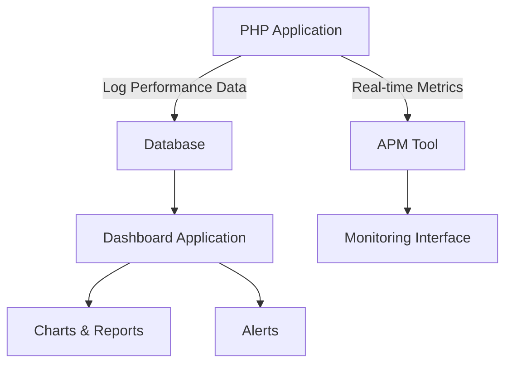

# PHP Performance Monitoring

## Introduction

Performance monitoring is a critical aspect of PHP application development and maintenance. As your applications grow in complexity and user base, understanding how they perform under various conditions becomes essential for delivering a smooth user experience. 

This guide will introduce you to PHP performance monitoring concepts, tools, and best practices that will help you identify bottlenecks, track resource usage, and optimize your applications for better speed and efficiency.

## Why Monitor PHP Performance?

Before diving into the tools and techniques, let's understand why monitoring is crucial:

- **Identify bottlenecks**: Find the slowest parts of your application that need optimization
- **Prevent outages**: Detect performance issues before they affect users
- **Capacity planning**: Understand resource needs as traffic grows
- **Validate optimizations**: Measure the impact of your performance improvements
- **User experience**: Ensure fast load times and responsive interactions

## Performance Metrics to Track

When monitoring PHP applications, several key metrics provide insights into your application's health:

### Response Time

Response time measures how long it takes for your PHP script to process a request and return a response. This is often broken down into:

- **Time to First Byte (TTFB)**: How quickly your server starts sending a response
- **Script execution time**: How long PHP takes to execute your code
- **Database query time**: Time spent on database operations
- **External API call time**: Duration of calls to third-party services

### Resource Usage

Understanding resource consumption helps identify inefficiencies:

- **Memory usage**: How much RAM your script consumes
- **CPU utilization**: Processing power required by your application
- **Database connections**: Number of concurrent database connections
- **File I/O operations**: Disk read/write activities

### Error Rates

Tracking errors provides insights into application stability:

- **PHP errors and exceptions**: Runtime issues in your code
- **HTTP error codes**: 4xx and 5xx responses
- **Slow queries**: Database operations exceeding threshold times

## Built-in PHP Monitoring Tools

PHP provides several built-in functions for basic performance monitoring:

### microtime()

The `microtime()` function is perfect for measuring execution time of specific code blocks:

```php
// Start timing
$start_time = microtime(true);

// Code to measure
for ($i = 0; $i < 1000; $i++) {
    $result = some_operation();
}

// End timing
$end_time = microtime(true);

// Calculate execution time
$execution_time = ($end_time - $start_time);
echo "Execution time: " . number_format($execution_time, 6) . " seconds";

// Output example:
// Execution time: 0.023651 seconds
```

### memory_get_usage()

This function helps track memory consumption during script execution:

```php
// Initial memory usage
$initial_memory = memory_get_usage();
echo "Initial memory usage: " . round($initial_memory / 1024 / 1024, 2) . " MB<br>";

// Create a large array
$data = [];
for ($i = 0; $i < 100000; $i++) {
    $data[] = $i;
}

// Memory usage after operation
$current_memory = memory_get_usage();
echo "Current memory usage: " . round($current_memory / 1024 / 1024, 2) . " MB<br>";
echo "Memory increase: " . round(($current_memory - $initial_memory) / 1024 / 1024, 2) . " MB";

// Output example:
// Initial memory usage: 0.41 MB
// Current memory usage: 4.18 MB
// Memory increase: 3.77 MB
```

### get_included_files()

This function shows all files included or required during script execution:

```php
// After your script runs
$included_files = get_included_files();
echo "Total included files: " . count($included_files) . "<br>";
echo "Files:<pre>";
print_r($included_files);
echo "</pre>";

// Output example:
// Total included files: 24
// Files:
// Array
// (
//     [0] => /var/www/html/index.php
//     [1] => /var/www/html/config.php
//     [2] => /var/www/html/functions.php
//     ...
// )
```

## Professional Monitoring Tools

For more comprehensive monitoring, several professional tools are available:

### Xdebug

Xdebug is a powerful PHP extension for debugging and profiling:

```php
// Install Xdebug and enable profiling in php.ini
// xdebug.mode = profile
// xdebug.output_dir = /tmp/xdebug

// No code changes needed - just run your script with profiling enabled
// Then analyze results with tools like KCacheGrind or Webgrind
```

After running your code with Xdebug profiling enabled, you'll get detailed execution data:

```
// Example output analysis would show:
// - Function call counts
// - Time spent in each function
// - Memory usage
// - Call graphs
```

### New Relic

New Relic provides comprehensive application performance monitoring:

```php
// Install New Relic PHP agent
// Add the extension to php.ini and configure your license key
// Then your application is automatically monitored

// You can add custom instrumentation:
newrelic_add_custom_parameter('user_id', $user_id);
newrelic_add_custom_parameter('cart_items', count($cart_items));

// Start timing a custom segment
newrelic_start_transaction('my_application');
newrelic_segment_begin('database_operation');

// Database code here
$results = $db->query("SELECT * FROM products WHERE category_id = 5");

// End timing the segment
newrelic_segment_end();
newrelic_end_transaction();
```

### Blackfire.io

Blackfire is a profiling tool focused on PHP performance optimization:

```php
// After installing the Blackfire agent and PHP probe
// Profile your code using the CLI tool:
// $ blackfire curl https://your-site.com/page-to-profile

// Or add the Blackfire browser extension and profile directly from your browser
```

## Creating a Custom Performance Monitoring System

For specific needs, you can build a simple custom monitoring system:

```php
<?php
// performance_monitor.php

class PerformanceMonitor {
    private $startTime;
    private $startMemory;
    private $checkpoints = [];
    
    public function __construct() {
        $this->startTime = microtime(true);
        $this->startMemory = memory_get_usage();
    }
    
    public function checkpoint($label) {
        $this->checkpoints[$label] = [
            'time' => microtime(true) - $this->startTime,
            'memory' => memory_get_usage() - $this->startMemory,
            'peak_memory' => memory_get_peak_usage()
        ];
    }
    
    public function getReport() {
        $report = "Performance Report:
";
        $report .= "=====================================
";
        $report .= "Total execution time: " . number_format(microtime(true) - $this->startTime, 4) . " seconds
";
        $report .= "Memory usage: " . $this->formatBytes(memory_get_usage() - $this->startMemory) . "
";
        $report .= "Peak memory usage: " . $this->formatBytes(memory_get_peak_usage()) . "
";
        $report .= "=====================================
";
        $report .= "Checkpoints:
";
        
        foreach ($this->checkpoints as $label => $data) {
            $report .= "- $label:
";
            $report .= "  Time: " . number_format($data['time'], 4) . " seconds
";
            $report .= "  Memory: " . $this->formatBytes($data['memory']) . "
";
        }
        
        return $report;
    }
    
    private function formatBytes($bytes) {
        $units = ['B', 'KB', 'MB', 'GB'];
        $bytes = max($bytes, 0);
        $pow = floor(($bytes ? log($bytes) : 0) / log(1024));
        $pow = min($pow, count($units) - 1);
        $bytes /= (1 << (10 * $pow));
        
        return round($bytes, 2) . ' ' . $units[$pow];
    }
}
```

Usage example:

```php
// index.php
require_once 'performance_monitor.php';

// Initialize the monitor
$monitor = new PerformanceMonitor();

// Run your first operation
$data = fetchDataFromDatabase();
$monitor->checkpoint('Database Fetch');

// Run some processing
$processedData = processData($data);
$monitor->checkpoint('Data Processing');

// Render the view
renderView($processedData);
$monitor->checkpoint('View Rendering');

// Display or log the performance report
if ($_SERVER['REMOTE_ADDR'] === '127.0.0.1') {
    echo "<pre>" . $monitor->getReport() . "</pre>";
} else {
    error_log($monitor->getReport());
}

// Output example:
// Performance Report:
// =====================================
// Total execution time: 0.2340 seconds
// Memory usage: 3.45 MB
// Peak memory usage: 4.21 MB
// =====================================
// Checkpoints:
// - Database Fetch:
//   Time: 0.1250 seconds
//   Memory: 1.23 MB
// - Data Processing:
//   Time: 0.0890 seconds
//   Memory: 2.10 MB
// - View Rendering:
//   Time: 0.0200 seconds
//   Memory: 0.12 MB
```

## Implementing a Monitoring Dashboard

For a complete monitoring solution, you might want to store performance data and visualize it:



Implementation example:

```php
// Record performance metrics to database
function recordPerformanceMetrics($pageId, $executionTime, $memoryUsage, $queries) {
    global $db;
    
    $db->prepare("
        INSERT INTO performance_logs 
        (page_id, execution_time, memory_usage, query_count, timestamp)
        VALUES (?, ?, ?, ?, NOW())
    ")->execute([
        $pageId,
        $executionTime,
        $memoryUsage,
        count($queries)
    ]);
    
    // Record individual queries
    $stmt = $db->prepare("
        INSERT INTO query_logs
        (page_id, query, execution_time, timestamp)
        VALUES (?, ?, ?, NOW())
    ");
    
    foreach ($queries as $query) {
        $stmt->execute([
            $pageId,
            $query['sql'],
            $query['time']
        ]);
    }
}

// Usage in your application
$start = microtime(true);
$initialMemory = memory_get_usage();

// Track database queries
$queries = [];
// ...Your application code...
// After each query, add to the $queries array:
$queries[] = [
    'sql' => $sql,
    'time' => $queryTime
];

// At the end of the script
$executionTime = microtime(true) - $start;
$memoryUsage = memory_get_usage() - $initialMemory;
recordPerformanceMetrics('home_page', $executionTime, $memoryUsage, $queries);
```

## Best Practices for Performance Monitoring

To get the most out of your monitoring efforts:

1. **Set baselines**: Establish normal performance patterns to detect deviations
2. **Monitor in production**: Test environments rarely match real-world conditions
3. **Use sampling**: For high-traffic applications, monitor a percentage of requests
4. **Alert on thresholds**: Define acceptable performance limits and alert when exceeded
5. **Track trends**: Look for gradual degradation over time
6. **Correlate metrics**: Connect performance data with user behavior and business metrics
7. **Automate responses**: Set up automatic scaling or failover based on metrics

## Common Performance Issues and Solutions

Based on monitoring data, here are common issues you might discover:

### Slow Database Queries

If your monitoring shows database operations taking too long:

```php
// Before: Inefficient query
$result = $db->query("
    SELECT * FROM products 
    WHERE category = 'electronics' 
    ORDER BY price
");

// After: Optimized query with index
$db->query("CREATE INDEX idx_category ON products(category)");
$result = $db->query("
    SELECT id, name, price FROM products 
    WHERE category = 'electronics' 
    ORDER BY price
");
```

### Memory Leaks

If memory usage keeps growing:

```php
// Before: Potential memory leak
function processLargeDataset($data) {
    $processed = [];
    foreach ($data as $item) {
        $processed[] = heavyProcessing($item);
    }
    return $processed;
}

// After: Process in chunks to control memory
function processLargeDataset($data) {
    $result = [];
    $chunkSize = 100;
    $chunks = array_chunk($data, $chunkSize);
    
    foreach ($chunks as $chunk) {
        $processed = [];
        foreach ($chunk as $item) {
            $processed[] = heavyProcessing($item);
        }
        $result = array_merge($result, $processed);
        // Free memory
        unset($processed);
        unset($chunk);
    }
    
    return $result;
}
```

### Excessive File Includes

If you're including too many files:

```php
// Before: Including everything
require_once 'config.php';
require_once 'database.php';
require_once 'user.php';
require_once 'product.php';
require_once 'cart.php';
require_once 'order.php';
// etc...

// After: Autoloading
spl_autoload_register(function ($class) {
    include strtolower($class) . '.php';
});

// Now classes are loaded on demand
$user = new User();
$product = new Product();
```

## Summary

Monitoring PHP performance is essential for maintaining efficient, responsive applications. In this guide, you've learned:

- Key performance metrics to track
- Built-in PHP functions for basic monitoring
- Professional tools for comprehensive analysis
- How to build a custom monitoring system
- Best practices for effective monitoring
- Solutions to common performance issues

By implementing these techniques, you'll gain valuable insights into your application's behavior and be able to make data-driven optimization decisions.

## Additional Resources

To continue learning about PHP performance monitoring:

- [PHP Manual: Performance Tips](https://www.php.net/manual/en/misc.performance.php)
- [Xdebug Documentation](https://xdebug.org/docs/)
- [New Relic PHP Agent Guide](https://docs.newrelic.com/docs/apm/agents/php-agent/)
- [Blackfire.io Documentation](https://blackfire.io/docs/introduction)

## Exercises

1. Set up Xdebug profiling on a local development environment and analyze a simple PHP script.
2. Implement the custom `PerformanceMonitor` class in a project and add checkpoints to track different sections.
3. Create a simple dashboard that displays performance metrics stored in a database.
4. Identify and optimize the slowest query in an existing application using monitoring data.
5. Compare the performance of different PHP versions (7.4 vs 8.0 vs 8.1) running the same script and analyze the differences.