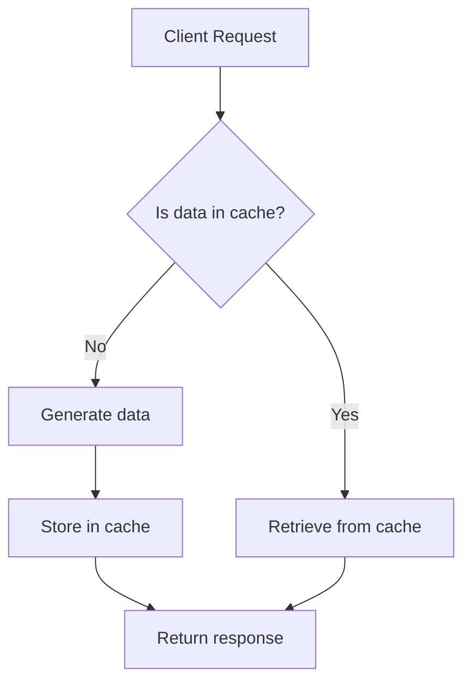
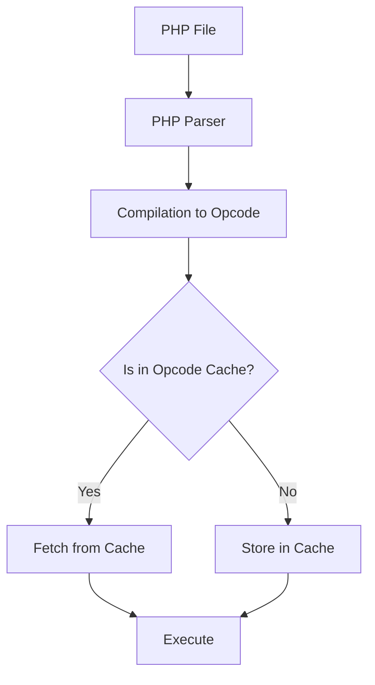

# PHP Caching Techniques

## Introduction

Caching is one of the most effective ways to improve PHP application performance. When your website receives high traffic or performs resource-intensive operations, caching can significantly reduce server load and response times by storing frequently accessed data in fast-access storage. This guide will introduce you to various PHP caching techniques, from simple in-memory solutions to distributed caching systems.

## What is Caching?

Caching is the process of storing copies of data in a temporary storage location (a cache) so that future requests for that data can be served faster.



## Benefits of Caching in PHP Applications

- **Faster response times**: Cached data retrieves much faster than regenerating it
- **Reduced server load**: Less CPU and memory usage
- **Better user experience**: Visitors experience quicker page loads
- **Increased scalability**: Your application can handle more traffic
- **Lower database load**: Fewer queries to your database

## Types of Caching in PHP

### 1. Output Caching

Output caching stores the entire HTML output of a page or part of a page.

#### Example: Simple Output Caching

```php
<?php
// Define the cache file
$cacheFile = 'cache/page_' . md5($_SERVER['REQUEST_URI']) . '.html';
$cacheTime = 3600; // Cache lifetime in seconds (1 hour)

// Check if cache exists and is valid
if (file_exists($cacheFile) && (time() - $cacheTime < filemtime($cacheFile))) {
    // Serve from cache
    include($cacheFile);
    echo "<!-- Served from cache: " . date('Y-m-d H:i:s', filemtime($cacheFile)) . " -->";
    exit;
}

// Start output buffering
ob_start();
?>

<!-- Your normal HTML and PHP code goes here -->
<h1>Welcome to my website</h1>
<p>Current time: <?php echo date('Y-m-d H:i:s'); ?></p>
<p>This content is expensive to generate...</p>

<?php
// Save the buffer to cache
if (!is_dir('cache')) {
    mkdir('cache', 0755, true);
}
$cachedContent = ob_get_contents();
file_put_contents($cacheFile, $cachedContent);
ob_end_flush(); // Send the output to the browser
?>
```

**What happened?**
1. We check if a valid cache file exists
2. If it does, we simply include the file and exit
3. If not, we start output buffering, generate the page, and save it to our cache

### 2. Data Caching with APCu

APCu (APC User Cache) is a PHP extension that provides in-memory caching.

#### Installation and Setup

```bash
# Install APCu on Ubuntu/Debian
sudo apt-get install php-apcu

# Restart PHP
sudo service php-fpm restart
```

#### Example: Using APCu for Data Caching

```php
<?php
function get_expensive_data($id) {
    // Create a unique cache key
    $cache_key = "product_data_" . $id;
    
    // Try to fetch from cache
    $data = apcu_fetch($cache_key, $success);
    
    if ($success) {
        echo "<!-- Data from cache -->";
        return $data;
    }
    
    // If not in cache, generate the data
    echo "<!-- Generated fresh data -->";
    
    // Simulate database query or API call
    sleep(2); // Simulating a slow operation
    $data = [
        'id' => $id,
        'name' => 'Product ' . $id,
        'price' => rand(10, 100),
        'description' => 'This is product ' . $id,
        'last_updated' => date('Y-m-d H:i:s')
    ];
    
    // Store in cache for 5 minutes (300 seconds)
    apcu_store($cache_key, $data, 300);
    
    return $data;
}

// Usage
$product = get_expensive_data(123);
echo "<pre>";
print_r($product);
echo "</pre>";
?>
```

**Output (first request):**
```
<!-- Generated fresh data -->
Array
(
    [id] => 123
    [name] => Product 123
    [price] => 67
    [description] => This is product 123
    [last_updated] => 2023-06-10 15:30:45
)
```

**Output (subsequent requests):**
```
<!-- Data from cache -->
Array
(
    [id] => 123
    [name] => Product 123
    [price] => 67
    [description] => This is product 123
    [last_updated] => 2023-06-10 15:30:45
)
```

### 3. Opcode Caching

Opcode caching improves PHP's performance by storing precompiled script bytecode in memory.

The most common opcode cache for PHP is OPcache, which is included with PHP since version 5.5.

#### PHP OPcache Configuration

Edit your `php.ini` file:

```ini
[opcache]
opcache.enable=1
opcache.memory_consumption=128
opcache.interned_strings_buffer=8
opcache.max_accelerated_files=4000
opcache.revalidate_freq=60
opcache.fast_shutdown=1
opcache.enable_cli=1
```

**What happens with opcode caching?**



With opcode caching, your PHP code is compiled to bytecode only once and then stored in memory, eliminating the need to parse and compile the same file on each request.

### 4. Object Caching with Memcached

Memcached is a distributed memory caching system.

#### Installation

```bash
# Install Memcached server
sudo apt-get install memcached

# Install PHP Memcached extension
sudo apt-get install php-memcached
```

#### Example: Using Memcached

```php
<?php
// Connect to Memcached server
$memcached = new Memcached();
$memcached->addServer('localhost', 11211);

$cache_key = 'user_list';
$cache_time = 60; // Cache for 60 seconds

// Try to get data from cache
$data = $memcached->get($cache_key);

if ($data === false) {
    echo "<!-- Generating fresh data -->";
    
    // Simulate database query
    sleep(1);
    $data = [
        ['id' => 1, 'name' => 'John Doe', 'email' => 'john@example.com'],
        ['id' => 2, 'name' => 'Jane Smith', 'email' => 'jane@example.com'],
        ['id' => 3, 'name' => 'Bob Johnson', 'email' => 'bob@example.com']
    ];
    
    // Store data in cache
    $memcached->set($cache_key, $data, $cache_time);
} else {
    echo "<!-- Data from cache -->";
}

// Display the data
echo "<h2>User List</h2>";
echo "<ul>";
foreach ($data as $user) {
    echo "<li>" . $user['name'] . " (" . $user['email'] . ")</li>";
}
echo "</ul>";
?>
```

### 5. Redis Caching

Redis is an advanced key-value store that can be used for caching.

#### Installation

```bash
# Install Redis server
sudo apt-get install redis-server

# Install PHP Redis extension
sudo apt-get install php-redis
```

#### Example: Using Redis for Session Caching

```php
<?php
// Redis session handler configuration
ini_set('session.save_handler', 'redis');
ini_set('session.save_path', 'tcp://localhost:6379');

// Start the session
session_start();

// Check if this is a new session
if (!isset($_SESSION['visits'])) {
    $_SESSION['visits'] = 0;
}

// Increment the visit counter
$_SESSION['visits']++;

// Display session info
echo "<h2>Session Information</h2>";
echo "<p>Session ID: " . session_id() . "</p>";
echo "<p>Visit count: " . $_SESSION['visits'] . "</p>";
echo "<p>Session storage: Redis</p>";
?>
```

### 6. Database Query Caching

Caching database queries can dramatically improve performance.

#### Example: Simple Database Query Cache

```php
<?php
function get_cached_query($sql, $params = [], $cache_time = 300) {
    $cache_key = 'db_query_' . md5($sql . serialize($params));
    
    // Try to get from APCu cache
    $result = apcu_fetch($cache_key, $success);
    
    if ($success) {
        return $result;
    }
    
    // Connect to database (using PDO)
    $db = new PDO('mysql:host=localhost;dbname=myapp', 'username', 'password');
    $stmt = $db->prepare($sql);
    $stmt->execute($params);
    $result = $stmt->fetchAll(PDO::FETCH_ASSOC);
    
    // Store in cache
    apcu_store($cache_key, $result, $cache_time);
    
    return $result;
}

// Usage example
$products = get_cached_query(
    "SELECT * FROM products WHERE category = ? AND price < ? ORDER BY name",
    ['electronics', 500],
    600 // Cache for 10 minutes
);

// Display results
foreach ($products as $product) {
    echo "<div class='product'>";
    echo "<h3>" . htmlspecialchars($product['name']) . "</h3>";
    echo "<p>$" . number_format($product['price'], 2) . "</p>";
    echo "</div>";
}
?>
```

## 7. Full-Page Caching with Varnish

For high-traffic websites, a reverse proxy cache like Varnish can be extremely effective.

Varnish sits in front of your web server and caches entire HTTP responses.


To work with Varnish, you'll need to add appropriate cache headers to your PHP application:

```php
<?php
// Set cache control headers for Varnish
header('Cache-Control: public, max-age=60');
header('Vary: Accept-Encoding, Cookie');

// Your regular PHP code follows
echo "<h1>Welcome to our website</h1>";
echo "<p>Current time: " . date('Y-m-d H:i:s') . "</p>";
?>
```

## Cache Invalidation Strategies

Cache invalidation is the process of removing or updating cached data when the original data changes.

### Time-Based Invalidation

The simplest approach is to set an expiration time:

```php
// Cache for 5 minutes
apcu_store('my_key', $data, 300);
```

### Event-Based Invalidation

Delete cache entries when data changes:

```php
function update_product($id, $data) {
    // Update in database
    $db->update('products', $data, ['id' => $id]);
    
    // Invalidate cache
    apcu_delete('product_' . $id);
    apcu_delete('product_list'); // Also clear list cache
}
```

### Tagging and Versioning

More advanced caching systems support tagging:

```php
// With a library like symfony/cache
$cache->invalidateTags(['products', 'category_electronics']);
```

## Best Practices for PHP Caching

1. **Cache at the appropriate level**: Choose the right caching mechanism for each use case.
2. **Set reasonable expiration times**: Too short and you lose benefits, too long and data becomes stale.
3. **Implement proper invalidation**: Make sure to clear cache when underlying data changes.
4. **Monitor cache performance**: Track hit rates and response times.
5. **Use cache warming**: Pre-populate caches to avoid slow initial requests.
6. **Be mindful of memory usage**: Too many cache entries can lead to memory issues.

## Common Caching Pitfalls

- **Cache stampede**: When multiple requests try to regenerate a cache entry simultaneously.
- **Stale data**: When cache isn't properly invalidated after data changes.
- **Over-caching**: Caching dynamic content that changes frequently.
- **Memory exhaustion**: Storing too much data in memory caches.

## Code Example: A Reusable Cache Class

Here's a simple but flexible caching class that uses different backend mechanisms:

```php
<?php
class SimpleCache {
    private $driver;
    
    public function __construct($driver = 'file', $options = []) {
        switch ($driver) {
            case 'apcu':
                $this->driver = new ApcuCacheDriver();
                break;
            case 'memcached':
                $host = $options['host'] ?? 'localhost';
                $port = $options['port'] ?? 11211;
                $this->driver = new MemcachedDriver($host, $port);
                break;
            case 'redis':
                $host = $options['host'] ?? 'localhost';
                $port = $options['port'] ?? 6379;
                $this->driver = new RedisDriver($host, $port);
                break;
            case 'file':
            default:
                $path = $options['path'] ?? 'cache';
                $this->driver = new FileCacheDriver($path);
                break;
        }
    }
    
    public function get($key, $default = null) {
        $value = $this->driver->get($key);
        return $value !== false ? $value : $default;
    }
    
    public function set($key, $value, $ttl = 3600) {
        return $this->driver->set($key, $value, $ttl);
    }
    
    public function delete($key) {
        return $this->driver->delete($key);
    }
    
    public function flush() {
        return $this->driver->flush();
    }
}

// Example driver implementations
class FileCacheDriver {
    private $path;
    
    public function __construct($path) {
        $this->path = $path;
        if (!is_dir($this->path)) {
            mkdir($this->path, 0755, true);
        }
    }
    
    public function get($key) {
        $file = $this->getFilename($key);
        if (!file_exists($file)) {
            return false;
        }
        
        $data = unserialize(file_get_contents($file));
        if ($data['expires'] < time()) {
            unlink($file);
            return false;
        }
        
        return $data['value'];
    }
    
    public function set($key, $value, $ttl) {
        $file = $this->getFilename($key);
        $data = [
            'value' => $value,
            'expires' => time() + $ttl
        ];
        
        return file_put_contents($file, serialize($data)) !== false;
    }
    
    public function delete($key) {
        $file = $this->getFilename($key);
        if (file_exists($file)) {
            return unlink($file);
        }
        return true;
    }
    
    public function flush() {
        $files = glob($this->path . '/*.cache');
        foreach ($files as $file) {
            unlink($file);
        }
        return true;
    }
    
    private function getFilename($key) {
        return $this->path . '/' . md5($key) . '.cache';
    }
}

// Usage example
$cache = new SimpleCache('file', ['path' => 'app/cache']);

// Try to get data from cache
$data = $cache->get('my_expensive_data');

if ($data === null) {
    // Generate data (expensive operation)
    $data = calculate_expensive_data();
    
    // Store in cache for 5 minutes
    $cache->set('my_expensive_data', $data, 300);
}

function calculate_expensive_data() {
    // Simulate expensive calculation
    sleep(2);
    return ['result' => 42, 'generated_at' => time()];
}
?>
```

## Summary

Caching is a powerful technique to improve PHP application performance. We've covered:

- The concept and benefits of caching
- Different types of PHP caching techniques:
  - Output caching
  - Data caching with APCu
  - Opcode caching
  - Object caching with Memcached
  - Redis caching
  - Database query caching
  - Full-page caching with Varnish
- Cache invalidation strategies
- Best practices and common pitfalls
- A reusable caching class example

By implementing appropriate caching strategies, you can significantly improve your PHP application's performance, reduce server load, and provide a better user experience.

## Further Learning Resources

- [PHP APCu Documentation](https://www.php.net/manual/en/book.apcu.php)
- [Memcached Website](https://memcached.org/)
- [Redis Documentation](https://redis.io/documentation)
- [Varnish Cache Documentation](https://varnish-cache.org/docs/)
- [Symfony Cache Component](https://symfony.com/doc/current/components/cache.html)

## Exercises

1. Implement simple file-based caching for a database query in your application.
2. Set up APCu caching and benchmark the performance improvement.
3. Create a caching layer for an API client that fetches external data.
4. Implement a tagged cache system for a blog application where posts and comments can be cached separately.
5. Build a cache warming script that pre-populates your cache during deployment.