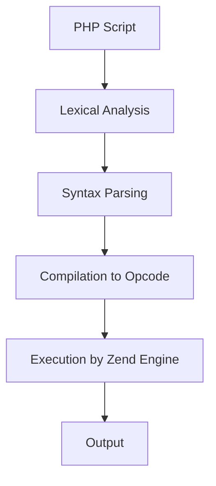
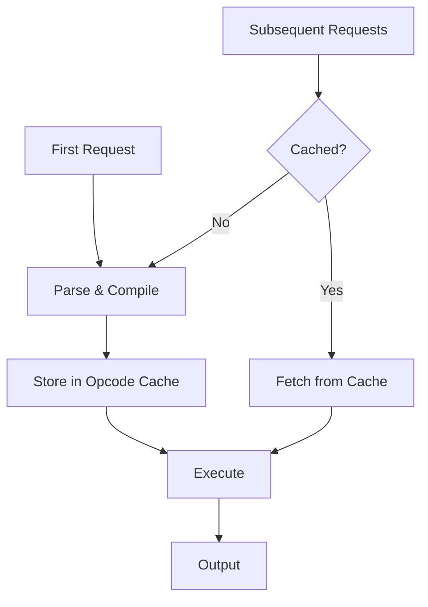

# PHP Opcode Caching

## Introduction

When a PHP script runs, it goes through several stages before producing output in your browser. One of these stages involves converting your PHP code into an intermediate representation called **opcode** (operation code), which can then be executed by the PHP engine. This compilation process happens every time a PHP script is requested.

**PHP Opcode Caching** is a performance optimization technique that stores these compiled opcodes in memory, eliminating the need to parse and compile PHP code on each request. This significantly reduces the overhead of PHP execution and can dramatically improve your application's performance.

In this tutorial, we'll explore:
- How PHP execution works
- What opcode caching is and how it helps
- How to implement opcode caching with OPcache
- How to monitor and optimize your opcode cache

## How PHP Execution Works

Before diving into opcode caching, let's understand how PHP executes code:



1. **Lexical Analysis**: PHP breaks down your code into tokens
2. **Syntax Parsing**: These tokens are analyzed for syntax correctness
3. **Compilation**: Valid PHP code is converted to opcodes
4. **Execution**: The opcodes are executed by the Zend Engine
5. **Output**: The result is sent to the user

Without opcode caching, this entire process happens on every request, which is inefficient.

## What is Opcode Caching?

Opcode caching improves this process by:

1. Storing compiled opcodes in memory after the first execution
2. Reusing these opcodes for subsequent requests
3. Skipping the parsing and compilation steps entirely

This optimization can lead to significant performance improvements, especially for larger applications.



## Implementing Opcode Caching with OPcache

The most widely used opcode caching solution is **OPcache**, which comes bundled with PHP since version 5.5.0.

### Enabling OPcache

To enable OPcache, you need to modify your `php.ini` file:

```ini
; Enable OPcache extension
zend_extension=opcache.so

; Enable opcode caching
opcache.enable=1

; Enable opcode caching for CLI
opcache.enable_cli=1
```

### Basic Configuration

Here's a basic configuration to get you started:

```ini
; Memory allocation (in MB)
opcache.memory_consumption=128

; Maximum number of files that can be stored in the cache
opcache.max_accelerated_files=10000

; How often to check file timestamps for changes (in seconds)
; 0 means it will check on every request
opcache.revalidate_freq=60

; Enable file timestamp validation
opcache.validate_timestamps=1
```

### Checking if OPcache is Enabled

You can verify if OPcache is enabled by creating a simple PHP script:

```php
<?php
// File: opcache_status.php

// Check if OPcache is enabled
if (function_exists('opcache_get_status')) {
    echo "OPcache is enabled!<br>";
    
    // Get OPcache configuration
    $config = opcache_get_configuration();
    echo "OPcache version: " . $config['version']['version'] . "<br>";
    
    // Get OPcache status
    $status = opcache_get_status();
    echo "Memory usage: " . round($status['memory_usage']['used_memory'] / 1024 / 1024, 2) . " MB<br>";
    echo "Cache hits: " . $status['opcache_statistics']['hits'] . "<br>";
    echo "Cache misses: " . $status['opcache_statistics']['misses'] . "<br>";
} else {
    echo "OPcache is not enabled.";
}
```

**Output (example):**
```
OPcache is enabled!
OPcache version: 8.0.0
Memory usage: 32.45 MB
Cache hits: 1243
Cache misses: 87
```

## Real-World Example: Measuring Performance Improvement

Let's create a simple script to demonstrate the performance boost from opcode caching:

```php
<?php
// File: benchmark.php

// Start timing
$start = microtime(true);

// Simulate a complex application
for ($i = 0; $i < 10000; $i++) {
    $array[$i] = md5($i);
}

// Sort the array
sort($array);

// Calculate some values
$sum = 0;
foreach ($array as $value) {
    $sum += ord($value[0]) + ord($value[1]);
}

// End timing
$end = microtime(true);
$execution_time = ($end - $start) * 1000; // Convert to milliseconds

echo "Execution time: " . round($execution_time, 2) . " ms<br>";
echo "OPcache enabled: " . (function_exists('opcache_get_status') && opcache_get_status() ? 'Yes' : 'No');
```

You can run this script multiple times with OPcache enabled and disabled to see the difference.

**Typical results:**
- Without OPcache: ~120-150 ms
- With OPcache: ~80-100 ms (30-40% faster)

For real applications, the performance improvement can be even more significant, often 2-3x faster.

## Advanced OPcache Configuration

Here are some additional configuration options for fine-tuning your opcode cache:

### Optimizing Memory Usage

```ini
; Pre-fill the opcache with common files
opcache.preload=/path/to/preload.php

; Allow preloading to work correctly
opcache.preload_user=www-data
```

### Improving Performance

```ini
; Don't check file timestamps; requires manual cache clearing after updates
opcache.validate_timestamps=0

; Fast shutdown for better performance
opcache.fast_shutdown=1

; Optimize file handling for production
opcache.save_comments=0
opcache.optimization_level=0xffffffff
```

### Development vs. Production Settings

For development:
```ini
opcache.validate_timestamps=1
opcache.revalidate_freq=0
opcache.save_comments=1
```

For production:
```ini
opcache.validate_timestamps=0
opcache.revalidate_freq=0
opcache.save_comments=0
```

## Managing the Opcode Cache

### Clearing the Cache

Sometimes you need to clear the opcode cache, especially after deploying new code:

```php
<?php
// File: clear_cache.php

// Reset the entire opcode cache
if (opcache_reset()) {
    echo "Opcode cache cleared successfully.";
} else {
    echo "Failed to clear opcode cache.";
}
```

### Invalidate Single File

```php
<?php
// Invalidate a specific file
$file = '/var/www/html/myapp/index.php';
if (opcache_invalidate($file, true)) {
    echo "File invalidated successfully.";
} else {
    echo "Failed to invalidate file.";
}
```

## Common Issues and Troubleshooting

### Issue: Code Changes Not Reflecting

If you've updated your code but don't see changes:

1. Verify timestamp validation is enabled: `opcache.validate_timestamps=1`
2. Set revalidation frequency to 0 for development: `opcache.revalidate_freq=0`
3. Manually clear the cache using `opcache_reset()`

### Issue: Memory Exhaustion

If you see errors about memory:

1. Increase memory allocation: `opcache.memory_consumption=256`
2. Increase maximum files: `opcache.max_accelerated_files=20000`
3. Monitor memory usage with `opcache_get_status()`

### Issue: CLI vs. Web Different Behavior

Remember that CLI and web server have separate PHP configurations. Ensure OPcache is configured correctly in both environments if needed.

## Best Practices

1. **In Development:**
   - Keep `validate_timestamps=1` and `revalidate_freq=0` to see code changes immediately
   - Use smaller memory values to conserve resources

2. **In Production:**
   - Consider setting `validate_timestamps=0` for maximum performance
   - Implement a deployment process that clears the cache after updates
   - Allocate sufficient memory based on your application size

3. **Monitoring:**
   - Regularly check cache hit/miss rates
   - Monitor memory usage to ensure you've allocated enough

## Summary

PHP opcode caching is a powerful optimization technique that can dramatically improve your application's performance by:

- Eliminating the overhead of repeated code parsing and compilation
- Storing compiled opcodes in memory for reuse
- Reducing CPU usage and execution time

By properly configuring OPcache, you can achieve significant performance gains with minimal effort. The key is to adjust the settings based on your environment (development vs. production) and your application's specific needs.

## Further Learning

### Exercises

1. Install and configure OPcache on your development environment
2. Create a script to monitor opcode cache statistics (hits, misses, memory usage)
3. Benchmark a complex PHP application with and without opcode caching
4. Experiment with different configuration settings to find the optimal setup for your application

### Additional Resources

- [PHP OPcache Documentation](https://www.php.net/manual/en/book.opcache.php)
- [PHP Performance Optimization Guide](https://www.php.net/manual/en/performancetips.php)
- [Zend OPcache Extension](https://github.com/zendtech/ZendOptimizerPlus)
- [Symfony Performance Best Practices](https://symfony.com/doc/current/performance.html)