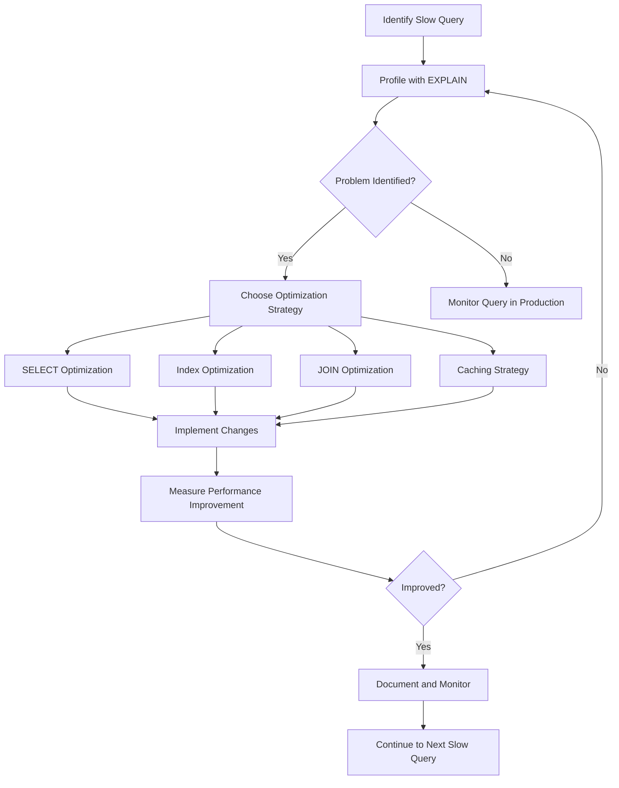

# PHP Query Optimization

## Introduction

Database operations are often the most significant performance bottleneck in PHP applications. When your application grows and data volumes increase, poorly optimized queries can cause slow page loads, timeouts, and a poor user experience. Query optimization is the process of improving how your application interacts with the database to retrieve or modify data in the most efficient way possible.

In this tutorial, we'll explore various techniques to optimize database queries in PHP applications, focusing primarily on MySQL as it's commonly used with PHP. Whether you're building a small blog or a complex web application, these techniques will help you write more efficient database code.

## Understanding Database Query Performance

Before diving into optimization techniques, it's important to understand what makes a query slow. Database queries can be slow for several reasons:

1. **Retrieving unnecessary data**: Selecting more columns or rows than needed
2. **Missing or improper indexes**: Not using indexes or using them ineffectively
3. **Complex joins**: Joining many tables or using inefficient join conditions
4. **Suboptimal query structure**: Using inefficient SQL patterns
5. **Database server configuration**: Poor configuration settings

## Essential Query Optimization Techniques

### 1. Select Only the Data You Need

One of the most common mistakes beginners make is using `SELECT *` to retrieve all columns from a table. This approach retrieves unnecessary data, consuming more memory and bandwidth.

#### Example - Before Optimization:

```php
// Inefficient query - retrieving all columns
$query = "SELECT * FROM users WHERE status = 'active'";
$result = $mysqli->query($query);

while ($row = $result->fetch_assoc()) {
    echo $row['username'] . " - " . $row['email'] . "<br>";
}
```

#### Example - After Optimization:

```php
// Optimized query - retrieving only needed columns
$query = "SELECT username, email FROM users WHERE status = 'active'";
$result = $mysqli->query($query);

while ($row = $result->fetch_assoc()) {
    echo $row['username'] . " - " . $row['email'] . "<br>";
}
```

#### Output:
```
john_doe - john@example.com
jane_smith - jane@example.com
```

By selecting only the columns you need, you reduce:
- The amount of data transferred from the database server
- Memory usage in your PHP application
- Processing time for the database server

### 2. Use Proper Indexing

Indexes are critical for query performance. They allow the database to find data quickly without scanning entire tables.

#### When to Create Indexes:
- Columns used in WHERE clauses
- Columns used in JOIN conditions
- Columns used for sorting (ORDER BY)
- Columns with unique constraints

#### Example - Creating an Index:

```php
// Creating an index on the 'email' column
$query = "CREATE INDEX idx_email ON users(email)";
$mysqli->query($query);

// Now queries filtering by email will be faster
$query = "SELECT * FROM users WHERE email = 'john@example.com'";
$result = $mysqli->query($query);
```

#### Important Indexing Tips:
1. Don't over-index - each index consumes disk space and slows down writes
2. Composite indexes (on multiple columns) can be more efficient than multiple single-column indexes
3. Consider the order of columns in composite indexes based on query patterns

### 3. EXPLAIN Your Queries

MySQL provides the `EXPLAIN` statement to analyze how queries are executed. This is invaluable for understanding query performance.

```php
// Using EXPLAIN to analyze a query
$query = "EXPLAIN SELECT * FROM users JOIN orders ON users.id = orders.user_id WHERE users.status = 'active'";
$result = $mysqli->query($query);

while ($row = $result->fetch_assoc()) {
    print_r($row);
}
```

#### Example Output:
```
Array
(
    [id] => 1
    [select_type] => SIMPLE
    [table] => users
    [type] => ref
    [possible_keys] => PRIMARY,idx_status
    [key] => idx_status
    [key_len] => 77
    [ref] => const
    [rows] => 253
    [Extra] => Using where
)
Array
(
    [id] => 1
    [select_type] => SIMPLE
    [table] => orders
    [type] => ref
    [possible_keys] => idx_user_id
    [key] => idx_user_id
    [key_len] => 4
    [ref] => database.users.id
    [rows] => 2
    [Extra] => 
)
```

Look for these warning signs in EXPLAIN output:
- `type: ALL` (full table scan)
- High values in the `rows` column
- Missing keys in `key` column
- `Using temporary` or `Using filesort` in the `Extra` column

### 4. Use Prepared Statements

Prepared statements not only protect against SQL injection but can also improve performance when executing similar queries multiple times.

```php
// Using prepared statements for better performance
$stmt = $mysqli->prepare("SELECT username, email FROM users WHERE status = ?");
$status = 'active';
$stmt->bind_param("s", $status);
$stmt->execute();
$result = $stmt->get_result();

while ($row = $result->fetch_assoc()) {
    echo $row['username'] . " - " . $row['email'] . "<br>";
}
$stmt->close();
```

The database parses and optimizes the query only once, then reuses the execution plan for subsequent executions with different parameter values.

### 5. Limit Result Sets

When working with large datasets, use the `LIMIT` clause to restrict the number of rows returned, especially for pagination.

```php
// Using LIMIT for pagination
$page = 1;
$itemsPerPage = 20;
$offset = ($page - 1) * $itemsPerPage;

$query = "SELECT id, title FROM articles ORDER BY created_at DESC LIMIT ?, ?";
$stmt = $mysqli->prepare($query);
$stmt->bind_param("ii", $offset, $itemsPerPage);
$stmt->execute();
$result = $stmt->get_result();

while ($row = $result->fetch_assoc()) {
    echo $row['id'] . ": " . $row['title'] . "<br>";
}
```

### 6. Optimize JOIN Operations

Joins can be expensive when not properly optimized. Follow these tips for better JOIN performance:

1. **Join on indexed columns**: Ensure columns used in JOIN conditions are indexed
2. **Minimize the number of joins**: Only join tables when necessary
3. **Use appropriate join types**: Use INNER JOIN when possible (more efficient than LEFT JOIN)

Let's compare inefficient and optimized joins:

#### Inefficient Join:

```php
// Inefficient - joining unnecessary tables and using non-indexed columns
$query = "SELECT users.username, orders.order_date, products.name 
          FROM users 
          LEFT JOIN orders ON users.username = orders.username 
          LEFT JOIN order_items ON orders.id = order_items.order_id 
          LEFT JOIN products ON order_items.product_id = products.id 
          WHERE users.status = 'active'";
```

#### Optimized Join:

```php
// Optimized - joining only necessary tables on indexed columns
$query = "SELECT u.username, o.order_date, p.name 
          FROM users u 
          INNER JOIN orders o ON u.id = o.user_id 
          INNER JOIN order_items oi ON o.id = oi.order_id 
          INNER JOIN products p ON oi.product_id = p.id 
          WHERE u.status = 'active'";
```

### 7. Use Database Caching

Reduce database load by caching frequently accessed data. PHP offers several caching solutions:

#### Example with APCu:

```php
function getUserData($userId) {
    $cacheKey = "user_" . $userId;
    
    // Try to get data from cache
    $userData = apcu_fetch($cacheKey, $success);
    
    if ($success) {
        return $userData;
    }
    
    // If not in cache, get from database
    global $mysqli;
    $stmt = $mysqli->prepare("SELECT id, username, email FROM users WHERE id = ?");
    $stmt->bind_param("i", $userId);
    $stmt->execute();
    $result = $stmt->get_result();
    $userData = $result->fetch_assoc();
    
    // Store in cache for 5 minutes (300 seconds)
    apcu_store($cacheKey, $userData, 300);
    
    return $userData;
}

// Usage
$user = getUserData(123);
echo "Username: " . $user['username'];
```

### 8. Use Query Building Tools Wisely

ORMs and query builders can generate inefficient SQL if not used carefully. Always review the generated SQL.

#### Example with PDO and a Simple Query Builder:

```php
class QueryBuilder {
    private $pdo;
    private $table;
    private $select = '*';
    private $where = [];
    private $params = [];
    
    public function __construct(PDO $pdo, $table) {
        $this->pdo = $pdo;
        $this->table = $table;
    }
    
    public function select($columns) {
        if (is_array($columns)) {
            $this->select = implode(', ', $columns);
        } else {
            $this->select = $columns;
        }
        return $this;
    }
    
    public function where($column, $operator, $value) {
        $this->where[] = "$column $operator ?";
        $this->params[] = $value;
        return $this;
    }
    
    public function get() {
        $sql = "SELECT {$this->select} FROM {$this->table}";
        
        if (!empty($this->where)) {
            $sql .= " WHERE " . implode(' AND ', $this->where);
        }
        
        $stmt = $this->pdo->prepare($sql);
        $stmt->execute($this->params);
        
        // Debug - see the generated SQL
        // echo "Generated SQL: $sql with params: " . implode(', ', $this->params);
        
        return $stmt->fetchAll(PDO::FETCH_ASSOC);
    }
}

// Usage
$pdo = new PDO('mysql:host=localhost;dbname=myapp', 'username', 'password');
$query = new QueryBuilder($pdo, 'users');
$activeUsers = $query->select(['id', 'username', 'email'])
                    ->where('status', '=', 'active')
                    ->where('last_login', '>', '2023-01-01')
                    ->get();

foreach ($activeUsers as $user) {
    echo $user['username'] . "<br>";
}
```

## Real-World Example: Optimizing a Product Search Function

Let's walk through a real-world example of optimizing a product search function in an e-commerce application:

### Initial Implementation (Slow):

```php
function searchProducts($keyword) {
    global $mysqli;
    
    // Inefficient query
    $query = "SELECT * FROM products 
              WHERE name LIKE '%$keyword%' 
              OR description LIKE '%$keyword%'";
              
    $result = $mysqli->query($query);
    
    $products = [];
    while ($row = $result->fetch_assoc()) {
        $products[] = $row;
    }
    
    return $products;
}

// Usage
$results = searchProducts("phone");
```

Issues with this implementation:
1. Uses `SELECT *` - retrieving all columns
2. Uses unindexed LIKE queries with leading wildcards (`%keyword%`)
3. Doesn't use prepared statements (security risk)
4. No pagination - could return thousands of rows
5. No caching for common searches

### Optimized Implementation:

```php
function searchProducts($keyword, $page = 1, $itemsPerPage = 20) {
    global $mysqli, $cache;
    
    // Sanitize input
    $keyword = trim($keyword);
    
    // Create cache key
    $cacheKey = "product_search_" . md5($keyword . "_" . $page . "_" . $itemsPerPage);
    
    // Check cache first
    if ($cache->has($cacheKey)) {
        return $cache->get($cacheKey);
    }
    
    // Calculate offset for pagination
    $offset = ($page - 1) * $itemsPerPage;
    
    // Use more efficient query structure with prepared statements
    $stmt = $mysqli->prepare("
        SELECT id, name, price, image_url, stock_status 
        FROM products 
        WHERE MATCH(name, description) AGAINST(? IN BOOLEAN MODE)
        ORDER BY 
            CASE 
                WHEN name LIKE ? THEN 1
                ELSE 2
            END,
            popularity DESC
        LIMIT ?, ?
    ");
    
    // Add wildcards for the LIKE condition
    $likeParam = $keyword . '%';
    $stmt->bind_param("ssii", $keyword, $likeParam, $offset, $itemsPerPage);
    $stmt->execute();
    
    $result = $stmt->get_result();
    
    $products = [];
    while ($row = $result->fetch_assoc()) {
        $products[] = $row;
    }
    
    // Store in cache for 10 minutes
    $cache->set($cacheKey, $products, 600);
    
    return $products;
}

// Usage
$results = searchProducts("phone", 1, 20);

// Count total results (in a separate function to avoid affecting the performance of the main search)
function countSearchResults($keyword) {
    global $mysqli, $cache;
    
    $cacheKey = "product_search_count_" . md5($keyword);
    
    if ($cache->has($cacheKey)) {
        return $cache->get($cacheKey);
    }
    
    $stmt = $mysqli->prepare("
        SELECT COUNT(*) as total
        FROM products 
        WHERE MATCH(name, description) AGAINST(? IN BOOLEAN MODE)
    ");
    
    $stmt->bind_param("s", $keyword);
    $stmt->execute();
    $result = $stmt->get_result();
    $row = $result->fetch_assoc();
    
    $count = $row['total'];
    $cache->set($cacheKey, $count, 600);
    
    return $count;
}
```

Improvements made:
1. Using FULLTEXT search instead of LIKE with leading wildcards
2. Selecting only necessary columns
3. Using prepared statements
4. Implementing pagination
5. Adding caching
6. Ordering results by relevance (exact matches first)

> **Note:** To use FULLTEXT search, you need to create a FULLTEXT index:
> ```sql
> ALTER TABLE products ADD FULLTEXT(name, description);
> ```

## Query Optimization Process Flowchart

Here's a visual guide to the query optimization process:



## Checking Query Performance

Always measure the performance of your queries before and after optimization:

```php
function executeAndMeasure($query, $params = []) {
    global $pdo;
    
    $start = microtime(true);
    
    $stmt = $pdo->prepare($query);
    $stmt->execute($params);
    $result = $stmt->fetchAll(PDO::FETCH_ASSOC);
    
    $end = microtime(true);
    $duration = ($end - $start) * 1000; // Convert to milliseconds
    
    return [
        'duration' => $duration,
        'result' => $result,
        'row_count' => count($result)
    ];
}

// Before optimization
$beforeQuery = "SELECT * FROM products WHERE category_id = 5";
$beforeResult = executeAndMeasure($beforeQuery);
echo "Before optimization: {$beforeResult['duration']} ms, {$beforeResult['row_count']} rows<br>";

// After optimization
$afterQuery = "SELECT id, name, price FROM products WHERE category_id = 5 LIMIT 100";
$afterResult = executeAndMeasure($afterQuery);
echo "After optimization: {$afterResult['duration']} ms, {$afterResult['row_count']} rows<br>";
```

## Summary

Query optimization is crucial for building high-performance PHP applications. In this tutorial, we've covered:

1. **Selecting only necessary data** to reduce transfer and processing overhead
2. **Using proper indexes** to speed up data retrieval
3. **Analyzing queries with EXPLAIN** to identify bottlenecks
4. **Using prepared statements** for better performance and security
5. **Limiting result sets** with pagination
6. **Optimizing JOIN operations** to reduce database load
7. **Implementing caching** to minimize database queries
8. **Using query builders wisely** to generate efficient SQL

Remember that query optimization is an ongoing process. As your application and data grow, continuously monitor and improve your database interactions.

## Additional Resources

- [MySQL Performance Optimization Guide](https://dev.mysql.com/doc/refman/8.0/en/optimization.html)
- [PHP PDO Documentation](https://www.php.net/manual/en/book.pdo.php)
- [Database Indexing Strategies](https://use-the-index-luke.com/)
- [MySQL EXPLAIN Output Format](https://dev.mysql.com/doc/refman/8.0/en/explain-output.html)

## Exercises

1. Take a slow query from your application and optimize it using the techniques learned.
2. Create appropriate indexes for a table with at least 5 columns and 1000+ rows.
3. Implement a caching layer for a frequently accessed database query.
4. Use EXPLAIN to analyze a complex query and identify at least three ways to improve it.
5. Rewrite a query using SELECT * to only retrieve the necessary columns and measure the performance difference.