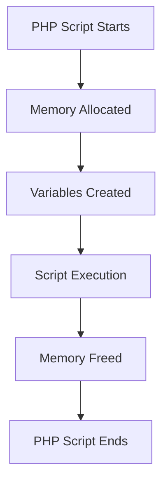

# PHP Memory Management

Memory management is a critical aspect of PHP performance optimization. Understanding how PHP handles memory will help you write more efficient code and avoid common issues like memory leaks and exhaustion.

## Introduction to PHP Memory Management

PHP, like any programming language, needs to use your computer's memory (RAM) to store and process data during script execution. How efficiently PHP manages this memory directly impacts your application's performance, especially for high-traffic websites or complex applications.

Unlike lower-level languages like C or C++ where developers must manually allocate and free memory, PHP employs automatic memory management through a system called "garbage collection." This means PHP handles much of the memory management for you, but understanding the underlying mechanisms will help you write more efficient code.

## How PHP Memory Works

### Memory Allocation

When you run a PHP script, the PHP engine:

1. Allocates a fixed amount of memory for the script execution
2. Creates variables and stores data in this memory space
3. Keeps track of which memory is being used
4. Frees memory when it's no longer needed



### PHP Memory Limits

PHP has a configurable memory limit to prevent scripts from consuming excessive resources. This limit is defined in the `php.ini` configuration file:

```php
memory_limit = 128M  ; Default is often 128MB
```

You can check your current memory limit with:

```php
<?php
echo "Current memory limit: " . ini_get('memory_limit');

// Output:
// Current memory limit: 128M
```

For specific scripts that require more memory, you can increase this limit temporarily:

```php
<?php
// Increase memory limit to 256MB for the current script
ini_set('memory_limit', '256M');
echo "New memory limit: " . ini_get('memory_limit');

// Output:
// New memory limit: 256M
```

**Note:** While you can increase the memory limit, it's better to optimize your code to use memory efficiently rather than simply allocating more memory.

## Memory Usage Tracking

PHP provides functions to monitor memory usage during script execution:

```php
<?php
// Get memory usage at a specific point
echo "Current memory usage: " . memory_get_usage() . " bytes
";

// Get peak memory usage
echo "Peak memory usage: " . memory_get_peak_usage() . " bytes
";

// Create a large array
$array = range(1, 100000);

// Check memory usage after creating the array
echo "Memory usage after creating array: " . memory_get_usage() . " bytes
";
echo "Peak memory usage after creating array: " . memory_get_peak_usage() . " bytes
";

// Output example:
// Current memory usage: 355840 bytes
// Peak memory usage: 356208 bytes
// Memory usage after creating array: 4544352 bytes
// Peak memory usage after creating array: 4544352 bytes
```

## PHP Garbage Collection

Garbage collection is the process of automatically freeing memory that's no longer needed. PHP uses a combination of reference counting and a cycle-collecting garbage collector.

### Reference Counting

PHP keeps track of how many references point to each variable. When the reference count drops to zero, PHP knows that the variable is no longer needed and can free its memory.

```php
<?php
// A variable is created and its reference count is 1
$a = "Hello World";

// Reference count of "Hello World" increases to 2
$b = $a;

// Reference count decreases to 1
unset($a);

// Reference count becomes 0, and the memory is eligible for cleanup
unset($b);
```

### Circular References

A limitation of simple reference counting is handling circular references:

```php
<?php
// Create objects that reference each other
$obj1 = new stdClass();
$obj2 = new stdClass();

// Create a circular reference
$obj1->ref = $obj2;
$obj2->ref = $obj1;

// Even if we unset both variables, the objects would still reference each other
unset($obj1);
unset($obj2);
// Without cycle collection, this would cause a memory leak
```

To address this issue, PHP introduced a cycle-collecting garbage collector that detects and cleans up circular references periodically.

## Common Memory Issues

### 1. Memory Leaks

Memory leaks occur when your application consumes memory but doesn't release it properly. In PHP, common causes include:

- Circular references that aren't properly handled
- Long-running scripts or daemon processes that accumulate memory over time
- Large static collections that grow without bounds

### 2. Memory Exhaustion

Memory exhaustion happens when your script tries to use more memory than allowed, resulting in a fatal error:

```
PHP Fatal error: Allowed memory size of 134217728 bytes exhausted
```

Common causes include:

- Processing very large files
- Handling large datasets without pagination
- Inefficient algorithms with high memory complexity
- Memory leaks that gradually consume all available memory

## Practical Memory Optimization Techniques

Let's look at some practical ways to optimize memory usage in your PHP applications:

### 1. Use Generators for Large Datasets

Instead of loading an entire dataset into memory, use generators to process items one at a time:

```php
<?php
// Memory-intensive approach
function getAllLinesFromFile($fileName) {
    $lines = [];
    $file = fopen($fileName, 'r');
    while (($line = fgets($file)) !== false) {
        $lines[] = trim($line);
    }
    fclose($file);
    return $lines;
}

// Memory-efficient approach using a generator
function getLineFromFile($fileName) {
    $file = fopen($fileName, 'r');
    while (($line = fgets($file)) !== false) {
        yield trim($line);
    }
    fclose($file);
}

// Usage example
// Memory-intensive (loads all lines at once)
$allLines = getAllLinesFromFile('large_log_file.txt');
foreach ($allLines as $line) {
    // Process line
}

// Memory-efficient (processes one line at a time)
foreach (getLineFromFile('large_log_file.txt') as $line) {
    // Process line
}
```

### 2. Clean Up After Large Operations

When performing operations that use significant memory, clean up afterwards:

```php
<?php
function processLargeData() {
    // Create a large array
    $largeArray = range(1, 1000000);
    
    // Process the data
    $result = array_sum($largeArray);
    
    // Clean up to free memory
    unset($largeArray);
    
    return $result;
}
```

### 3. Use Pagination for Database Queries

Instead of fetching thousands of records at once, use pagination:

```php
<?php
function fetchAllUsers($pdo) {
    // Bad practice for large tables
    $stmt = $pdo->query("SELECT * FROM users");
    return $stmt->fetchAll(PDO::FETCH_ASSOC);
}

function fetchUsersPaginated($pdo, $page = 1, $perPage = 100) {
    // Good practice - paginate results
    $offset = ($page - 1) * $perPage;
    $stmt = $pdo->prepare("SELECT * FROM users LIMIT :limit OFFSET :offset");
    $stmt->bindValue(':limit', $perPage, PDO::PARAM_INT);
    $stmt->bindValue(':offset', $offset, PDO::PARAM_INT);
    $stmt->execute();
    
    return $stmt->fetchAll(PDO::FETCH_ASSOC);
}
```

### 4. Stream Large Files

When working with large files, use streaming techniques instead of loading the entire file:

```php
<?php
// Bad practice for large files
$content = file_get_contents('large_file.csv');
$lines = explode("
", $content);

// Good practice - process the file line by line
$handle = fopen('large_file.csv', 'r');
while (($line = fgets($handle)) !== false) {
    // Process line
}
fclose($handle);
```

### 5. Use Iterators for Large Collections

For large data structures, use iterators to process items one at a time:

```php
<?php
// Example using SPL iterators for directory scanning
$dir = new RecursiveDirectoryIterator('/path/to/directory');
$iterator = new RecursiveIteratorIterator($dir);

// Process each file one at a time
foreach ($iterator as $file) {
    if ($file->isFile()) {
        // Process file
        echo $file->getPathname() . "
";
    }
}
```

## Memory Profiling Tools

To identify memory issues, you can use these tools:

1. **Xdebug** - A PHP extension that provides debugging and profiling capabilities
2. **Blackfire** - A performance testing and profiling tool
3. **PHP Memtrack** - A lightweight memory tracking library
4. **New Relic** - Application monitoring that includes memory usage tracking

## Real-World Example: Processing a Large CSV File

Let's compare memory-efficient and memory-intensive approaches for processing a large CSV file:

```php
<?php
// Memory-intensive approach
function analyzeCSVMemoryIntensive($filename) {
    $startMemory = memory_get_usage();
    
    // Load the entire file into memory
    $content = file_get_contents($filename);
    $rows = explode("
", $content);
    
    $data = [];
    foreach ($rows as $row) {
        if (empty(trim($row))) continue;
        $data[] = str_getcsv($row);
    }
    
    // Calculate some statistics (example)
    $count = count($data);
    $totalMemory = memory_get_peak_usage() - $startMemory;
    
    return [
        'rows' => $count,
        'memory_used' => $totalMemory
    ];
}

// Memory-efficient approach
function analyzeCSVMemoryEfficient($filename) {
    $startMemory = memory_get_usage();
    
    $count = 0;
    $handle = fopen($filename, 'r');
    
    while (($row = fgetcsv($handle)) !== false) {
        // Process each row individually
        $count++;
    }
    
    fclose($handle);
    
    $totalMemory = memory_get_peak_usage() - $startMemory;
    
    return [
        'rows' => $count,
        'memory_used' => $totalMemory
    ];
}

// Example usage
$largeFile = 'users_1million.csv';

echo "Memory-intensive approach:
";
print_r(analyzeCSVMemoryIntensive($largeFile));

echo "Memory-efficient approach:
";
print_r(analyzeCSVMemoryEfficient($largeFile));

/* Example output:
Memory-intensive approach:
Array
(
    [rows] => 1000000
    [memory_used] => 524288000
)

Memory-efficient approach:
Array
(
    [rows] => 1000000
    [memory_used] => 2097152
)
*/
```

This example demonstrates how the streaming approach uses significantly less memory while achieving the same result.

## Summary

Proper memory management is crucial for building efficient PHP applications. In this guide, we've covered:

- How PHP allocates and manages memory
- PHP's memory limits and how to adjust them
- Memory usage tracking with PHP functions
- How PHP's garbage collection works
- Common memory issues and how to avoid them
- Practical memory optimization techniques
- Tools for memory profiling
- Real-world examples of memory-efficient code

By applying these principles, you can write PHP applications that use memory efficiently, perform better, and avoid common memory-related issues.

## Additional Resources

- [PHP Memory Management in the Manual](https://www.php.net/manual/en/features.gc.php)
- [PHP Garbage Collection Internals](https://www.php.net/manual/en/features.gc.performance-considerations.php)
- [PHP SPL Iterators](https://www.php.net/manual/en/spl.iterators.php)

## Exercises

1. **Memory Monitoring**: Write a simple PHP script that creates different types of variables (strings, arrays, objects) and monitors memory usage at each step.

2. **Generator Implementation**: Convert a function that returns a large array into a generator function and compare the memory usage of both approaches.

3. **CSV Challenge**: Implement a memory-efficient solution for finding the average value in a specific column of a very large CSV file (10+ million rows).

4. **Pagination Practice**: Create a simple API endpoint that retrieves data from a database using pagination, with configurable page size and page number.

5. **Circular Reference**: Create a set of objects with circular references and demonstrate how to properly clean them up to avoid memory leaks.