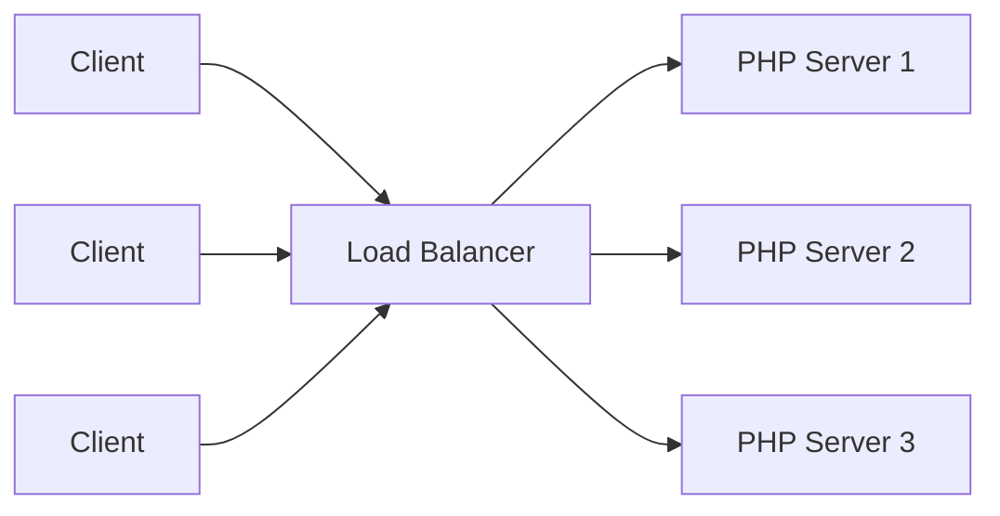
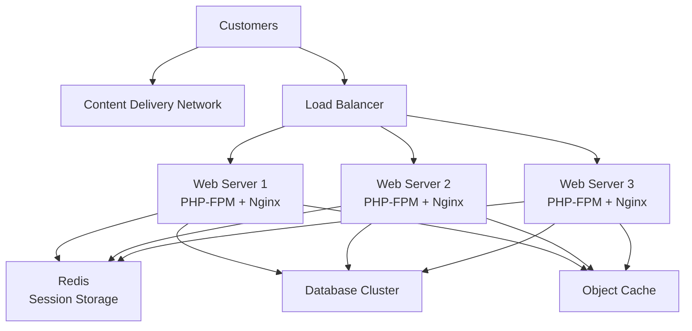

# PHP Load Balancing

## Introduction

Load balancing is a critical technique for distributing incoming network traffic across multiple servers to ensure no single server bears too much demand. For PHP applications, proper load balancing can significantly improve performance, reliability, and scalability.

As your PHP application grows in popularity, a single server may no longer handle the increasing traffic efficiently. This is where load balancing comes in—it helps distribute the workload evenly, preventing server overloads and ensuring your application remains responsive even during traffic spikes.

In this guide, we'll explore how load balancing works with PHP applications, different load balancing techniques, implementation strategies, and practical examples to help you get started.

## Understanding Load Balancing Basics

### What is Load Balancing?

Load balancing refers to the process of distributing incoming network traffic across multiple backend servers. A load balancer sits between client devices and backend servers, routing client requests to available servers capable of fulfilling those requests.



### Why Load Balance PHP Applications?

1. **Improved Performance**: Distributes user requests across multiple servers, reducing response time.
2. **High Availability**: If one server fails, traffic is automatically redirected to functioning servers.
3. **Scalability**: Easily add more servers to handle increasing traffic without downtime.
4. **Resource Optimization**: Efficiently utilizes server resources by balancing the workload.
5. **Redundancy**: Eliminates single points of failure in your infrastructure.

## Load Balancing Algorithms

Several algorithms determine how a load balancer distributes requests:

### Round Robin

The simplest algorithm that forwards requests to servers in sequential order. After reaching the last server, it starts again from the first one.

```php
<?php
// Simplified Round-Robin implementation example
function roundRobin($servers) {
    static $current = 0;
    
    // Get the next server in rotation
    $server = $servers[$current];
    
    // Update the counter for next request
    $current = ($current + 1) % count($servers);
    
    return $server;
}

$servers = ['server1.example.com', 'server2.example.com', 'server3.example.com'];

// Simulate 5 requests
for ($i = 0; $i < 5; $i++) {
    $selectedServer = roundRobin($servers);
    echo "Request " . ($i + 1) . " routed to: " . $selectedServer . "
";
}
?>
```

Output:
```
Request 1 routed to: server1.example.com
Request 2 routed to: server2.example.com
Request 3 routed to: server3.example.com
Request 4 routed to: server1.example.com
Request 5 routed to: server2.example.com
```

### Least Connections

Routes traffic to the server with the fewest active connections, helping to distribute load more evenly when request processing times vary.

### IP Hash

Uses the client's IP address to determine which server receives the request, ensuring that a client always connects to the same server.

```php
<?php
// IP Hash load balancing example
function ipHash($clientIP, $servers) {
    // Convert IP to integer and get modulo by server count
    $hash = crc32($clientIP) % count($servers);
    
    // Ensure we get a positive index
    $hash = ($hash < 0) ? $hash + count($servers) : $hash;
    
    return $servers[$hash];
}

$servers = ['server1.example.com', 'server2.example.com', 'server3.example.com'];

// Simulate requests from different IPs
$ips = ['192.168.1.1', '10.0.0.1', '172.16.0.1', '192.168.1.2'];

foreach ($ips as $ip) {
    $selectedServer = ipHash($ip, $servers);
    echo "Client " . $ip . " routed to: " . $selectedServer . "
";
}
?>
```

Output:
```
Client 192.168.1.1 routed to: server3.example.com
Client 10.0.0.1 routed to: server2.example.com
Client 172.16.0.1 routed to: server2.example.com
Client 192.168.1.2 routed to: server1.example.com
```

### Weighted Round Robin

Similar to Round Robin but assigns different weights to servers based on their capabilities or performance. Servers with higher weights receive more requests.

## Load Balancing Implementation Options for PHP Applications

### 1. Hardware Load Balancers

Physical devices specifically designed to distribute network traffic. They offer high performance but can be expensive.

Examples: F5 BIG-IP, Citrix ADC, A10 Networks

### 2. Software Load Balancers

Software solutions that can be installed on standard servers.

Examples:

#### Nginx as a Load Balancer

Nginx is a popular web server that can also function as a load balancer. Here's a basic configuration:

```nginx
http {
    upstream php_servers {
        server 192.168.1.10:80;
        server 192.168.1.11:80;
        server 192.168.1.12:80;
    }

    server {
        listen 80;
        server_name example.com;

        location / {
            proxy_pass http://php_servers;
            proxy_set_header Host $host;
            proxy_set_header X-Real-IP $remote_addr;
        }
    }
}
```

#### HAProxy as a Load Balancer

HAProxy is a dedicated software load balancer with extensive features:

```
frontend http_front
    bind *:80
    default_backend php_servers

backend php_servers
    balance roundrobin
    server server1 192.168.1.10:80 check
    server server2 192.168.1.11:80 check
    server server3 192.168.1.12:80 check
```

### 3. Cloud Load Balancers

Managed services provided by cloud providers:

- AWS Elastic Load Balancing
- Google Cloud Load Balancing
- Azure Load Balancer

## Session Management in Load-Balanced PHP Applications

One challenge with load balancing is session management, as requests from the same user might be sent to different servers.

### 1. Sticky Sessions

Configure your load balancer to send all requests from a user to the same server. While simple, this approach reduces the effectiveness of load balancing.

```nginx
# Nginx sticky sessions example
upstream php_backend {
    ip_hash;  # This enables sticky sessions based on client IP
    server 192.168.1.10:80;
    server 192.168.1.11:80;
    server 192.168.1.12:80;
}
```

### 2. External Session Storage

Store sessions in an external system accessible by all servers:

#### Using Redis for Session Storage

```php
<?php
// Configure PHP to use Redis for session storage
ini_set('session.save_handler', 'redis');
ini_set('session.save_path', 'tcp://your-redis-server:6379');

// Start the session
session_start();

// Use sessions as normal
$_SESSION['user_id'] = 123;
?>
```

#### Using Database for Session Storage

```php
<?php
// database_session.php - A custom session handler using MySQL

class DatabaseSessionHandler implements SessionHandlerInterface
{
    private $db;
    
    public function __construct($db) {
        $this->db = $db;
    }
    
    public function open($savePath, $sessionName) {
        return true;
    }
    
    public function close() {
        return true;
    }
    
    public function read($id) {
        $stmt = $this->db->prepare("SELECT data FROM sessions WHERE id = ?");
        $stmt->execute([$id]);
        $result = $stmt->fetch(PDO::FETCH_ASSOC);
        
        return $result ? $result['data'] : '';
    }
    
    public function write($id, $data) {
        $stmt = $this->db->prepare("REPLACE INTO sessions (id, data, last_accessed) VALUES (?, ?, NOW())");
        return $stmt->execute([$id, $data]);
    }
    
    public function destroy($id) {
        $stmt = $this->db->prepare("DELETE FROM sessions WHERE id = ?");
        return $stmt->execute([$id]);
    }
    
    public function gc($maxlifetime) {
        $stmt = $this->db->prepare("DELETE FROM sessions WHERE last_accessed < NOW() - INTERVAL ? SECOND");
        return $stmt->execute([$maxlifetime]);
    }
}

// Database connection
$pdo = new PDO('mysql:host=localhost;dbname=myapp', 'username', 'password');

// Register the session handler
$handler = new DatabaseSessionHandler($pdo);
session_set_save_handler($handler, true);

// Start the session
session_start();
?>
```

## Implementing a Simple PHP-based Load Balancer

While most production environments use dedicated load balancers, you can create a simple PHP-based load balancer for educational purposes or small applications:

```php
<?php
// simple-load-balancer.php

class SimpleLoadBalancer {
    private $servers = [];
    private $algorithm;
    
    public function __construct(array $servers, string $algorithm = 'round-robin') {
        $this->servers = $servers;
        $this->algorithm = $algorithm;
    }
    
    public function getServer() {
        switch ($this->algorithm) {
            case 'round-robin':
                return $this->roundRobin();
            case 'ip-hash':
                return $this->ipHash();
            default:
                return $this->roundRobin();
        }
    }
    
    private function roundRobin() {
        static $current = 0;
        
        // Get next server
        $server = $this->servers[$current];
        
        // Update counter for next request
        $current = ($current + 1) % count($this->servers);
        
        return $server;
    }
    
    private function ipHash() {
        $clientIP = $_SERVER['REMOTE_ADDR'];
        $hash = crc32($clientIP) % count($this->servers);
        $hash = ($hash < 0) ? $hash + count($this->servers) : $hash;
        
        return $this->servers[$hash];
    }
    
    public function forward() {
        $server = $this->getServer();
        
        // Create a new cURL resource
        $ch = curl_init();
        
        // Set URL and other options
        curl_setopt($ch, CURLOPT_URL, $server . $_SERVER['REQUEST_URI']);
        curl_setopt($ch, CURLOPT_RETURNTRANSFER, true);
        
        // Forward POST data if present
        if ($_SERVER['REQUEST_METHOD'] === 'POST') {
            curl_setopt($ch, CURLOPT_POST, true);
            curl_setopt($ch, CURLOPT_POSTFIELDS, file_get_contents('php://input'));
        }
        
        // Forward headers
        $headers = [];
        foreach (getallheaders() as $name => $value) {
            if ($name !== 'Host') {  // Skip host header
                $headers[] = "$name: $value";
            }
        }
        curl_setopt($ch, CURLOPT_HTTPHEADER, $headers);
        
        // Execute request and get response
        $response = curl_exec($ch);
        $info = curl_getinfo($ch);
        
        // Close cURL resource
        curl_close($ch);
        
        // Set HTTP response code
        http_response_code($info['http_code']);
        
        // Output response
        echo $response;
    }
}

// Configure and use the load balancer
$servers = [
    'http://192.168.1.10',
    'http://192.168.1.11',
    'http://192.168.1.12'
];

$loadBalancer = new SimpleLoadBalancer($servers, 'round-robin');
$loadBalancer->forward();
?>
```

:::caution
This simple PHP load balancer is for educational purposes only. In a production environment, use dedicated load balancing solutions mentioned earlier.
:::

## Monitoring Load-Balanced PHP Applications

Proper monitoring is essential to ensure your load balancing setup is working correctly:

```php
<?php
// server-health.php - A simple health check endpoint
header('Content-Type: application/json');

$serverInfo = [
    'status' => 'healthy',
    'server_id' => getenv('SERVER_ID') ?: 'unknown',
    'memory_usage' => memory_get_usage(true),
    'cpu_load' => sys_getloadavg()[0],
    'timestamp' => date('Y-m-d H:i:s')
];

echo json_encode($serverInfo);
?>
```

## Real-World Example: Scaling a PHP E-commerce Application

Let's look at how load balancing applies to a real-world PHP e-commerce site:



Implementation considerations:

1. **Session Management**: Store sessions in Redis for seamless user experience
2. **Database Access**: Use connection pooling to optimize database connections
3. **Caching Strategy**: Implement distributed caching with Redis or Memcached
4. **Static Assets**: Serve through a CDN to reduce load on application servers
5. **Auto-scaling**: Configure your infrastructure to add/remove servers based on traffic patterns

## Best Practices for PHP Load Balancing

1. **Always design for failure**: Assume components will fail and plan accordingly
2. **Health checks**: Implement robust health checks to detect and remove unhealthy servers
3. **Session management**: Use external session storage or sticky sessions
4. **Stateless applications**: Design your PHP applications to be stateless where possible
5. **Cache aggressively**: Implement proper caching to reduce server load
6. **Monitor everything**: Set up comprehensive monitoring and alerting
7. **Test thoroughly**: Regularly test failover scenarios and performance under load
8. **Consider geographic distribution**: Use global load balancing for worldwide audiences
9. **Secure your setup**: Implement proper security measures throughout your infrastructure
10. **Document everything**: Keep detailed documentation of your load balancing setup

## Summary

Load balancing is an essential technique for scaling PHP applications to handle increased traffic and ensure high availability. By distributing workloads across multiple servers, you can improve performance, provide redundancy, and create a more reliable application.

We've covered various load balancing algorithms, implementation options, session management strategies, and a real-world example. Remember that the right load balancing solution depends on your specific requirements, budget, and technical expertise.

As you continue to grow your PHP application, regularly review and adjust your load balancing strategy to ensure it meets your evolving needs.

## Additional Resources

- [Nginx Load Balancing Documentation](https://nginx.org/en/docs/http/load_balancing.html)
- [HAProxy Documentation](https://www.haproxy.org/documentation.html)
- [PHP Session Handling](https://www.php.net/manual/en/book.session.php)
- [AWS Elastic Load Balancing for PHP Applications](https://aws.amazon.com/elasticloadbalancing/)
- [Google Cloud Load Balancing](https://cloud.google.com/load-balancing)

## Exercises

1. **Basic Load Balancer Setup**: Install and configure Nginx as a load balancer for two PHP application servers.
2. **Session Management**: Modify a simple PHP application to store sessions in Redis instead of the file system.
3. **Custom Health Checks**: Create a custom health check endpoint for your PHP application that reports server load and memory usage.
4. **Load Testing**: Use a tool like Apache Bench (ab) or JMeter to test your load-balanced setup under various traffic conditions.
5. **Failover Testing**: Simulate server failures to ensure your load balancing configuration handles them gracefully.