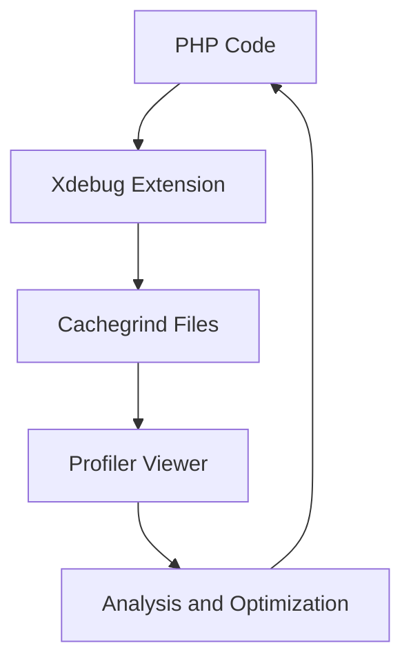
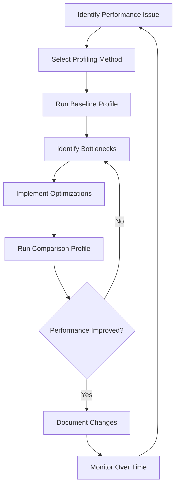

# PHP Profiling

## Introduction

PHP profiling is the process of analyzing your PHP application's performance to identify bottlenecks, memory leaks, and inefficient code. Just like a doctor uses diagnostic tools to identify health issues, profiling tools help developers pinpoint performance problems in their code. For beginners, understanding profiling is essential as it helps you write more efficient code and builds good programming habits from the start.

In this tutorial, we'll explore various PHP profiling techniques, tools, and how to interpret profiling data to optimize your applications.

## Why Profile Your PHP Code?

Before diving into the tools and techniques, let's understand why profiling is important:

- **Performance Improvement**: Identify slow functions and queries that affect user experience
- **Resource Optimization**: Reduce memory usage and CPU load
- **Cost Reduction**: Efficient code means lower hosting costs
- **Debugging Aid**: Find bugs that only appear under specific performance conditions
- **Better Programming Habits**: Learn to write efficient code from the beginning

## Basic Profiling with Built-in Functions

PHP provides several built-in functions that can help with basic profiling. Let's start with these simple approaches before moving to more advanced tools.

### Measuring Execution Time

The simplest form of profiling is measuring how long a section of code takes to execute:

```php
// Start the timer
$startTime = microtime(true);

// Code to profile
for ($i = 0; $i < 1000000; $i++) {
    $result = $i * $i;
}

// Calculate execution time
$endTime = microtime(true);
$executionTime = ($endTime - $startTime) * 1000; // convert to milliseconds

echo "Execution time: " . number_format($executionTime, 2) . " ms";
```

**Output:**
```
Execution time: 27.45 ms
```

### Memory Usage Tracking

To profile memory usage, you can use the `memory_get_usage()` function:

```php
// Before allocation
$memoryBefore = memory_get_usage();

// Allocate memory
$array = array();
for ($i = 0; $i < 100000; $i++) {
    $array[] = $i;
}

// After allocation
$memoryAfter = memory_get_usage();
$memoryUsed = ($memoryAfter - $memoryBefore) / 1024 / 1024; // convert to MB

echo "Memory used: " . number_format($memoryUsed, 2) . " MB";
```

**Output:**
```
Memory used: 3.81 MB
```

### Creating a Simple Profiler Class

Let's create a basic profiler class that can be used throughout your application:

```php
class SimpleProfiler {
    private $startTime;
    private $startMemory;
    private $markers = [];
    
    public function start() {
        $this->startTime = microtime(true);
        $this->startMemory = memory_get_usage();
        $this->markers = [];
        return $this;
    }
    
    public function mark($name) {
        $this->markers[$name] = [
            'time' => microtime(true),
            'memory' => memory_get_usage()
        ];
        return $this;
    }
    
    public function getReport() {
        $report = "<h3>Profiling Report</h3>";
        $report .= "<table border='1'>";
        $report .= "<tr><th>Marker</th><th>Time (ms)</th><th>Memory (MB)</th></tr>";
        
        $previousTime = $this->startTime;
        $previousMemory = $this->startMemory;
        
        foreach ($this->markers as $name => $data) {
            $timeElapsed = ($data['time'] - $previousTime) * 1000;
            $memoryUsed = ($data['memory'] - $previousMemory) / 1024 / 1024;
            
            $report .= "<tr>";
            $report .= "<td>{$name}</td>";
            $report .= "<td>" . number_format($timeElapsed, 2) . "</td>";
            $report .= "<td>" . number_format($memoryUsed, 2) . "</td>";
            $report .= "</tr>";
            
            $previousTime = $data['time'];
            $previousMemory = $data['memory'];
        }
        
        $report .= "</table>";
        return $report;
    }
}
```

**Usage example:**

```php
$profiler = new SimpleProfiler();
$profiler->start();

// First operation
$array = [];
for ($i = 0; $i < 100000; $i++) {
    $array[] = $i;
}
$profiler->mark("Array Creation");

// Second operation
$sum = 0;
foreach ($array as $value) {
    $sum += $value;
}
$profiler->mark("Array Sum Calculation");

// Display the report
echo $profiler->getReport();
```

**Output:**
```
Profiling Report
-------------------------
Marker               | Time (ms)  | Memory (MB)
-------------------------
Array Creation       | 12.65      | 3.82
Array Sum Calculation| 5.34       | 0.00
```

## Advanced Profiling with Xdebug

While built-in functions are helpful, professional PHP profiling typically involves Xdebug, a powerful debugging and profiling extension.

### Installing Xdebug

First, you need to install Xdebug. The installation varies by platform:

**For Linux (Ubuntu/Debian):**
```bash
sudo apt-get install php-xdebug
```

**For Windows with XAMPP:**
Xdebug usually comes preinstalled but might need configuration.

**For macOS with Homebrew:**
```bash
brew install php-xdebug
```

After installation, configure your `php.ini` file to enable profiling:

```ini
[xdebug]
zend_extension=xdebug.so
xdebug.mode=profile
xdebug.output_dir=/path/to/profiler/output
xdebug.profiler_output_name=cachegrind.out.%p
```

### Triggering Xdebug Profiling

You can trigger profiling in several ways:

1. **Always On (not recommended for production):**
   ```ini
   xdebug.mode=profile
   ```

2. **On Demand with GET/POST parameters:**
   ```ini
   xdebug.mode=develop,debug
   xdebug.start_with_request=trigger
   ```
   
   Then trigger profiling by adding `XDEBUG_PROFILE=1` to your URL:
   ```
   https://yourapplication.local/index.php?XDEBUG_PROFILE=1
   ```

3. **Using a Browser Extension:**
   Extensions like "Xdebug Helper" for Chrome or Firefox make it easy to toggle profiling.

### Analyzing Profiling Data

Xdebug generates cachegrind files that need to be analyzed with a viewer. Popular options include:

1. **KCachegrind** (Linux)
2. **QCachegrind** (Windows/macOS)
3. **Webgrind** (Web-based)

Let's see how to use Webgrind for analysis:

1. Download and set up Webgrind on your server
2. Point it to your Xdebug output directory
3. Open Webgrind in your browser to analyze profiles

The profiling data will show:

- Function calls and their execution times
- Call hierarchies (which functions call which)
- Memory usage
- Inclusive vs. exclusive times

Here's what the flow looks like:



## Real-world Profiling Example

Let's look at a practical example of how profiling can help identify performance issues in a web application.

### The Problem: Slow Product Listing Page

Consider an e-commerce site with a slow product listing page. Let's set up profiling to identify the bottleneck:

```php
<?php
// index.php - Product listing page
require_once 'config.php';
require_once 'database.php';
require_once 'product_model.php';

// Start profiling
$profiler = new SimpleProfiler();
$profiler->start();

// Get database connection
$db = new Database();
$connection = $db->getConnection();
$profiler->mark("Database Connection");

// Get product model
$productModel = new ProductModel($connection);
$profiler->mark("Model Initialization");

// Fetch all products
$products = $productModel->getAllProducts();
$profiler->mark("Product Retrieval");

// Format products for display
$formattedProducts = [];
foreach ($products as $product) {
    $formattedProducts[] = [
        'id' => $product['id'],
        'name' => $product['name'],
        'price' => '$' . number_format($product['price'], 2),
        'description' => substr($product['description'], 0, 100) . '...',
        'image' => $product['image_url']
    ];
}
$profiler->mark("Product Formatting");

// Render page
include 'templates/header.php';
$profiler->mark("Header Rendering");

include 'templates/product_listing.php';
$profiler->mark("Product Listing Rendering");

include 'templates/footer.php';
$profiler->mark("Footer Rendering");

// Display profiling data in development environment
if (ENVIRONMENT === 'development') {
    echo $profiler->getReport();
}
?>
```

After running this code with real data, the profiling report might look like:

```
Profiling Report
-----------------------------------------------------
Marker                   | Time (ms)  | Memory (MB)
-----------------------------------------------------
Database Connection      | 12.34      | 0.25
Model Initialization     | 2.11       | 0.10
Product Retrieval        | 1542.67    | 4.52
Product Formatting       | 35.45      | 1.20
Header Rendering         | 8.76       | 0.35
Product Listing Rendering| 125.78     | 2.10
Footer Rendering         | 5.43       | 0.15
```

The report clearly shows that "Product Retrieval" is the bottleneck, taking over 1.5 seconds. Now we can focus our optimization efforts on improving the database query in the `getAllProducts()` method.

### The Solution

After examining the `getAllProducts()` method, we might find an inefficient query:

```php
// Before optimization
public function getAllProducts() {
    $query = "SELECT p.*, 
             (SELECT GROUP_CONCAT(c.name) FROM categories c 
              JOIN product_categories pc ON c.id = pc.category_id 
              WHERE pc.product_id = p.id) as categories
             FROM products p";
    $result = $this->connection->query($query);
    return $result->fetch_all(MYSQLI_ASSOC);
}
```

The subquery to fetch categories for each product is causing the performance issue. We can optimize it by using JOINs and processing in PHP:

```php
// After optimization
public function getAllProducts() {
    // First, get all products
    $query = "SELECT * FROM products";
    $result = $this->connection->query($query);
    $products = $result->fetch_all(MYSQLI_ASSOC);
    
    // Get all product IDs
    $productIds = array_column($products, 'id');
    if (empty($productIds)) {
        return $products;
    }
    
    // Get categories in a single query
    $idList = implode(',', $productIds);
    $query = "SELECT pc.product_id, c.name 
              FROM product_categories pc 
              JOIN categories c ON pc.category_id = c.id 
              WHERE pc.product_id IN ($idList)";
    $result = $this->connection->query($query);
    $categories = $result->fetch_all(MYSQLI_ASSOC);
    
    // Map categories to products
    $productCategories = [];
    foreach ($categories as $category) {
        $productId = $category['product_id'];
        if (!isset($productCategories[$productId])) {
            $productCategories[$productId] = [];
        }
        $productCategories[$productId][] = $category['name'];
    }
    
    // Add categories to products
    foreach ($products as &$product) {
        $product['categories'] = isset($productCategories[$product['id']]) 
            ? implode(', ', $productCategories[$product['id']]) 
            : '';
    }
    
    return $products;
}
```

After this optimization, running the profiler again might show:

```
Profiling Report
-----------------------------------------------------
Marker                   | Time (ms)  | Memory (MB)
-----------------------------------------------------
Database Connection      | 12.56      | 0.25
Model Initialization     | 2.23       | 0.10
Product Retrieval        | 87.45      | 4.75
Product Formatting       | 34.67      | 1.20
Header Rendering         | 8.89       | 0.35
Product Listing Rendering| 126.12     | 2.10
Footer Rendering         | 5.67       | 0.15
```

The product retrieval time has been reduced from 1542.67 ms to 87.45 ms - a 94% improvement!

## Profiling Beyond Code: Database Queries

Sometimes the bottleneck is in your database queries. PHP provides several ways to profile database operations:

### MySQLi Performance Profiling

```php
// Start timer
$startTime = microtime(true);

// Execute query
$result = $mysqli->query("SELECT * FROM products WHERE category_id = 5");

// End timer
$endTime = microtime(true);
$queryTime = ($endTime - $startTime) * 1000;

echo "Query execution time: " . number_format($queryTime, 2) . " ms";
```

### PDO Query Profiling

```php
// Enable profiling
$pdo->exec("SET profiling = 1");

// Execute query
$stmt = $pdo->query("SELECT * FROM products WHERE category_id = 5");

// Get profile data
$profileData = $pdo->query("SHOW PROFILES")->fetchAll(PDO::FETCH_ASSOC);
print_r($profileData);

// Disable profiling
$pdo->exec("SET profiling = 0");
```

### Using EXPLAIN for MySQL Query Analysis

```php
$explainResult = $mysqli->query("EXPLAIN SELECT * FROM products WHERE category_id = 5");
$explainData = $explainResult->fetch_all(MYSQLI_ASSOC);
print_r($explainData);
```

The EXPLAIN output provides crucial information about:
- How tables are joined
- Index usage
- Approximate number of rows examined
- Extra operations like temporary tables or file sorts

## Identifying Common PHP Performance Issues

Through profiling, you'll often discover these common performance problems:

### 1. N+1 Query Problem

The N+1 query problem occurs when your code executes N+1 database queries to fetch related data for N items.

**Before (problematic):**
```php
// Get all products
$products = $db->query("SELECT * FROM products")->fetchAll();

// For each product, get its categories (N additional queries)
foreach ($products as &$product) {
    $product['categories'] = $db->query(
        "SELECT c.name FROM categories c 
         JOIN product_categories pc ON c.id = pc.category_id 
         WHERE pc.product_id = {$product['id']}"
    )->fetchAll();
}
```

**After (optimized):**
```php
// Get all products
$products = $db->query("SELECT * FROM products")->fetchAll();
$productIds = array_column($products, 'id');

// Get all categories in a single query
$categories = $db->query(
    "SELECT pc.product_id, c.name FROM categories c 
     JOIN product_categories pc ON c.id = pc.category_id 
     WHERE pc.product_id IN (" . implode(',', $productIds) . ")"
)->fetchAll();

// Map categories to products
$productCategories = [];
foreach ($categories as $category) {
    $productCategories[$category['product_id']][] = $category['name'];
}

// Add categories to each product
foreach ($products as &$product) {
    $product['categories'] = $productCategories[$product['id']] ?? [];
}
```

### 2. Memory Leaks

Profiling helps identify memory leaks in long-running scripts.

```php
// Memory leak example
function processLargeDataset() {
    $data = [];
    
    for ($i = 0; $i < 1000; $i++) {
        $bigArray = range(1, 10000);
        // Process data
        $data[] = processArray($bigArray);
        // Forgot to unset $bigArray
    }
    
    return $data;
}

// Optimized version
function processLargeDataset() {
    $data = [];
    
    for ($i = 0; $i < 1000; $i++) {
        $bigArray = range(1, 10000);
        // Process data
        $data[] = processArray($bigArray);
        // Free memory
        unset($bigArray);
    }
    
    return $data;
}
```

### 3. Function Call Overhead

Sometimes profiling reveals excessive function calls:

```php
// Before optimization
$total = 0;
for ($i = 0; $i < 1000000; $i++) {
    $total += getValue($i); // Function call for each iteration
}

// After optimization
$values = getValues(1000000); // Single function call
$total = array_sum($values);
```

## Profiling in Different Environments

Profiling needs change depending on your environment:

### Development Environment

- Enable detailed profiling
- Set up visual profiling tools
- Focus on finding issues early

**php.ini settings:**
```ini
xdebug.mode=develop,debug,profile
xdebug.start_with_request=trigger
xdebug.output_dir=/path/to/profiles
display_errors=On
error_reporting=E_ALL
```

### Staging/Testing Environment

- Profile with production-like data
- Focus on load testing and stress testing
- Identify issues that only appear with realistic data volume

**php.ini settings:**
```ini
xdebug.mode=profile
xdebug.start_with_request=trigger
xdebug.output_dir=/path/to/profiles
display_errors=Off
```

### Production Environment

- Minimal profiling to avoid performance impact
- Focus on real user monitoring
- Use sampling techniques

**php.ini settings:**
```ini
xdebug.mode=off
display_errors=Off
```

For production profiling, consider using tools like:
- New Relic
- Blackfire.io
- Tideways

These tools provide minimal overhead while offering valuable insights.

## Best Practices for PHP Profiling

1. **Profile Early and Often**: Don't wait until performance issues arise
2. **Establish Baselines**: Know what "normal" performance looks like
3. **Focus on Hotspots**: Optimize the 20% of code that causes 80% of performance issues
4. **Use Multiple Tools**: Combine Xdebug, database profiling, and application monitoring
5. **Profile in Different Environments**: Development, staging, and production
6. **Compare Before and After**: Verify that your optimizations actually help
7. **Set Performance Budgets**: Define acceptable performance thresholds

## The PHP Profiling Process Flowchart



## Summary

PHP profiling is an essential skill for creating efficient web applications. In this tutorial, we've covered:

1. **Basic Profiling Techniques**: Using built-in functions like `microtime()` and `memory_get_usage()`
2. **Advanced Profiling**: Setting up and using Xdebug
3. **Analyzing Profiling Data**: Interpreting results to find bottlenecks
4. **Real-world Example**: A practical case study of optimizing a slow product listing page
5. **Database Profiling**: Techniques specific to improving database performance
6. **Common Issues**: Identifying and fixing N+1 queries, memory leaks, and function call overhead
7. **Environment-specific Profiling**: Adapting your approach based on development, staging, or production needs
8. **Best Practices**: Guidelines to make profiling a regular part of your development workflow

## Additional Resources

### Books and Documentation
- [PHP Manual: Xdebug Extension](https://www.php.net/manual/en/book.xdebug.php)
- [PHP 7 Performance](https://www.oreilly.com/library/view/php-7-performance/9781787282889/)
- [High Performance PHP](https://phpperformancebook.com/)

### Online Resources
- [Blackfire.io Documentation](https://blackfire.io/docs/introduction)
- [Tideways Knowledge Base](https://tideways.com/kb)
- [PHP The Right Way: Performance](https://phptherightway.com/#performance)

### Tools
- [Xdebug](https://xdebug.org/)
- [Webgrind](https://github.com/jokkedk/webgrind)
- [KCachegrind/QCachegrind](https://kcachegrind.github.io/)
- [Blackfire.io](https://blackfire.io/)
- [Tideways](https://tideways.com/)
- [New Relic PHP Agent](https://newrelic.com/php)

## Exercises for Practice

1. **Basic Profiling Exercise**: Create a script that measures the performance difference between using `array_map()` and a foreach loop to transform a large array
   
2. **Xdebug Profiling Exercise**: Set up Xdebug profiling on your local development environment and analyze a simple PHP application
   
3. **Database Profiling Exercise**: Write a script that compares the performance of different SQL query approaches to solve the same problem
   
4. **Memory Optimization Exercise**: Profile and optimize a script that processes a large dataset to use less memory
   
5. **Real Application Exercise**: Take an existing small PHP application (like a blog or todo app) and use profiling to identify and fix the top three performance bottlenecks