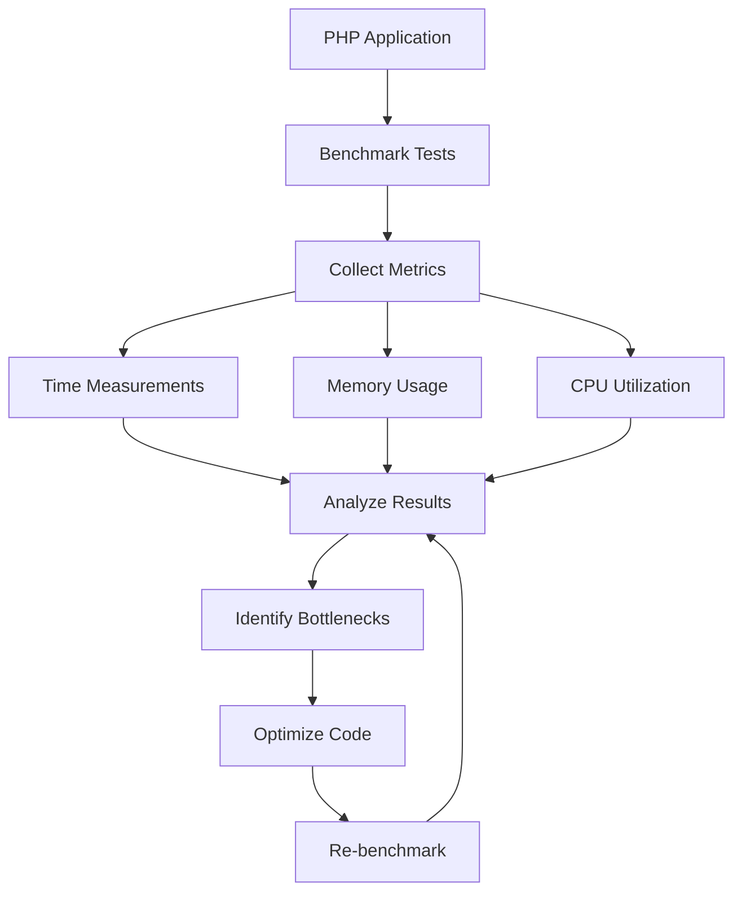

# PHP Benchmarking

## Introduction

Benchmarking is a critical aspect of PHP development that involves measuring the performance of your code to identify bottlenecks and optimize execution time. For beginners diving into PHP performance optimization, understanding how to properly benchmark your code is an essential skill that will help you create faster, more efficient applications.

In this guide, we'll explore various techniques to measure PHP code performance, compare different implementations, and make data-driven decisions to improve your applications.

## Why Benchmark Your PHP Code?

Before we dive into the "how", let's understand the "why":

- **Performance Optimization**: Identify which parts of your code are slow and need improvement
- **Resource Management**: Understand how your code utilizes server resources (CPU, memory)
- **Code Comparison**: Compare different algorithms or functions to determine which performs better
- **Scalability Planning**: Predict how your application will perform under increased load

## Basic Time Measurement in PHP

The simplest way to benchmark PHP code is by measuring the execution time using the `microtime()` function.

### Using microtime()

```php
<?php
// Start the timer
$start_time = microtime(true);

// Code to benchmark
for ($i = 0; $i < 1000000; $i++) {
    $result = $i * $i;
}

// End the timer
$end_time = microtime(true);

// Calculate execution time
$execution_time = ($end_time - $start_time);

echo "Execution time: " . number_format($execution_time, 6) . " seconds";
?>
```

**Output:**
```
Execution time: 0.023842 seconds
```

### Creating a Simple Benchmark Class

Let's create a reusable benchmark class to make our testing more organized:

```php
<?php
class Benchmark {
    private $startTime;
    private $endTime;
    
    public function start() {
        $this->startTime = microtime(true);
    }
    
    public function end() {
        $this->endTime = microtime(true);
    }
    
    public function getExecutionTime() {
        return ($this->endTime - $this->startTime);
    }
    
    public function displayExecutionTime() {
        echo "Execution time: " . number_format($this->getExecutionTime(), 6) . " seconds";
    }
}

// Usage example
$benchmark = new Benchmark();
$benchmark->start();

// Code to benchmark
$array = range(1, 100000);
$sum = array_sum($array);

$benchmark->end();
$benchmark->displayExecutionTime();
?>
```

**Output:**
```
Execution time: 0.012576 seconds
```

## Memory Usage Benchmarking

Time isn't the only important metric. Memory usage is crucial for PHP applications, especially when dealing with large datasets.

```php
<?php
// Record memory before operation
$memory_start = memory_get_usage();

// Code to benchmark
$array = range(1, 100000);

// Record memory after operation
$memory_end = memory_get_usage();
$memory_usage = ($memory_end - $memory_start) / 1024 / 1024; // Convert to MB

echo "Memory used: " . number_format($memory_usage, 4) . " MB";
?>
```

**Output:**
```
Memory used: 3.8147 MB
```

## Comparing Different Implementations

One of the most common use cases for benchmarking is comparing different approaches to solve the same problem.

### Example: String Concatenation Methods

```php
<?php
$benchmark = new Benchmark();
$iterations = 100000;

// Method 1: Using dot operator
$benchmark->start();
$string = '';
for ($i = 0; $i < $iterations; $i++) {
    $string .= 'a';
}
$benchmark->end();
echo "Dot operator: " . number_format($benchmark->getExecutionTime(), 6) . " seconds<br>";

// Method 2: Using array and implode
$benchmark->start();
$array = [];
for ($i = 0; $i < $iterations; $i++) {
    $array[] = 'a';
}
$string = implode('', $array);
$benchmark->end();
echo "Array implode: " . number_format($benchmark->getExecutionTime(), 6) . " seconds<br>";
?>
```

**Output:**
```
Dot operator: 0.056321 seconds
Array implode: 0.012145 seconds
```

As we can see, using array and implode for large string concatenation operations is significantly faster than using the dot operator in PHP.

## Advanced Benchmarking Tools

While manual benchmarking works for simple cases, more complex applications benefit from specialized tools.

### Using PHP's Built-in Benchmark Extension

PHP offers a benchmarking extension called Xdebug which provides profiling capabilities:

```php
<?php
// Enable profiling with Xdebug
xdebug_start_trace('trace');

// Code to benchmark
for ($i = 0; $i < 10000; $i++) {
    sqrt($i);
}

// Stop profiling
xdebug_stop_trace();
echo "Profiling data written to trace file";
?>
```

### External Benchmarking Tools

There are several powerful tools for PHP benchmarking:

1. **Apache Bench (ab)** - For testing HTTP requests to your PHP application
2. **Siege** - Load testing to simulate multiple concurrent users
3. **PHPBench** - A benchmarking framework for PHP

## Real-World Benchmarking Example: Database Queries

Let's compare different ways to fetch data from a database:

```php
<?php
// Connect to database (using PDO)
$pdo = new PDO('mysql:host=localhost;dbname=test', 'username', 'password');

$benchmark = new Benchmark();

// Method 1: Fetch all rows at once
$benchmark->start();
$stmt = $pdo->query("SELECT * FROM users LIMIT 10000");
$users = $stmt->fetchAll(PDO::FETCH_ASSOC);
$benchmark->end();
echo "Fetch all at once: " . number_format($benchmark->getExecutionTime(), 6) . " seconds<br>";

// Method 2: Fetch one by one
$benchmark->start();
$stmt = $pdo->query("SELECT * FROM users LIMIT 10000");
$users = [];
while ($row = $stmt->fetch(PDO::FETCH_ASSOC)) {
    $users[] = $row;
}
$benchmark->end();
echo "Fetch one by one: " . number_format($benchmark->getExecutionTime(), 6) . " seconds<br>";
?>
```

## Best Practices for PHP Benchmarking

To ensure accurate benchmarking results:

1. **Run Multiple Tests**: Single tests can be affected by system variations
2. **Warm Up First**: PHP opcode caching might skew first-run results
3. **Control the Environment**: Minimize other processes running during tests
4. **Use Realistic Data**: Test with data that represents actual usage
5. **Focus on Bottlenecks**: Identify the 20% of code causing 80% of performance issues

## Visualizing Benchmark Results

Visualizing performance data can help identify patterns. Here's an example of how you might represent benchmark data using a flowchart:



## Automated Benchmarking in Development Workflow

Integrating benchmarking into your development process ensures continuous performance monitoring:

```php
<?php
// Example of automated benchmark test
class UserServiceBenchmark {
    public function runAllTests() {
        $this->testUserCreation();
        $this->testUserRetrieval();
        $this->testUserUpdate();
        // More tests...
    }
    
    private function testUserCreation() {
        $benchmark = new Benchmark();
        $benchmark->start();
        
        // Create 100 test users
        for ($i = 0; $i < 100; $i++) {
            // User creation code
        }
        
        $benchmark->end();
        
        // Log or report results
        $this->logResult('User Creation', $benchmark->getExecutionTime());
    }
    
    // More test methods...
    
    private function logResult($testName, $executionTime) {
        file_put_contents(
            'benchmark_results.log',
            date('Y-m-d H:i:s') . " - {$testName}: {$executionTime} seconds
",
            FILE_APPEND
        );
    }
}

// Run benchmarks automatically
$benchmark = new UserServiceBenchmark();
$benchmark->runAllTests();
?>
```

## Common Pitfalls in PHP Benchmarking

Be aware of these common mistakes:

1. **Premature Optimization**: Don't optimize without benchmarking first
2. **Micro-optimization Obsession**: Focus on significant bottlenecks
3. **Unrealistic Test Cases**: Benchmarks should reflect real usage
4. **Ignoring External Factors**: Database, network, and server configurations impact performance
5. **One-time Testing**: Performance can vary; multiple tests provide more reliable data

## Summary

PHP benchmarking is a vital practice for developing high-performance applications. By measuring execution time, memory usage, and other metrics, you can identify bottlenecks and optimize your code effectively. Remember these key points:

- Use `microtime()` for basic time measurement
- Monitor memory usage with `memory_get_usage()`
- Compare different implementations to find the most efficient approach
- Use specialized tools for complex applications
- Follow best practices for accurate results
- Make benchmarking a regular part of your development workflow

## Exercises

1. Create a benchmark class that tracks both time and memory usage
2. Compare the performance of different sorting algorithms (bubble sort vs. quick sort) on large arrays
3. Benchmark different methods of reading a large file in PHP
4. Measure the performance impact of using different PHP caching mechanisms
5. Create an automated benchmark suite for a small PHP application

## Additional Resources

- [PHP Manual: microtime](https://www.php.net/manual/en/function.microtime.php)
- [PHP Manual: memory_get_usage](https://www.php.net/manual/en/function.memory-get-usage.php)
- [PHPBench Documentation](https://phpbench.readthedocs.io/)
- [Xdebug Profiling Guide](https://xdebug.org/docs/profiler)
- [PHP Performance Optimization Best Practices](https://www.php.net/manual/en/features.gc.performance-considerations.php)