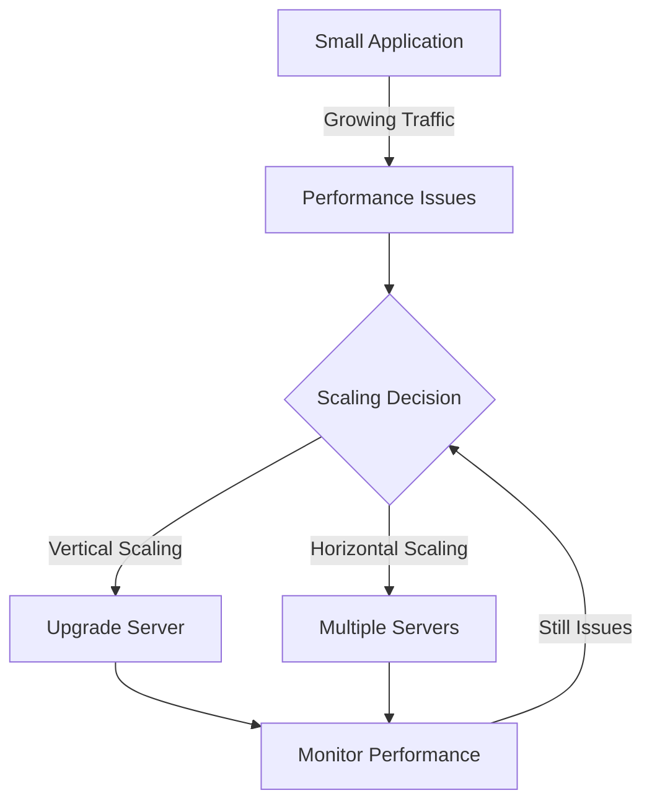
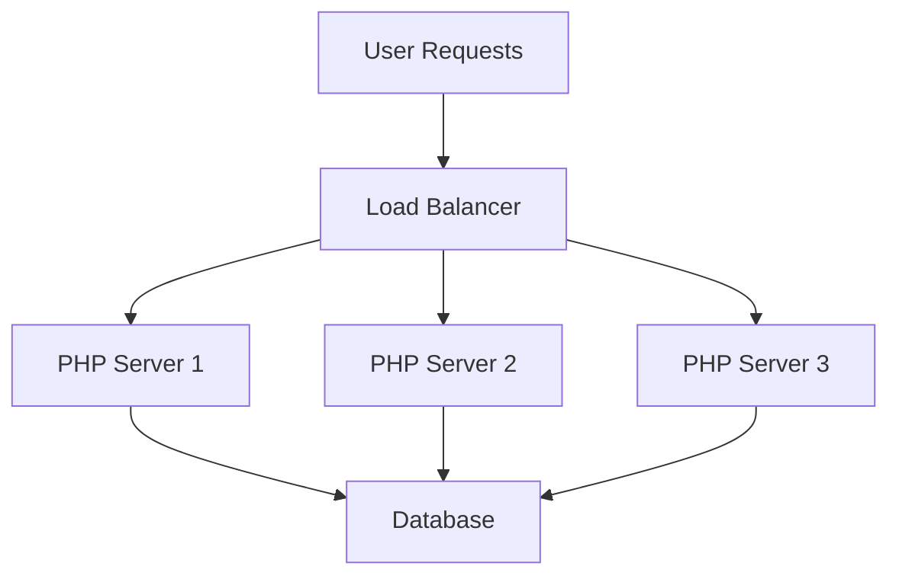
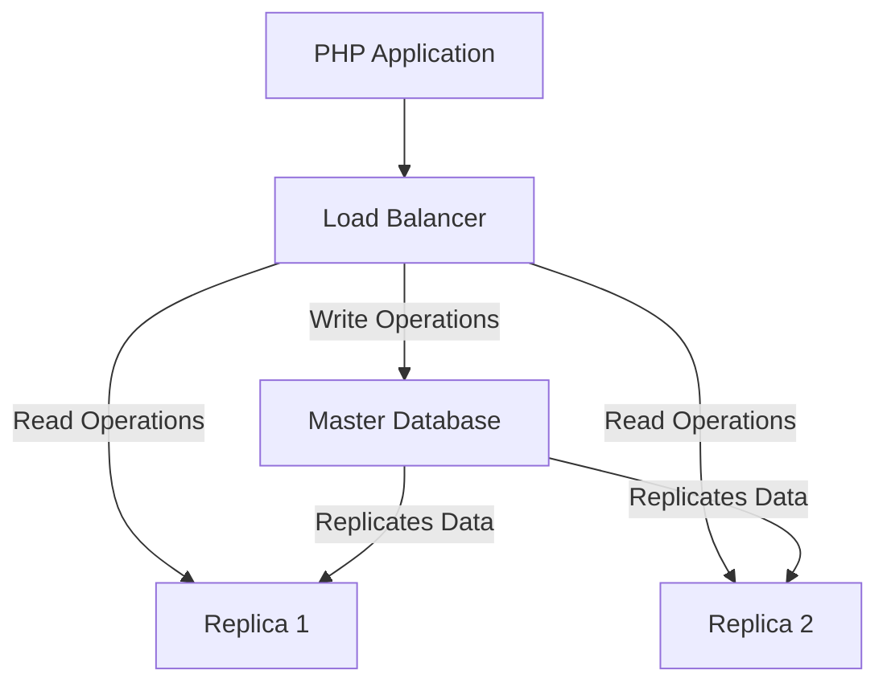
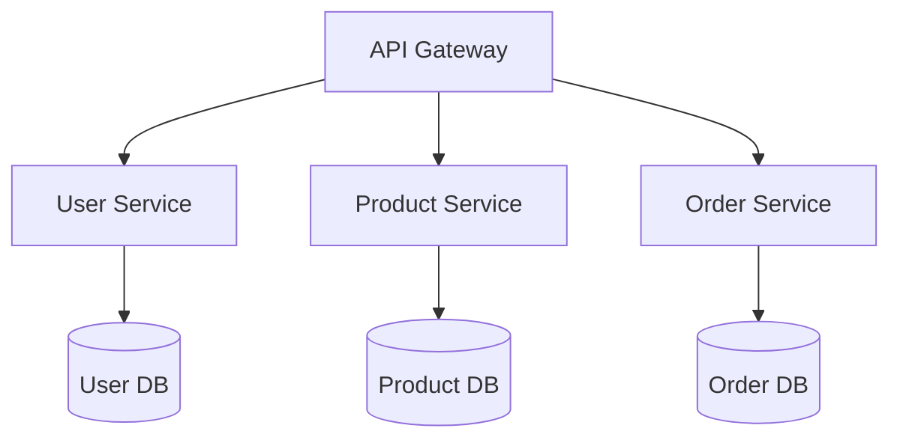

# PHP Scaling Strategies

## Introduction

As your PHP application grows in popularity, you'll face the challenge of handling increased traffic and data while maintaining good performance. Scaling is the process of designing your application to handle growth effectively. This guide introduces key scaling strategies for PHP applications, helping you prepare for success as your user base expands.

Scaling strategies fall into two main categories:
- **Vertical Scaling**: Adding more resources (CPU, RAM) to your existing server
- **Horizontal Scaling**: Adding more servers to distribute the load

Let's explore these approaches and other essential techniques to keep your PHP applications running smoothly under increasing demand.

## Understanding the Need for Scaling

Before diving into specific strategies, it's important to recognize when scaling becomes necessary:

1. **Increased response times**: Pages take longer to load
2. **Server timeouts**: Requests fail under heavy load
3. **Database bottlenecks**: Queries become slow
4. **Resource exhaustion**: CPU/memory usage consistently high

Let's visualize the typical scaling journey:



## Basic Scaling Strategies

### 1. Code Optimization

Before investing in additional infrastructure, optimize your existing code:

```php
// Inefficient code
$users = [];
$result = $mysqli->query("SELECT * FROM users");
while ($row = $result->fetch_assoc()) {
    $users[] = $row;
}

// Processing each user
foreach ($users as $user) {
    // Heavy processing
    echo "Processing user: " . $user['name'] . "<br>";
}
```

```php
// Optimized code
$result = $mysqli->query("SELECT id, name FROM users");
while ($row = $result->fetch_assoc()) {
    // Process directly without storing all users
    echo "Processing user: " . $row['name'] . "<br>";
}
```

**What improved:**
- Only selecting needed columns (id, name) instead of all columns
- Processing users one at a time without storing them all in memory
- Reduced memory usage and processing time

### 2. Caching Implementations

Caching stores frequently accessed data in fast storage to reduce processing time.

#### PHP's OPcache

OPcache improves performance by storing precompiled script bytecode in memory:

```php
// Check if OPcache is enabled
<?php
if (function_exists('opcache_get_status')) {
    $status = opcache_get_status();
    echo "OPcache is enabled and using " . 
         round($status['memory_usage']['used_memory'] / 1024 / 1024, 2) . 
         " MB of memory";
} else {
    echo "OPcache is not enabled";
}
```

#### Data Caching with APCu

```php
<?php
// Using APCu for caching expensive operations
function get_user_data($user_id) {
    $cache_key = "user_data_$user_id";
    
    // Try to fetch from cache first
    $data = apcu_fetch($cache_key, $success);
    
    if ($success) {
        echo "Cache hit! Using cached data.<br>";
        return $data;
    }
    
    // Cache miss - get from database
    echo "Cache miss! Fetching from database.<br>";
    $data = fetch_user_from_database($user_id); // Expensive operation
    
    // Store in cache for future requests (cache for 1 hour)
    apcu_store($cache_key, $data, 3600);
    
    return $data;
}

// Example usage
$user = get_user_data(123);
echo "User name: " . $user['name'];
```

**Output on first request:**
```
Cache miss! Fetching from database.
User name: John Doe
```

**Output on subsequent requests:**
```
Cache hit! Using cached data.
User name: John Doe
```

### 3. Database Optimization

Database operations are often the biggest bottleneck in PHP applications.

#### Implement Indexes

```sql
-- Before: Slow query without index
SELECT * FROM products WHERE category = 'electronics';

-- Add index to improve performance
CREATE INDEX idx_category ON products(category);

-- After: Same query runs much faster
SELECT * FROM products WHERE category = 'electronics';
```

#### Query Optimization

```php
<?php
// Inefficient query
$result = $mysqli->query("
    SELECT p.*, c.name as category_name
    FROM products p
    JOIN categories c ON p.category_id = c.id
    WHERE p.price > 100
");

// Optimized query
$result = $mysqli->query("
    SELECT p.id, p.name, p.price, c.name as category_name
    FROM products p
    JOIN categories c ON p.category_id = c.id
    WHERE p.price > 100
    LIMIT 100
");
```

## Intermediate Scaling Strategies

### 1. Load Balancing

Load balancing distributes traffic across multiple servers, improving availability and capacity.



A simple example of configuring Nginx as a load balancer:

```nginx
http {
    upstream php_servers {
        server php_server1:80;
        server php_server2:80;
        server php_server3:80;
    }

    server {
        listen 80;
        location / {
            proxy_pass http://php_servers;
            proxy_set_header Host $host;
            proxy_set_header X-Real-IP $remote_addr;
        }
    }
}
```

### 2. Implementing Content Delivery Networks (CDNs)

CDNs distribute static content across multiple geographic locations, reducing load times for users worldwide.

```php
<?php
// Before: Serving assets from your server
echo '';
echo '<link rel="stylesheet" href="/css/style.css">';

// After: Using a CDN
echo '';
echo '<link rel="stylesheet" href="https://cdn.example.com/css/style.css">';
```

### 3. Session Management in Distributed Environments

When scaling horizontally, session management becomes complex. You need a centralized storage for sessions.

```php
<?php
// Configure PHP to use Redis for session storage
ini_set('session.save_handler', 'redis');
ini_set('session.save_path', 'tcp://redis-server:6379');

// Start session
session_start();

// Use session as normal
$_SESSION['user_id'] = 123;
echo "User ID stored in session: " . $_SESSION['user_id'];
```

## Advanced Scaling Strategies

### 1. Database Sharding and Replication

#### Database Replication



Example implementation:

```php
<?php
// Configuration
$write_db = new mysqli('master-db.example.com', 'user', 'password', 'app_db');
$read_db = new mysqli('replica-db.example.com', 'user', 'password', 'app_db');

// Writing data (use master)
function save_user($name, $email) {
    global $write_db;
    $stmt = $write_db->prepare("INSERT INTO users (name, email) VALUES (?, ?)");
    $stmt->bind_param("ss", $name, $email);
    $stmt->execute();
    return $write_db->insert_id;
}

// Reading data (use replica)
function get_user($id) {
    global $read_db;
    $stmt = $read_db->prepare("SELECT * FROM users WHERE id = ?");
    $stmt->bind_param("i", $id);
    $stmt->execute();
    return $stmt->get_result()->fetch_assoc();
}

// Example usage
$user_id = save_user("Jane Doe", "jane@example.com");
echo "User saved with ID: $user_id<br>";

$user = get_user($user_id);
echo "User name: " . $user['name'];
```

### 2. Microservice Architecture

Breaking a monolithic application into microservices allows for more targeted scaling.



Example implementation of a microservice with API calls:

```php
<?php
// User Service (microservice)
class UserService {
    private $db;
    
    public function __construct() {
        $this->db = new mysqli('user-db.example.com', 'user', 'password', 'user_db');
    }
    
    public function getUser($id) {
        $stmt = $this->db->prepare("SELECT * FROM users WHERE id = ?");
        $stmt->bind_param("i", $id);
        $stmt->execute();
        return $stmt->get_result()->fetch_assoc();
    }
}

// API Gateway (main application)
function callUserService($user_id) {
    // In a real microservice architecture, this would be an HTTP request
    // to another service, but we're simplifying for this example
    $service = new UserService();
    return $service->getUser($user_id);
}

function callProductService($product_id) {
    // HTTP request to product service
    $ch = curl_init("http://product-service/products/$product_id");
    curl_setopt($ch, CURLOPT_RETURNTRANSFER, true);
    $response = curl_exec($ch);
    curl_close($ch);
    return json_decode($response, true);
}

// Example usage
$user = callUserService(123);
echo "User name: " . $user['name'] . "<br>";

$product = callProductService(456);
echo "Product name: " . $product['name'];
```

### 3. Queue Processing for Background Tasks

Offload heavy processing to background workers using a message queue:

```php
<?php
// Producer: Add task to queue (part of web application)
function enqueue_email_task($to, $subject, $body) {
    $redis = new Redis();
    $redis->connect('redis-server', 6379);
    
    $task = [
        'to' => $to,
        'subject' => $subject,
        'body' => $body,
        'created_at' => time()
    ];
    
    $redis->rPush('email_queue', json_encode($task));
    return true;
}

// Consumer: Process tasks (runs as a separate process/service)
function process_email_queue() {
    $redis = new Redis();
    $redis->connect('redis-server', 6379);
    
    while (true) {
        // Wait for a task (blocking pop)
        $task = $redis->bLPop('email_queue', 0);
        
        if ($task) {
            $email_data = json_decode($task[1], true);
            
            // Process the email
            echo "Sending email to: " . $email_data['to'] . "<br>";
            send_email($email_data['to'], $email_data['subject'], $email_data['body']);
            
            // Log completion
            echo "Email sent successfully<br>";
        }
    }
}

// Example usage in web application
$result = enqueue_email_task('user@example.com', 'Welcome!', 'Thank you for registering.');
echo $result ? "Email queued for delivery" : "Failed to queue email";
```

In this example:
1. The web application quickly adds the email task to a Redis queue
2. A separate worker process continuously monitors the queue and sends emails
3. The user gets immediate response while heavy processing happens in the background

## Monitoring and Performance Tuning

### 1. Setting Up Monitoring

Implement monitoring to identify bottlenecks and scaling needs:

```php
<?php
// Simple execution time monitoring
function log_performance($action, $start_time) {
    $end_time = microtime(true);
    $execution_time = ($end_time - $start_time) * 1000; // Convert to milliseconds
    
    // Log to file
    file_put_contents(
        'performance.log', 
        date('Y-m-d H:i:s') . " - $action: {$execution_time}ms
", 
        FILE_APPEND
    );
    
    return $execution_time;
}

// Example usage
$start = microtime(true);

// Perform database query
$result = $mysqli->query("SELECT * FROM products LIMIT 100");

// Log the performance
$query_time = log_performance('product_query', $start);
echo "Query executed in {$query_time}ms";
```

### 2. Automated Scaling

Modern cloud environments support auto-scaling based on metrics like CPU load or request volume:

```php
<?php
// Example of checking system load to inform scaling decisions
function should_scale_up() {
    $load = sys_getloadavg();
    $five_min_load = $load[1];
    
    // High load detected
    if ($five_min_load > 0.7) {
        // In a real system, this might trigger an API call to your cloud provider
        echo "High load detected ({$five_min_load}), scaling up recommended<br>";
        return true;
    }
    
    echo "Current load ({$five_min_load}) is acceptable<br>";
    return false;
}

// Check if scaling is needed
should_scale_up();
```

## Real-World Example: Scaling an E-commerce Site

Let's put everything together with a real-world example:

```php
<?php
// config.php - Configuration for different environments
$config = [
    'cache' => [
        'enabled' => true,
        'redis_host' => 'redis-cache',
        'redis_port' => 6379,
        'ttl' => 3600 // 1 hour
    ],
    'database' => [
        'write' => [
            'host' => 'master-db',
            'user' => 'app_user',
            'pass' => 'secret',
            'name' => 'ecommerce'
        ],
        'read' => [
            'host' => 'replica-db',
            'user' => 'app_read',
            'pass' => 'read_only',
            'name' => 'ecommerce'
        ]
    ],
    'queue' => [
        'host' => 'redis-queue',
        'port' => 6379
    ]
];

// Database.php - Connection manager
class Database {
    private static $write_conn;
    private static $read_conn;
    
    public static function getWriteConnection() {
        global $config;
        
        if (!self::$write_conn) {
            $db = $config['database']['write'];
            self::$write_conn = new mysqli($db['host'], $db['user'], $db['pass'], $db['name']);
        }
        
        return self::$write_conn;
    }
    
    public static function getReadConnection() {
        global $config;
        
        if (!self::$read_conn) {
            $db = $config['database']['read'];
            self::$read_conn = new mysqli($db['host'], $db['user'], $db['pass'], $db['name']);
        }
        
        return self::$read_conn;
    }
}

// Cache.php - Caching layer
class Cache {
    private static $instance;
    private $redis;
    private $enabled;
    private $ttl;
    
    private function __construct() {
        global $config;
        
        $this->enabled = $config['cache']['enabled'];
        $this->ttl = $config['cache']['ttl'];
        
        if ($this->enabled) {
            $this->redis = new Redis();
            $this->redis->connect(
                $config['cache']['redis_host'], 
                $config['cache']['redis_port']
            );
        }
    }
    
    public static function getInstance() {
        if (!self::$instance) {
            self::$instance = new Cache();
        }
        
        return self::$instance;
    }
    
    public function get($key) {
        if (!$this->enabled) return null;
        
        $value = $this->redis->get($key);
        return $value ? json_decode($value, true) : null;
    }
    
    public function set($key, $value, $ttl = null) {
        if (!$this->enabled) return false;
        
        $ttl = $ttl ?? $this->ttl;
        return $this->redis->setex($key, $ttl, json_encode($value));
    }
}

// ProductService.php - Business logic with caching
class ProductService {
    private $cache;
    
    public function __construct() {
        $this->cache = Cache::getInstance();
    }
    
    public function getProduct($id) {
        // Try cache first
        $cache_key = "product_$id";
        $product = $this->cache->get($cache_key);
        
        if ($product) {
            return $product;
        }
        
        // Cache miss, get from database
        $db = Database::getReadConnection();
        $stmt = $db->prepare("SELECT * FROM products WHERE id = ?");
        $stmt->bind_param("i", $id);
        $stmt->execute();
        $product = $stmt->get_result()->fetch_assoc();
        
        // Store in cache
        if ($product) {
            $this->cache->set($cache_key, $product);
        }
        
        return $product;
    }
    
    public function updateProduct($id, $data) {
        // Write to master database
        $db = Database::getWriteConnection();
        
        // Build update SQL
        $sql = "UPDATE products SET ";
        $parts = [];
        $types = "";
        $values = [];
        
        foreach ($data as $field => $value) {
            $parts[] = "$field = ?";
            $types .= is_int($value) ? "i" : "s";
            $values[] = $value;
        }
        
        $sql .= implode(", ", $parts);
        $sql .= " WHERE id = ?";
        $types .= "i";
        $values[] = $id;
        
        // Execute update
        $stmt = $db->prepare($sql);
        $stmt->bind_param($types, ...$values);
        $result = $stmt->execute();
        
        // Invalidate cache
        if ($result) {
            $this->cache->set("product_$id", null, 1);
        }
        
        return $result;
    }
    
    public function searchProducts($keyword, $limit = 20) {
        $cache_key = "search_" . md5($keyword . $limit);
        $results = $this->cache->get($cache_key);
        
        if ($results) {
            return $results;
        }
        
        // Search database
        $db = Database::getReadConnection();
        $keyword = "%$keyword%";
        $stmt = $db->prepare("
            SELECT * FROM products 
            WHERE name LIKE ? OR description LIKE ? 
            LIMIT ?
        ");
        $stmt->bind_param("ssi", $keyword, $keyword, $limit);
        $stmt->execute();
        
        $results = $stmt->get_result()->fetch_all(MYSQLI_ASSOC);
        
        // Cache for a shorter time (10 minutes)
        $this->cache->set($cache_key, $results, 600);
        
        return $results;
    }
}

// QueueManager.php - Background task handling
class QueueManager {
    private $redis;
    
    public function __construct() {
        global $config;
        
        $this->redis = new Redis();
        $this->redis->connect($config['queue']['host'], $config['queue']['port']);
    }
    
    public function addTask($queue, $data) {
        return $this->redis->rPush($queue, json_encode($data));
    }
    
    public function processQueue($queue, $callback) {
        while (true) {
            $task = $this->redis->bLPop($queue, 5);
            
            if ($task) {
                $data = json_decode($task[1], true);
                $callback($data);
            }
        }
    }
}

// Usage examples

// Example 1: Get product with caching
$productService = new ProductService();
$product = $productService->getProduct(123);
echo "Product: " . $product['name'] . "<br>";

// Example 2: Update product
$updateData = [
    'price' => 29.99,
    'stock' => 100
];
$productService->updateProduct(123, $updateData);
echo "Product updated<br>";

// Example 3: Queue an order processing task
$queueManager = new QueueManager();
$orderData = [
    'order_id' => 456,
    'user_id' => 789,
    'items' => [
        ['product_id' => 123, 'quantity' => 2],
        ['product_id' => 124, 'quantity' => 1]
    ]
];
$queueManager->addTask('order_processing', $orderData);
echo "Order queued for processing<br>";

// Example 4: Worker process (run in separate process)
// This would typically be in a separate file executed by a worker
/*
$queueManager = new QueueManager();
$queueManager->processQueue('order_processing', function($data) {
    echo "Processing order {$data['order_id']}<br>";
    // Process order logic here
    sleep(2); // Simulate processing time
    echo "Order {$data['order_id']} processed successfully<br>";
});
*/
```

## Summary and Best Practices

We've covered a wide range of PHP scaling strategies, from basic optimizations to advanced architectural patterns:

1. **Optimize before scaling**: Make your code efficient first
2. **Implement caching**: Reduce database load and processing time
3. **Use load balancing**: Distribute traffic across multiple servers
4. **Implement database scaling**: Replication and sharding for database performance
5. **Decouple with queues**: Move heavy processing to background workers
6. **Consider microservices**: Break monoliths into smaller, scalable services
7. **Monitor everything**: Use metrics to inform scaling decisions

Remember that scaling is a journey, not a destination. Start with the simplest solutions that address your current bottlenecks, then gradually implement more complex strategies as your application grows.

## Additional Resources

- [PHP OPcache Documentation](https://www.php.net/manual/en/book.opcache.php)
- [Redis Documentation](https://redis.io/documentation)
- [MySQL Performance Tuning](https://dev.mysql.com/doc/refman/8.0/en/optimization.html)
- [Nginx Load Balancing Guide](https://docs.nginx.com/nginx/admin-guide/load-balancer/http-load-balancer/)
- [Laravel Horizon](https://laravel.com/docs/horizon) - Queue monitoring for Laravel applications
- [Kubernetes PHP Deployment Guide](https://kubernetes.io/docs/tutorials/)

## Exercises

1. **Basic Caching**: Implement APCu caching for a database-heavy PHP script and measure the performance improvement.

2. **Load Testing**: Use a tool like Apache Bench (ab) to test your PHP application's performance under load:
   ```bash
   ab -n 1000 -c 100 http://yourapp.com/
   ```

3. **Queue Implementation**: Create a simple job queue using Redis to process image uploads in the background.

4. **Database Optimization**: Take a slow-running query from your application and optimize it using EXPLAIN and adding appropriate indexes.

5. **Scaling Plan**: For an existing application, create a scaling roadmap that outlines which strategies you would implement and in what order as the application grows.