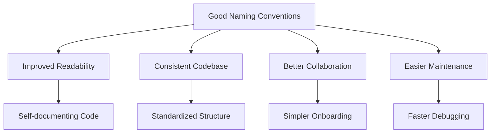

# PHP Naming Conventions

## Introduction

Naming conventions are standardized guidelines for naming different elements in your code. In PHP, following consistent naming conventions is crucial for writing clean, maintainable, and readable code. Good naming conventions make your code more professional, easier to debug, and simpler for other developers to understand.

This guide will walk you through the standard PHP naming conventions for variables, functions, classes, constants, and more, with practical examples to help you implement these practices in your own projects.

## Why Naming Conventions Matter

Before diving into specific conventions, let's understand why they're important:

1. **Readability**: Well-named elements make code self-documenting
2. **Consistency**: Following standards helps maintain a uniform codebase
3. **Collaboration**: Makes it easier for teams to work together
4. **Maintainability**: Simplifies debugging and future modifications



## Variable Naming Conventions

Variables in PHP should be named to clearly indicate their purpose and content.

### Rules for Variable Names

1. Always start with a dollar sign (`$`)
2. Followed by a letter or underscore
3. Can contain letters, numbers, and underscores
4. Cannot contain spaces or special characters
5. Should use camelCase (first word lowercase, subsequent words capitalized)
6. Should be descriptive and clear

### Examples

```php
// Good variable names
$firstName = "John";
$userAge = 25;
$isActive = true;
$totalItems = 100;

// Poor variable names - avoid these
$fn = "John";      // Too short, not descriptive
$u_age = 25;       // Inconsistent style
$TotalItems = 100; // Should start with lowercase
$x = true;         // Meaningless
```

### Arrays and Collections

For arrays and collections, use plural nouns to indicate they contain multiple items:

```php
// Good array names
$userNames = ["John", "Jane", "Bob"];
$productPrices = [9.99, 19.99, 29.99];
$activeUsers = [$user1, $user2, $user3];

// Output example
echo "We have " . count($userNames) . " users: " . implode(", ", $userNames);
// Output: We have 3 users: John, Jane, Bob
```

## Function Naming Conventions

Functions should be named to clearly indicate their purpose or action.

### Rules for Function Names

1. Start with a letter or underscore
2. Use camelCase (first word lowercase, subsequent words capitalized)
3. Use verbs as prefixes (get, set, is, has, can, etc.)
4. Make names descriptive of the function's purpose

### Examples

```php
// Good function names
function getUserData($userId) {
    // Code to retrieve user data
    return $userData;
}

function calculateTotalPrice($items) {
    $total = 0;
    foreach ($items as $item) {
        $total += $item->price;
    }
    return $total;
}

function isValidEmail($email) {
    return filter_var($email, FILTER_VALIDATE_EMAIL) !== false;
}

// Example usage
$email = "user@example.com";
if (isValidEmail($email)) {
    echo "Email is valid";
} else {
    echo "Email is invalid";
}
// Output if $email is "user@example.com": Email is valid
```

## Class Naming Conventions

Classes in PHP should follow these conventions:

### Rules for Class Names

1. Use PascalCase (each word capitalized, including the first)
2. Use nouns or noun phrases
3. Choose descriptive, specific names
4. Avoid abbreviations

### Examples

```php
// Good class names
class User {
    // User properties and methods
}

class ShoppingCart {
    // ShoppingCart properties and methods
}

class DatabaseConnection {
    // DatabaseConnection properties and methods
}

// Poor class names - avoid these
class Usr {}        // Too abbreviated
class user_data {}  // Wrong case, uses underscores
class DoStuff {}    // Too vague
```

### Interface Naming

Interfaces should follow the same rules as classes but often include an adjective or end with "Interface" or "able":

```php
interface Serializable {
    public function serialize();
    public function unserialize($data);
}

interface UserInterface {
    public function getProfile();
    public function updateProfile($data);
}
```

## Method Naming Conventions

Methods within classes follow the same conventions as functions:

```php
class User {
    private $firstName;
    private $lastName;
    
    public function getFullName() {
        return $this->firstName . ' ' . $this->lastName;
    }
    
    public function setFirstName($name) {
        $this->firstName = $name;
    }
    
    public function isActive() {
        // Check if user is active
        return true;
    }
}

// Example usage
$user = new User();
$user->setFirstName("John");
echo $user->getFullName();
```

## Constant Naming Conventions

Constants should be easily distinguishable from variables and other elements.

### Rules for Constants

1. Use all uppercase letters
2. Separate words with underscores (snake_case)
3. Should express fixed values that won't change

### Examples

```php
// Global constants
define('MAX_LOGIN_ATTEMPTS', 5);
define('API_KEY', 'abc123xyz789');

// Class constants
class PaymentStatus {
    const PENDING = 'pending';
    const COMPLETED = 'completed';
    const FAILED = 'failed';
}

// Example usage
echo "Maximum login attempts: " . MAX_LOGIN_ATTEMPTS;
// Output: Maximum login attempts: 5

if ($payment->status === PaymentStatus::COMPLETED) {
    echo "Payment has been processed successfully";
}
```

## Namespace Naming Conventions

Namespaces help organize and encapsulate code, preventing naming conflicts.

### Rules for Namespaces

1. Use PascalCase (each word capitalized)
2. Typically reflect directory structure
3. Vendor or company name often comes first

### Examples

```php
// Namespace declaration
namespace MyCompany\UserManagement;

class UserController {
    // Code here
}

// Using the namespaced class elsewhere
$controller = new \MyCompany\UserManagement\UserController();

// Or with a use statement
use MyCompany\UserManagement\UserController;
$controller = new UserController();
```

## File Naming Conventions

File names should correspond to the classes they contain and follow a consistent pattern.

### Rules for File Names

1. One class per file (typically)
2. File name should match the class name
3. Use PascalCase for class files
4. Use lowercase and hyphens for non-class files

### Examples

```
UserController.php     // Contains UserController class
database-config.php    // General config file, not class-based
autoload.php           // Utility file
Logger.php             // Contains Logger class
```

## Real-World Example: User Registration System

Let's put these conventions together in a real-world example of a simple user registration system:

```php
<?php
// File: UserRegistration.php
namespace App\Users;

// Constants
define('MIN_PASSWORD_LENGTH', 8);

class UserRegistration {
    private $databaseConnection;
    private $validationRules;
    
    public function __construct($dbConnection) {
        $this->databaseConnection = $dbConnection;
        $this->validationRules = [
            'email' => ['required', 'email'],
            'password' => ['required', 'min:' . MIN_PASSWORD_LENGTH]
        ];
    }
    
    public function registerUser($userData) {
        if (!$this->isValidData($userData)) {
            return false;
        }
        
        $hashedPassword = $this->hashPassword($userData['password']);
        $newUser = [
            'email' => $userData['email'],
            'password' => $hashedPassword,
            'created_at' => date('Y-m-d H:i:s')
        ];
        
        return $this->saveUserToDatabase($newUser);
    }
    
    private function isValidData($userData) {
        // Validation logic here
        return $this->validateEmail($userData['email']) && 
               $this->validatePassword($userData['password']);
    }
    
    private function validateEmail($email) {
        return filter_var($email, FILTER_VALIDATE_EMAIL) !== false;
    }
    
    private function validatePassword($password) {
        return strlen($password) >= MIN_PASSWORD_LENGTH;
    }
    
    private function hashPassword($password) {
        return password_hash($password, PASSWORD_DEFAULT);
    }
    
    private function saveUserToDatabase($user) {
        // Database logic to save user
        return $this->databaseConnection->insert('users', $user);
    }
}

// Example usage:
$dbConnection = new \App\Database\MySQLConnection();
$registration = new UserRegistration($dbConnection);

$userData = [
    'email' => 'john@example.com',
    'password' => 'securepassword123'
];

if ($registration->registerUser($userData)) {
    echo "User successfully registered!";
} else {
    echo "Registration failed.";
}
```

In this example, you can see:
- PascalCase for class name (`UserRegistration`)
- camelCase for method names (`registerUser`, `validateEmail`)
- camelCase for variables (`$userData`, `$hashedPassword`)
- UPPER_CASE for constants (`MIN_PASSWORD_LENGTH`)
- Descriptive names that clearly indicate purpose
- Proper namespacing (`App\Users`)

## Common Naming Patterns in PHP

Beyond basic conventions, there are common naming patterns you'll encounter:

### Prefixes and Suffixes

- **Interface suffix**: `Interface` (e.g., `UserInterface`)
- **Abstract class prefix**: `Abstract` (e.g., `AbstractController`)
- **Trait suffix**: `Trait` (e.g., `LoggableTrait`)
- **Controller suffix**: `Controller` (e.g., `UserController`)
- **Model without suffix**: Usually just the entity name (e.g., `User`, `Product`)

### Boolean Variable Naming

Boolean variables typically use prefixes that make their boolean nature clear:

```php
$isActive = true;
$hasPermission = false;
$canEdit = checkPermissions();
$shouldRedirect = $statusCode >= 300 && $statusCode < 400;
```

## PSR Standards

The PHP community has formalized many naming conventions through the PHP Standards Recommendations (PSR). These are particularly important for package development and open-source contributions.

Key PSRs related to naming conventions include:
- **PSR-1**: Basic Coding Standard
- **PSR-12**: Extended Coding Style (replaces PSR-2)

Following these standards ensures your code will be consistent with the broader PHP ecosystem.

## Summary

Following naming conventions in PHP is essential for writing clean, maintainable code. Key points to remember:

- Variables: Use camelCase, be descriptive, start with `$`
- Functions/Methods: Use camelCase, start with verbs
- Classes: Use PascalCase, use nouns
- Constants: Use UPPER_SNAKE_CASE
- Files: Name should match the class they contain
- Be consistent throughout your codebase

By adhering to these conventions, you'll write more professional code that's easier to read, debug, and maintain—both for yourself and for other developers who work with your code.

## Additional Resources

- [PHP-FIG PSR Standards](https://www.php-fig.org/psr/)
- [PHP The Right Way](https://phptherightway.com/)
- [Clean Code in PHP](https://github.com/jupeter/clean-code-php)

## Exercises

1. Refactor the following variable names to follow proper PHP naming conventions:
   ```php
   $user_name = "John";
   $AGE = 25;
   $isactive = true;
   ```

2. Create a class called `ProductInventory` with methods to add, remove, and check product availability.

3. Write a function to validate a username following PHP naming conventions. The function should check if the username is between 3-15 characters and only contains letters, numbers, and underscores.

4. Review an existing PHP project (or create a small one) and ensure all naming follows the conventions discussed in this guide.