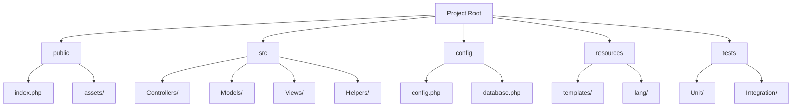

# PHP Code Organization

Proper code organization is essential for creating maintainable, scalable, and collaborative PHP projects. In this guide, we'll explore how to structure your PHP code effectively to improve readability, reduce bugs, and make your codebase easier to understand for yourself and other developers.

## Introduction

When you're just starting with PHP, it might be tempting to put all your code in a single file or organize it randomly. However, as your projects grow in complexity, poor organization can lead to:

- Difficulty finding specific code
- Challenges when debugging
- Problems when collaborating with others
- Code duplication
- Maintenance nightmares

By implementing good code organization practices from the beginning, you'll build better habits and create more professional applications.

## Directory Structure

A well-organized PHP project typically follows a logical directory structure. Here's a common structure for a small to medium-sized PHP application:



### Explanation:

- **public/**: Contains publicly accessible files like the main index.php and assets (CSS, JavaScript, images)
- **src/**: Contains your PHP source code organized by functionality
- **config/**: Configuration files for your application
- **resources/**: Templates, language files, and other resources
- **tests/**: Test files for your application

## Separation of Concerns

One of the most important principles in code organization is the separation of concerns. This means dividing your code into distinct sections, each responsible for a specific aspect of your application.

### Example: Simple PHP Application

Let's look at a poorly organized PHP script:

```php
<?php
// connect.php - Bad organization example

// Database connection
$host = "localhost";
$username = "root";
$password = "password";
$database = "my_database";
$conn = mysqli_connect($host, $username, $password, $database);

// Get user data
$query = "SELECT * FROM users WHERE id = 1";
$result = mysqli_query($conn, $query);
$user = mysqli_fetch_assoc($result);

// Display user profile
echo "<h1>User Profile</h1>";
echo "<p>Name: " . $user['name'] . "</p>";
echo "<p>Email: " . $user['email'] . "</p>";

// Update user's last login
$update_query = "UPDATE users SET last_login = NOW() WHERE id = 1";
mysqli_query($conn, $update_query);
?>
```

This code mixes database connection, data retrieval, presentation, and business logic in a single file. Let's reorganize it using separation of concerns:

```php
<?php
// config/database.php - Configuration
return [
    'host' => 'localhost',
    'username' => 'root',
    'password' => 'password',
    'database' => 'my_database'
];
```

```php
<?php
// src/Database/Connection.php - Database connection
namespace App\Database;

class Connection {
    private static $instance = null;
    
    public static function getInstance() {
        if (self::$instance === null) {
            $config = require_once __DIR__ . '/../../config/database.php';
            self::$instance = mysqli_connect(
                $config['host'],
                $config['username'],
                $config['password'],
                $config['database']
            );
        }
        return self::$instance;
    }
}
```

```php
<?php
// src/Models/User.php - Data model
namespace App\Models;

use App\Database\Connection;

class User {
    public static function find($id) {
        $conn = Connection::getInstance();
        $query = "SELECT * FROM users WHERE id = " . (int)$id;
        $result = mysqli_query($conn, $query);
        return mysqli_fetch_assoc($result);
    }
    
    public static function updateLastLogin($id) {
        $conn = Connection::getInstance();
        $update_query = "UPDATE users SET last_login = NOW() WHERE id = " . (int)$id;
        return mysqli_query($conn, $update_query);
    }
}
```

```php
<?php
// public/index.php - Main application file
require_once __DIR__ . '/../vendor/autoload.php';

use App\Models\User;

// Get user data
$user = User::find(1);

// Update last login
User::updateLastLogin(1);

// Include view to display data
include __DIR__ . '/../resources/views/user_profile.php';
```

```php
<!-- resources/views/user_profile.php - View template -->
<h1>User Profile</h1>
<p>Name: <?php echo htmlspecialchars($user['name']); ?></p>
<p>Email: <?php echo htmlspecialchars($user['email']); ?></p>
```

### Benefits of this organization:

1. **Modularity**: Each file has a single responsibility
2. **Reusability**: The User model can be reused throughout the application
3. **Maintainability**: Changes to database configuration only need to be made in one place
4. **Security**: Input is properly sanitized using type casting and output is escaped with htmlspecialchars()

## Using Namespaces

PHP namespaces help prevent naming conflicts and organize your code logically. Namespaces typically match your directory structure.

```php
<?php
// src/Services/EmailService.php
namespace App\Services;

class EmailService {
    public function sendWelcomeEmail($user) {
        // Code to send welcome email
    }
    
    public function sendPasswordReset($user) {
        // Code to send password reset email
    }
}
```

To use this class in another file:

```php
<?php
// src/Controllers/UserController.php
namespace App\Controllers;

use App\Services\EmailService;
use App\Models\User;

class UserController {
    public function register() {
        // Register the user
        $user = User::create($_POST);
        
        // Send welcome email
        $emailService = new EmailService();
        $emailService->sendWelcomeEmail($user);
        
        // Redirect to success page
        header('Location: /registration-success');
    }
}
```

## Autoloading

Instead of manually requiring files, you can use PHP's autoloading feature (or preferably Composer's autoloader) to automatically load classes when they're needed.

Here's a simple composer.json file that sets up autoloading:

```json
{
    "name": "your-name/your-project",
    "description": "Your project description",
    "autoload": {
        "psr-4": {
            "App\\": "src/"
        }
    },
    "require": {
        "php": ">=7.4"
    }
}
```

With this configuration and Composer installed, you can run `composer dump-autoload` to generate the autoloader files. Then, simply require the autoloader in your entry script:

```php
<?php
// public/index.php
require_once __DIR__ . '/../vendor/autoload.php';

// Now you can use classes without requiring them manually
$userController = new App\Controllers\UserController();
$userController->register();
```

## Practical Project Example

Let's create a simplified blog system to demonstrate these principles in action:

### Directory Structure

```
my-blog/
├── config/
│   ├── database.php
│   └── app.php
├── public/
│   ├── index.php
│   └── assets/
│       ├── css/
│       └── js/
├── resources/
│   └── views/
│       ├── layout.php
│       ├── posts/
│       │   ├── index.php
│       │   └── show.php
│       └── comments/
│           └── form.php
├── src/
│   ├── Controllers/
│   │   ├── PostController.php
│   │   └── CommentController.php
│   ├── Models/
│   │   ├── Post.php
│   │   └── Comment.php
│   └── Database/
│       └── Connection.php
├── composer.json
└── vendor/ (generated by Composer)
```

### Implementation

Let's create a few of these files to see how they work together:

```php
<?php
// src/Models/Post.php
namespace App\Models;

use App\Database\Connection;

class Post {
    public static function all() {
        $conn = Connection::getInstance();
        $query = "SELECT * FROM posts ORDER BY created_at DESC";
        $result = mysqli_query($conn, $query);
        
        $posts = [];
        while ($row = mysqli_fetch_assoc($result)) {
            $posts[] = $row;
        }
        
        return $posts;
    }
    
    public static function find($id) {
        $conn = Connection::getInstance();
        $query = "SELECT * FROM posts WHERE id = " . (int)$id;
        $result = mysqli_query($conn, $query);
        return mysqli_fetch_assoc($result);
    }
    
    public static function create($data) {
        $conn = Connection::getInstance();
        $title = mysqli_real_escape_string($conn, $data['title']);
        $content = mysqli_real_escape_string($conn, $data['content']);
        
        $query = "INSERT INTO posts (title, content, created_at) VALUES ('$title', '$content', NOW())";
        mysqli_query($conn, $query);
        
        return mysqli_insert_id($conn);
    }
}
```

```php
<?php
// src/Controllers/PostController.php
namespace App\Controllers;

use App\Models\Post;

class PostController {
    public function index() {
        $posts = Post::all();
        include __DIR__ . '/../../resources/views/posts/index.php';
    }
    
    public function show($id) {
        $post = Post::find($id);
        include __DIR__ . '/../../resources/views/posts/show.php';
    }
    
    public function create() {
        // Display the create post form
        include __DIR__ . '/../../resources/views/posts/create.php';
    }
    
    public function store() {
        // Validate the input
        if (empty($_POST['title']) || empty($_POST['content'])) {
            $_SESSION['error'] = 'Title and content are required.';
            header('Location: /posts/create');
            return;
        }
        
        // Create the post
        $postId = Post::create($_POST);
        
        // Redirect to the new post
        header('Location: /posts/' . $postId);
    }
}
```

```php
<?php
// public/index.php
require_once __DIR__ . '/../vendor/autoload.php';

// Simple router
$uri = parse_url($_SERVER['REQUEST_URI'], PHP_URL_PATH);

// Routes
if ($uri === '/' || $uri === '/posts') {
    $controller = new App\Controllers\PostController();
    $controller->index();
} elseif (preg_match('/^\/posts\/(\d+)$/', $uri, $matches)) {
    $controller = new App\Controllers\PostController();
    $controller->show($matches[1]);
} elseif ($uri === '/posts/create') {
    $controller = new App\Controllers\PostController();
    $controller->create();
} elseif ($uri === '/posts/store' && $_SERVER['REQUEST_METHOD'] === 'POST') {
    $controller = new App\Controllers\PostController();
    $controller->store();
} else {
    // 404 Not Found
    header('HTTP/1.1 404 Not Found');
    echo '404 - Page not found';
}
```

```html
<!-- resources/views/posts/index.php -->
<!DOCTYPE html>
<html>
<head>
    <title>My Blog</title>
    <link rel="stylesheet" href="/assets/css/style.css">
</head>
<body>
    <div class="container">
        <h1>My Blog</h1>
        
        <a href="/posts/create" class="btn">Create New Post</a>
        
        <div class="posts">
            <?php foreach ($posts as $post): ?>
                <div class="post">
                    <h2><a href="/posts/<?php echo $post['id']; ?>"><?php echo htmlspecialchars($post['title']); ?></a></h2>
                    <div class="date"><?php echo date('F j, Y', strtotime($post['created_at'])); ?></div>
                    <div class="excerpt"><?php echo htmlspecialchars(substr($post['content'], 0, 200)); ?>...</div>
                </div>
            <?php endforeach; ?>
        </div>
    </div>
</body>
</html>
```

## Code Organization Principles

To summarize, here are the key principles for PHP code organization:

1. **Separation of Concerns**: Divide your code based on functionality
2. **Directory Structure**: Create a logical structure for your files
3. **Namespaces**: Use namespaces to organize classes and prevent conflicts
4. **Autoloading**: Implement autoloading to automatically include files
5. **Single Responsibility**: Each class should have a single responsibility
6. **DRY (Don't Repeat Yourself)**: Avoid code duplication
7. **Consistent Naming**: Use consistent naming conventions for files and classes

## Using Design Patterns

Design patterns are proven solutions to common problems in software design. They can help you organize your code more effectively. Here are a few common patterns used in PHP:

### MVC (Model-View-Controller)

We've already implemented a simple version of MVC in our blog example:

- **Models**: Handle data logic (Post.php, Comment.php)
- **Views**: Display information to the user (resources/views/)
- **Controllers**: Process user input and coordinate between models and views (PostController.php)

### Repository Pattern

The repository pattern separates the logic that retrieves data from the database:

```php
<?php
// src/Repositories/PostRepository.php
namespace App\Repositories;

use App\Database\Connection;

class PostRepository {
    protected $conn;
    
    public function __construct() {
        $this->conn = Connection::getInstance();
    }
    
    public function all() {
        $query = "SELECT * FROM posts ORDER BY created_at DESC";
        $result = mysqli_query($this->conn, $query);
        
        $posts = [];
        while ($row = mysqli_fetch_assoc($result)) {
            $posts[] = $row;
        }
        
        return $posts;
    }
    
    public function find($id) {
        $query = "SELECT * FROM posts WHERE id = " . (int)$id;
        $result = mysqli_query($this->conn, $query);
        return mysqli_fetch_assoc($result);
    }
    
    // More methods...
}
```

Then the model would use the repository:

```php
<?php
// src/Models/Post.php
namespace App\Models;

use App\Repositories\PostRepository;

class Post {
    protected $repository;
    
    public function __construct() {
        $this->repository = new PostRepository();
    }
    
    public static function all() {
        $instance = new self();
        return $instance->repository->all();
    }
    
    public static function find($id) {
        $instance = new self();
        return $instance->repository->find($id);
    }
    
    // More methods...
}
```

## Using Composer Packages

Don't reinvent the wheel. Use Composer to install and manage third-party packages:

```json
{
    "require": {
        "monolog/monolog": "^2.0",
        "twig/twig": "^3.0",
        "phpmailer/phpmailer": "^6.5"
    }
}
```

After running `composer install`, you can use these packages in your code:

```php
<?php
// Using a logging package
use Monolog\Logger;
use Monolog\Handler\StreamHandler;

$log = new Logger('name');
$log->pushHandler(new StreamHandler('logs/app.log', Logger::WARNING));

// Add records to the log
$log->warning('This is a warning');
$log->error('This is an error');
```

## Summary

Proper code organization is crucial for building maintainable and scalable PHP applications. By following these best practices:

1. Implement a logical directory structure
2. Separate your code by concern
3. Use namespaces to avoid conflicts
4. Implement autoloading
5. Follow the single responsibility principle
6. Apply design patterns where appropriate
7. Use third-party packages for common functionality

Your code will be easier to maintain, debug, and extend, and collaboration with other developers will be smoother.

## Additional Resources

1. [PHP-FIG (PHP Framework Interop Group)](https://www.php-fig.org/) - Standards for PHP code
2. [PSR-4: Autoloader](https://www.php-fig.org/psr/psr-4/) - Standard for autoloading classes
3. [Composer Documentation](https://getcomposer.org/doc/) - Package management for PHP
4. [PHP The Right Way](https://phptherightway.com/) - Best practices for modern PHP

## Exercises

1. Take an existing single-file PHP script and refactor it using separation of concerns.
2. Create a simple CRUD application for a "product" entity using the MVC pattern.
3. Implement the repository pattern for your data layer.
4. Set up Composer in a project and use a third-party package like Monolog for logging.
5. Create a PHP class autoloader without using Composer.