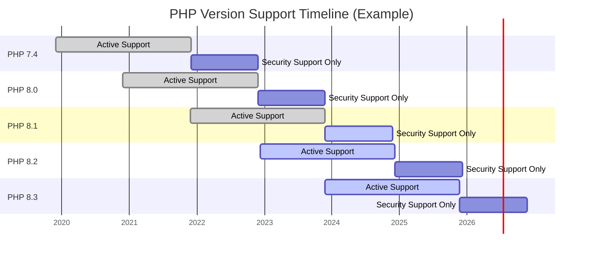

# PHP Version Compatibility

## Introduction

When developing PHP applications, one critical consideration that can save you countless hours of debugging and frustration is **PHP version compatibility**. Different PHP versions introduce new features, deprecate old ones, and sometimes change how existing functions work. Understanding these differences is essential for writing robust code that works reliably across various environments.

In this guide, we'll explore why PHP version compatibility matters, how to check for it, and best practices to ensure your code runs smoothly across different PHP versions. Whether you're maintaining legacy applications or starting a new project, these principles will help you write more portable and future-proof PHP code.

## Why PHP Version Compatibility Matters

### The PHP Release Cycle

PHP has a regular release cycle with several versions being actively maintained simultaneously:



Each PHP version typically receives:
- **Active support** for 2 years after release
- **Security support** for an additional 1 year

This means at any given time, you might encounter hosting environments running different PHP versions.

### Common Compatibility Challenges

1. **New features aren't available in older versions**
2. **Deprecated functions may be removed**
3. **Function behaviors can change between versions**
4. **Error handling and reporting differences**
5. **Extension availability and compatibility**

## Checking PHP Version Compatibility

### Determining PHP Version

To check which PHP version you're running, use the `phpversion()` function or the `PHP_VERSION` constant:

```php
<?php
// Method 1
echo "Current PHP version: " . phpversion();

// Method 2
echo "Current PHP version: " . PHP_VERSION;
?>
```

**Output:**
```
Current PHP version: 8.2.10
```

### Version Comparison

You can compare PHP versions in your code to conditionally execute version-specific code:

```php
<?php
// Check if PHP version is at least 8.0
if (version_compare(PHP_VERSION, '8.0.0', '>=')) {
    echo "You're running PHP 8.0 or higher";
} else {
    echo "You're running an older PHP version";
}
?>
```

### PHP Version Constants

PHP provides predefined constants for version checking:

```php
<?php
// Check major version
if (PHP_MAJOR_VERSION >= 8) {
    echo "Using PHP 8 or higher
";
}

// Check minor version
if (PHP_MINOR_VERSION >= 1 && PHP_MAJOR_VERSION == 8) {
    echo "Using PHP 8.1 or higher
";
}
?>
```

## Best Practices for PHP Version Compatibility

### 1. Specify Requirements Clearly

Always document your project's PHP version requirements:

- In your `composer.json` file:
  ```json
  {
      "require": {
          "php": ">=7.4.0"
      }
  }
  ```

- In your project documentation:
  ```markdown
  ## Requirements
  - PHP 7.4 or higher
  - MySQL 5.7 or higher
  ```

### 2. Feature Detection Instead of Version Checking

Where possible, check if a function exists rather than checking the PHP version:

```php
<?php
// Not recommended
if (PHP_VERSION_ID >= 80000) {
    $result = str_contains($haystack, $needle);
} else {
    $result = strpos($haystack, $needle) !== false;
}

// Recommended
if (function_exists('str_contains')) {
    $result = str_contains($haystack, $needle);
} else {
    $result = strpos($haystack, $needle) !== false;
}
?>
```

### 3. Polyfills for New Functions

Implement polyfills for newer functions when targeting older PHP versions:

```php
<?php
// Polyfill for str_contains() introduced in PHP 8.0
if (!function_exists('str_contains')) {
    function str_contains($haystack, $needle) {
        return $needle !== '' && mb_strpos($haystack, $needle) !== false;
    }
}

// Now you can use str_contains() regardless of PHP version
$text = "Hello, world!";
$contains = str_contains($text, "world");  // true
?>
```

### 4. Use Compatibility Libraries

Leverage libraries like symfony/polyfill to handle compatibility issues:

```bash
# Install polyfill for PHP 8.0 features
composer require symfony/polyfill-php80
```

### 5. Testing Across Versions

Set up testing environments for different PHP versions:

```yaml
# Example GitHub Actions workflow testing multiple PHP versions
name: PHP Tests
on: [push, pull_request]
jobs:
  test:
    runs-on: ubuntu-latest
    strategy:
      matrix:
        php-versions: ['7.4', '8.0', '8.1', '8.2']
    steps:
      - uses: actions/checkout@v3
      - uses: shivammathur/setup-php@v2
        with:
          php-version: ${{ matrix.php-versions }}
      - run: composer install
      - run: vendor/bin/phpunit
```

### 6. Progressive Enhancement

Implement features progressively based on PHP version capabilities:

```php
<?php
function getArrayItem(array $array, string $key, $default = null) {
    // PHP 7.4+ can use null coalescing assignment
    if (PHP_VERSION_ID >= 70400) {
        $result ??= $array[$key] ?? $default;
    } else {
        $result = isset($array[$key]) ? $array[$key] : $default;
    }
    return $result;
}
?>
```

## Real-World Examples

### Example 1: Handling Constructor Property Promotion

Constructor property promotion was introduced in PHP 8.0. Here's how to write code that works across versions:

```php
<?php
// PHP 8.0+ way (using constructor property promotion)
class User_PHP8 {
    public function __construct(
        public string $name,
        public string $email,
        private int $age
    ) {}
}

// Compatible across PHP 7.4 and PHP 8+
class User {
    public string $name;
    public string $email;
    private int $age;

    public function __construct(string $name, string $email, int $age) {
        $this->name = $name;
        $this->email = $email;
        $this->age = $age;
    }
}
?>
```

### Example 2: Using Named Arguments

PHP 8.0 introduced named arguments. Here's a backward-compatible approach:

```php
<?php
function createUser($name, $email, $role = 'user', $active = true) {
    return [
        'name' => $name,
        'email' => $email,
        'role' => $role,
        'active' => $active
    ];
}

// PHP 8.0+ (using named arguments)
// $user = createUser(name: 'John', email: 'john@example.com', active: false);

// Compatible with all PHP versions
$user = createUser('John', 'john@example.com', 'user', false);
?>
```

### Example 3: Handling Union Types

PHP 8.0 introduced union types. Here's how to handle this feature across versions:

```php
<?php
// PHP 8.0+ with union types
// function process(string|int $input): string|int { ... }

// Compatible approach using PHPDoc
/**
 * @param string|int $input
 * @return string|int
 */
function process($input) {
    if (is_string($input)) {
        return strtoupper($input);
    } elseif (is_int($input)) {
        return $input * 2;
    } else {
        throw new InvalidArgumentException('Input must be string or integer');
    }
}

// Works in all PHP versions
echo process("hello");  // Outputs: HELLO
echo process(5);       // Outputs: 10
?>
```

## Common Compatibility Issues and Solutions

### Deprecated Functions

Many functions have been deprecated or removed in newer PHP versions:

```php
<?php
// PHP 7.4 and earlier
$parts = split(',', 'a,b,c'); // Deprecated in PHP 5.3, removed in PHP 7.0

// Compatible alternative
$parts = explode(',', 'a,b,c');
?>
```

### Changed Return Types

Some functions have changed their return types:

```php
<?php
// In PHP 7.x, json_decode() returns null for invalid JSON
// In PHP 8.x, it throws a JsonException
function parseJson($json) {
    try {
        // PHP 8+ approach with exception handling
        return json_decode($json, true, 512, JSON_THROW_ON_ERROR);
    } catch (Throwable $e) {
        // Handle error
        return null;
    }
}
?>
```

### Error Handling Changes

Error handling has evolved significantly across PHP versions:

```php
<?php
// Compatible error handling
function divideNumbers($a, $b) {
    if ($b == 0) {
        throw new InvalidArgumentException("Division by zero");
    }
    return $a / $b;
}

try {
    echo divideNumbers(10, 2);  // Works fine
    echo divideNumbers(10, 0);  // Throws exception
} catch (Exception $e) {
    echo "Error: " . $e->getMessage();
}
?>
```

## Tools for Managing PHP Compatibility

1. **PHP_CodeSniffer with PHPCompatibility**
   ```bash
   composer require --dev squizlabs/php_codesniffer phpcompatibility/php-compatibility
   ./vendor/bin/phpcs --standard=PHPCompatibility --runtime-set testVersion 7.4- path/to/your/code
   ```

2. **Rector for automated code upgrades**
   ```bash
   composer require --dev rector/rector
   ```

3. **Composer's platform config**
   ```json
   {
       "config": {
           "platform": {
               "php": "7.4.0"
           }
       }
   }
   ```

## Summary

PHP version compatibility is a crucial aspect of professional PHP development. By following these best practices, you can ensure your code works reliably across different PHP environments:

1. **Always document** your PHP version requirements
2. **Use feature detection** instead of version checking when possible
3. **Implement polyfills** for newer functions
4. **Test your code** across multiple PHP versions
5. **Use compatibility libraries** for complex compatibility needs
6. **Apply progressive enhancement** to leverage newer features when available

By maintaining compatibility, you make your code more portable, more maintainable, and accessible to a wider range of users and hosting environments.

## Additional Resources

- [PHP: Supported Versions](https://www.php.net/supported-versions.php) - Official information on PHP version support
- [PHP: Migration Guides](https://www.php.net/manual/en/appendices.php) - Official migration guides between PHP versions
- [PHPCompatibility](https://github.com/PHPCompatibility/PHPCompatibility) - PHP compatibility checking tool
- [Rector](https://github.com/rectorphp/rector) - Tool for automated PHP upgrades and refactoring
- [symfony/polyfill](https://github.com/symfony/polyfill) - Polyfills for newer PHP features

## Practice Exercises

1. Write a function that safely uses the `str_contains()` function with a fallback for PHP versions before 8.0.
2. Create a class that works in both PHP 7.4 and PHP 8.0+, utilizing type declarations where possible.
3. Set up a GitHub Actions workflow to test your code against PHP 7.4, 8.0, 8.1, and 8.2.
4. Use Composer to add compatibility libraries to your project and ensure it works across different PHP versions.
5. Audit an existing PHP project for compatibility issues using PHPCompatibility and fix the issues you find.