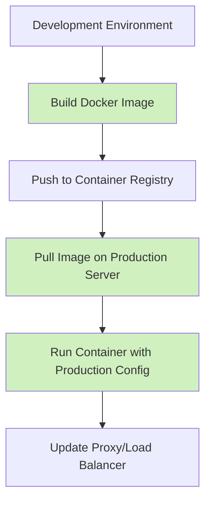
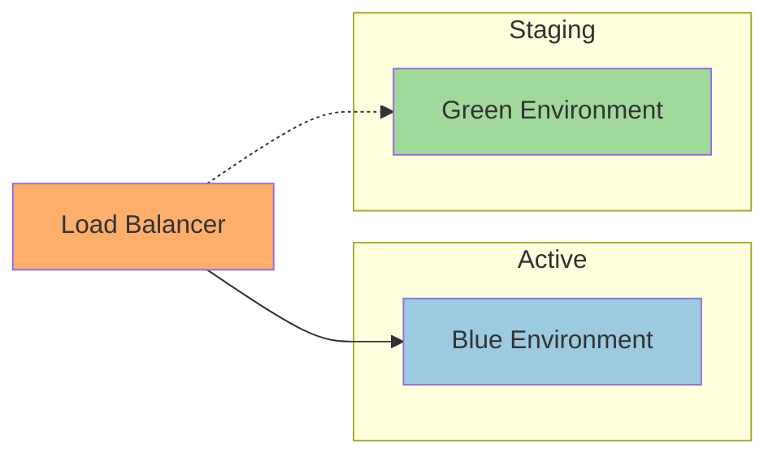

# PHP Deployment Strategies

## Introduction

Deploying PHP applications can range from simple file transfers to complex automated pipelines. The right deployment strategy ensures your application is reliably delivered to its hosting environment with minimal downtime and risk. This guide will walk you through various PHP deployment strategies, from basic approaches suitable for beginners to more advanced techniques used in professional environments.

## Understanding Deployment Basics

Before diving into specific strategies, let's understand what deployment involves:

1. **Preparing your code** for the production environment
2. **Transferring files** to your hosting server
3. **Configuring the environment** (web server, database, etc.)
4. **Running post-deployment tasks** (cache clearing, database migrations)
5. **Verifying the deployment** was successful

The goal is to make this process as smooth, reliable, and repeatable as possible.

## Basic Deployment Strategies

### Manual FTP Deployment

The simplest deployment method involves manually uploading files using FTP (File Transfer Protocol).

#### Example: Basic FTP Deployment

```php
// This isn't code you run, but a conceptual example of what files you'd transfer
// Typically you'd use an FTP client like FileZilla or built-in FTP in your IDE

// Files to transfer:
// - PHP files (*.php)
// - Asset files (CSS, JS, images)
// - Configuration files (with proper environment settings)
// - Vendor libraries (if not using Composer on the server)

// Remember to exclude:
// - .git directory
// - node_modules
// - development configuration files
// - test files
```

**Pros:**
- Simple to understand and implement
- Requires minimal setup
- Works with virtually any hosting provider

**Cons:**
- Error-prone (easy to forget files)
- Time-consuming for larger applications
- No version control integration
- Difficult to roll back if problems occur

### Using Version Control for Deployment

A step up from FTP is pulling your code directly from version control.

#### Example: Git-based Deployment

```bash
# On your server
cd /var/www/myapp
git pull origin main

# If using Composer
composer install --no-dev --optimize-autoloader

# Clear cache, update permissions, etc.
php artisan cache:clear  # For Laravel
# or
php bin/console cache:clear  # For Symfony
```

**Pros:**
- Better tracking of what's deployed
- Easier rollbacks (just checkout a previous commit)
- More consistent deployments

**Cons:**
- Requires Git on your server
- May expose .git directory if not configured properly
- Still requires manual intervention

## Intermediate Deployment Strategies

### Deployment Scripts

Creating custom deployment scripts automates the process and reduces human error.

#### Example: Simple Bash Deployment Script

```bash
#!/bin/bash
# deploy.sh

# Configuration
APP_DIR="/var/www/myapp"
REPO="git@github.com:username/repository.git"
BRANCH="main"

# Deployment steps
echo "Starting deployment..."
cd $APP_DIR

# Pull latest code
git pull origin $BRANCH

# Install dependencies
composer install --no-dev --optimize-autoloader

# Run database migrations
php artisan migrate --force

# Clear caches
php artisan cache:clear
php artisan config:cache

# Update permissions
chown -R www-data:www-data $APP_DIR/storage

echo "Deployment completed!"
```

To use this script:

```bash
# Make it executable
chmod +x deploy.sh

# Run deployment
./deploy.sh
```

**Pros:**
- Automated process reduces human error
- Consistent deployments each time
- Can include additional steps like testing and validation

**Cons:**
- Still requires manual triggering
- Limited error handling and rollback capabilities

### Deployer PHP

[Deployer](https://deployer.org/) is a deployment tool written in PHP, designed specifically for deploying PHP applications.

#### Example: Using Deployer

First, install Deployer:

```bash
composer require deployer/deployer --dev
```

Create a deployment configuration file (`deploy.php`):

```php
<?php
namespace Deployer;

require 'recipe/laravel.php';  // Or another recipe based on your framework

// Configuration
set('application', 'my_app');
set('repository', 'git@github.com:username/repository.git');
set('git_tty', true);
set('keep_releases', 3);

// Hosts
host('example.com')
    ->set('remote_user', 'deployer')
    ->set('deploy_path', '/var/www/my_app');

// Tasks
task('build', function () {
    run('cd {{release_path}} && npm install && npm run build');
});

// Execute tasks
after('deploy:failed', 'deploy:unlock');
before('deploy:symlink', 'build');
```

Then deploy with:

```bash
php vendor/bin/dep deploy
```

**Pros:**
- PHP-specific deployment tool
- Built-in recipes for popular frameworks
- Atomic deployments with zero downtime
- Easy rollbacks

**Cons:**
- Learning curve to configure properly
- Requires SSH access to your server
- More complex setup than basic methods

## Advanced Deployment Strategies

### Continuous Integration/Continuous Deployment (CI/CD)

CI/CD pipelines automate testing and deployment whenever changes are pushed to your repository.

#### Example: GitHub Actions CI/CD Pipeline

Create a `.github/workflows/deploy.yml` file:

```yaml
name: Deploy

on:
  push:
    branches: [ main ]

jobs:
  deploy:
    runs-on: ubuntu-latest
    steps:
    - uses: actions/checkout@v3
    
    - name: Setup PHP
      uses: shivammathur/setup-php@v2
      with:
        php-version: '8.1'
        
    - name: Install dependencies
      run: composer install --no-dev --optimize-autoloader
        
    - name: Run tests
      run: vendor/bin/phpunit
      
    - name: Deploy to production
      if: success()
      uses: appleboy/ssh-action@master
      with:
        host: ${{ secrets.HOST }}
        username: ${{ secrets.USERNAME }}
        key: ${{ secrets.SSH_KEY }}
        script: |
          cd /var/www/myapp
          git pull origin main
          composer install --no-dev --optimize-autoloader
          php artisan migrate --force
          php artisan config:cache
          php artisan route:cache
```

This workflow:
1. Runs when code is pushed to the main branch
2. Sets up PHP and installs dependencies
3. Runs tests
4. If successful, deploys to production

**Pros:**
- Fully automated process
- Integrates testing before deployment
- Consistent environment for testing and building
- Detailed logs and history

**Cons:**
- More complex to set up initially
- May require paid services for private repositories
- More points of potential failure

### Docker-Based Deployments

Using Docker containers provides consistent environments across development and production.



#### Example: Docker Deployment with Docker Compose

`Dockerfile`:

```dockerfile
FROM php:8.1-fpm

# Install dependencies
RUN apt-get update && apt-get install -y \
    git \
    curl \
    libpng-dev \
    libonig-dev \
    libxml2-dev \
    zip \
    unzip

# Clear cache
RUN apt-get clean && rm -rf /var/lib/apt/lists/*

# Install PHP extensions
RUN docker-php-ext-install pdo_mysql mbstring exif pcntl bcmath gd

# Get latest Composer
COPY --from=composer:latest /usr/bin/composer /usr/bin/composer

# Set working directory
WORKDIR /var/www

# Copy application
COPY . /var/www

# Install dependencies
RUN composer install --optimize-autoloader --no-dev

# Change ownership
RUN chown -R www-data:www-data /var/www

# Expose port 9000
EXPOSE 9000

CMD ["php-fpm"]
```

`docker-compose.yml`:

```yaml
version: '3'
services:
  app:
    build:
      context: .
      dockerfile: Dockerfile
    image: my-php-app
    container_name: php-app
    restart: unless-stopped
    volumes:
      - ./:/var/www
    networks:
      - app-network

  webserver:
    image: nginx:alpine
    container_name: webserver
    restart: unless-stopped
    ports:
      - "80:80"
    volumes:
      - ./:/var/www
      - ./nginx.conf:/etc/nginx/conf.d/default.conf
    networks:
      - app-network

networks:
  app-network:
    driver: bridge
```

**Pros:**
- Consistent environments across development and production
- Isolated application dependencies
- Easier horizontal scaling
- Simplified rollbacks (just revert to a previous image)

**Cons:**
- Steeper learning curve
- More complex infrastructure
- Resource overhead

### Blue-Green Deployments

Blue-green deployment uses two identical environments: one active (blue) and one idle (green). New releases go to the idle environment, and after testing, traffic is switched over.



**Pros:**
- Zero downtime deployments
- Easy rollback (switch back to previous environment)
- Full testing in production-like environment before going live

**Cons:**
- Requires duplicated infrastructure
- More complex configuration
- Needs automation to be practical

## Best Practices for PHP Deployments

Regardless of which strategy you choose, follow these best practices:

1. **Use environment-specific configuration files**
   - Never hardcode credentials or environment-specific settings
   - Use `.env` files or similar approaches to manage configuration

   ```php
   // config.php
   return [
       'database' => [
           'host' => getenv('DB_HOST') ?: 'localhost',
           'username' => getenv('DB_USERNAME') ?: 'root',
           'password' => getenv('DB_PASSWORD') ?: '',
           'name' => getenv('DB_NAME') ?: 'myapp',
       ],
       'debug' => getenv('APP_DEBUG') === 'true',
   ];
   ```

2. **Automate database migrations**
   - Include migration scripts in your deployment process
   - Use tools like Phinx, Laravel Migrations, or Doctrine Migrations

3. **Implement proper error logging**
   - Configure error reporting appropriately for each environment
   - Set up monitoring and alerting

4. **Use Composer correctly**
   - Lock dependencies with `composer.lock`
   - Install with `--no-dev` in production
   - Use optimized autoloader in production

   ```bash
   composer install --no-dev --optimize-autoloader
   ```

5. **Implement caching strategies**
   - Clear cache after deployment
   - Warm up cache for critical routes/pages

6. **Set up proper file permissions**
   - Ensure web server has correct permissions
   - Limit write access to only necessary directories

7. **Perform health checks post-deployment**
   - Verify the application is functioning correctly
   - Check critical functionality before considering deployment complete

## Choosing the Right Strategy

Consider these factors when selecting a deployment strategy:

| Factor | Consideration |
|--------|--------------|
| Team Size | Larger teams need more automated, standardized approaches |
| Application Complexity | Complex apps benefit from more sophisticated strategies |
| Budget | Some strategies require more infrastructure investment |
| Downtime Tolerance | Zero-downtime needs? Consider blue-green or containerization |
| Release Frequency | Frequent releases benefit more from automation |

## Summary

We've explored PHP deployment strategies ranging from basic FTP transfers to sophisticated CI/CD pipelines and containerized deployments. As your application and team grow, consider evolving your deployment strategy to match your needs.

Remember these key points:
- Start simple but plan for growth
- Automate repetitive tasks to reduce errors
- Test thoroughly before deploying
- Plan for rollbacks
- Document your deployment process
- Continuously improve your strategy based on pain points

## Additional Resources

- [Deployer Documentation](https://deployer.org/docs)
- [Laravel Deployment Documentation](https://laravel.com/docs/deployment)
- [GitHub Actions Documentation](https://docs.github.com/en/actions)
- [Docker Documentation](https://docs.docker.com/)
- [Phinx Database Migration Tool](https://phinx.org/)

## Exercises

1. **Basic**: Create a simple bash script to automate deployment to your hosting environment.

2. **Intermediate**: Set up Deployer for a small PHP project and configure it to deploy to a staging server.

3. **Advanced**: Create a complete CI/CD pipeline using GitHub Actions or GitLab CI that tests, builds, and deploys your PHP application.

4. **Expert**: Implement a blue-green deployment strategy with automated testing and traffic switching for a PHP application.