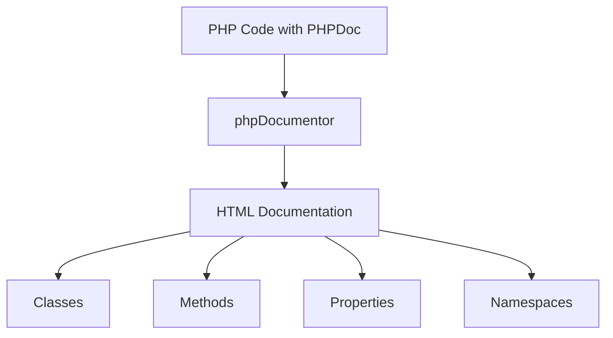
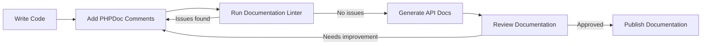

# PHP Documentation

## Introduction

Documentation is a critical aspect of writing maintainable and collaborative PHP code. Well-documented code is easier to understand, modify, and debug, both for yourself and other developers. This guide will explore different documentation techniques in PHP, including comments, PHPDoc blocks, and best practices for creating clear and useful documentation for your PHP projects.

## Why Documentation Matters

Good documentation serves several important purposes:

- Helps new developers understand your codebase quickly
- Makes it easier to return to your own code months later
- Facilitates collaboration in team environments
- Provides context and reasoning behind implementation decisions
- Enables automatic documentation generation tools
- Improves code maintainability and reduces technical debt

## Basic PHP Comments

PHP supports several comment styles that are fundamental to documentation:

### Single-line Comments

```php
// This is a single-line comment
$name = "John"; // This explains the variable

# This is also a single-line comment (less common in PHP)
```

### Multi-line Comments

```php
/*
This is a multi-line comment
that spans several lines
and can be used for longer explanations
*/

$complexCalculation = ($a * $b) / ($c + $d);
```

## PHPDoc Syntax

PHPDoc is a standard format for documenting PHP code, similar to JavaDoc. It uses specially formatted comment blocks to provide structured information about classes, methods, and properties.

### Basic PHPDoc Block Format

```php
/**
 * Short description
 *
 * Longer description if needed spanning
 * multiple lines
 *
 * @tag information
 */
```

### Documenting Classes

```php
/**
 * User class for managing user data and authentication
 *
 * This class handles all operations related to users including
 * registration, authentication, and profile management
 *
 * @package MyApp
 * @author Your Name <your.email@example.com>
 * @version 1.0.0
 */
class User {
    // Class implementation
}
```

### Documenting Methods

```php
/**
 * Authenticates a user against the database
 *
 * @param string $username The user's username
 * @param string $password The user's plain text password
 * @return bool Returns true if authentication was successful, false otherwise
 * @throws AuthenticationException If the database connection fails
 */
public function authenticate($username, $password) {
    // Method implementation
}
```

### Documenting Properties

```php
class Product {
    /**
     * The unique identifier for the product
     * @var int
     */
    private $id;
    
    /**
     * The product's current stock level
     * @var int
     */
    private $stockLevel;
    
    /**
     * Whether the product is currently active
     * @var bool
     */
    private $isActive;
}
```

## Common PHPDoc Tags

PHPDoc uses a variety of tags to provide specific information:

| Tag | Description | Example |
|-----|-------------|---------|
| `@param` | Documents a method parameter | `@param string $name The user's name` |
| `@return` | Documents the return value | `@return bool True on success` |
| `@var` | Documents the type of a property | `@var int` |
| `@throws` | Documents exceptions that might be thrown | `@throws InvalidArgumentException` |
| `@author` | Specifies the author | `@author Jane Doe <jane@example.com>` |
| `@since` | Documents when the element was added | `@since 1.2.0` |
| `@deprecated` | Marks element as deprecated | `@deprecated Use newMethod() instead` |
| `@see` | Provides a reference to related element | `@see User::login()` |
| `@todo` | Describes planned changes | `@todo Implement caching` |

## Real-world Example

Let's look at a complete example of documented PHP code for a simple shopping cart item:

```php
<?php
/**
 * CartItem class representing an item in a shopping cart
 *
 * This class handles the data and operations for individual items
 * that can be added to a shopping cart.
 *
 * @package ShoppingCart
 * @author Your Name <your.email@example.com>
 */
class CartItem {
    /**
     * Unique product ID
     * @var int
     */
    private $productId;
    
    /**
     * Product name
     * @var string
     */
    private $name;
    
    /**
     * Product price
     * @var float
     */
    private $price;
    
    /**
     * Quantity of this item in the cart
     * @var int
     */
    private $quantity;
    
    /**
     * Creates a new cart item
     *
     * @param int $productId The product ID
     * @param string $name The product name
     * @param float $price The product price
     * @param int $quantity The quantity (defaults to 1)
     * @throws InvalidArgumentException If price is negative
     */
    public function __construct($productId, $name, $price, $quantity = 1) {
        // Validate price
        if ($price < 0) {
            throw new InvalidArgumentException("Price cannot be negative");
        }
        
        $this->productId = $productId;
        $this->name = $name;
        $this->price = $price;
        $this->quantity = $quantity;
    }
    
    /**
     * Updates the quantity of this item
     *
     * @param int $newQuantity The new quantity value
     * @return bool True if the update was successful
     */
    public function updateQuantity($newQuantity) {
        // Only allow positive quantities
        if ($newQuantity > 0) {
            $this->quantity = $newQuantity;
            return true;
        }
        
        return false;
    }
    
    /**
     * Calculates the total price for this item (price × quantity)
     *
     * @return float The total price
     */
    public function getTotal() {
        return $this->price * $this->quantity;
    }
    
    /**
     * Gets the product name
     *
     * @return string The product name
     */
    public function getName() {
        return $this->name;
    }
    
    // Other getters and setters...
}
```

## Using Documentation to Generate API Docs

One of the major benefits of using PHPDoc is the ability to automatically generate API documentation. Tools like phpDocumentor can parse your documented code and generate comprehensive HTML documentation.

Example usage of phpDocumentor:

```bash
# Install phpDocumentor
composer require --dev phpdocumentor/phpdocumentor

# Generate documentation
vendor/bin/phpdoc -d src/ -t docs/api
```

The result is a professional documentation website that makes your code more accessible:



## Documentation Best Practices

### 1. Be Consistent

Choose a documentation style and stick with it throughout your project. Consistency makes it easier for developers to find and understand documentation.

### 2. Document "Why" Not Just "What"

The code itself shows what it does. Documentation should explain why decisions were made:

```php
/**
 * Recalculate user statistics daily rather than on-demand
 * to improve performance for the user dashboard which needs
 * this data frequently.
 */
public function recalculateUserStats() {
    // Implementation
}
```

### 3. Keep Documentation Updated

Outdated documentation is often worse than no documentation. Always update docs when you change code:

```php
/**
 * @deprecated since 2.3.0, use processOrder() instead
 * This method is kept for backward compatibility but will be
 * removed in version 3.0.0
 */
public function processTransaction() {
    // Forward to new method
    return $this->processOrder();
}
```

### 4. Document Exceptions and Edge Cases

Make sure to document behavior in exceptional situations:

```php
/**
 * Divides two numbers
 *
 * @param float $a The dividend
 * @param float $b The divisor
 * @return float The result of division
 * @throws DivisionByZeroException When $b is zero
 */
public function divide($a, $b) {
    if ($b == 0) {
        throw new DivisionByZeroException("Cannot divide by zero");
    }
    return $a / $b;
}
```

### 5. Use Type Hints Along with PHPDoc

Modern PHP allows type hints, but PHPDoc often provides more detailed type information:

```php
/**
 * @param array<string, mixed> $config An associative array of configuration options
 * @return array<int, string> A list of processed values
 */
public function processConfig(array $config): array {
    // Implementation
}
```

## Code Examples with Context

### Example 1: Database Wrapper Class

```php
<?php
/**
 * Database wrapper for MySQL connections
 *
 * This class provides a simplified interface for connecting to
 * and interacting with a MySQL database using PDO.
 *
 * Usage example:
 * ```
 * $db = new Database('localhost', 'mydb', 'user', 'pass');
 * $users = $db->query("SELECT * FROM users WHERE active = ?", [1]);
 * ```
 *
 * @package Database
 */
class Database {
    /** @var PDO The PDO connection instance */
    private $connection;
    
    /**
     * Creates a new database connection
     *
     * @param string $host The database host
     * @param string $dbname The database name
     * @param string $user The username
     * @param string $password The password
     * @throws PDOException If connection fails
     */
    public function __construct($host, $dbname, $user, $password) {
        $dsn = "mysql:host=$host;dbname=$dbname;charset=utf8mb4";
        
        // Configure PDO to throw exceptions on error
        $options = [
            PDO::ATTR_ERRMODE => PDO::ERRMODE_EXCEPTION,
            PDO::ATTR_DEFAULT_FETCH_MODE => PDO::FETCH_ASSOC,
            PDO::ATTR_EMULATE_PREPARES => false,
        ];
        
        // Create the connection
        $this->connection = new PDO($dsn, $user, $password, $options);
    }
    
    /**
     * Executes a query and returns the results
     *
     * @param string $sql The SQL query with placeholders
     * @param array $params The parameters to bind to the query
     * @return array The query results as an associative array
     */
    public function query($sql, $params = []) {
        $stmt = $this->connection->prepare($sql);
        $stmt->execute($params);
        return $stmt->fetchAll();
    }
}

// Usage example:
try {
    $db = new Database('localhost', 'inventory', 'admin', 'secure_password');
    $products = $db->query("SELECT * FROM products WHERE category = ?", ['electronics']);
    
    foreach ($products as $product) {
        echo $product['name'] . ': $' . $product['price'] . "
";
    }
} catch (PDOException $e) {
    echo "Database error: " . $e->getMessage();
}
```

**Output:**
```
Laptop: $899
Smartphone: $699
Tablet: $349
```

## Documentation Workflow

A well-structured documentation workflow can be visualized as follows:



## Summary

Good documentation is an essential part of professional PHP development:

- Use single-line comments (`//`) for brief explanations
- Use multi-line comments (`/* */`) for more detailed information
- Use PHPDoc blocks (`/** */`) for structured documentation
- Document classes, methods, properties, and functions completely
- Include parameter types, return types, and exceptions
- Explain the "why" behind important code decisions
- Keep documentation up-to-date with code changes
- Use tools like phpDocumentor to generate documentation websites

By following these best practices, you'll create PHP code that is easier to maintain, collaborate on, and extend over time.

## Additional Resources

- [Official PHPDoc Documentation](https://docs.phpdoc.org/latest/)
- [PHP Standards Recommendations (PSR)](https://www.php-fig.org/psr/)
- [phpDocumentor Website](https://phpdoc.org/)

## Exercises

1. Take an existing PHP class from your project and add complete PHPDoc comments.
2. Install phpDocumentor and generate documentation for your PHP project.
3. Create a simple function with complex parameters and document it properly with PHPDoc.
4. Write a documentation guide specific to your team's coding standards.
5. Review a peer's code and suggest documentation improvements.