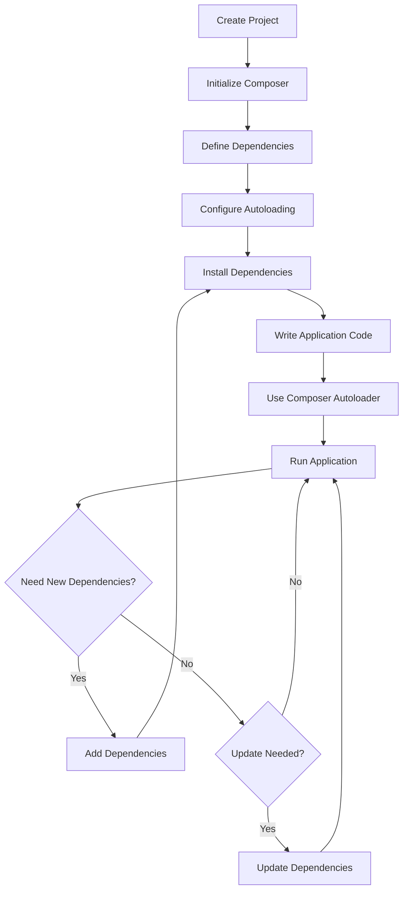

# PHP Composer Usage

## Introduction

Composer is a dependency manager for PHP that has revolutionized how PHP developers build applications. Before Composer, managing external libraries and dependencies was a manual and error-prone process. Now, with just a few commands, you can install, update, and autoload dependencies with ease.

In this guide, we'll explore how to use Composer effectively in your PHP projects. Whether you're building a small website or a complex application, Composer will help you organize your code and incorporate third-party libraries seamlessly.

## What is Composer?

Composer is a tool for dependency management in PHP. It allows you to declare the libraries your project depends on and it will manage (install/update) them for you. The key benefits of using Composer include:

- **Dependency Management**: Easily declare and install third-party libraries
- **Version Control**: Specify exact versions or version ranges for dependencies
- **Autoloading**: Automatically load your classes without requiring manual includes
- **Consistency**: Ensure all team members use the same dependency versions

## Getting Started with Composer

### Installation

Before we can use Composer, we need to install it. The installation process varies slightly depending on your operating system.

#### For Windows:

1. Download and run the [Composer-Setup.exe](https://getcomposer.org/Composer-Setup.exe)
2. Follow the installation wizard instructions

#### For macOS/Linux:

```bash
# Download the installer
php -r "copy('https://getcomposer.org/installer', 'composer-setup.php');"

# Verify the installer
php -r "if (hash_file('sha384', 'composer-setup.php') === 'e21205b207c3ff031906575712edab6f13eb0b361f2085f1f1237b7126d785e826a450292b6cfd1d64d92e6563bbde02') { echo 'Installer verified'; } else { echo 'Installer corrupt'; unlink('composer-setup.php'); } echo PHP_EOL;"

# Run the installer
php composer-setup.php

# Move composer to a global location
sudo mv composer.phar /usr/local/bin/composer

# Clean up
php -r "unlink('composer-setup.php');"
```

### Verifying Installation

To verify that Composer is installed correctly, open your terminal or command prompt and run:

```bash
composer --version
```

You should see output similar to:

```
Composer version 2.5.8 2023-06-09 17:13:21
```

## Creating a New Project with Composer

### Initializing Composer in Your Project

To start using Composer in your project, navigate to your project directory and run:

```bash
composer init
```

This will launch an interactive wizard that guides you through creating a `composer.json` file:

```
Welcome to the Composer config generator

This command will guide you through creating your composer.json config.

Package name (<vendor>/<name>) [username/my-project]: acme/blog
Description []: A simple blog application
Author [Your Name <your.email@example.com>, n to skip]: John Doe <john@example.com>
Minimum Stability []: dev
Package Type (e.g. library, project, metapackage, composer-plugin) []: project
License []: MIT

Define your dependencies.

Would you like to define your dependencies (require) interactively [yes]? yes
Search for a package: monolog/monolog
Enter the version constraint to require (or leave blank to use the latest version): ^2.0
Search for a package:

Would you like to define your dev dependencies (require-dev) interactively [yes]? yes
Search for a package: phpunit/phpunit
Enter the version constraint to require (or leave blank to use the latest version): ^9.0
Search for a package:

{
    "name": "acme/blog",
    "description": "A simple blog application",
    "type": "project",
    "require": {
        "monolog/monolog": "^2.0"
    },
    "require-dev": {
        "phpunit/phpunit": "^9.0"
    },
    "license": "MIT",
    "authors": [
        {
            "name": "John Doe",
            "email": "john@example.com"
        }
    ],
    "minimum-stability": "dev"
}

Do you confirm generation [yes]? yes
```

### Understanding composer.json

The `composer.json` file is the heart of Composer. It defines your project's dependencies and configuration. Here's a breakdown of its key sections:

```json
{
    "name": "vendor/project",              // Your project's name
    "description": "Project description",  // A brief description
    "type": "project",                     // The type of package
    "require": {                           // Production dependencies
        "php": ">=7.4",                    // Required PHP version
        "monolog/monolog": "^2.0"          // External library dependency
    },
    "require-dev": {                       // Development dependencies
        "phpunit/phpunit": "^9.0"          // Testing framework
    },
    "autoload": {                          // Autoloading configuration
        "psr-4": {                         // PSR-4 autoloading standard
            "App\\": "src/"                // Maps "App\" namespace to "src/" directory
        }
    },
    "license": "MIT",                      // License type
    "authors": [                           // Project authors
        {
            "name": "Your Name",
            "email": "your.email@example.com"
        }
    ],
    "minimum-stability": "stable"          // Package stability preference
}
```

## Installing Dependencies

### Installing Packages

Once you have your `composer.json` file, you can install dependencies with:

```bash
composer install
```

This command reads the `composer.json` file and downloads all required packages to the `vendor` directory. It also creates a `composer.lock` file that locks the exact versions of packages installed.

### Output Example

```
Loading composer repositories with package information
Updating dependencies (including require-dev)
Package operations: 25 installs, 0 updates, 0 removals
  - Installing psr/log (1.1.4): Downloading (100%)
  - Installing monolog/monolog (2.8.0): Downloading (100%)
  - Installing sebastian/version (3.0.2): Downloading (100%)
  ...
  - Installing phpunit/phpunit (9.5.25): Downloading (100%)
Generating autoload files
```

### Adding New Dependencies

To add a new package to your project:

```bash
composer require vendor/package
```

For example, to add the Guzzle HTTP client:

```bash
composer require guzzlehttp/guzzle
```

This will automatically update your `composer.json` and `composer.lock` files and download the package.

### Development Dependencies

For packages only needed during development (like testing tools):

```bash
composer require --dev phpunit/phpunit
```

## Managing Dependencies

### Updating Packages

To update all dependencies to their latest versions according to your version constraints:

```bash
composer update
```

To update a specific package:

```bash
composer update vendor/package
```

### Removing Packages

To remove a package:

```bash
composer remove vendor/package
```

### Understanding composer.lock

The `composer.lock` file is automatically generated when you run `composer install` or `composer update`. It locks the exact versions of all dependencies, ensuring that everyone who works on the project gets exactly the same versions.

Always commit both `composer.json` and `composer.lock` to your version control system.

## Autoloading

One of Composer's most powerful features is its autoloading capability. Autoloading eliminates the need for manual `require` or `include` statements for your classes.

### PSR-4 Autoloading

The most common autoloading standard used with Composer is PSR-4. To set up PSR-4 autoloading, add this to your `composer.json`:

```json
{
    "autoload": {
        "psr-4": {
            "App\\": "src/"
        }
    }
}
```

This maps the `App\` namespace to the `src/` directory. So a class like `App\User\UserController` would be located at `src/User/UserController.php`.

After changing autoload configuration, run:

```bash
composer dump-autoload
```

### Using Autoloading

To use Composer's autoloader in your code, include this line at the top of your entry point file (like `index.php`):

```php
<?php
require 'vendor/autoload.php';

// Now you can use classes without manual includes
$logger = new \Monolog\Logger('name');
$user = new \App\User\User();
```

### Output Example

```php
<?php
// Without autoloading
require_once 'src/User/User.php';
require_once 'src/Post/Post.php';
require_once 'vendor/monolog/monolog/src/Monolog/Logger.php';
// ... many more requires

// With autoloading
require 'vendor/autoload.php';

// Now you can directly use classes
$user = new \App\User\User();
$logger = new \Monolog\Logger('name');
```

## Real-World Application

Let's build a simple application that logs messages to a file using Monolog. This demonstrates how Composer manages dependencies and provides autoloading.

### Step 1: Create Project Structure

```
myproject/
├── src/
│   └── Logger/
│       └── ApplicationLogger.php
├── logs/
└── index.php
```

### Step 2: Initialize Composer

```bash
cd myproject
composer init
```

Follow the prompts and add Monolog as a dependency.

### Step 3: Set Up Autoloading

Edit your `composer.json` to include:

```json
{
    "require": {
        "monolog/monolog": "^2.0"
    },
    "autoload": {
        "psr-4": {
            "App\\": "src/"
        }
    }
}
```

### Step 4: Install Dependencies

```bash
composer install
```

### Step 5: Create the ApplicationLogger Class

Create `src/Logger/ApplicationLogger.php`:

```php
<?php

namespace App\Logger;

use Monolog\Logger;
use Monolog\Handler\StreamHandler;
use Monolog\Formatter\LineFormatter;

class ApplicationLogger
{
    private $logger;

    public function __construct(string $channel = 'app')
    {
        $this->logger = new Logger($channel);
        
        // Create a handler
        $logPath = __DIR__ . '/../../logs/app.log';
        $handler = new StreamHandler($logPath, Logger::DEBUG);
        
        // Format the log entries
        $formatter = new LineFormatter(
            "[%datetime%] %channel%.%level_name%: %message% %context% %extra%
",
            "Y-m-d H:i:s"
        );
        $handler->setFormatter($formatter);
        
        // Add the handler to the logger
        $this->logger->pushHandler($handler);
    }

    public function info(string $message, array $context = []): void
    {
        $this->logger->info($message, $context);
    }

    public function error(string $message, array $context = []): void
    {
        $this->logger->error($message, $context);
    }

    // Add more methods as needed for other log levels
}
```

### Step 6: Use the Logger in Your Application

Create `index.php`:

```php
<?php

require_once 'vendor/autoload.php';

use App\Logger\ApplicationLogger;

// Create our application logger
$logger = new ApplicationLogger('my-application');

// Log some messages
$logger->info('Application started', ['user' => 'guest']);
try {
    // Some code that might throw an exception
    throw new Exception('Something went wrong!');
} catch (Exception $e) {
    $logger->error('Error occurred: ' . $e->getMessage(), [
        'exception' => $e,
        'file' => $e->getFile(),
        'line' => $e->getLine()
    ]);
}

echo "Check the logs/app.log file to see the log messages.
";
```

### Step 7: Run the Application

```bash
php index.php
```

### Result

The application will create log entries in `logs/app.log`:

```
[2023-07-15 14:32:18] my-application.INFO: Application started {"user":"guest"} []
[2023-07-15 14:32:18] my-application.ERROR: Error occurred: Something went wrong! {"exception":"[object] (Exception(code: 0): Something went wrong! at /myproject/index.php:12)","file":"/myproject/index.php","line":12} []
```

## Composer Scripts

Composer allows you to define scripts that can be run from the command line. This is useful for automating common tasks like testing, linting, and deployment.

### Defining Scripts

Add a `scripts` section to your `composer.json`:

```json
{
    "scripts": {
        "test": "phpunit --colors=always",
        "lint": "php-cs-fixer fix src --dry-run --diff",
        "fix": "php-cs-fixer fix src",
        "start": "php -S localhost:8000 -t public/"
    }
}
```

### Running Scripts

```bash
composer test    # Run the test script
composer lint    # Run the lint script
composer fix     # Run the fix script
composer start   # Start the development server
```

## Composer Workflow

The following diagram illustrates a typical Composer workflow in a PHP project:



## Best Practices

1. **Always commit composer.lock**: This ensures that all developers and your production environment use exactly the same versions of dependencies.

2. **Use version constraints wisely**:
   - `^1.0` - Allows updates to any 1.x version but not to 2.0
   - `~1.2` - Allows updates to any 1.2.x version but not to 1.3.0
   - `1.2.*` - Allows updates to any 1.2.x version

3. **Optimize autoloading for production**:
   ```bash
   composer dump-autoload --optimize --no-dev
   ```

4. **Use private repositories when needed** - For proprietary code, you can create private Composer repositories.

5. **Keep dependencies up to date** - Regularly run `composer update` to get security fixes.

6. **Use Composer scripts** to automate common tasks.

## Common Issues and Troubleshooting

### Memory Limit Errors

If you encounter memory limit errors:

```bash
COMPOSER_MEMORY_LIMIT=-1 composer update
```

### Timeout Errors

For slow connections:

```bash
composer update --timeout=600
```

### Dependency Conflicts

If packages have conflicting requirements, try:

```bash
composer why-not vendor/package 2.0.0
```

This will show you which packages are preventing the installation of a specific version.

## Summary

Composer has transformed PHP development by providing a robust dependency management and autoloading system. By following the practices outlined in this guide, you'll be able to:

- Install and manage project dependencies
- Autoload your classes efficiently
- Keep your dependencies up to date
- Automate common development tasks

Incorporating Composer into your PHP workflow will make your development process more efficient and your codebase more maintainable.

## Additional Resources

- [Official Composer Documentation](https://getcomposer.org/doc/)
- [Packagist](https://packagist.org/) - The main Composer repository
- [PHP-FIG PSR-4 Autoloading Standard](https://www.php-fig.org/psr/psr-4/)
- [Tighten.co Composer Tips](https://blog.tighten.co/php-composer-tips-tricks/)

## Exercises

1. **Basic Composer Setup**: Create a new PHP project and use Composer to install and use a popular package like `symfony/var-dumper`.

2. **Custom Autoloader**: Create a project with a custom namespace and use Composer's autoloading to load your classes.

3. **Multi-package Project**: Build a small application that uses at least three different Composer packages.

4. **Composer Scripts**: Set up Composer scripts to automate testing and code style checking for your project.

5. **Private Package**: Create a private Composer package that can be used across multiple projects.