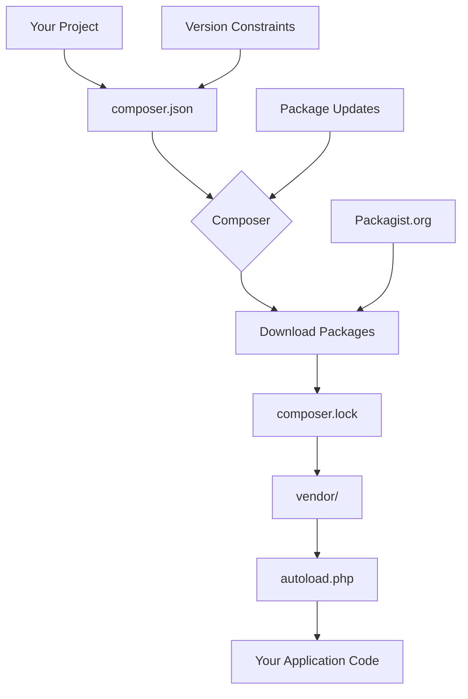

# PHP Dependency Management

## Introduction

When building PHP applications, you rarely start from scratch. Instead, you leverage existing libraries and packages to save time and effort. PHP dependency management is the process of handling these external packages that your project relies on in an organized and efficient manner.

In the early days of PHP, developers used manual approaches like copying library files or using includes. Today, modern PHP development uses sophisticated tools to automate dependency management. Understanding these tools and practices is essential for writing maintainable, professional PHP code.

## What are Dependencies?

Dependencies are external code packages that your project relies on to function properly. These can be:

- **Framework components** (Laravel, Symfony, etc.)
- **Utility libraries** (for working with dates, strings, etc.)
- **Database abstraction layers** (like Doctrine ORM)
- **Testing frameworks** (PHPUnit, Pest)
- **Third-party API clients**

Dependencies create a more modular codebase, allowing you to focus on your application's specific business logic rather than reinventing the wheel.

## Meet Composer: The PHP Dependency Manager

Composer is the de-facto standard tool for PHP dependency management. Released in 2012, it revolutionized how PHP developers share and manage code.

### What Composer Does

1. **Installs and updates packages** from various sources (primarily Packagist)
2. **Resolves dependency conflicts** by finding compatible versions
3. **Generates autoloaders** for efficient class loading
4. **Manages development vs. production dependencies**

### Getting Started with Composer

First, you need to install Composer. Here are the basic steps:

```bash
# For Linux/Mac
curl -sS https://getcomposer.org/installer | php
sudo mv composer.phar /usr/local/bin/composer

# For Windows
# Download and run Composer-Setup.exe from https://getcomposer.org/download/
```

Once installed, verify it's working by running:

```bash
composer --version
```

You should see output similar to:

```
Composer version 2.5.8
```

## Creating a New Project with Composer

To start a new project with Composer, create a `composer.json` file in your project root:

```json
{
    "name": "your-name/project-name",
    "description": "A brief description of your project",
    "type": "project",
    "require": {
        "php": ">=8.1"
    },
    "require-dev": {
        "phpunit/phpunit": "^10.0"
    },
    "autoload": {
        "psr-4": {
            "YourNamespace\\": "src/"
        }
    },
    "authors": [
        {
            "name": "Your Name",
            "email": "your.email@example.com"
        }
    ]
}
```

Alternatively, you can generate this file interactively:

```bash
composer init
```

## Adding Dependencies

To add a dependency to your project:

```bash
composer require vendor/package
```

For example, to add the popular Carbon date library:

```bash
composer require nesbot/carbon
```

This will:
1. Download the latest compatible version of Carbon
2. Add it to your `composer.json` under `require`
3. Create or update `composer.lock` to lock the exact version
4. Update the autoloader files

The updated `composer.json` will look something like:

```json
{
    "require": {
        "php": ">=8.1",
        "nesbot/carbon": "^2.66"
    }
}
```

### Development Dependencies

For packages only needed during development (like testing libraries):

```bash
composer require --dev phpunit/phpunit
```

These are added to the `require-dev` section of your `composer.json`.

## Understanding Version Constraints

Composer uses semantic versioning to manage package versions. Understanding version constraints is crucial:

- `^2.0` - Allows updates to any 2.x version but not 3.0 (recommended)
- `~2.0` - Allows updates to 2.0.x versions but not 2.1
- `2.0.*` - Allows only 2.0.x versions
- `>=2.0 <3.0` - Explicit version range
- `dev-main` - Use the main branch (unstable)

Example in `composer.json`:

```json
{
    "require": {
        "monolog/monolog": "^2.0",
        "symfony/http-foundation": "~6.0",
        "twig/twig": "3.0.*"
    }
}
```

## The Composer Lock File

When you run `composer install` or `composer require`, a `composer.lock` file is generated. This file:

- Records the exact versions of all packages installed
- Ensures consistent installations across environments
- Should be committed to version control

To update all dependencies to their latest allowed versions:

```bash
composer update
```

To update a specific package:

```bash
composer update vendor/package
```

## Autoloading with Composer

One of Composer's most powerful features is its autoloading system, which eliminates the need for manual `require`/`include` statements.

The `autoload` section in `composer.json` defines how your classes should be loaded:

```json
{
    "autoload": {
        "psr-4": {
            "App\\": "src/"
        },
        "files": [
            "src/helpers.php"
        ],
        "classmap": [
            "database/seeds",
            "database/factories"
        ]
    }
}
```

After changing autoload configurations, regenerate the autoloader:

```bash
composer dump-autoload
```

In your PHP code, simply use:

```php
<?php
require_once 'vendor/autoload.php';

// Now you can use any class without requiring it manually
$carbon = new \Carbon\Carbon();
$myApp = new \App\MyClass();
```

## Real-World Example: Building a Weather Application

Let's create a simple weather application using Composer dependencies:

1. Start by initializing a new project:

```bash
mkdir weather-app
cd weather-app
composer init
```

2. Add required packages:

```bash
composer require guzzlehttp/guzzle
composer require --dev phpunit/phpunit
```

3. Create a basic structure:

```bash
mkdir -p src/WeatherApp
mkdir -p tests
```

4. Update your `composer.json` with proper autoloading:

```json
{
    "name": "your-name/weather-app",
    "description": "A simple weather application",
    "require": {
        "php": ">=8.1",
        "guzzlehttp/guzzle": "^7.0"
    },
    "require-dev": {
        "phpunit/phpunit": "^10.0"
    },
    "autoload": {
        "psr-4": {
            "WeatherApp\\": "src/WeatherApp/"
        }
    },
    "autoload-dev": {
        "psr-4": {
            "WeatherApp\\Tests\\": "tests/"
        }
    }
}
```

5. Create a weather service class in `src/WeatherApp/WeatherService.php`:

```php
<?php

namespace WeatherApp;

use GuzzleHttp\Client;
use GuzzleHttp\Exception\GuzzleException;

class WeatherService
{
    private Client $client;
    private string $apiKey;
    
    public function __construct(string $apiKey)
    {
        $this->client = new Client([
            'base_uri' => 'https://api.openweathermap.org/data/2.5/',
            'timeout'  => 5.0,
        ]);
        $this->apiKey = $apiKey;
    }
    
    /**
     * Get current weather for a city
     *
     * @param string $city City name
     * @return array Weather data
     * @throws GuzzleException
     */
    public function getCurrentWeather(string $city): array
    {
        $response = $this->client->get('weather', [
            'query' => [
                'q' => $city,
                'appid' => $this->apiKey,
                'units' => 'metric'
            ]
        ]);
        
        return json_decode($response->getBody()->getContents(), true);
    }
}
```

6. Create a test in `tests/WeatherServiceTest.php`:

```php
<?php

namespace WeatherApp\Tests;

use PHPUnit\Framework\TestCase;
use WeatherApp\WeatherService;

class WeatherServiceTest extends TestCase
{
    public function testCanInstantiateWeatherService()
    {
        $service = new WeatherService('test-api-key');
        $this->assertInstanceOf(WeatherService::class, $service);
    }
    
    // More tests would go here
}
```

7. Create a simple entry point in `index.php`:

```php
<?php

require_once 'vendor/autoload.php';

use WeatherApp\WeatherService;

// In a real app, you would store this in environment variables
$apiKey = 'your-openweathermap-api-key';

$weatherService = new WeatherService($apiKey);

try {
    $weather = $weatherService->getCurrentWeather('London');
    
    echo "Current weather in London:
";
    echo "Temperature: {$weather['main']['temp']}°C
";
    echo "Conditions: {$weather['weather'][0]['description']}
";
    echo "Humidity: {$weather['main']['humidity']}%
";
} catch (Exception $e) {
    echo "Error: " . $e->getMessage();
}
```

This example demonstrates:
- Using external HTTP client (Guzzle) to connect to APIs
- Creating a proper namespaced class structure
- Utilizing Composer's autoloading
- Setting up testing with PHPUnit

## Best Practices for PHP Dependency Management

### 1. Keep Dependencies Minimal

Only include packages you really need. Each dependency adds complexity and potential security issues.

### 2. Use Version Constraints Wisely

```php
// Good - allows compatible updates
"require": {
    "monolog/monolog": "^2.0"
}

// Risky - could break with any new version
"require": {
    "monolog/monolog": "*"
}
```

### 3. Always Commit `composer.lock`

This ensures all environments use the exact same dependency versions.

### 4. Use Private Repositories for Proprietary Code

```json
{
    "repositories": [
        {
            "type": "vcs",
            "url": "https://github.com/company/private-package"
        }
    ]
}
```

### 5. Understand Dependency Trees

Use `composer show --tree` to visualize nested dependencies:

```bash
composer show --tree symfony/console
```

This helps identify potential conflicts or bloat.

### 6. Regularly Update Dependencies

```bash
# Check for outdated packages
composer outdated

# Update dependencies
composer update
```

### 7. Use Composer Scripts for Common Tasks

```json
{
    "scripts": {
        "test": "phpunit",
        "lint": "php-cs-fixer fix --dry-run",
        "fix": "php-cs-fixer fix",
        "start": "php -S localhost:8000 -t public"
    }
}
```

Then run them with:

```bash
composer test
composer start
```

## Dependency Flow Visualization

Here's a visualization of how dependencies flow in a PHP project:



## Handling Dependency Conflicts

Sometimes packages require different versions of the same dependency. Composer tries to resolve these automatically, but might need your help:

1. **Update version constraints** to find compatible ranges
2. Use **aliasing** for complex situations
3. Consider **replacing problematic dependencies**

## Security Considerations

Regularly check for security vulnerabilities:

```bash
composer audit
```

Consider using tools like:
- GitHub Dependabot
- Composer's built-in security advisories
- Security scanning services

## Summary

PHP dependency management is a critical skill for modern PHP development. With Composer, you can:

- Easily integrate third-party libraries
- Maintain consistent environments
- Autoload classes efficiently
- Keep your project organized and modular

By following best practices for dependency management, you'll create more maintainable, secure, and professional PHP applications.

## Additional Resources

- [Official Composer Documentation](https://getcomposer.org/doc/)
- [Packagist (PHP Package Repository)](https://packagist.org/)
- [Semantic Versioning](https://semver.org/)
- [PHP-FIG Standards](https://www.php-fig.org/)

## Exercises

1. Create a new PHP project with Composer and add at least three dependencies.
2. Set up proper namespacing and autoloading for your classes.
3. Create a script that uses one of the dependencies in a practical way.
4. Update a dependency to a newer version and observe the changes in `composer.lock`.
5. Try adding a development dependency and explain why it's better as a dev dependency than a regular one.