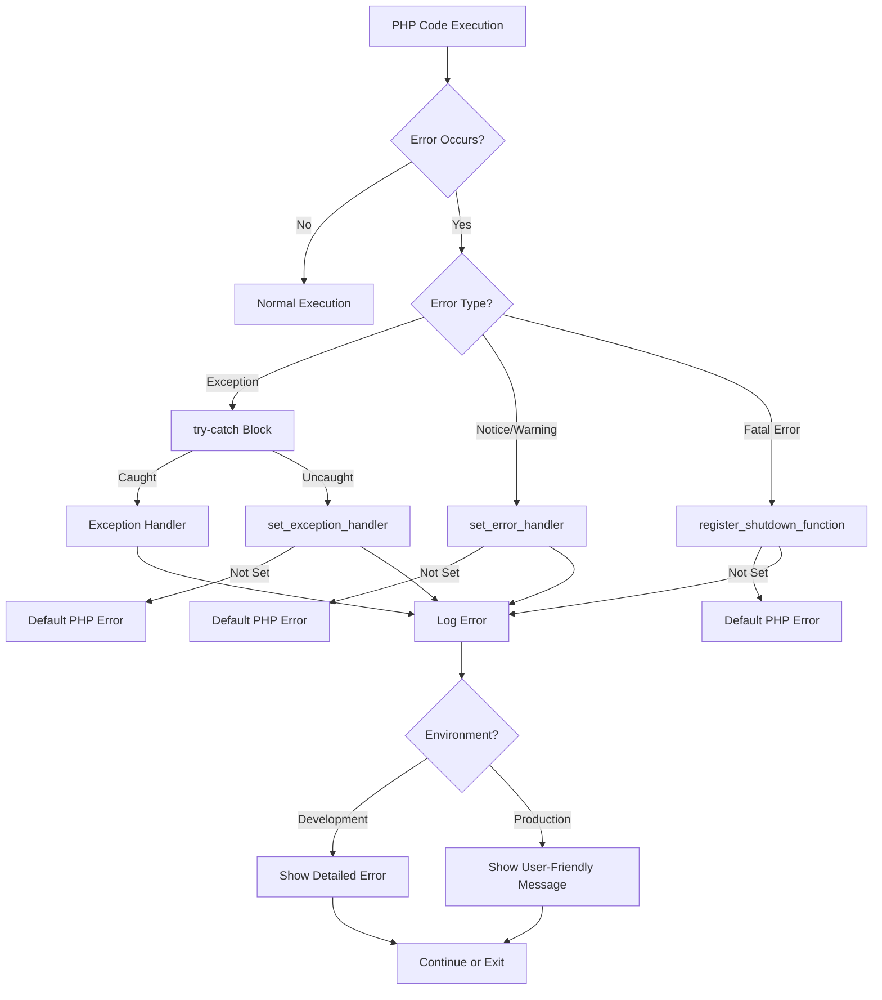

# PHP Error Handling Practices

## Introduction

Effective error handling is a crucial aspect of writing robust PHP applications. When you're building web applications, errors are inevitable - from syntax mistakes to database connection failures or unexpected user inputs. How you handle these errors determines whether your application crashes with cryptic messages or gracefully manages problems while providing useful feedback.

In this guide, we'll explore PHP's error handling mechanisms and best practices that will help you build more reliable applications. By implementing proper error handling, you'll create a better user experience, simplify debugging, and make your code more maintainable.

## Understanding PHP Error Types

Before diving into handling techniques, let's understand the different types of errors PHP can generate:

| Error Type | Description | Example |
|------------|-------------|---------|
| Parse Error | Syntax errors that prevent code from running | Missing semicolon, unclosed brackets |
| Fatal Error | Critical errors that halt script execution | Calling undefined function |
| Warning | Non-fatal errors that don't stop execution | Including a file that doesn't exist |
| Notice | Minor issues, often related to variables | Using undefined variable |
| Deprecated | Code that works but will be removed in future PHP versions | Using functions marked for removal |

Understanding these distinctions helps you implement appropriate handling strategies for different scenarios.

## Basic Error Handling Techniques

### 1. Error Reporting Configuration

PHP allows you to control which errors are reported through the `error_reporting()` function and the `display_errors` directive.

```php
// Show all errors except notices
error_reporting(E_ALL & ~E_NOTICE);

// For development: Show all possible errors
error_reporting(E_ALL);
ini_set('display_errors', 1);

// For production: Hide errors from users
error_reporting(E_ALL);
ini_set('display_errors', 0);
ini_set('log_errors', 1);
ini_set('error_log', '/path/to/error.log');
```

### 2. Custom Error Handlers

PHP allows you to define your own error handler with the `set_error_handler()` function:

```php
function customErrorHandler($errno, $errstr, $errfile, $errline) {
    // Create timestamp
    $timestamp = date('Y-m-d H:i:s');
    
    // Format error message
    $errorMessage = "[$timestamp] Error: [$errno] $errstr - $errfile:$errline
";
    
    // Log to file
    error_log($errorMessage, 3, "app_errors.log");
    
    // Show user-friendly message in production
    if (ENVIRONMENT === 'production') {
        echo "Sorry, something went wrong. Our team has been notified.";
    } else {
        // Show detailed error in development
        echo "<b>Error:</b> [$errno] $errstr<br>";
        echo "File: $errfile:$errline<br>";
    }
    
    // Don't execute PHP internal error handler
    return true;
}

// Set the custom error handler
set_error_handler("customErrorHandler");

// Example that will trigger our handler
$undefinedVariable;  // Notice: Undefined variable
```

Output (in development):
```
Error: [8] Undefined variable $undefinedVariable
File: /var/www/html/example.php:32
```

Output (in production):
```
Sorry, something went wrong. Our team has been notified.
```

## Exception Handling in PHP

While error handling manages PHP-generated errors, exception handling gives you more control over your application's error flow.

### 1. Basic Try-Catch Blocks

```php
try {
    // Code that might throw an exception
    $file = fopen('non_existent_file.txt', 'r');
    if (!$file) {
        throw new Exception("Failed to open file");
    }
} catch (Exception $e) {
    // Handle the exception
    echo "Error: " . $e->getMessage();
}
```

Output:
```
Error: Failed to open file
```

### 2. Try-Catch-Finally

The `finally` block executes regardless of whether an exception was thrown:

```php
function processFile($filename) {
    $file = null;
    
    try {
        echo "Trying to open file...<br>";
        $file = fopen($filename, 'r');
        
        if (!$file) {
            throw new Exception("Could not open file: $filename");
        }
        
        // Process file contents
        echo "Reading file contents...<br>";
        $contents = fread($file, filesize($filename));
        return $contents;
        
    } catch (Exception $e) {
        echo "Error: " . $e->getMessage() . "<br>";
        return null;
    } finally {
        echo "Cleaning up resources...<br>";
        // Close file if it was opened
        if ($file) {
            fclose($file);
        }
    }
}

// Example usage
$result = processFile('sample.txt'); // Assumes this file exists
echo "Result: " . $result . "<br>";

$result = processFile('missing.txt'); // This file doesn't exist
echo "Result: " . $result . "<br>";
```

Output (when sample.txt exists):
```
Trying to open file...
Reading file contents...
Cleaning up resources...
Result: [contents of sample.txt]
```

Output (when missing.txt doesn't exist):
```
Trying to open file...
Error: Could not open file: missing.txt
Cleaning up resources...
Result: 
```

### 3. Custom Exception Classes

Creating custom exception classes helps distinguish between different error types:

```php
class DatabaseException extends Exception {
    public function __construct($message, $code = 0, Exception $previous = null) {
        parent::__construct("Database Error: " . $message, $code, $previous);
    }
}

class ValidationException extends Exception {
    protected $invalidFields = [];
    
    public function __construct($message, array $invalidFields = [], $code = 0, Exception $previous = null) {
        $this->invalidFields = $invalidFields;
        parent::__construct("Validation Error: " . $message, $code, $previous);
    }
    
    public function getInvalidFields() {
        return $this->invalidFields;
    }
}

// Usage example
function saveUser($userData) {
    try {
        // Validate user data
        $errors = [];
        
        if (empty($userData['email'])) {
            $errors['email'] = 'Email is required';
        } elseif (!filter_var($userData['email'], FILTER_VALIDATE_EMAIL)) {
            $errors['email'] = 'Invalid email format';
        }
        
        if (empty($userData['name'])) {
            $errors['name'] = 'Name is required';
        }
        
        if (!empty($errors)) {
            throw new ValidationException("User data validation failed", $errors);
        }
        
        // Try to connect to database
        if (rand(0, 1) === 0) { // Simulate random DB error
            throw new DatabaseException("Connection failed");
        }
        
        // Save user
        echo "User saved successfully<br>";
        
    } catch (ValidationException $e) {
        echo $e->getMessage() . "<br>";
        echo "Invalid fields:<br>";
        foreach ($e->getInvalidFields() as $field => $error) {
            echo "- $field: $error<br>";
        }
    } catch (DatabaseException $e) {
        echo $e->getMessage() . "<br>";
        echo "Please try again later or contact support.<br>";
    } catch (Exception $e) {
        echo "An unexpected error occurred: " . $e->getMessage() . "<br>";
    }
}

// Example with invalid data
saveUser([
    'email' => 'invalid-email',
    'name' => ''
]);

// Example with database error (random simulation)
saveUser([
    'email' => 'valid@example.com',
    'name' => 'John Doe'
]);
```

This example demonstrates using custom exception classes to handle different types of errors in a structured way.

## Practical Error Handling Pattern

Here's a comprehensive example showing a real-world error handling approach:

```php
<?php
// config.php
define('ENVIRONMENT', 'development'); // 'development' or 'production'
define('LOG_PATH', __DIR__ . '/logs/');

// Initialize error handling based on environment
function initErrorHandling() {
    // Set error reporting level
    error_reporting(E_ALL);
    
    // Development: Show errors
    if (ENVIRONMENT === 'development') {
        ini_set('display_errors', 1);
    } 
    // Production: Log errors, don't display them
    else {
        ini_set('display_errors', 0);
        ini_set('log_errors', 1);
        ini_set('error_log', LOG_PATH . 'php_errors.log');
    }
    
    // Set custom error handler
    set_error_handler('customErrorHandler');
    
    // Set exception handler
    set_exception_handler('customExceptionHandler');
    
    // Register shutdown function to catch fatal errors
    register_shutdown_function('fatalErrorHandler');
}

// Custom error handler
function customErrorHandler($errno, $errstr, $errfile, $errline) {
    $errorType = match($errno) {
        E_ERROR => 'Error',
        E_WARNING => 'Warning',
        E_PARSE => 'Parse Error',
        E_NOTICE => 'Notice',
        E_CORE_ERROR => 'Core Error',
        E_CORE_WARNING => 'Core Warning',
        E_COMPILE_ERROR => 'Compile Error',
        E_COMPILE_WARNING => 'Compile Warning',
        E_USER_ERROR => 'User Error',
        E_USER_WARNING => 'User Warning',
        E_USER_NOTICE => 'User Notice',
        E_STRICT => 'Strict Standards',
        E_RECOVERABLE_ERROR => 'Recoverable Error',
        E_DEPRECATED => 'Deprecated',
        E_USER_DEPRECATED => 'User Deprecated',
        default => 'Unknown Error'
    };
    
    $logMessage = date('[Y-m-d H:i:s]') . " $errorType: $errstr in $errfile on line $errline" . PHP_EOL;
    error_log($logMessage, 3, LOG_PATH . 'app_errors.log');
    
    if (ENVIRONMENT === 'development') {
        echo "<div style='background-color:#f8d7da; color:#721c24; padding:10px; margin:10px 0; border:1px solid #f5c6cb; border-radius:4px;'>";
        echo "<strong>$errorType:</strong> $errstr<br>";
        echo "<strong>File:</strong> $errfile<br>";
        echo "<strong>Line:</strong> $errline";
        echo "</div>";
    } else {
        // In production, don't expose error details to users
        // You could log the error and show a generic message
        // or redirect to an error page
        if ($errno === E_USER_ERROR) {
            echo "<div class='error'>Sorry, an error occurred. Our team has been notified.</div>";
        }
    }
    
    // Don't execute PHP's internal error handler
    return true;
}

// Custom exception handler
function customExceptionHandler($exception) {
    $logMessage = date('[Y-m-d H:i:s]') . ' Uncaught Exception: ' . 
                  $exception->getMessage() . ' in ' . 
                  $exception->getFile() . ' on line ' . 
                  $exception->getLine() . PHP_EOL;
    
    error_log($logMessage, 3, LOG_PATH . 'exceptions.log');
    
    if (ENVIRONMENT === 'development') {
        echo "<div style='background-color:#f8d7da; color:#721c24; padding:10px; margin:10px 0; border:1px solid #f5c6cb; border-radius:4px;'>";
        echo "<h3>Uncaught Exception</h3>";
        echo "<p><strong>Message:</strong> " . $exception->getMessage() . "</p>";
        echo "<p><strong>File:</strong> " . $exception->getFile() . "</p>";
        echo "<p><strong>Line:</strong> " . $exception->getLine() . "</p>";
        echo "<h4>Stack Trace:</h4>";
        echo "<pre>" . $exception->getTraceAsString() . "</pre>";
        echo "</div>";
    } else {
        // In production, redirect to an error page
        header('Location: /error.php');
        exit;
    }
}

// Fatal error handler
function fatalErrorHandler() {
    $error = error_get_last();
    
    // Check if error is fatal
    if ($error !== null && in_array($error['type'], [E_ERROR, E_CORE_ERROR, E_COMPILE_ERROR, E_PARSE])) {
        $logMessage = date('[Y-m-d H:i:s]') . " FATAL ERROR: {$error['message']} in {$error['file']} on line {$error['line']}" . PHP_EOL;
        error_log($logMessage, 3, LOG_PATH . 'fatal_errors.log');
        
        if (ENVIRONMENT === 'development') {
            echo "<div style='background-color:#f8d7da; color:#721c24; padding:10px; margin:10px 0; border:1px solid #f5c6cb; border-radius:4px;'>";
            echo "<h3>Fatal Error</h3>";
            echo "<p><strong>Message:</strong> {$error['message']}</p>";
            echo "<p><strong>File:</strong> {$error['file']}</p>";
            echo "<p><strong>Line:</strong> {$error['line']}</p>";
            echo "</div>";
        } else {
            // In production, show a user-friendly message
            echo "<div class='error'>Sorry, a critical error occurred. Our team has been notified.</div>";
        }
    }
}

// Initialize error handling
initErrorHandling();
?>
```

## Visual Error Handling Flow

Here's a diagram showing the typical error handling flow in a PHP application:



## Best Practices for PHP Error Handling

1. **Different Environments, Different Handling**:
   - Development: Show detailed errors
   - Production: Log errors, show user-friendly messages

2. **Log Everything Important**:
   - Save errors to log files
   - Include timestamps, error types, and stack traces
   - Consider using different log files for different error types

3. **Use Custom Exception Classes**:
   - Create specific exception types for different parts of your application
   - Include relevant context data in exceptions

4. **Handle Fatal Errors**:
   - Implement `register_shutdown_function()` to catch fatal errors
   - Log fatal errors and display friendly messages in production

5. **Be Specific in Try-Catch Blocks**:
   - Catch only exceptions you can actually handle
   - Use multiple catch blocks for different exception types

6. **Don't Suppress Errors Silently**:
   - Avoid the `@` error suppression operator
   - Always log errors even if not displaying them

7. **Validate Input**:
   - Prevent errors by validating user input
   - Use type hinting and return type declarations

## Real-World Example: Form Validation

```php
<?php
// FormValidator.php

class FormValidationException extends Exception {
    protected $errors = [];
    
    public function __construct($message, array $errors = [], $code = 0, Exception $previous = null) {
        $this->errors = $errors;
        parent::__construct($message, $code, $previous);
    }
    
    public function getErrors() {
        return $this->errors;
    }
}

class FormValidator {
    protected $data;
    protected $errors = [];
    
    public function __construct(array $data) {
        $this->data = $data;
    }
    
    public function validate() {
        try {
            // Email validation
            if (!isset($this->data['email']) || empty($this->data['email'])) {
                $this->errors['email'] = 'Email is required';
            } elseif (!filter_var($this->data['email'], FILTER_VALIDATE_EMAIL)) {
                $this->errors['email'] = 'Invalid email format';
            }
            
            // Password validation
            if (!isset($this->data['password']) || empty($this->data['password'])) {
                $this->errors['password'] = 'Password is required';
            } elseif (strlen($this->data['password']) < 8) {
                $this->errors['password'] = 'Password must be at least 8 characters long';
            }
            
            // Age validation
            if (isset($this->data['age'])) {
                if (!is_numeric($this->data['age'])) {
                    $this->errors['age'] = 'Age must be a number';
                } elseif ($this->data['age'] < 18) {
                    $this->errors['age'] = 'You must be at least 18 years old';
                }
            }
            
            // If we have errors, throw exception
            if (!empty($this->errors)) {
                throw new FormValidationException('Form validation failed', $this->errors);
            }
            
            return true;
            
        } catch (FormValidationException $e) {
            // Re-throw to be caught by the controller
            throw $e;
        } catch (Exception $e) {
            // Log unexpected errors
            error_log('Unexpected validation error: ' . $e->getMessage());
            throw new Exception('An unexpected error occurred during validation');
        }
    }
}

// Usage example
try {
    $formData = [
        'email' => 'user@example',
        'password' => 'pass',
        'age' => '17'
    ];
    
    $validator = new FormValidator($formData);
    $validator->validate();
    
    echo "Form is valid. Processing...";
    
} catch (FormValidationException $e) {
    echo "<div class='validation-errors'>";
    echo "<h3>Please fix the following errors:</h3>";
    echo "<ul>";
    
    foreach ($e->getErrors() as $field => $error) {
        echo "<li><strong>$field</strong>: $error</li>";
    }
    
    echo "</ul>";
    echo "</div>";
    
} catch (Exception $e) {
    echo "<div class='error'>";
    echo "Error: " . $e->getMessage();
    echo "</div>";
}
?>
```

Output:
```
Please fix the following errors:
- email: Invalid email format
- password: Password must be at least 8 characters long
- age: You must be at least 18 years old
```

## Debugging Techniques

While error handling helps manage errors gracefully, debugging helps find and fix the source of those errors:

### Using var_dump() and print_r()

```php
// Debug a variable
$user = [
    'name' => 'John',
    'email' => 'john@example.com',
    'roles' => ['editor', 'subscriber']
];

echo "<pre>";
var_dump($user);  // Shows type information
print_r($user);   // More readable for arrays
echo "</pre>";
```

### Better Debugging with debug_backtrace()

```php
function debugHere($variable, $exit = false) {
    echo "<pre style='background:#f4f4f4; padding:10px; border:1px solid #ddd;'>";
    echo "<h3>Debug Information</h3>";
    
    // Print variable
    echo "<h4>Variable Content:</h4>";
    var_dump($variable);
    
    // Get backtrace
    echo "<h4>Debug Backtrace:</h4>";
    $trace = debug_backtrace();
    
    // Remove the current function call from trace
    array_shift($trace);
    
    foreach ($trace as $i => $t) {
        echo "#$i ";
        
        if (isset($t['class'])) {
            echo $t['class'] . $t['type'];
        }
        
        echo $t['function'] . '(';
        
        if (isset($t['args']) && !empty($t['args'])) {
            $args = array_map(function($arg) {
                if (is_object($arg)) {
                    return get_class($arg);
                } elseif (is_array($arg)) {
                    return 'Array(' . count($arg) . ')';
                } else {
                    return var_export($arg, true);
                }
            }, $t['args']);
            
            echo implode(', ', $args);
        }
        
        echo ') called at [' . ($t['file'] ?? 'unknown file') . ':' . ($t['line'] ?? 'unknown line') . ']<br>';
    }
    
    echo "</pre>";
    
    if ($exit) {
        exit;
    }
}

// Usage
function processOrder($orderId) {
    $order = getOrder($orderId);
    debugHere($order);
    // Continue processing...
}

function getOrder($id) {
    // Simulate fetching an order
    return [
        'id' => $id,
        'customer' => 'Jane Doe',
        'amount' => 129.99,
        'status' => 'pending'
    ];
}

processOrder(12345);
```

## Summary

Effective error handling is essential for building reliable PHP applications. In this guide, we've covered:

1. **Understanding PHP Error Types** - From notices to fatal errors
2. **Basic Error Handling** - Using `error_reporting()` and custom error handlers
3. **Exception Handling** - Try-catch blocks, custom exceptions, and complex exception hierarchies
4. **Real-World Patterns** - Complete error handling architectures for professional applications
5. **Debugging Techniques** - Tools to help identify and fix errors

By implementing these practices, you'll create more robust applications that gracefully handle errors, provide better user experiences, and simplify maintenance and debugging.

## Additional Resources

- [PHP Manual: Error Handling](https://www.php.net/manual/en/book.errorfunc.php)
- [PHP Manual: Exceptions](https://www.php.net/manual/en/language.exceptions.php)
- [PSR-3: Logger Interface](https://www.php-fig.org/psr/psr-3/) - A standard logging interface

## Exercises

1. Create a custom exception class for handling file operations that includes the filename and operation type.
2. Implement a complete error logging system that rotates log files daily.
3. Write a function that safely connects to a database and handles different types of connection errors.
4. Build a form validation class that uses exceptions to handle validation errors and provides clear error messages.
5. Modify the `fatalErrorHandler` function to email administrators when critical errors occur in production.