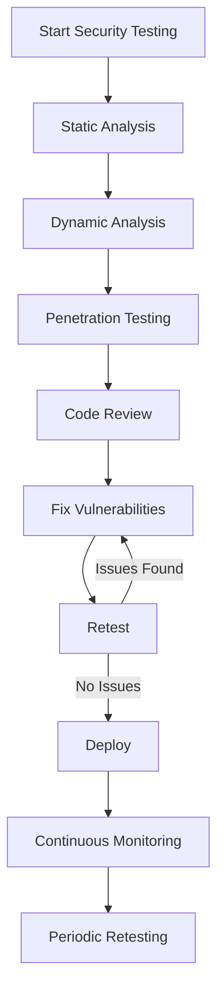

# PHP Security Guidelines

## Introduction

Security is a critical aspect of web development that can't be overlooked. PHP applications, like any web applications, are potential targets for various attacks if not properly secured. This guide covers essential security practices that every PHP developer should implement to protect their applications and user data.

As a beginner PHP developer, understanding these security guidelines will help you build more robust applications and develop good security habits from the start. Let's explore the common security vulnerabilities in PHP applications and learn how to mitigate them.

## Common PHP Security Vulnerabilities

### 1. SQL Injection

SQL injection occurs when untrusted user input is used directly in SQL queries, allowing attackers to manipulate your database.

#### Vulnerable Code Example:

```php
// DON'T DO THIS - Vulnerable to SQL Injection
$username = $_POST['username'];
$query = "SELECT * FROM users WHERE username = '$username'";
$result = mysqli_query($connection, $query);
```

If a user inputs `' OR '1'='1`, the query becomes:

```sql
SELECT * FROM users WHERE username = '' OR '1'='1'
```

This would return all users in the database!

#### Secure Code Example:

```php
// DO THIS - Using Prepared Statements
$username = $_POST['username'];

// Using MySQLi
$stmt = $connection->prepare("SELECT * FROM users WHERE username = ?");
$stmt->bind_param("s", $username);
$stmt->execute();
$result = $stmt->get_result();

// Using PDO
$stmt = $pdo->prepare("SELECT * FROM users WHERE username = :username");
$stmt->execute(['username' => $username]);
$result = $stmt->fetchAll();
```

### 2. Cross-Site Scripting (XSS)

XSS allows attackers to inject malicious client-side scripts into web pages viewed by other users.

#### Vulnerable Code Example:

```php
// DON'T DO THIS - Vulnerable to XSS
echo "Welcome, " . $_GET['name'] . "!";
```

If someone uses this URL: `example.com/page.php?name=<script>alert('Hacked!')</script>`, the script would execute.

#### Secure Code Example:

```php
// DO THIS - Escape output
echo "Welcome, " . htmlspecialchars($_GET['name'], ENT_QUOTES, 'UTF-8') . "!";
```

### 3. Cross-Site Request Forgery (CSRF)

CSRF tricks users into performing unwanted actions on a site they're authenticated to.

#### Secure Implementation Example:

```php
// Generate and store CSRF token
function generate_csrf_token() {
    if (empty($_SESSION['csrf_token'])) {
        $_SESSION['csrf_token'] = bin2hex(random_bytes(32));
    }
    return $_SESSION['csrf_token'];
}

// In your form
echo '<form method="post" action="process.php">';
echo '<input type="hidden" name="csrf_token" value="' . generate_csrf_token() . '">';
echo '<!-- Rest of your form -->';
echo '</form>';

// When processing the form
if (!isset($_POST['csrf_token']) || $_POST['csrf_token'] !== $_SESSION['csrf_token']) {
    die('CSRF token validation failed');
}
```

## Essential PHP Security Practices

### 1. Input Validation and Sanitization

Always validate and sanitize all user inputs before using them in your application.

```php
// Validating and sanitizing email
$email = filter_var($_POST['email'], FILTER_VALIDATE_EMAIL);
if (!$email) {
    die("Invalid email format");
}

// Validating numeric input
$id = filter_var($_POST['id'], FILTER_VALIDATE_INT);
if ($id === false) {
    die("ID must be an integer");
}

// Sanitizing string input
$username = filter_var($_POST['username'], FILTER_SANITIZE_STRING);
// Note: FILTER_SANITIZE_STRING is deprecated in PHP 8.1+
// For newer PHP versions, use:
$username = htmlspecialchars($_POST['username'], ENT_QUOTES, 'UTF-8');
```

### 2. Password Security

Properly hash and store passwords using modern algorithms.

```php
// Creating a password hash
$password = $_POST['password'];
$hashed_password = password_hash($password, PASSWORD_DEFAULT);

// Store $hashed_password in the database

// Verifying a password
$stored_hash = '...'; // Hash retrieved from the database
if (password_verify($_POST['password'], $stored_hash)) {
    // Password is correct
    // Check if rehash is needed due to updated algorithms
    if (password_needs_rehash($stored_hash, PASSWORD_DEFAULT)) {
        $new_hash = password_hash($_POST['password'], PASSWORD_DEFAULT);
        // Update the stored hash in the database
    }
} else {
    // Incorrect password
}
```

### 3. File Upload Security

Secure file uploads to prevent malicious file execution.

```php
// Handling file uploads securely
if (isset($_FILES['upload'])) {
    // Define allowed file types
    $allowed_types = ['image/jpeg', 'image/png', 'image/gif'];
    $max_size = 2 * 1024 * 1024; // 2MB
    
    // Validate file type and size
    if (!in_array($_FILES['upload']['type'], $allowed_types)) {
        die("Invalid file type");
    }
    
    if ($_FILES['upload']['size'] > $max_size) {
        die("File too large");
    }
    
    // Generate a random filename
    $new_filename = md5(uniqid() . $_FILES['upload']['name']) . '.jpg';
    
    // Move to a directory outside the web root if possible
    $upload_path = '/path/to/secure/uploads/' . $new_filename;
    
    if (move_uploaded_file($_FILES['upload']['tmp_name'], $upload_path)) {
        echo "File uploaded successfully";
    } else {
        echo "Error uploading file";
    }
}
```

### 4. Secure Database Configuration

Configure your database connection securely.

```php
// Store credentials in a separate file outside web root
// config.php - Store this outside your web root
<?php
define('DB_HOST', 'localhost');
define('DB_USER', 'username');
define('DB_PASS', 'password');
define('DB_NAME', 'database');
?>

// In your application file
require_once '/path/to/config.php';

$conn = new mysqli(DB_HOST, DB_USER, DB_PASS, DB_NAME);
if ($conn->connect_error) {
    // Log error securely, don't display detailed errors to users
    error_log('Database connection failed: ' . $conn->connect_error);
    die("Connection error. Please try again later.");
}
```

### 5. Error Handling and Logging

Configure proper error handling for production environments.

```php
// In development
ini_set('display_errors', 1);
ini_set('display_startup_errors', 1);
error_reporting(E_ALL);

// In production - in php.ini or using ini_set()
ini_set('display_errors', 0);
ini_set('log_errors', 1);
ini_set('error_log', '/path/to/error.log');
```

### 6. Session Security

Implement secure session management practices.

```php
// Secure session configuration
ini_set('session.cookie_httponly', 1); // Prevent JavaScript access to session cookie
ini_set('session.use_only_cookies', 1); // Force use of cookies for session
ini_set('session.cookie_secure', 1); // Send cookies only over HTTPS

// Regenerate session ID periodically
session_start();
if (!isset($_SESSION['created'])) {
    $_SESSION['created'] = time();
} else if (time() - $_SESSION['created'] > 3600) {
    // Regenerate session ID every hour
    session_regenerate_id(true);
    $_SESSION['created'] = time();
}
```

## Security Headers

Implement important HTTP security headers in your PHP application:

```php
// Add security headers
header("Content-Security-Policy: default-src 'self'");
header("X-Content-Type-Options: nosniff");
header("X-Frame-Options: SAMEORIGIN");
header("X-XSS-Protection: 1; mode=block");
header("Referrer-Policy: strict-origin-when-cross-origin");
header("Permissions-Policy: geolocation=(), microphone=()");
```

## Security Testing

Regular security testing helps identify vulnerabilities before attackers can exploit them.



Tools you can use:
- OWASP ZAP
- PHP CodeSniffer
- PHPStan
- PHP Mess Detector

## Real-World Application: Secure Login System

Let's build a simple but secure login system:

```php
<?php
// config.php and database connection included here

// Secure login form processing
if ($_SERVER['REQUEST_METHOD'] === 'POST') {
    // Validate CSRF token
    if (!isset($_POST['csrf_token']) || $_POST['csrf_token'] !== $_SESSION['csrf_token']) {
        die('CSRF token validation failed');
    }
    
    // Validate and sanitize inputs
    $username = filter_input(INPUT_POST, 'username', FILTER_SANITIZE_STRING);
    $password = $_POST['password']; // Don't sanitize passwords before verification
    
    if (empty($username) || empty($password)) {
        $error = "Username and password are required";
    } else {
        // Prepare a secure query using parameterized statement
        $stmt = $pdo->prepare("SELECT id, username, password FROM users WHERE username = :username");
        $stmt->execute(['username' => $username]);
        $user = $stmt->fetch(PDO::FETCH_ASSOC);
        
        // Verify password with constant-time comparison
        if ($user && password_verify($password, $user['password'])) {
            // Successful login
            // Regenerate session ID to prevent session fixation
            session_regenerate_id(true);
            
            // Set session variables
            $_SESSION['user_id'] = $user['id'];
            $_SESSION['username'] = $user['username'];
            $_SESSION['last_activity'] = time();
            
            // Redirect to protected page
            header("Location: dashboard.php");
            exit;
        } else {
            // Use vague error message to prevent username enumeration
            $error = "Invalid username or password";
            
            // Log failed attempt (rate limiting could be implemented here)
            error_log("Failed login attempt for username: $username from IP: " . $_SERVER['REMOTE_ADDR']);
            
            // Add a small delay to prevent timing attacks
            sleep(1);
        }
    }
}

// Generate a new CSRF token
$_SESSION['csrf_token'] = bin2hex(random_bytes(32));
?>

<!DOCTYPE html>
<html>
<head>
    <title>Secure Login</title>
</head>
<body>
    <h1>Login</h1>
    
    <?php if (isset($error)): ?>
        <div class="error"><?php echo htmlspecialchars($error); ?></div>
    <?php endif; ?>
    
    <form method="post" action="">
        <input type="hidden" name="csrf_token" value="<?php echo $_SESSION['csrf_token']; ?>">
        
        <div>
            <label for="username">Username:</label>
            <input type="text" id="username" name="username" required>
        </div>
        
        <div>
            <label for="password">Password:</label>
            <input type="password" id="password" name="password" required>
        </div>
        
        <button type="submit">Login</button>
    </form>
</body>
</html>
```

## Summary

Securing your PHP applications is an ongoing process that requires attention to many different aspects:

1. **Input Validation**: Never trust user input; always validate and sanitize it.
2. **SQL Security**: Use prepared statements to prevent SQL injection.
3. **Output Escaping**: Always escape output to prevent XSS attacks.
4. **Password Handling**: Use modern hashing algorithms like `password_hash()`.
5. **File Security**: Implement strict validation for file uploads.
6. **Configuration Security**: Keep sensitive configuration outside web-accessible directories.
7. **Error Handling**: Don't expose detailed errors to users in production.
8. **Session Security**: Implement secure session management practices.
9. **Security Headers**: Add HTTP security headers to your applications.
10. **Regular Testing**: Perform security scans and code reviews regularly.

## Additional Resources

1. [OWASP PHP Security Cheat Sheet](https://cheatsheetseries.owasp.org/cheatsheets/PHP_Configuration_Cheat_Sheet.html)
2. [PHP Security Manual](https://www.php.net/manual/en/security.php)
3. [OWASP Top Ten](https://owasp.org/www-project-top-ten/)

## Exercises

1. Audit an existing PHP application for potential SQL injection vulnerabilities and fix them using prepared statements.
2. Create a secure file upload system that validates file types using both MIME types and file extensions.
3. Implement a password reset function with proper security measures.
4. Set up a Content Security Policy for your PHP application and test it with the CSP Evaluator tool.
5. Write a script to scan your codebase for potentially unsafe functions like `eval()`, `shell_exec()`, or direct inclusion of user input in SQL queries.

Remember, security is not a one-time task but a continuous process. Stay updated with the latest security best practices and vulnerabilities to keep your PHP applications secure.