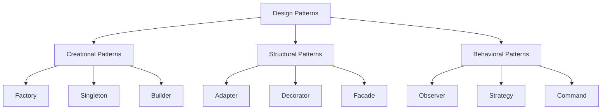

# PHP Design Patterns

## Introduction

Design patterns are proven solutions to recurring problems in software design. They represent best practices evolved over time by experienced software developers. By understanding and implementing design patterns, you can write more maintainable, scalable, and robust PHP code.

In this tutorial, we'll explore common design patterns and how to implement them in PHP. Whether you're building a small application or a large-scale system, these patterns will help you organize your code better and solve complex problems more elegantly.

## Why Use Design Patterns?

Before diving into specific patterns, let's understand why design patterns are valuable:

1. **Code Reusability**: Design patterns provide tested, proven development paradigms, reducing the need to reinvent solutions
2. **Common Vocabulary**: They establish a common language among developers, making collaboration easier
3. **Best Practices**: They incorporate principles of object-oriented design like encapsulation and separation of concerns
4. **Scalability**: They help create systems that can grow without becoming overly complex

## Types of Design Patterns

Design patterns are typically categorized into three main groups:



Let's explore each category with practical PHP examples.

## Creational Patterns

Creational patterns focus on object creation mechanisms, increasing flexibility and reuse of existing code.

### Factory Pattern

The Factory pattern provides an interface for creating objects without specifying their exact class.

#### Example Implementation

```php
<?php
// Step 1: Define a Product interface
interface DatabaseConnection {
    public function connect();
    public function query($sql);
    public function disconnect();
}

// Step 2: Create concrete products
class MySQLConnection implements DatabaseConnection {
    public function connect() {
        return "Connected to MySQL database";
    }
    
    public function query($sql) {
        return "Executing query on MySQL: " . $sql;
    }
    
    public function disconnect() {
        return "Disconnected from MySQL database";
    }
}

class PostgreSQLConnection implements DatabaseConnection {
    public function connect() {
        return "Connected to PostgreSQL database";
    }
    
    public function query($sql) {
        return "Executing query on PostgreSQL: " . $sql;
    }
    
    public function disconnect() {
        return "Disconnected from PostgreSQL database";
    }
}

// Step 3: Create the Factory
class DatabaseFactory {
    public static function createConnection($type) {
        switch ($type) {
            case 'mysql':
                return new MySQLConnection();
            case 'postgresql':
                return new PostgreSQLConnection();
            default:
                throw new Exception("Unsupported database type");
        }
    }
}

// Step 4: Client code
try {
    // Create a MySQL connection
    $mysql = DatabaseFactory::createConnection('mysql');
    echo $mysql->connect() . "
";
    echo $mysql->query("SELECT * FROM users") . "
";
    echo $mysql->disconnect() . "
";
    
    // Create a PostgreSQL connection
    $postgres = DatabaseFactory::createConnection('postgresql');
    echo $postgres->connect() . "
";
    echo $postgres->query("SELECT * FROM products") . "
";
    echo $postgres->disconnect() . "
";
} catch (Exception $e) {
    echo "Error: " . $e->getMessage();
}
```

#### Output
```
Connected to MySQL database
Executing query on MySQL: SELECT * FROM users
Disconnected from MySQL database
Connected to PostgreSQL database
Executing query on PostgreSQL: SELECT * FROM products
Disconnected from PostgreSQL database
```

#### Benefits

- Encapsulates object creation logic
- Makes it easy to add support for new database types
- Client code only needs to know the interface, not specific implementations

### Singleton Pattern

The Singleton pattern ensures a class has only one instance and provides a global point of access to it.

#### Example Implementation

```php
<?php
class Logger {
    private static $instance = null;
    private $logFile;
    private $logCount = 0;
    
    // Private constructor to prevent direct creation
    private function __construct() {
        $this->logFile = 'application.log';
        echo "Logger initialized with file: {$this->logFile}
";
    }
    
    // The static method to access the singleton instance
    public static function getInstance() {
        if (self::$instance === null) {
            self::$instance = new Logger();
        }
        
        return self::$instance;
    }
    
    public function log($message) {
        $this->logCount++;
        return "Writing to log ({$this->logCount}): $message";
    }
    
    // Prevent cloning
    private function __clone() {}
    
    // Prevent unserialization
    private function __wakeup() {}
}

// Client code
$logger1 = Logger::getInstance();
echo $logger1->log("User logged in") . "
";

$logger2 = Logger::getInstance();
echo $logger2->log("Database query executed") . "
";

// Prove that $logger1 and $logger2 are the same instance
if ($logger1 === $logger2) {
    echo "Both variables point to the same instance!
";
}
```

#### Output
```
Logger initialized with file: application.log
Writing to log (1): User logged in
Writing to log (2): Database query executed
Both variables point to the same instance!
```

#### Benefits

- Guarantees a single instance of the class
- Provides a global access point
- Lazy initialization - object is created only when needed

#### When to Use

Use Singleton when:
- Exactly one instance of a class is needed
- You need controlled access to a shared resource (file, database connection)

## Structural Patterns

Structural patterns deal with object composition, creating relationships between objects to form larger structures.

### Adapter Pattern

The Adapter pattern allows incompatible interfaces to work together.

#### Example Implementation

```php
<?php
// Step 1: Define the Target interface
interface PaymentProcessor {
    public function pay($amount);
}

// Step 2: Create the class that needs adapting (Adaptee)
class PayPalAPI {
    public function makePayment($dollars) {
        return "PayPal payment processed: $" . $dollars;
    }
}

class StripeAPI {
    public function processCharge($amount, $currency = 'USD') {
        return "Stripe charge processed: $amount $currency";
    }
}

// Step 3: Create adapters
class PayPalAdapter implements PaymentProcessor {
    private $paypal;
    
    public function __construct(PayPalAPI $paypal) {
        $this->paypal = $paypal;
    }
    
    public function pay($amount) {
        return $this->paypal->makePayment($amount);
    }
}

class StripeAdapter implements PaymentProcessor {
    private $stripe;
    
    public function __construct(StripeAPI $stripe) {
        $this->stripe = $stripe;
    }
    
    public function pay($amount) {
        return $this->stripe->processCharge($amount);
    }
}

// Step 4: Client code
function processPayment(PaymentProcessor $processor, $amount) {
    return $processor->pay($amount);
}

// Using the adapters
$paypal = new PayPalAdapter(new PayPalAPI());
echo processPayment($paypal, 100) . "
";

$stripe = new StripeAdapter(new StripeAPI());
echo processPayment($stripe, 200) . "
";
```

#### Output
```
PayPal payment processed: $100
Stripe charge processed: 200 USD
```

#### Benefits

- Enables reuse of existing classes without modification
- Allows classes with incompatible interfaces to work together
- Follows the Open/Closed Principle

### Decorator Pattern

The Decorator pattern attaches additional responsibilities to objects dynamically, providing a flexible alternative to subclassing.

#### Example Implementation

```php
<?php
// Step 1: Define the base Component interface
interface Notification {
    public function send($message);
}

// Step 2: Create a Concrete Component
class EmailNotification implements Notification {
    private $email;
    
    public function __construct($email) {
        $this->email = $email;
    }
    
    public function send($message) {
        return "EMAIL to {$this->email}: $message";
    }
}

// Step 3: Create the Decorator base class
abstract class NotificationDecorator implements Notification {
    protected $wrappedNotification;
    
    public function __construct(Notification $notification) {
        $this->wrappedNotification = $notification;
    }
    
    abstract public function send($message);
}

// Step 4: Create Concrete Decorators
class SMSDecorator extends NotificationDecorator {
    private $phoneNumber;
    
    public function __construct(Notification $notification, $phoneNumber) {
        parent::__construct($notification);
        $this->phoneNumber = $phoneNumber;
    }
    
    public function send($message) {
        return $this->wrappedNotification->send($message) . "
SMS to {$this->phoneNumber}: $message";
    }
}

class SlackDecorator extends NotificationDecorator {
    private $slackChannel;
    
    public function __construct(Notification $notification, $slackChannel) {
        parent::__construct($notification);
        $this->slackChannel = $slackChannel;
    }
    
    public function send($message) {
        return $this->wrappedNotification->send($message) . "
SLACK to {$this->slackChannel}: $message";
    }
}

// Step 5: Client code
// Basic email notification
$notification = new EmailNotification("user@example.com");
echo $notification->send("System update scheduled") . "

";

// Email + SMS notification
$notification = new SMSDecorator(
    new EmailNotification("user@example.com"),
    "+1234567890"
);
echo $notification->send("Critical system failure") . "

";

// Email + SMS + Slack notification
$notification = new SlackDecorator(
    new SMSDecorator(
        new EmailNotification("admin@example.com"),
        "+9876543210"
    ),
    "#system-alerts"
);
echo $notification->send("Server is down!");
```

#### Output
```
EMAIL to user@example.com: System update scheduled

EMAIL to user@example.com: Critical system failure
SMS to +1234567890: Critical system failure

EMAIL to admin@example.com: Server is down!
SMS to +9876543210: Server is down!
SLACK to #system-alerts: Server is down!
```

#### Benefits

- Adds functionality to objects dynamically
- Follows Single Responsibility Principle
- Provides flexibility not possible with static inheritance

## Behavioral Patterns

Behavioral patterns focus on communication between objects, how they interact and distribute responsibility.

### Observer Pattern

The Observer pattern defines a one-to-many dependency between objects, so that when one object changes state, all dependents are notified and updated automatically.

#### Example Implementation

```php
<?php
// Step 1: Define the Subject interface
interface Subject {
    public function attach(Observer $observer);
    public function detach(Observer $observer);
    public function notify();
}

// Step 2: Define the Observer interface
interface Observer {
    public function update(Subject $subject);
}

// Step 3: Create a Concrete Subject
class Product implements Subject {
    private $observers = [];
    private $name;
    private $price;
    private $availability;
    
    public function __construct($name, $price) {
        $this->name = $name;
        $this->price = $price;
        $this->availability = false;
    }
    
    public function attach(Observer $observer) {
        $this->observers[] = $observer;
    }
    
    public function detach(Observer $observer) {
        $key = array_search($observer, $this->observers, true);
        if ($key !== false) {
            unset($this->observers[$key]);
        }
    }
    
    public function notify() {
        foreach ($this->observers as $observer) {
            $observer->update($this);
        }
    }
    
    public function setAvailability($available) {
        $this->availability = $available;
        $this->notify();
    }
    
    public function getName() {
        return $this->name;
    }
    
    public function getPrice() {
        return $this->price;
    }
    
    public function isAvailable() {
        return $this->availability;
    }
}

// Step 4: Create Concrete Observers
class CustomerObserver implements Observer {
    private $name;
    
    public function __construct($name) {
        $this->name = $name;
    }
    
    public function update(Subject $subject) {
        if ($subject instanceof Product && $subject->isAvailable()) {
            return "Customer {$this->name} notified: {$subject->getName()} is now available!";
        }
    }
}

class InventoryObserver implements Observer {
    public function update(Subject $subject) {
        if ($subject instanceof Product) {
            $status = $subject->isAvailable() ? "in stock" : "out of stock";
            return "Inventory updated: {$subject->getName()} is now $status";
        }
    }
}

// Step 5: Client code
$iPhone = new Product("iPhone 14", 999);

$customer1 = new CustomerObserver("John");
$customer2 = new CustomerObserver("Alice");
$inventory = new InventoryObserver();

$iPhone->attach($customer1);
$iPhone->attach($customer2);
$iPhone->attach($inventory);

// Initially, iPhone is unavailable
echo "Setting iPhone as available:
";
$result = $iPhone->setAvailability(true);

// Display observer notifications
foreach ($iPhone->observers as $observer) {
    echo $observer->update($iPhone) . "
";
}

// Change availability again
echo "
Setting iPhone as unavailable:
";
$iPhone->setAvailability(false);

// Display observer notifications
foreach ($iPhone->observers as $observer) {
    $message = $observer->update($iPhone);
    if ($message) {
        echo $message . "
";
    }
}
```

#### Output
```
Setting iPhone as available:
Customer John notified: iPhone 14 is now available!
Customer Alice notified: iPhone 14 is now available!
Inventory updated: iPhone 14 is now in stock

Setting iPhone as unavailable:
Inventory updated: iPhone 14 is now out of stock
```

#### Benefits

- Supports the principle of loose coupling
- Allows sending data to many objects efficiently
- Enables dynamic relationships between objects

### Strategy Pattern

The Strategy pattern defines a family of algorithms, encapsulates each one, and makes them interchangeable.

#### Example Implementation

```php
<?php
// Step 1: Define the Strategy interface
interface PaymentStrategy {
    public function pay($amount);
}

// Step 2: Create Concrete Strategies
class CreditCardPayment implements PaymentStrategy {
    private $name;
    private $cardNumber;
    private $cvv;
    private $expiryDate;
    
    public function __construct($name, $cardNumber, $cvv, $expiryDate) {
        $this->name = $name;
        $this->cardNumber = $cardNumber;
        $this->cvv = $cvv;
        $this->expiryDate = $expiryDate;
    }
    
    public function pay($amount) {
        // Mask card number for privacy
        $maskedCard = "xxxx-xxxx-xxxx-" . substr($this->cardNumber, -4);
        return "Paid $amount using Credit Card ($maskedCard)";
    }
}

class PayPalPayment implements PaymentStrategy {
    private $email;
    private $password;
    
    public function __construct($email, $password) {
        $this->email = $email;
        $this->password = $password;
    }
    
    public function pay($amount) {
        return "Paid $amount using PayPal ({$this->email})";
    }
}

class BankTransferPayment implements PaymentStrategy {
    private $accountNumber;
    private $bankCode;
    
    public function __construct($accountNumber, $bankCode) {
        $this->accountNumber = $accountNumber;
        $this->bankCode = $bankCode;
    }
    
    public function pay($amount) {
        return "Paid $amount using Bank Transfer (Account: {$this->accountNumber})";
    }
}

// Step 3: Create the Context
class ShoppingCart {
    private $products = [];
    private $paymentStrategy;
    
    public function setPaymentStrategy(PaymentStrategy $paymentStrategy) {
        $this->paymentStrategy = $paymentStrategy;
    }
    
    public function addProduct($product, $price) {
        $this->products[$product] = $price;
    }
    
    public function calculateTotal() {
        return array_sum($this->products);
    }
    
    public function checkout() {
        $amount = $this->calculateTotal();
        return $this->paymentStrategy->pay($amount);
    }
}

// Step 4: Client code
$cart = new ShoppingCart();
$cart->addProduct("PHP Design Patterns Book", 29.99);
$cart->addProduct("PHP IDE License", 89.99);

// Pay with Credit Card
$cart->setPaymentStrategy(new CreditCardPayment("John Doe", "1234567890123456", "123", "12/25"));
echo $cart->checkout() . "
";

// Pay with PayPal
$cart->setPaymentStrategy(new PayPalPayment("john.doe@example.com", "password"));
echo $cart->checkout() . "
";

// Pay with Bank Transfer
$cart->setPaymentStrategy(new BankTransferPayment("9876543210", "BANK123"));
echo $cart->checkout() . "
";
```

#### Output
```
Paid 119.98 using Credit Card (xxxx-xxxx-xxxx-3456)
Paid 119.98 using PayPal (john.doe@example.com)
Paid 119.98 using Bank Transfer (Account: 9876543210)
```

#### Benefits

- Defines a family of interchangeable algorithms
- Eliminates conditional statements
- Allows the algorithm to vary independently from clients that use it

## Best Practices for Using Design Patterns

When implementing design patterns in PHP, keep these guidelines in mind:

1. **Don't force patterns**: Use a pattern only when it solves a problem you have, not just because it's a pattern
2. **Understand the problem first**: Choose the pattern that fits your situation, not the other way around
3. **Keep it simple**: Sometimes a simpler solution is better than a complex pattern
4. **Combine patterns**: Design patterns often work well together to solve complex problems
5. **Document your patterns**: Make sure other developers understand why and how you're using a pattern

## Real-World Application: Building a Content Management System

Let's see how multiple design patterns can work together in a real-world scenario:

```php
<?php
// Factory Pattern for creating content types
interface ContentFactory {
    public function createContent($data);
}

class ArticleFactory implements ContentFactory {
    public function createContent($data) {
        return new Article($data['title'], $data['body'], $data['author']);
    }
}

class VideoFactory implements ContentFactory {
    public function createContent($data) {
        return new Video($data['title'], $data['url'], $data['duration']);
    }
}

// Strategy Pattern for different content rendering approaches
interface RenderStrategy {
    public function render($content);
}

class HTMLRenderer implements RenderStrategy {
    public function render($content) {
        return $content->toHTML();
    }
}

class JSONRenderer implements RenderStrategy {
    public function render($content) {
        return $content->toJSON();
    }
}

// Observer Pattern for content events
interface ContentObserver {
    public function update($content, $event);
}

class Logger implements ContentObserver {
    public function update($content, $event) {
        return "Logged: $event on " . $content->getTitle();
    }
}

class Notifier implements ContentObserver {
    public function update($content, $event) {
        if ($event === 'publish') {
            return "Notification: New content published - " . $content->getTitle();
        }
        return null;
    }
}

// Base Content class and concrete implementations
abstract class Content {
    protected $title;
    protected $observers = [];
    
    public function attach(ContentObserver $observer) {
        $this->observers[] = $observer;
    }
    
    public function notify($event) {
        $notifications = [];
        foreach ($this->observers as $observer) {
            $notification = $observer->update($this, $event);
            if ($notification) {
                $notifications[] = $notification;
            }
        }
        return $notifications;
    }
    
    public function getTitle() {
        return $this->title;
    }
    
    abstract public function toHTML();
    abstract public function toJSON();
}

class Article extends Content {
    private $body;
    private $author;
    
    public function __construct($title, $body, $author) {
        $this->title = $title;
        $this->body = $body;
        $this->author = $author;
    }
    
    public function toHTML() {
        return "<article>
            <h1>{$this->title}</h1>
            <p class='author'>By {$this->author}</p>
            <div class='content'>{$this->body}</div>
        </article>";
    }
    
    public function toJSON() {
        return json_encode([
            'type' => 'article',
            'title' => $this->title,
            'author' => $this->author,
            'body' => $this->body
        ]);
    }
}

class Video extends Content {
    private $url;
    private $duration;
    
    public function __construct($title, $url, $duration) {
        $this->title = $title;
        $this->url = $url;
        $this->duration = $duration;
    }
    
    public function toHTML() {
        return "<div class='video'>
            <h2>{$this->title}</h2>
            <p>Duration: {$this->duration}</p>
            <iframe src='{$this->url}'></iframe>
        </div>";
    }
    
    public function toJSON() {
        return json_encode([
            'type' => 'video',
            'title' => $this->title,
            'url' => $this->url,
            'duration' => $this->duration
        ]);
    }
}

// CMS Class that uses the patterns
class CMS {
    private $contentFactory;
    private $renderStrategy;
    
    public function setContentFactory(ContentFactory $factory) {
        $this->contentFactory = $factory;
    }
    
    public function setRenderStrategy(RenderStrategy $strategy) {
        $this->renderStrategy = $strategy;
    }
    
    public function createContent($data) {
        $content = $this->contentFactory->createContent($data);
        
        // Add default observers
        $content->attach(new Logger());
        $content->attach(new Notifier());
        
        return $content;
    }
    
    public function publishContent($content) {
        $notifications = $content->notify('publish');
        $rendered = $this->renderStrategy->render($content);
        
        return [
            'content' => $rendered,
            'notifications' => $notifications
        ];
    }
}

// Example usage
$cms = new CMS();

// Create an article
$cms->setContentFactory(new ArticleFactory());
$cms->setRenderStrategy(new HTMLRenderer());

$articleData = [
    'title' => 'Understanding PHP Design Patterns',
    'body' => 'Design patterns are solutions to common problems in software design...',
    'author' => 'John Developer'
];

$article = $cms->createContent($articleData);
$articleResult = $cms->publishContent($article);

echo "Article HTML Output:
";
echo $articleResult['content'] . "

";

echo "Notifications:
";
foreach ($articleResult['notifications'] as $notification) {
    echo "- $notification
";
}

echo "
";

// Create a video with JSON rendering
$cms->setContentFactory(new VideoFactory());
$cms->setRenderStrategy(new JSONRenderer());

$videoData = [
    'title' => 'PHP Design Patterns Tutorial',
    'url' => 'https://example.com/videos/php-patterns',
    'duration' => '10:30'
];

$video = $cms->createContent($videoData);
$videoResult = $cms->publishContent($video);

echo "Video JSON Output:
";
echo $videoResult['content'] . "

";

echo "Notifications:
";
foreach ($videoResult['notifications'] as $notification) {
    echo "- $notification
";
}
```

#### Example Output
```
Article HTML Output:
<article>
    <h1>Understanding PHP Design Patterns</h1>
    <p class='author'>By John Developer</p>
    <div class='content'>Design patterns are solutions to common problems in software design...</div>
</article>

Notifications:
- Logged: publish on Understanding PHP Design Patterns
- Notification: New content published - Understanding PHP Design Patterns

Video JSON Output:
{"type":"video","title":"PHP Design Patterns Tutorial","url":"https://example.com/videos/php-patterns","duration":"10:30"}

Notifications:
- Logged: publish on PHP Design Patterns Tutorial
- Notification: New content published - PHP Design Patterns Tutorial
```

## Summary

Design patterns are powerful tools for writing better PHP code. In this guide, we've explored:

1. **Creational Patterns**:
   - Factory Pattern for flexible object creation
   - Singleton Pattern for controlled instance management

2. **Structural Patterns**:
   - Adapter Pattern for making incompatible interfaces work together
   - Decorator Pattern for adding functionality to objects dynamically

3. **Behavioral Patterns**:
   - Observer Pattern for implementing event handling systems
   - Strategy Pattern for swappable algorithms

By learning to recognize situations where these patterns apply and implementing them correctly, you'll be able to create more maintainable, flexible, and robust PHP applications.

## Additional Resources

To deepen your understanding of PHP design patterns:

- **Books**:
  - "Design Patterns: Elements of Reusable Object-Oriented Software" by Gang of Four
  - "Learning PHP Design Patterns" by William Sanders

- **Online Resources**:
  - [PHP: The Right Way](https://phptherightway.com/)
  - [Refactoring Guru - Design Patterns](https://refactoring.guru/design-patterns/php)

## Exercises

1. **Practice Factory Pattern**: Create a form element factory that can create different HTML form controls (text inputs, select boxes, checkboxes)

2. **Extend the Decorator**: Add a new decorator to the notification system that sends messages via a webhook

3. **Combined Patterns**: Develop a simple logging system that uses Singleton for global access and Strategy for different output formats (file, database, API)

4. **Custom Pattern**: Identify a recurring problem in your own PHP code and design a pattern-based solution