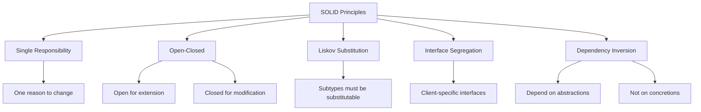

# PHP SOLID Principles

## Introduction

SOLID is an acronym for five object-oriented design principles that, when applied together, make your code more maintainable, flexible, and easier to understand. These principles were introduced by Robert C. Martin (Uncle Bob) and have become fundamental guidelines for developing robust software systems.

Whether you're building a small website or a complex application, following SOLID principles can significantly improve your code quality and make future changes less painful. In this guide, we'll explore each principle with PHP examples and practical applications.

## The SOLID Principles

SOLID stands for:

- **S**: Single Responsibility Principle
- **O**: Open-Closed Principle
- **L**: Liskov Substitution Principle
- **I**: Interface Segregation Principle
- **D**: Dependency Inversion Principle

Let's dive into each principle in detail.

## Single Responsibility Principle (SRP)

### What is it?

> A class should have only one reason to change.

This means a class should have only one job or responsibility. If a class handles multiple responsibilities, it becomes coupled in multiple ways, making it more fragile to changes.

### Example without SRP

```php
class User {
    private $name;
    private $email;
    
    public function __construct($name, $email) {
        $this->name = $name;
        $this->email = $email;
    }
    
    public function getName() {
        return $this->name;
    }
    
    public function getEmail() {
        return $this->email;
    }
    
    public function saveToDatabase() {
        // Connect to database
        $db = new Database();
        
        // Save user data to database
        $query = "INSERT INTO users (name, email) VALUES ('{$this->name}', '{$this->email}')";
        $db->execute($query);
        
        echo "User saved to database";
    }
    
    public function sendWelcomeEmail() {
        // Connect to email service
        $emailService = new EmailService();
        
        // Send email
        $subject = "Welcome to our platform";
        $body = "Hi {$this->name}, welcome to our platform!";
        $emailService->send($this->email, $subject, $body);
        
        echo "Welcome email sent";
    }
}

// Usage
$user = new User("John Doe", "john@example.com");
$user->saveToDatabase();
$user->sendWelcomeEmail();
```

Here, the `User` class is doing too much. It's responsible for:
1. Managing user data
2. Database operations
3. Email operations

### Example with SRP

```php
class User {
    private $name;
    private $email;
    
    public function __construct($name, $email) {
        $this->name = $name;
        $this->email = $email;
    }
    
    public function getName() {
        return $this->name;
    }
    
    public function getEmail() {
        return $this->email;
    }
}

class UserRepository {
    private $db;
    
    public function __construct(Database $db) {
        $this->db = $db;
    }
    
    public function save(User $user) {
        $query = "INSERT INTO users (name, email) VALUES ('{$user->getName()}', '{$user->getEmail()}')";
        $this->db->execute($query);
        
        return "User saved to database";
    }
}

class EmailService {
    public function sendWelcomeEmail(User $user) {
        // Connect to email service
        $subject = "Welcome to our platform";
        $body = "Hi {$user->getName()}, welcome to our platform!";
        
        // Send email logic
        $result = mail($user->getEmail(), $subject, $body);
        
        return $result ? "Welcome email sent" : "Failed to send email";
    }
}

// Usage
$user = new User("John Doe", "john@example.com");

$userRepository = new UserRepository(new Database());
echo $userRepository->save($user);

$emailService = new EmailService();
echo $emailService->sendWelcomeEmail($user);
```

Now each class has a single responsibility:
- `User` manages user data
- `UserRepository` handles database operations
- `EmailService` handles email operations

### Benefits of SRP

1. **Easier to understand**: Each class has a clearly defined purpose
2. **Easier to modify**: Changes to one aspect (e.g., database logic) don't affect other aspects
3. **Better testability**: You can test each component in isolation
4. **Better reusability**: Components can be reused in different contexts

## Open-Closed Principle (OCP)

### What is it?

> Software entities should be open for extension but closed for modification.

This means you should be able to add new functionality without changing existing code. You achieve this through abstractions and polymorphism.

### Example without OCP

```php
class Rectangle {
    protected $width;
    protected $height;
    
    public function __construct($width, $height) {
        $this->width = $width;
        $this->height = $height;
    }
    
    public function getWidth() {
        return $this->width;
    }
    
    public function getHeight() {
        return $this->height;
    }
}

class Circle {
    protected $radius;
    
    public function __construct($radius) {
        $this->radius = $radius;
    }
    
    public function getRadius() {
        return $this->radius;
    }
}

class AreaCalculator {
    public function calculateArea($shape) {
        if ($shape instanceof Rectangle) {
            return $shape->getWidth() * $shape->getHeight();
        } else if ($shape instanceof Circle) {
            return pi() * $shape->getRadius() * $shape->getRadius();
        }
        
        throw new Exception("Unsupported shape");
    }
}

// Usage
$rectangle = new Rectangle(5, 10);
$circle = new Circle(7);

$calculator = new AreaCalculator();
echo "Rectangle area: " . $calculator->calculateArea($rectangle) . "
";
echo "Circle area: " . $calculator->calculateArea($circle) . "
";
```

The problem? If we want to add a new shape, we have to modify the `AreaCalculator` class, violating OCP.

### Example with OCP

```php
interface Shape {
    public function calculateArea();
}

class Rectangle implements Shape {
    protected $width;
    protected $height;
    
    public function __construct($width, $height) {
        $this->width = $width;
        $this->height = $height;
    }
    
    public function calculateArea() {
        return $this->width * $this->height;
    }
}

class Circle implements Shape {
    protected $radius;
    
    public function __construct($radius) {
        $this->radius = $radius;
    }
    
    public function calculateArea() {
        return pi() * $this->radius * $this->radius;
    }
}

class AreaCalculator {
    public function calculateArea(Shape $shape) {
        return $shape->calculateArea();
    }
}

// Usage
$rectangle = new Rectangle(5, 10);
$circle = new Circle(7);

$calculator = new AreaCalculator();
echo "Rectangle area: " . $calculator->calculateArea($rectangle) . "
";
echo "Circle area: " . $calculator->calculateArea($circle) . "
";

// Adding a new shape without modifying existing code
class Triangle implements Shape {
    protected $base;
    protected $height;
    
    public function __construct($base, $height) {
        $this->base = $base;
        $this->height = $height;
    }
    
    public function calculateArea() {
        return 0.5 * $this->base * $this->height;
    }
}

$triangle = new Triangle(10, 5);
echo "Triangle area: " . $calculator->calculateArea($triangle) . "
";
```

Now we can add new shapes without modifying the `AreaCalculator` class. The `Shape` interface acts as an abstraction layer.

### Benefits of OCP

1. **Reduced risk of bugs**: No need to change existing, tested code
2. **Easier maintenance**: New functionality is added through new code
3. **Better extensibility**: System is designed to accommodate changes
4. **Improved modularity**: Components are decoupled from each other

## Liskov Substitution Principle (LSP)

### What is it?

> Subtypes must be substitutable for their base types without altering the correctness of the program.

This means that objects of a superclass should be replaceable with objects of a subclass without affecting the functionality of the program.

### Example without LSP

```php
class Rectangle {
    protected $width;
    protected $height;
    
    public function setWidth($width) {
        $this->width = $width;
    }
    
    public function setHeight($height) {
        $this->height = $height;
    }
    
    public function getWidth() {
        return $this->width;
    }
    
    public function getHeight() {
        return $this->height;
    }
    
    public function getArea() {
        return $this->width * $this->height;
    }
}

class Square extends Rectangle {
    public function setWidth($width) {
        $this->width = $width;
        $this->height = $width;
    }
    
    public function setHeight($height) {
        $this->width = $height;
        $this->height = $height;
    }
}

// Usage
function printArea(Rectangle $rectangle) {
    $rectangle->setWidth(5);
    $rectangle->setHeight(10);
    
    echo "Area should be 50, got: " . $rectangle->getArea() . "
";
}

$rectangle = new Rectangle();
printArea($rectangle); // Output: Area should be 50, got: 50

$square = new Square();
printArea($square); // Output: Area should be 50, got: 100 - Incorrect!
```

This violates LSP because a `Square` cannot be substituted for a `Rectangle` without breaking the expected behavior. When we set the height of a square, we're also changing its width.

### Example with LSP

```php
interface Shape {
    public function getArea();
}

class Rectangle implements Shape {
    protected $width;
    protected $height;
    
    public function __construct($width, $height) {
        $this->width = $width;
        $this->height = $height;
    }
    
    public function getArea() {
        return $this->width * $this->height;
    }
}

class Square implements Shape {
    protected $side;
    
    public function __construct($side) {
        $this->side = $side;
    }
    
    public function getArea() {
        return $this->side * $this->side;
    }
}

// Usage
function printArea(Shape $shape) {
    echo "Area: " . $shape->getArea() . "
";
}

$rectangle = new Rectangle(5, 10);
printArea($rectangle); // Output: Area: 50

$square = new Square(5);
printArea($square); // Output: Area: 25
```

In this refactored example, both `Rectangle` and `Square` implement the `Shape` interface, but they're not in an inheritance relationship. This maintains LSP because we're replacing the hierarchy with composition.

### Benefits of LSP

1. **Predictable behavior**: Subtypes behave as expected when used through base type references
2. **Robust code**: Prevents unexpected side effects when using polymorphism
3. **Better abstractions**: Forces you to create proper abstractions and hierarchies
4. **Improved testability**: Code that adheres to LSP is easier to test in isolation

## Interface Segregation Principle (ISP)

### What is it?

> Clients should not be forced to depend on interfaces they do not use.

This means that it's better to have many specific interfaces rather than a single general-purpose interface.

### Example without ISP

```php
interface Worker {
    public function work();
    public function eat();
    public function sleep();
}

class Human implements Worker {
    public function work() {
        echo "Human working
";
    }
    
    public function eat() {
        echo "Human eating
";
    }
    
    public function sleep() {
        echo "Human sleeping
";
    }
}

class Robot implements Worker {
    public function work() {
        echo "Robot working
";
    }
    
    public function eat() {
        // Robots don't eat, but forced to implement this method
        throw new Exception("Robots don't eat");
    }
    
    public function sleep() {
        // Robots don't sleep, but forced to implement this method
        throw new Exception("Robots don't sleep");
    }
}

// Usage
function manageWorker(Worker $worker) {
    $worker->work();
    $worker->eat();  // This will fail for robots
    $worker->sleep(); // This will fail for robots
}

$human = new Human();
manageWorker($human); // Works fine

$robot = new Robot();
manageWorker($robot); // Throws exceptions
```

The `Robot` class is forced to implement methods it doesn't need, violating ISP.

### Example with ISP

```php
interface Workable {
    public function work();
}

interface Eatable {
    public function eat();
}

interface Sleepable {
    public function sleep();
}

class Human implements Workable, Eatable, Sleepable {
    public function work() {
        echo "Human working
";
    }
    
    public function eat() {
        echo "Human eating
";
    }
    
    public function sleep() {
        echo "Human sleeping
";
    }
}

class Robot implements Workable {
    public function work() {
        echo "Robot working
";
    }
}

// Usage
function makeWork(Workable $worker) {
    $worker->work();
}

function makeEat(Eatable $eater) {
    $eater->eat();
}

function makeSleep(Sleepable $sleeper) {
    $sleeper->sleep();
}

$human = new Human();
makeWork($human);
makeEat($human);
makeSleep($human);

$robot = new Robot();
makeWork($robot);
// Can't call makeEat() or makeSleep() on $robot, which is good
```

Now we have segregated the interfaces based on functionality, and classes only implement what they need.

### Benefits of ISP

1. **Focused interfaces**: Classes only need to implement methods relevant to them
2. **Higher cohesion**: Interfaces contain only related methods
3. **Reduced coupling**: Dependencies are more specific and targeted
4. **Better flexibility**: Easier to mix and match capabilities through multiple interfaces

## Dependency Inversion Principle (DIP)

### What is it?

> High-level modules should not depend on low-level modules. Both should depend on abstractions.
> Abstractions should not depend on details. Details should depend on abstractions.

This principle is about decoupling modules and promoting the use of interfaces or abstract classes.

### Example without DIP

```php
class MySQLDatabase {
    public function connect() {
        // Connect to MySQL
        echo "Connected to MySQL
";
    }
    
    public function query($sql) {
        echo "Executing query: $sql
";
        // Execute query
        return ["sample data"];
    }
}

class UserRepository {
    private $database;
    
    public function __construct() {
        $this->database = new MySQLDatabase();
    }
    
    public function getUsers() {
        $this->database->connect();
        return $this->database->query("SELECT * FROM users");
    }
}

// Usage
$userRepository = new UserRepository();
$users = $userRepository->getUsers();
print_r($users);
```

The `UserRepository` class directly depends on the `MySQLDatabase` class. If we want to switch to a different database, we'd have to modify the `UserRepository` class.

### Example with DIP

```php
interface DatabaseInterface {
    public function connect();
    public function query($sql);
}

class MySQLDatabase implements DatabaseInterface {
    public function connect() {
        // Connect to MySQL
        echo "Connected to MySQL
";
    }
    
    public function query($sql) {
        echo "Executing MySQL query: $sql
";
        // Execute query
        return ["sample data from MySQL"];
    }
}

class PostgreSQLDatabase implements DatabaseInterface {
    public function connect() {
        // Connect to PostgreSQL
        echo "Connected to PostgreSQL
";
    }
    
    public function query($sql) {
        echo "Executing PostgreSQL query: $sql
";
        // Execute query
        return ["sample data from PostgreSQL"];
    }
}

class UserRepository {
    private $database;
    
    public function __construct(DatabaseInterface $database) {
        $this->database = $database;
    }
    
    public function getUsers() {
        $this->database->connect();
        return $this->database->query("SELECT * FROM users");
    }
}

// Usage with MySQL
$mysqlDatabase = new MySQLDatabase();
$userRepository = new UserRepository($mysqlDatabase);
$users = $userRepository->getUsers();
print_r($users);

// Usage with PostgreSQL
$postgresDatabase = new PostgreSQLDatabase();
$userRepository = new UserRepository($postgresDatabase);
$users = $userRepository->getUsers();
print_r($users);
```

Now, `UserRepository` depends on the `DatabaseInterface` abstraction, not on concrete implementations. This allows us to easily switch between different database types.

### Benefits of DIP

1. **Flexibility**: Systems can easily adapt to changes in external components
2. **Testability**: Dependencies can be mocked for testing
3. **Decoupling**: Changes in one part of the system have minimal impact on other parts
4. **Scalability**: System components can evolve independently

## Visualizing SOLID Principles

Here's a diagram showing how the SOLID principles work together:



## Real-World Application: Building a Payment Processing System

Let's apply SOLID principles to a real-world example of a payment processing system:

```php
// 1. Define interfaces (abstractions)
interface PaymentMethodInterface {
    public function processPayment($amount);
    public function validatePayment();
}

interface PaymentNotifierInterface {
    public function sendConfirmation($paymentDetails);
}

interface LoggerInterface {
    public function logTransaction($transaction);
}

// 2. Implement concrete classes
class CreditCardPayment implements PaymentMethodInterface {
    private $cardNumber;
    private $expiryDate;
    private $cvv;
    
    public function __construct($cardNumber, $expiryDate, $cvv) {
        $this->cardNumber = $cardNumber;
        $this->expiryDate = $expiryDate;
        $this->cvv = $cvv;
    }
    
    public function processPayment($amount) {
        // Process credit card payment
        echo "Processing credit card payment of $amount
";
        return [
            'success' => true,
            'transaction_id' => 'cc_' . uniqid(),
            'amount' => $amount,
            'method' => 'credit_card',
            'timestamp' => date('Y-m-d H:i:s')
        ];
    }
    
    public function validatePayment() {
        // Validate credit card details
        return strlen($this->cardNumber) === 16 && 
               !empty($this->expiryDate) && 
               strlen($this->cvv) === 3;
    }
}

class PayPalPayment implements PaymentMethodInterface {
    private $email;
    private $password;
    
    public function __construct($email, $password) {
        $this->email = $email;
        $this->password = $password;
    }
    
    public function processPayment($amount) {
        // Process PayPal payment
        echo "Processing PayPal payment of $amount
";
        return [
            'success' => true,
            'transaction_id' => 'pp_' . uniqid(),
            'amount' => $amount,
            'method' => 'paypal',
            'timestamp' => date('Y-m-d H:i:s')
        ];
    }
    
    public function validatePayment() {
        // Validate PayPal credentials
        return filter_var($this->email, FILTER_VALIDATE_EMAIL) && 
               !empty($this->password);
    }
}

class EmailNotifier implements PaymentNotifierInterface {
    public function sendConfirmation($paymentDetails) {
        // Send email confirmation
        echo "Sending email confirmation for transaction {$paymentDetails['transaction_id']}
";
        return true;
    }
}

class SMSNotifier implements PaymentNotifierInterface {
    public function sendConfirmation($paymentDetails) {
        // Send SMS confirmation
        echo "Sending SMS confirmation for transaction {$paymentDetails['transaction_id']}
";
        return true;
    }
}

class FileLogger implements LoggerInterface {
    public function logTransaction($transaction) {
        // Log transaction to file
        echo "Logging transaction {$transaction['transaction_id']} to file
";
        return true;
    }
}

class DatabaseLogger implements LoggerInterface {
    public function logTransaction($transaction) {
        // Log transaction to database
        echo "Logging transaction {$transaction['transaction_id']} to database
";
        return true;
    }
}

// 3. Payment processor (high-level module)
class PaymentProcessor {
    private $paymentMethod;
    private $notifier;
    private $logger;
    
    public function __construct(
        PaymentMethodInterface $paymentMethod,
        PaymentNotifierInterface $notifier,
        LoggerInterface $logger
    ) {
        $this->paymentMethod = $paymentMethod;
        $this->notifier = $notifier;
        $this->logger = $logger;
    }
    
    public function processPayment($amount) {
        // Validate payment
        if (!$this->paymentMethod->validatePayment()) {
            throw new Exception("Invalid payment details");
        }
        
        // Process payment
        $paymentDetails = $this->paymentMethod->processPayment($amount);
        
        // Send confirmation
        $this->notifier->sendConfirmation($paymentDetails);
        
        // Log transaction
        $this->logger->logTransaction($paymentDetails);
        
        return $paymentDetails;
    }
}

// 4. Usage
try {
    // Using credit card with email notification and file logging
    $paymentMethod = new CreditCardPayment('1234567890123456', '12/25', '123');
    $notifier = new EmailNotifier();
    $logger = new FileLogger();
    
    $processor = new PaymentProcessor($paymentMethod, $notifier, $logger);
    $result = $processor->processPayment(99.99);
    
    print_r($result);
    
    echo "
";
    
    // Using PayPal with SMS notification and database logging
    $paymentMethod = new PayPalPayment('user@example.com', 'password123');
    $notifier = new SMSNotifier();
    $logger = new DatabaseLogger();
    
    $processor = new PaymentProcessor($paymentMethod, $notifier, $logger);
    $result = $processor->processPayment(149.99);
    
    print_r($result);
} catch (Exception $e) {
    echo "Error: " . $e->getMessage();
}
```

### SOLID Principles in the Payment System

1. **Single Responsibility Principle**:
   - Each class has a single purpose
   - Payment methods handle payment processing
   - Notifiers handle sending confirmations
   - Loggers handle transaction logging

2. **Open-Closed Principle**:
   - We can add new payment methods, notifiers, or loggers without modifying existing code
   - The `PaymentProcessor` doesn't need to change when we add a new payment method

3. **Liskov Substitution Principle**:
   - All payment methods can be used interchangeably through the `PaymentMethodInterface`
   - All notifiers can be used interchangeably through the `PaymentNotifierInterface`
   - All loggers can be used interchangeably through the `LoggerInterface`

4. **Interface Segregation Principle**:
   - Interfaces are specific to their purpose
   - Payment methods don't need to implement notification or logging methods

5. **Dependency Inversion Principle**:
   - `PaymentProcessor` depends on abstractions (interfaces), not concrete implementations
   - This allows us to easily swap components without modifying the processor

## Summary

The SOLID principles provide a foundation for creating maintainable, flexible, and robust object-oriented PHP code:

1. **Single Responsibility Principle (SRP)**: A class should have only one reason to change
2. **Open-Closed Principle (OCP)**: Software entities should be open for extension but closed for modification
3. **Liskov Substitution Principle (LSP)**: Subtypes must be substitutable for their base types
4. **Interface Segregation Principle (ISP)**: Clients should not be forced to depend on interfaces they do not use
5. **Dependency Inversion Principle (DIP)**: High-level modules should not depend on low-level modules; both should depend on abstractions

By applying these principles, you can:
- Reduce code complexity
- Improve maintainability
- Increase code reusability
- Make testing easier
- Create more flexible systems

## Additional Resources

To deepen your understanding of SOLID principles:

1. **Books**:
   - "Clean Code" by Robert C. Martin
   - "Agile Software Development, Principles, Patterns, and Practices" by Robert C. Martin

2. **Online Resources**:
   - [PHP The Right Way](https://phptherightway.com/)
   - [Laracasts SOLID Principles Course](https://laracasts.com/series/solid-principles-in-php)
   - [Symfony Best Practices](https://symfony.com/doc/current/best_practices.html)

## Exercises

1. **Refactor a Class**: Take an existing class that has multiple responsibilities and refactor it according to SRP.
2. **Extend a System**: Add a new feature to an existing system without modifying existing code (OCP).
3. **Design Interfaces**: Create interfaces for a system that follow ISP principles.
4. **Build a Module**: Create a module that depends on abstractions rather than concrete implementations (DIP).
5. **Test Inheritance**: Ensure that your class hierarchies follow LSP by creating tests that work with both base classes and their derivatives.

By consistently applying SOLID principles, you'll develop better coding habits and create more maintainable PHP applications. Remember that these principles are guidelines, not strict rules, and should be applied thoughtfully based on the specific needs of your project.