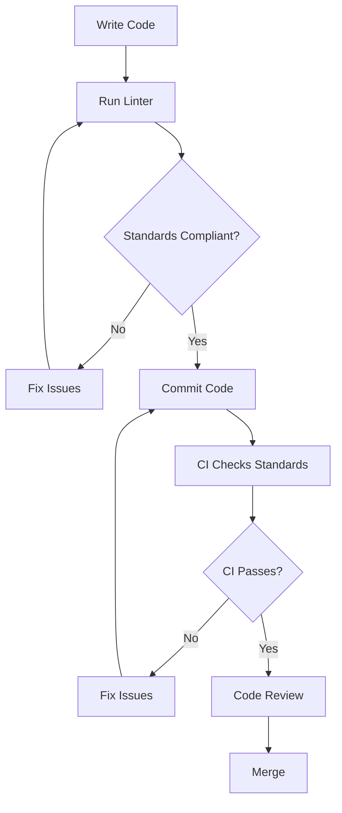

# PHP Code Standards

## Introduction

Writing code that works is just the first step in becoming a proficient PHP developer. Learning to write clean, maintainable, and consistent code is equally important. PHP code standards are agreed-upon guidelines that help developers create code that is easier to read, share, and maintain.

In this guide, we'll explore why coding standards matter, the most widely accepted PHP standards, and how to implement them in your projects.

## Why Code Standards Matter

Before diving into specific standards, let's understand why they're important:

1. **Readability**: Standardized code is easier to read and understand, not just for you but for anyone who might work with your code.
2. **Maintainability**: Following consistent patterns makes it easier to update and debug code.
3. **Collaboration**: When everyone on a team follows the same standards, collaboration becomes smoother.
4. **Professionalism**: Clean, well-formatted code reflects professionalism and attention to detail.

Think of code standards as a common language that helps developers communicate more effectively through their code.

## PHP Standards Recommendations (PSR)

The PHP Framework Interop Group (PHP-FIG) created a set of PHP Standards Recommendations (PSRs) that have become widely adopted in the PHP community.

### PSR-1: Basic Coding Standard

PSR-1 covers the basic elements that should be considered standard when writing PHP code.

Key points include:

- Files MUST use only `<?php` and `<?=` tags
- Files MUST use only UTF-8 without BOM for PHP code
- Files SHOULD either declare symbols (classes, functions, constants, etc.) OR cause side-effects (e.g., generate output, change .ini settings, etc.) but SHOULD NOT do both
- Namespaces and classes MUST follow PSR-4 autoloading standard
- Class names MUST be declared in `StudlyCaps`
- Class constants MUST be declared in all upper case with underscore separators
- Method names MUST be declared in `camelCase`

Example of PSR-1 compliant code:

```php
<?php
namespace Vendor\Package;

class StudlyCapsClass
{
    const VERSION = '1.0';
    const DATE_APPROVED = '2023-04-12';
    
    public function camelCaseMethod()
    {
        // method body
    }
}
```

### PSR-2: Coding Style Guide (Replaced by PSR-12)

PSR-2 has been replaced by PSR-12, but it's worth mentioning as you might still encounter references to it. It expanded on PSR-1 with more detailed formatting rules.

### PSR-12: Extended Coding Style Guide

PSR-12 is the current coding style guide, extending and expanding on PSR-1 and PSR-2.

Key points include:

- Code MUST follow PSR-1
- All PHP files MUST use Unix LF line endings
- All PHP files MUST end with a non-blank line, terminated with a single LF
- The closing `?>` tag MUST be omitted from files containing only PHP
- Lines SHOULD NOT be longer than 120 characters
- There MUST be one blank line after the namespace declaration
- Opening braces for classes MUST go on the next line
- Opening braces for methods MUST go on the next line
- Visibility MUST be declared on all properties and methods
- The keyword `elseif` SHOULD be used instead of `else if`
- Control structure keywords MUST have one space after them
- Opening parentheses for control structures MUST NOT have a space after them
- Closing parentheses for control structures MUST NOT have a space before them

Let's see a PSR-12 compliant example:

```php
<?php

namespace Vendor\Package;

use Vendor\Package\FirstClass;
use Vendor\Package\SecondClass;

class ExampleClass extends FirstClass implements SecondInterface
{
    private $propertyOne = null;
    
    public function methodName($arg1, $arg2 = null)
    {
        if ($arg1 === true) {
            $result = $this->firstAction();
        } elseif ($arg2 === true) {
            $result = $this->secondAction();
        } else {
            $result = $this->defaultAction();
        }
        
        return $result;
    }
    
    private function firstAction()
    {
        // Implementation
    }
}
```

### PSR-4: Autoloader

PSR-4 describes a specification for autoloading classes from file paths. It specifies where to put classes so they can be automatically loaded without having to include/require them manually.

Example of PSR-4 directory structure:

```
vendor/
└── acme/
    └── blog/
        ├── src/
        │   ├── Post.php              # Acme\Blog\Post
        │   ├── Category.php          # Acme\Blog\Category
        │   └── Comment/
        │       ├── CommentInterface.php  # Acme\Blog\Comment\CommentInterface
        │       └── CommentService.php    # Acme\Blog\Comment\CommentService
        └── tests/
            └── PostTest.php          # Acme\Blog\Tests\PostTest
```

And in your `composer.json`:

```json
{
    "autoload": {
        "psr-4": {
            "Acme\\Blog\\": "src/",
            "Acme\\Blog\\Tests\\": "tests/"
        }
    }
}
```

## Documentation Standards

Good code documentation is just as important as the code itself. Here are some guidelines:

### PHPDoc Comments

PHPDoc is a standard for documenting PHP code. It uses DocBlocks, which are special comment blocks that begin with `/**` and end with `*/`.

Example of a well-documented class:

```php
<?php

namespace App\Service;

/**
 * UserService handles user-related operations.
 *
 * This service contains methods for creating, updating,
 * and retrieving user information.
 *
 * @package App\Service
 */
class UserService
{
    /**
     * Create a new user in the system.
     *
     * @param string $username The username for the new user
     * @param string $email The email address of the user
     * @param string $password The plaintext password (will be hashed)
     * @return int The ID of the newly created user
     * @throws \InvalidArgumentException If the username is already taken
     */
    public function createUser(string $username, string $email, string $password): int
    {
        // Implementation...
        return $userId;
    }
}
```

## Practical Implementation

Let's see how these standards can be applied in a real-world scenario. Here's a small but practical example of a blog post manager:

```php
<?php

namespace App\Blog;

/**
 * Class PostManager
 * 
 * Handles operations related to blog posts.
 */
class PostManager
{
    /**
     * @var \PDO Database connection
     */
    private $db;
    
    /**
     * Constructor.
     *
     * @param \PDO $database Database connection
     */
    public function __construct(\PDO $database)
    {
        $this->db = $database;
    }
    
    /**
     * Creates a new blog post.
     *
     * @param string $title The post title
     * @param string $content The post content
     * @param int $authorId The ID of the post author
     * @return int The ID of the newly created post
     */
    public function createPost(string $title, string $content, int $authorId): int
    {
        $now = new \DateTime();
        
        $stmt = $this->db->prepare(
            'INSERT INTO posts (title, content, author_id, created_at) 
             VALUES (:title, :content, :author_id, :created_at)'
        );
        
        $stmt->execute([
            'title' => $title,
            'content' => $content,
            'author_id' => $authorId,
            'created_at' => $now->format('Y-m-d H:i:s'),
        ]);
        
        return (int) $this->db->lastInsertId();
    }
    
    /**
     * Gets a post by its ID.
     *
     * @param int $postId The ID of the post to retrieve
     * @return array|null The post data or null if not found
     */
    public function getPostById(int $postId): ?array
    {
        $stmt = $this->db->prepare('SELECT * FROM posts WHERE id = :id');
        $stmt->execute(['id' => $postId]);
        
        $post = $stmt->fetch(\PDO::FETCH_ASSOC);
        
        return $post ?: null;
    }
}
```

In this example, we've applied:
- PSR-1 and PSR-12 formatting
- Proper namespacing
- PHPDoc comments
- Type declarations (introduced in PHP 7)
- Consistent indentation and spacing

## Tools for Maintaining Code Standards

Manually checking code for standards compliance would be tedious. Fortunately, several tools can help:

### PHP_CodeSniffer

PHP_CodeSniffer is a popular tool that detects violations of a defined coding standard.

Installation via Composer:

```bash
composer require --dev squizlabs/php_codesniffer
```

Usage:

```bash
# Check coding standards
./vendor/bin/phpcs --standard=PSR12 src/

# Automatically fix some issues
./vendor/bin/phpcbf --standard=PSR12 src/
```

### PHP-CS-Fixer

PHP-CS-Fixer is another tool that can fix most coding standards issues automatically.

Installation:

```bash
composer require --dev friendsofphp/php-cs-fixer
```

Usage:

```bash
# Display issues without fixing
./vendor/bin/php-cs-fixer fix src/ --dry-run --diff

# Fix issues
./vendor/bin/php-cs-fixer fix src/
```

### Integrating with IDEs

Most modern IDEs support PHP code standards out of the box or through plugins:

- **PhpStorm**: Has built-in support for PSR standards and can use PHP_CodeSniffer or PHP-CS-Fixer
- **Visual Studio Code**: Extensions like "PHP Intelephense" and "PHP CS Fixer" provide support
- **Sublime Text**: Packages like "Phpcs" and "PHP CS Fixer" are available

## Implementing Standards in Your Project

Here's a step-by-step guide to implementing coding standards in your project:

1. **Choose your standards**: Typically, following PSR-1, PSR-12, and PSR-4 is a good starting point
2. **Install tools**: Set up PHP_CodeSniffer or PHP-CS-Fixer
3. **Create configuration**: Create a configuration file for your chosen tool
4. **Add to build process**: Integrate code standard checks in your CI/CD pipeline
5. **Configure your IDE**: Set up your editor to highlight or auto-fix standards violations
6. **Document for your team**: Make sure everyone understands the standards being used

Example configuration for PHP-CS-Fixer (`.php-cs-fixer.dist.php`):

```php
<?php

$finder = PhpCsFixer\Finder::create()
    ->in(__DIR__.'/src')
    ->in(__DIR__.'/tests');

return PhpCsFixer\Config::create()
    ->setRules([
        '@PSR12' => true,
        'array_syntax' => ['syntax' => 'short'],
        'ordered_imports' => ['sort_algorithm' => 'alpha'],
        'no_unused_imports' => true,
    ])
    ->setFinder($finder);
```

## Code Standards Workflow

Let's visualize a typical workflow for maintaining code standards:



## Summary

Adopting PHP code standards is an essential practice for writing professional, maintainable PHP code. By following established standards like PSR-1, PSR-12, and PSR-4, you create code that's easier to read, maintain, and collaborate on.

Remember these key points:

1. Standards improve readability and maintainability
2. PSR standards provide widely accepted guidelines
3. Proper documentation is part of good coding standards
4. Automated tools can help enforce standards
5. Consistency across your codebase is the ultimate goal

## Additional Resources

Here are some resources to help you dive deeper into PHP coding standards:

1. [PHP-FIG PSR Index](https://www.php-fig.org/psr/) - Official documentation for all PSRs
2. [PHP_CodeSniffer Documentation](https://github.com/squizlabs/PHP_CodeSniffer/wiki)
3. [PHP-CS-Fixer Documentation](https://github.com/FriendsOfPHP/PHP-CS-Fixer)
4. [PHPDoc Documentation](https://docs.phpdoc.org/)

## Exercises

1. **Code Review Exercise**: Take a non-standards-compliant PHP file and manually identify all the violations of PSR-12.
2. **Tool Setup**: Install PHP_CodeSniffer and run it on an existing project to see how many issues it finds.
3. **Fix Violations**: Use PHP-CS-Fixer to automatically fix standards violations in a project.
4. **Create Documentation**: Write proper PHPDoc comments for a class in your project.
5. **Create a Standard**: Define a custom coding standard for your team, extending PSR-12 with your own preferences.