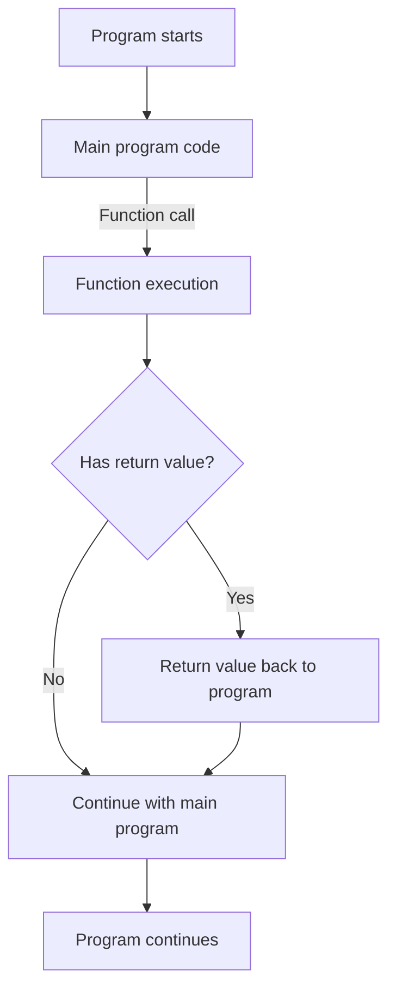

# PHP Functions Basics

## Introduction

Functions are one of the fundamental building blocks in PHP programming. A function is a block of code designed to perform a specific task, which can be reused throughout your application. Think of functions as small machines that take some input, process it, and produce an output.

Using functions helps you:
- Organize your code into manageable chunks
- Avoid writing the same code multiple times (DRY - Don't Repeat Yourself)
- Make your code more readable and maintainable
- Create modular programs that are easier to debug

In this tutorial, we'll explore the basics of PHP functions, from defining simple functions to working with parameters and return values.

## Defining a Basic Function

Let's start with the simplest form of a PHP function:

```php
function sayHello() {
    echo "Hello, World!";
}

// Calling the function
sayHello(); // Output: Hello, World!
```

The anatomy of a function includes:

1. The `function` keyword
2. A function name (in this case, `sayHello`)
3. Parentheses `()` (which may contain parameters)
4. A code block enclosed in curly braces `{}`

### Function Naming Rules

When naming your functions in PHP, follow these rules:

- Function names must start with a letter or underscore
- Function names can only contain letters, numbers, and underscores
- Function names are case-insensitive (though it's best practice to be consistent)

```php
function calculate_total() { /* code */ }   // Valid
function _getUser() { /* code */ }          // Valid
function process123() { /* code */ }        // Valid
function 123process() { /* code */ }        // Invalid - starts with a number
function process-data() { /* code */ }      // Invalid - contains a hyphen
```

## Functions with Parameters

Parameters allow you to pass data to your functions, making them more flexible and reusable.

```php
function greet($name) {
    echo "Hello, $name!";
}

// Call the function with a parameter
greet("John"); // Output: Hello, John!
greet("Sarah"); // Output: Hello, Sarah!
```

### Multiple Parameters

Functions can accept multiple parameters, separated by commas:

```php
function displayUserInfo($name, $age, $country) {
    echo "Name: $name, Age: $age, Country: $country";
}

displayUserInfo("Maria", 28, "Spain");
// Output: Name: Maria, Age: 28, Country: Spain
```

### Default Parameter Values

You can assign default values to parameters, which will be used when a value is not provided:

```php
function setBackgroundColor($color = "white") {
    echo "Background color set to: $color";
}

setBackgroundColor("blue"); // Output: Background color set to: blue
setBackgroundColor(); // Output: Background color set to: white
```

## Return Values

Functions can return values using the `return` statement. This allows you to get data back from a function.

```php
function addNumbers($a, $b) {
    return $a + $b;
}

$sum = addNumbers(5, 3);
echo "The sum is: $sum"; // Output: The sum is: 8

// You can also use the return value directly
echo "10 + 20 = " . addNumbers(10, 20); // Output: 10 + 20 = 30
```

Once a `return` statement is executed, the function stops running and returns control to the calling code.

```php
function checkAge($age) {
    if ($age < 18) {
        return "Too young";
    }
    return "Old enough";
    echo "This line will never execute"; // This line is unreachable
}

echo checkAge(15); // Output: Too young
```

## Function Scope

Variables defined inside a function are only accessible within that function. This is known as local scope.

```php
function testScope() {
    $localVariable = "I'm local to the function";
    echo $localVariable;
}

testScope(); // Output: I'm local to the function
// echo $localVariable; // Error: Undefined variable
```

To access global variables inside a function, use the `global` keyword:

```php
$globalVariable = "I'm a global variable";

function accessGlobal() {
    global $globalVariable;
    echo $globalVariable;
}

accessGlobal(); // Output: I'm a global variable
```

## Practical Examples

### Example 1: Calculate Discount

```php
function calculateDiscount($price, $discountPercent) {
    $discount = ($price * $discountPercent) / 100;
    $finalPrice = $price - $discount;
    return $finalPrice;
}

$originalPrice = 50;
$discountRate = 20;
$salesPrice = calculateDiscount($originalPrice, $discountRate);

echo "Original price: $" . $originalPrice . "<br>";
echo "After a $discountRate% discount: $" . $salesPrice;

/* Output:
Original price: $50
After a 20% discount: $40
*/
```

### Example 2: Form Validation Function

```php
function validateEmail($email) {
    if (empty($email)) {
        return "Email is required";
    }
    
    if (!filter_var($email, FILTER_VALIDATE_EMAIL)) {
        return "Invalid email format";
    }
    
    return "Valid";
}

// Test the function
$testEmail1 = "user@example.com";
$testEmail2 = "invalid-email";
$testEmail3 = "";

echo validateEmail($testEmail1) . "<br>"; // Output: Valid
echo validateEmail($testEmail2) . "<br>"; // Output: Invalid email format
echo validateEmail($testEmail3); // Output: Email is required
```

### Example 3: Generate a Random Password

```php
function generatePassword($length = 8) {
    $chars = "abcdefghijklmnopqrstuvwxyzABCDEFGHIJKLMNOPQRSTUVWXYZ0123456789!@#$%^&*()_-=+;:,.?";
    $password = "";
    
    for ($i = 0; $i < $length; $i++) {
        $randomIndex = rand(0, strlen($chars) - 1);
        $password .= $chars[$randomIndex];
    }
    
    return $password;
}

echo "Your new password: " . generatePassword() . "<br>";
echo "Your new 12-character password: " . generatePassword(12);

/* Possible output:
Your new password: j8!fK2pQ
Your new 12-character password: A5b@3zT7&cD9
*/
```

## Function Flow Diagram

Here's a visual representation of how functions work in PHP:



## Summary

In this tutorial, we've covered the essential basics of PHP functions:

- How to define and call simple functions
- Working with function parameters and default values
- Returning values from functions
- Understanding function scope
- Real-world examples of PHP functions in action

Functions are a powerful tool in PHP programming that help you write cleaner, more maintainable, and more efficient code. As you continue learning PHP, you'll discover more advanced function concepts like anonymous functions, closures, and callable type hints.

## Additional Resources

- Practice creating functions that solve common programming tasks like:
  - Converting temperatures between Celsius and Fahrenheit
  - Checking if a number is prime
  - Formatting dates in different ways

## Exercises

1. Create a function called `calculateArea` that calculates the area of a rectangle based on width and height parameters.
2. Write a function that checks if a string is a palindrome (reads the same forward and backward).
3. Create a function that takes an array of numbers and returns the highest value in the array.
4. Write a function that counts the number of words in a sentence.
5. Build a function that generates an HTML list (`<ul>` or `<ol>`) from an array of items.