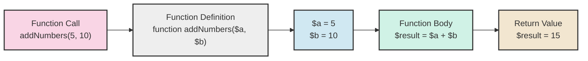

# PHP Function Parameters

## Introduction

Function parameters are an essential part of PHP functions that allow you to pass data into functions. Think of parameters as variables that receive values when a function is called. They enable your functions to be flexible and reusable by working with different input values.

This guide will explore how to define and use parameters in PHP functions, covering basic parameters, default values, type declarations, and more advanced techniques that will make your code more efficient and robust.

## Basic Function Parameters

At their simplest, function parameters are variables listed in the function definition that receive values when the function is called.

### Defining a Function with Parameters

```php
function greet($name) {
    echo "Hello, $name!";
}

// Calling the function with an argument
greet("John"); // Output: Hello, John!
greet("Sarah"); // Output: Hello, Sarah!
```

In this example:
- `$name` is the parameter in the function definition
- `"John"` and `"Sarah"` are arguments passed when calling the function

## Multiple Parameters

Functions can accept multiple parameters, separated by commas.

```php
function calculateRectangleArea($length, $width) {
    $area = $length * $width;
    return $area;
}

$rectangleArea = calculateRectangleArea(10, 5);
echo "The rectangle area is: $rectangleArea"; // Output: The rectangle area is: 50
```

### Parameter Order Matters

When calling a function, arguments must be provided in the same order as the parameters are defined.

```php
function displayUserInfo($name, $age, $country) {
    echo "Name: $name, Age: $age, Country: $country";
}

displayUserInfo("Alice", 25, "Canada");
// Output: Name: Alice, Age: 25, Country: Canada
```

## Default Parameter Values

PHP allows you to define default values for parameters, making them optional when calling the function.

```php
function setConnectionTimeout($timeout = 30) {
    echo "Connection timeout set to $timeout seconds";
}

setConnectionTimeout(60); // Output: Connection timeout set to 60 seconds
setConnectionTimeout(); // Output: Connection timeout set to 30 seconds
```

### Rules for Default Parameters

- Parameters with default values must be placed after parameters without default values
- Default values must be constant expressions, not variables or function calls

```php
// Correct
function configureApp($appName, $debugMode = false, $timeout = 30) {
    // Function body
}

// Incorrect - will cause an error
function invalidFunction($param1 = 10, $param2) {
    // This will cause an error because the parameter with 
    // a default value comes before one without a default value
}
```

## Named Arguments (PHP 8.0+)

PHP 8.0 introduced named arguments, allowing you to specify which parameter each argument corresponds to when calling a function.

```php
function createUser($name, $email, $role = 'user', $active = true) {
    echo "Created $role: $name ($email) - Status: " . ($active ? "Active" : "Inactive");
}

// Using named arguments
createUser(
    name: "John Doe",
    email: "john@example.com",
    active: false
    // 'role' is omitted, so it uses the default value
);
// Output: Created user: John Doe (john@example.com) - Status: Inactive
```

Named arguments provide several benefits:
- Order-independent arguments
- Ability to skip optional parameters
- Self-documenting function calls
- Easier maintenance when function signatures change

## Type Declarations

Type declarations (also called type hints) allow you to specify the expected data type for parameters.

```php
function addNumbers(int $a, int $b): int {
    return $a + $b;
}

echo addNumbers(5, 10); // Output: 15
// echo addNumbers("5", "10"); // Works in PHP 5/7 with type coercion, but not in strict mode
```

### Available Type Declarations

PHP supports the following types for parameters:

| Type | Description | Available Since |
|------|-------------|----------------|
| `int` | Integer numbers | PHP 7.0 |
| `float` | Floating-point numbers | PHP 7.0 |
| `string` | Text strings | PHP 7.0 |
| `bool` | Boolean values | PHP 7.0 |
| `array` | Arrays | PHP 5.1 |
| `object` | Objects | PHP 7.2 |
| `mixed` | Any type | PHP 8.0 |
| `callable` | Function or method | PHP 5.4 |
| `iterable` | Arrays or objects implementing Traversable | PHP 7.1 |
| `self` | Same class type | PHP 5.0 |
| `?type` | Nullable type (e.g., `?string`) | PHP 7.1 |
| `union types` | Multiple possible types (e.g., `string|int`) | PHP 8.0 |

### Strict Type Checking

By default, PHP will try to convert (coerce) values to the specified type. To enforce strict type checking, add the following line at the top of your PHP file:

```php
<?php
declare(strict_types=1);

function divideNumbers(int $a, int $b): float {
    return $a / $b;
}

echo divideNumbers(10, 2); // Works: Output: 5
// echo divideNumbers("10", "2"); // Fails with TypeError
```

## Passing by Reference

By default, function parameters are passed by value (a copy is created). You can pass variables by reference using the `&` symbol, allowing the function to modify the original variable.

```php
function addFive(&$number) {
    $number += 5;
}

$value = 10;
addFive($value);
echo $value; // Output: 15 (the original variable was modified)
```

Use cases for passing by reference:
- When you need to modify the original variable
- When working with large data structures to avoid copying them
- When a function needs to return multiple values

## Variadic Functions

Variadic functions can accept a variable number of arguments using the `...` (spread) operator.

```php
function calculateSum(...$numbers) {
    $sum = 0;
    foreach ($numbers as $number) {
        $sum += $number;
    }
    return $sum;
}

echo calculateSum(1, 2, 3, 4, 5); // Output: 15
echo calculateSum(10, 20); // Output: 30
```

The spread operator packs all the arguments into an array named `$numbers` that can be processed inside the function.

### Combining Regular and Variadic Parameters

You can combine regular parameters with variadic parameters:

```php
function processFiles($fileType, ...$filenames) {
    echo "Processing $fileType files: " . implode(", ", $filenames);
}

processFiles("PDF", "document1.pdf", "document2.pdf", "document3.pdf");
// Output: Processing PDF files: document1.pdf, document2.pdf, document3.pdf
```

Remember that the variadic parameter must be the last parameter in the function definition.

## Parameter Unpacking

The spread operator can also be used to unpack arrays into function arguments:

```php
function displayUserProfile($name, $age, $occupation) {
    echo "Name: $name, Age: $age, Occupation: $occupation";
}

$userData = ["Jane Doe", 28, "Web Developer"];
displayUserProfile(...$userData);
// Output: Name: Jane Doe, Age: 28, Occupation: Web Developer
```

## Practical Examples

### Example 1: Building a Flexible Formatting Function

```php
function formatPrice($amount, $currencySymbol = '$', $decimals = 2, $decimalSeparator = '.', $thousandsSeparator = ',') {
    return $currencySymbol . number_format($amount, $decimals, $decimalSeparator, $thousandsSeparator);
}

// Different ways to use the function
echo formatPrice(1234.56); // Output: $1,234.56
echo formatPrice(1234.56, '€'); // Output: €1,234.56
echo formatPrice(1234.56, '£', 0); // Output: £1,235
echo formatPrice(1234.56, '¥', 2, ',', ' '); // Output: ¥1 234,56
```

### Example 2: User Authentication Function

```php
function authenticate(string $username, string $password, bool $rememberMe = false, ?string $twoFactorCode = null): bool {
    // Simulated authentication logic
    $validUsername = "admin";
    $validPassword = "secret123";
    $valid2FA = "123456";
    
    $isBasicAuthValid = ($username === $validUsername && $password === $validPassword);
    
    // If 2FA is provided, validate it
    if ($twoFactorCode !== null) {
        return $isBasicAuthValid && $twoFactorCode === $valid2FA;
    }
    
    // If remember me is set, we could set a cookie here in a real application
    if ($rememberMe) {
        echo "Setting remember-me cookie for user: $username<br>";
    }
    
    return $isBasicAuthValid;
}

// Examples of calling the authentication function
$result1 = authenticate("admin", "secret123");
echo "Basic auth result: " . ($result1 ? "Success" : "Failure") . "<br>";

$result2 = authenticate("admin", "secret123", true);
echo "Auth with remember-me: " . ($result2 ? "Success" : "Failure") . "<br>";

$result3 = authenticate("admin", "secret123", false, "123456");
echo "Auth with 2FA: " . ($result3 ? "Success" : "Failure") . "<br>";

// Using named arguments (PHP 8+)
$result4 = authenticate(
    username: "admin", 
    password: "wrong_password", 
    twoFactorCode: "123456"
);
echo "Auth with named args: " . ($result4 ? "Success" : "Failure") . "<br>";

/*
Output:
Basic auth result: Success
Setting remember-me cookie for user: admin
Auth with remember-me: Success
Auth with 2FA: Success
Auth with named args: Failure
*/
```

### Example 3: Dynamic Database Query Builder

```php
function buildQuery(string $table, array $conditions = [], array $orderBy = [], int $limit = null): string {
    $query = "SELECT * FROM $table";
    
    // Add WHERE conditions if provided
    if (!empty($conditions)) {
        $whereClause = [];
        foreach ($conditions as $column => $value) {
            $whereClause[] = "$column = '$value'";
        }
        $query .= " WHERE " . implode(" AND ", $whereClause);
    }
    
    // Add ORDER BY if provided
    if (!empty($orderBy)) {
        $orderClauses = [];
        foreach ($orderBy as $column => $direction) {
            $orderClauses[] = "$column $direction";
        }
        $query .= " ORDER BY " . implode(", ", $orderClauses);
    }
    
    // Add LIMIT if provided
    if ($limit !== null) {
        $query .= " LIMIT $limit";
    }
    
    return $query;
}

// Simple query
echo buildQuery("users") . "<br>";
// Output: SELECT * FROM users

// Query with conditions
echo buildQuery("products", ["category" => "electronics", "in_stock" => "1"]) . "<br>";
// Output: SELECT * FROM products WHERE category = 'electronics' AND in_stock = '1'

// Query with conditions and ordering
echo buildQuery(
    "customers", 
    ["status" => "active"], 
    ["last_visit" => "DESC", "name" => "ASC"]
) . "<br>";
// Output: SELECT * FROM customers WHERE status = 'active' ORDER BY last_visit DESC, name ASC

// Full query with all parameters
echo buildQuery(
    "orders", 
    ["status" => "pending"], 
    ["date" => "DESC"], 
    10
);
// Output: SELECT * FROM orders WHERE status = 'pending' ORDER BY date DESC LIMIT 10
```

## Working with Function Parameters Visually

Here's a diagram showing how function parameters work:



## Common Mistakes and Best Practices

### Mistakes to Avoid

1. **Not validating parameters**: Always validate input parameters before using them
2. **Incorrect parameter order**: Be careful with the order of arguments when calling functions
3. **Missing required parameters**: Make sure to provide all required parameters
4. **Ignoring return types**: Pay attention to what type of data a function returns

### Best Practices

1. **Use type declarations**: Specify the expected data types for parameters to catch errors early
2. **Provide default values**: Make parameters optional when appropriate by providing default values
3. **Meaningful parameter names**: Choose descriptive names that indicate what the parameter is for
4. **Document parameters**: Add PHPDoc comments to describe what each parameter does

```php
/**
 * Calculate the total price including tax
 *
 * @param float $price The base price of the product
 * @param float $taxRate The tax rate as a decimal (e.g., 0.07 for 7%)
 * @param bool $rounded Whether to round the result to 2 decimal places
 * @return float The final price with tax applied
 */
function calculatePriceWithTax(float $price, float $taxRate, bool $rounded = true): float {
    $finalPrice = $price * (1 + $taxRate);
    return $rounded ? round($finalPrice, 2) : $finalPrice;
}
```

## Summary

Function parameters are a fundamental concept in PHP programming that allow your functions to be flexible and reusable. In this guide, we've covered:

- Basic parameter syntax and usage
- Default parameter values
- Type declarations for parameters
- Named arguments (PHP 8.0+)
- Passing parameters by reference
- Variadic functions using the spread operator
- Parameter unpacking
- Real-world examples of functions with various parameter types

By mastering function parameters, you'll be able to write more flexible, maintainable, and error-resistant PHP code.

## Exercises

1. Create a function that accepts a string and returns it formatted in different ways based on optional parameters (uppercase, lowercase, capitalized, etc.).

2. Build a shopping cart calculation function that takes a variable number of items and applies different discounts based on the total.

3. Create a function that formats dates with various optional parameters (format, timezone, locale).

4. Write a function that filters an array of users based on multiple optional criteria (age, location, interests).

5. Implement a logging function that accepts different log levels and formats the output accordingly.

## Additional Resources

- [PHP Manual: Functions](https://www.php.net/manual/en/language.functions.php)
- [PHP Manual: Type Declarations](https://www.php.net/manual/en/language.types.declarations.php)
- [PHP 8.0: Named Arguments](https://www.php.net/manual/en/functions.arguments.php#functions.named-arguments)
- [PHP Manual: Variable Functions](https://www.php.net/manual/en/functions.variable-functions.php)