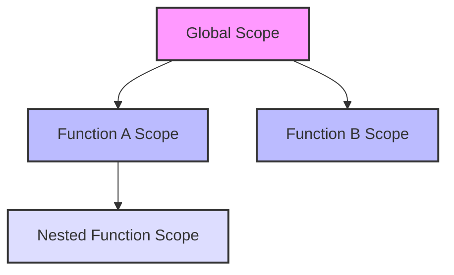

# PHP Function Scope

## Introduction

When you're writing PHP functions, one of the most important concepts to understand is **scope**. Scope refers to the visibility and accessibility of variables in different parts of your code. Understanding scope helps you avoid common bugs and write more maintainable code.

In this tutorial, we'll explore how variable scope works in PHP functions, the difference between local and global variables, and techniques for sharing data between different scopes.

## What is Variable Scope?

In PHP, scope determines where in your code a variable can be accessed or modified. Think of scope as the "lifetime" and "visibility" of a variable - it defines where a variable is born, where it can be seen, and where it dies.

PHP has several different variable scopes:

1. **Local scope**: Variables defined inside a function
2. **Global scope**: Variables defined outside all functions
3. **Static scope**: Local variables that maintain their value between function calls
4. **Parameter scope**: Function parameters that are available within the function

Let's examine each type of scope in detail.

## Local Scope

When you define a variable inside a function, it has **local scope**. This means the variable is only accessible within that function. Once the function finishes executing, local variables are destroyed and their values are lost.

```php
<?php
function testLocalScope() {
    $localVar = "I'm a local variable";
    echo $localVar; // This works fine
}

testLocalScope(); // Output: I'm a local variable

// Trying to access the variable outside the function
echo $localVar; // ERROR: Undefined variable $localVar
?>
```

In this example, `$localVar` only exists inside the `testLocalScope()` function. When we try to access it outside the function, PHP treats it as an undefined variable.

## Global Scope

Variables defined outside any function have **global scope**. However, PHP has a unique approach to global variables - by default, they are **not** accessible inside functions.

```php
<?php
$globalVar = "I'm a global variable";

function testGlobalScope() {
    echo $globalVar; // ERROR: Undefined variable $globalVar
}

testGlobalScope();
?>
```

This might seem counterintuitive if you're used to other programming languages. In PHP, global variables aren't automatically available within functions.

### Accessing Global Variables in Functions

To access a global variable from within a function, you need to use the `global` keyword:

```php
<?php
$globalVar = "I'm a global variable";

function accessGlobalVar() {
    global $globalVar; // Declare the variable as global
    echo $globalVar; // Now works: I'm a global variable
}

accessGlobalVar();
?>
```

Alternatively, you can use the `$GLOBALS` superglobal array, which contains all global variables:

```php
<?php
$globalVar = "I'm a global variable";

function accessGlobalWithArray() {
    echo $GLOBALS['globalVar']; // Access via $GLOBALS array
}

accessGlobalWithArray(); // Output: I'm a global variable
?>
```

## Static Variables

Sometimes you need a local variable to retain its value between function calls. This is where **static variables** come in. Static variables are declared using the `static` keyword and are initialized only once.

```php
<?php
function countCalls() {
    static $count = 0; // Initialized only the first time
    $count++;
    return "This function has been called $count time(s)";
}

echo countCalls(); // Output: This function has been called 1 time(s)
echo "<br>";
echo countCalls(); // Output: This function has been called 2 time(s)
echo "<br>";
echo countCalls(); // Output: This function has been called 3 time(s)
?>
```

In this example, the `$count` variable maintains its value between function calls. Without the `static` keyword, `$count` would be reset to 0 each time the function is called.

## Function Parameters

Function parameters have their own scope, similar to local variables. They are available only within the function where they are defined.

```php
<?php
function greet($name) {
    echo "Hello, $name!";
}

greet("John"); // Output: Hello, John!

// $name is not accessible here
echo $name; // ERROR: Undefined variable $name
?>
```

## Visualizing PHP Variable Scope

Here's a diagram to help visualize how variable scope works in PHP:



Variables in outer scopes aren't automatically accessible in inner scopes, but you can explicitly make them available using techniques we've discussed.

## Practical Examples

### Example 1: Shopping Cart Total

Here's a practical example of using scope for a shopping cart:

```php
<?php
// Global variable for cart items
$cartItems = ["Laptop" => 999, "Headphones" => 99, "Mouse" => 25];

function calculateTotal() {
    global $cartItems;
    $total = 0;
    
    foreach ($cartItems as $item => $price) {
        $total += $price;
    }
    
    return $total;
}

function addItem($item, $price) {
    global $cartItems;
    $cartItems[$item] = $price;
    echo "$item added to cart for \$$price<br>";
}

// Display initial cart
echo "Initial cart total: $" . calculateTotal() . "<br>";

// Add a new item
addItem("Keyboard", 45);

// Display updated total
echo "Updated cart total: $" . calculateTotal() . "<br>";
?>
```

**Output:**
```
Initial cart total: $1123
Keyboard added to cart for $45
Updated cart total: $1168
```

### Example 2: User View Counter with Static Variables

Static variables are perfect for tracking state:

```php
<?php
function trackPageViews($userId) {
    // Array to track views per user
    static $userViews = [];
    
    // Initialize if not set
    if (!isset($userViews[$userId])) {
        $userViews[$userId] = 0;
    }
    
    // Increment view count
    $userViews[$userId]++;
    
    // Return all stats
    return $userViews;
}

// Simulate page views
$views = trackPageViews("user123"); // First view for user123
echo "Page views after first call:<br>";
print_r($views);

$views = trackPageViews("user456"); // First view for user456
$views = trackPageViews("user123"); // Second view for user123
echo "<br>Page views after more calls:<br>";
print_r($views);
?>
```

**Output:**
```
Page views after first call:
Array ( [user123] => 1 )

Page views after more calls:
Array ( [user123] => 2 [user456] => 1 )
```

## Common Pitfalls and Best Practices

### Pitfall 1: Variable Naming Conflicts

When using the `global` keyword, be careful about variable naming conflicts:

```php
<?php
$counter = 10; // Global counter

function incrementCounter() {
    $counter = 5; // Local variable, not using the global one
    $counter++;
    echo "Counter inside function: $counter<br>"; // 6
}

incrementCounter();
echo "Global counter: $counter<br>"; // Still 10 - wasn't modified
?>
```

To fix this, use the `global` keyword:

```php
<?php
$counter = 10;

function incrementCounter() {
    global $counter; // Now using the global variable
    $counter++;
    echo "Counter inside function: $counter<br>"; // 11
}

incrementCounter();
echo "Global counter: $counter<br>"; // 11 - was modified
?>
```

### Best Practice 1: Minimize Global Variables

Global variables can lead to code that's hard to understand and maintain. Instead, consider:

1. Passing values as function parameters
2. Returning values from functions
3. Using classes and objects for related data

### Best Practice 2: Use Function Parameters for Inputs

```php
<?php
// Poor approach: using globals
$firstName = "John";
$lastName = "Doe";

function poorGreeting() {
    global $firstName, $lastName;
    return "Hello, $firstName $lastName!";
}

// Better approach: using parameters
function betterGreeting($firstName, $lastName) {
    return "Hello, $firstName $lastName!";
}

echo poorGreeting() . "<br>";
echo betterGreeting("Jane", "Smith") . "<br>";
?>
```

## Summary

Understanding PHP function scope is crucial for writing maintainable and bug-free code:

- **Local variables** exist only within the function where they're defined
- **Global variables** exist outside functions but need the `global` keyword to be accessed inside functions
- **Static variables** maintain their value between function calls
- **Function parameters** are local to the function where they are defined

By mastering variable scope, you'll avoid common bugs related to variable visibility and create more modular, reusable PHP code.

## Exercises

1. Create a function that uses a static variable to keep track of how many times it has been called.
2. Write a function that takes an array as a parameter and adds all its values to a global array.
3. Create two functions that share data through a global variable, then refactor them to avoid using globals.

## Additional Resources

- [PHP Manual: Variable Scope](https://www.php.net/manual/en/language.variables.scope.php)
- [PHP: The Right Way](https://phptherightway.com/)
- [PHP Functions Documentation](https://www.php.net/manual/en/language.functions.php)