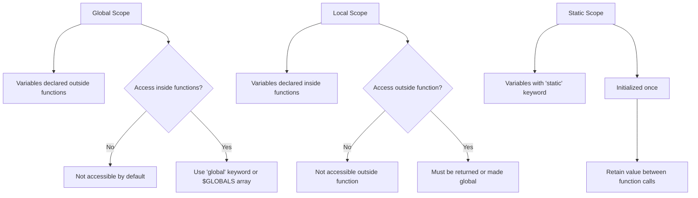

# PHP Variable Scope

## Introduction

When working with PHP functions, understanding **variable scope** is essential for writing efficient and bug-free code. Scope defines where in your code a variable can be accessed or modified. In PHP, variables have different scopes that determine their visibility and lifetime throughout your program.

This tutorial explains the different types of variable scope in PHP, how they work, and provides practical examples to help you implement them correctly in your own projects.

## What is Variable Scope?

Variable scope refers to the region of your code where a variable is accessible. In PHP, there are three main types of variable scope:

1. **Local scope**: Variables declared within a function
2. **Global scope**: Variables declared outside any function
3. **Static scope**: Variables that retain their value between function calls

Let's explore each type in detail.

## Local Variables

Variables declared within a function are considered **local** to that function. This means they can only be accessed or modified within that function and are not visible to other functions or the global scope.

### Example of Local Variables

```php
<?php
// Global variable
$name = "John";

function greet() {
    // Local variable
    $message = "Hello, ";
    echo $message . $name; // This will cause an error
}

greet();
echo $message; // This will also cause an error
?>
```

**Output:**
```
Warning: Undefined variable $name in example.php on line 8
Hello, 
Warning: Undefined variable $message in example.php on line 11
```

In this example:
- `$message` is local to the `greet()` function and cannot be accessed outside it
- The function cannot access `$name` because it's in the global scope

Local variables are destroyed automatically when the function execution ends, freeing up memory.

## Global Variables

Variables declared outside any function have **global scope**. However, they are not automatically accessible within functions. To access global variables inside a function, you need to use the `global` keyword or the `$GLOBALS` array.

### Using the `global` Keyword

```php
<?php
// Global variable
$name = "John";

function greet() {
    global $name; // Tell PHP we want to access the global variable
    $message = "Hello, ";
    echo $message . $name;
}

greet();
?>
```

**Output:**
```
Hello, John
```

### Using the `$GLOBALS` Array

```php
<?php
// Global variable
$name = "John";

function greet() {
    $message = "Hello, ";
    echo $message . $GLOBALS['name'];
}

greet();
?>
```

**Output:**
```
Hello, John
```

The `$GLOBALS` array is a superglobal that contains all variables in the global scope. It's available in all scopes, including within functions.

## Static Variables

Sometimes, you need a variable that maintains its value between function calls but remains local to the function. This is where **static variables** come in. Static variables are initialized only once and retain their value between function calls.

### Example of Static Variables

```php
<?php
function counter() {
    static $count = 0; // Static variable
    $count++;
    echo "Function has been called $count time(s)<br>";
}

counter(); // First call
counter(); // Second call
counter(); // Third call
?>
```

**Output:**
```
Function has been called 1 time(s)
Function has been called 2 time(s)
Function has been called 3 time(s)
```

In this example, the `$count` variable is initialized to 0 only on the first call to the function. On subsequent calls, it retains its previous value.

## Variable Scope Visualization

Here's a visual representation of how variable scope works in PHP:



## Practical Examples

Let's look at some real-world applications of variable scope in PHP.

### Example 1: User Authentication Counter

This example uses a static variable to track login attempts:

```php
<?php
function checkLogin($username, $password) {
    static $attempts = 0;
    
    // Simulate database check
    if ($username === "admin" && $password === "secret123") {
        echo "Login successful after $attempts attempts";
        $attempts = 0; // Reset counter on successful login
        return true;
    } else {
        $attempts++;
        echo "Login failed. Attempt #$attempts";
        return false;
    }
}

// Test with incorrect credentials
checkLogin("admin", "wrong"); // First attempt
echo "<br>";
checkLogin("admin", "wrong2"); // Second attempt
echo "<br>";
// Test with correct credentials
checkLogin("admin", "secret123");
echo "<br>";
// Test again (counter should be reset)
checkLogin("admin", "wrong3");
?>
```

**Output:**
```
Login failed. Attempt #1
Login failed. Attempt #2
Login successful after 2 attempts
Login failed. Attempt #1
```

### Example 2: Configuration Manager

This example uses global variables for application settings:

```php
<?php
// Global configuration settings
$config = [
    "db_host" => "localhost",
    "db_user" => "root",
    "db_pass" => "password"
];

function connectToDatabase() {
    global $config;
    
    // In a real application, this would be actual database connection code
    echo "Connecting to {$config['db_host']} as {$config['db_user']}";
}

function updateConfig($key, $value) {
    global $config;
    $config[$key] = $value;
    echo "Updated $key to $value";
}

// Test the functions
connectToDatabase();
echo "<br>";
updateConfig("db_host", "production.server.com");
echo "<br>";
connectToDatabase();
?>
```

**Output:**
```
Connecting to localhost as root
Updated db_host to production.server.com
Connecting to production.server.com as root
```

### Example 3: Function Factory with Closures

This advanced example uses closures to create functions with their own scope:

```php
<?php
function createMultiplier($factor) {
    // The created function "captures" the $factor variable
    return function($number) use ($factor) {
        return $number * $factor;
    };
}

// Create different multiplier functions
$double = createMultiplier(2);
$triple = createMultiplier(3);

// Use the multiplier functions
echo $double(5) . "<br>"; // 5 * 2
echo $triple(5) . "<br>"; // 5 * 3
?>
```

**Output:**
```
10
15
```

In this example, each multiplier function has its own scope that "remembers" the `$factor` value through the `use` keyword.

## Common Pitfalls and Best Practices

### Avoid Excessive Use of Global Variables

Using too many global variables can make your code harder to maintain. It's generally better to:

1. Pass variables as function parameters
2. Return values from functions
3. Use classes and object properties for shared state

### Example of Better Practice

```php
<?php
// Instead of global variables
function betterGreet($name) {
    $message = "Hello, ";
    return $message . $name;
}

$result = betterGreet("John");
echo $result;
?>
```

**Output:**
```
Hello, John
```

### Be Careful with Variable Names

PHP does not require variable declarations, so using the same variable name in different scopes can lead to confusion.

```php
<?php
$value = 10; // Global scope

function updateValue() {
    $value = 20; // Local scope, NOT the global $value
    echo "Inside function: $value<br>";
}

updateValue();
echo "Outside function: $value";
?>
```

**Output:**
```
Inside function: 20
Outside function: 10
```

The global `$value` remains unchanged because the function created a new local variable with the same name.

## Summary

Understanding variable scope is crucial for writing effective PHP code. Here's a quick recap:

- **Local variables** exist only within the function where they are declared
- **Global variables** are accessible throughout your script, but need special handling inside functions
- **Static variables** maintain their value between function calls
- Use the `global` keyword or `$GLOBALS` array to access global variables inside functions
- Use the `static` keyword to create persistent function variables

By mastering these concepts, you'll avoid common bugs related to variable visibility and write more maintainable PHP code.

## Exercises

1. Create a function that counts the number of times it has been called using a static variable.
2. Write a script that has global configuration variables and multiple functions that access them.
3. Create a function that generates a unique ID each time it's called (hint: use a static variable).
4. Implement a simple shopping cart using a combination of global and local variables.

## Additional Resources

- [Official PHP Documentation on Variable Scope](https://www.php.net/manual/en/language.variables.scope.php)
- [PHP: The Right Way - Function Declarations](https://phptherightway.com/#functions)
- [PHP Variable Scope Best Practices](https://phptherightway.com/)