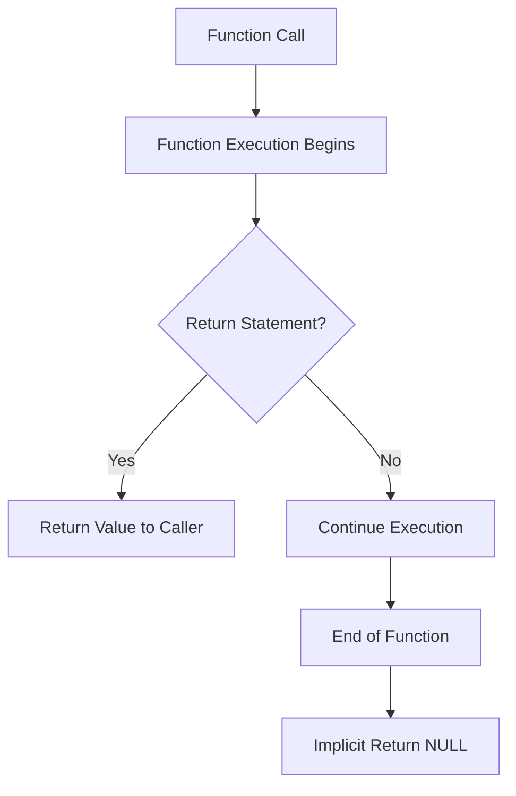

# PHP Return Values

## Introduction

When you create a function in PHP, you often want it to perform calculations or operations and then send back the result to wherever the function was called from. This is accomplished through **return values**. Return values are a fundamental concept in programming that allow functions to communicate their results back to the rest of your program.

In this tutorial, we'll explore how return values work in PHP functions, different types of values you can return, and best practices for implementing them in your code.

## Understanding the `return` Statement

The `return` statement serves two essential purposes in PHP functions:

1. It specifies the value that the function should output
2. It immediately stops the execution of the function

Let's look at a simple example:

```php
function add($a, $b) {
    $sum = $a + $b;
    return $sum;
}

$result = add(5, 3);
echo $result; // Output: 8
```

In this example:
- The `add()` function takes two parameters (`$a` and `$b`)
- It calculates their sum
- It returns this value using the `return` statement
- When we call the function and assign it to `$result`, the returned value (8) is stored in that variable

## Types of Return Values

PHP is a loosely typed language, which means functions can return different types of data:

### 1. Returning Primitive Values

You can return simple data types like integers, floats, strings, or booleans:

```php
function isAdult($age) {
    if ($age >= 18) {
        return true;
    } else {
        return false;
    }
}

$canVote = isAdult(20);
echo $canVote ? "Yes, can vote" : "No, cannot vote"; // Output: Yes, can vote
```

### 2. Returning Arrays

Functions can return arrays, which is useful when you need to return multiple values:

```php
function getUserInfo($userId) {
    // In a real application, this might come from a database
    return [
        'id' => $userId,
        'name' => 'John Doe',
        'email' => 'john@example.com',
        'age' => 28
    ];
}

$user = getUserInfo(42);
echo "Name: " . $user['name']; // Output: Name: John Doe
```

### 3. Returning Objects

You can also return objects:

```php
class User {
    public $name;
    public $email;
    
    public function __construct($name, $email) {
        $this->name = $name;
        $this->email = $email;
    }
}

function createUser($name, $email) {
    return new User($name, $email);
}

$newUser = createUser('Jane Smith', 'jane@example.com');
echo "Created user: " . $newUser->name; // Output: Created user: Jane Smith
```

### 4. Returning NULL

If a function doesn't explicitly return a value, or if it uses `return;` without a value, PHP will implicitly return `NULL`:

```php
function doSomething() {
    // No return statement
}

$result = doSomething();
var_dump($result); // Output: NULL

function doSomethingElse() {
    return; // Explicit return with no value
}

$result = doSomethingElse();
var_dump($result); // Output: NULL
```

## Early Returns

The `return` statement immediately exits the function. This can be used for efficient code structure, especially in conditional logic:

```php
function getDivision($numerator, $denominator) {
    // Early return for error case
    if ($denominator == 0) {
        return "Error: Cannot divide by zero";
    }
    
    // This code only executes if the denominator is not zero
    $result = $numerator / $denominator;
    return $result;
}

echo getDivision(10, 2); // Output: 5
echo getDivision(10, 0); // Output: Error: Cannot divide by zero
```

This pattern of "early returns" makes your code more readable and helps avoid deeply nested conditional blocks.

## Return Type Declarations

In PHP 7.0 and later, you can specify what type of data a function will return using return type declarations:

```php
function sum(int $a, int $b): int {
    return $a + $b;
}

function getUsername(int $id): string {
    // Some logic to fetch username
    return "user" . $id;
}

function isLoggedIn(): bool {
    // Check login status
    return true;
}
```

Adding return type declarations:
- Makes your code more readable
- Helps catch errors early
- Improves IDE auto-completion
- Serves as built-in documentation

## Nullable Return Types

Sometimes, a function might need to return either a specific type or `NULL`. PHP 7.1 introduced nullable types using a question mark before the type:

```php
function findUser($id): ?string {
    $users = ['1' => 'John', '2' => 'Lisa'];
    
    if (isset($users[$id])) {
        return $users[$id];
    } else {
        return null;
    }
}

$name = findUser('1'); // Returns "John"
$name = findUser('999'); // Returns null
```

## Union Types

PHP 8.0 introduced union types, allowing functions to return values of different specified types:

```php
function getIdOrName(bool $returnName): int|string {
    if ($returnName) {
        return "John Doe";
    } else {
        return 42;
    }
}

$result1 = getIdOrName(true); // Returns "John Doe" (string)
$result2 = getIdOrName(false); // Returns 42 (int)
```

## Practical Examples

### Example 1: Form Validation

```php
function validateEmail($email): array {
    $errors = [];
    
    if (empty($email)) {
        $errors[] = "Email is required";
    } elseif (!filter_var($email, FILTER_VALIDATE_EMAIL)) {
        $errors[] = "Invalid email format";
    }
    
    return [
        'valid' => empty($errors),
        'errors' => $errors
    ];
}

$validation = validateEmail("user@example.com");
if ($validation['valid']) {
    echo "Email is valid!";
} else {
    echo "Errors found: " . implode(", ", $validation['errors']);
}
```

### Example 2: Database Query Helper

```php
function getProductById($id): ?array {
    // In a real application, this would query a database
    $products = [
        1 => ['name' => 'Laptop', 'price' => 999.99],
        2 => ['name' => 'Smartphone', 'price' => 499.99]
    ];
    
    return $products[$id] ?? null;
}

$product = getProductById(1);
if ($product) {
    echo "Found: {$product['name']} costs \${$product['price']}";
} else {
    echo "Product not found";
}
```

### Example 3: Calculator Function

```php
function calculate($num1, $num2, $operation): float|string {
    switch ($operation) {
        case 'add':
            return $num1 + $num2;
        case 'subtract':
            return $num1 - $num2;
        case 'multiply':
            return $num1 * $num2;
        case 'divide':
            if ($num2 == 0) {
                return "Cannot divide by zero";
            }
            return $num1 / $num2;
        default:
            return "Unknown operation";
    }
}

echo calculate(10, 5, 'add'); // Output: 15
echo calculate(10, 5, 'divide'); // Output: 2
echo calculate(10, 0, 'divide'); // Output: Cannot divide by zero
```

## Function Return Flow

Understanding how the return statement affects the flow of execution in a function is important:



## Best Practices for Return Values

1. **Be consistent** with your return types for the same function
2. **Document return types** in comments or using PHP type declarations
3. **Use early returns** for error cases or special conditions
4. **Return meaningful data** that the caller can use
5. **Consider returning data structures** (arrays/objects) for complex results
6. **Use nullable types** when a function might not find what it's looking for
7. **Validate return values** when receiving them from functions

## Summary

Return values are a fundamental part of PHP functions that allow you to pass calculated results back to the calling code. PHP offers flexibility in what you can return (primitives, arrays, objects) and provides type declarations to help ensure code correctness.

Understanding how to effectively use return values will make your functions more useful, your code more modular, and your applications more maintainable.

## Exercises

1. Create a function that takes an array of numbers and returns both the minimum and maximum values.
2. Write a function that validates a password and returns true if valid or an array of error messages if invalid.
3. Create a calculator class with methods that return appropriate values for different operations.
4. Implement a function that searches an array for a value and returns either the key or null if not found.

## Additional Resources

- [PHP Manual: Functions](https://www.php.net/manual/en/language.functions.php)
- [PHP Manual: Return Type Declarations](https://www.php.net/manual/en/functions.returning-values.php)
- [PHP 8 Documentation on Union Types](https://www.php.net/manual/en/language.types.declarations.php)