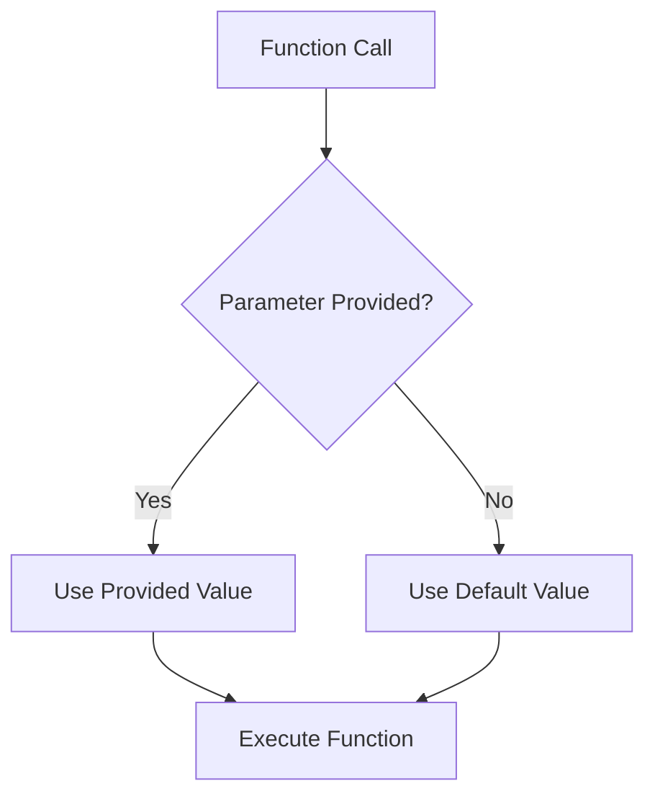

# PHP Default Arguments

## Introduction

When creating functions in PHP, you'll often encounter situations where some parameters should be optional or have predefined values. This is where **default arguments** (also called default parameters) come into play. Default arguments allow you to specify fallback values for function parameters, making your functions more flexible and your code cleaner.

In this tutorial, we'll explore how to use default arguments in PHP functions, why they're useful, and best practices for implementing them in your projects.

## Understanding Default Arguments

Default arguments are values assigned to function parameters that are used when the caller doesn't provide a value for that parameter. They create optional parameters, reducing the amount of code you need to write while maintaining flexibility.

Let's look at the basic syntax:

```php
function functionName($requiredParam, $optionalParam = defaultValue) {
    // Function body
}
```

Here, `$optionalParam` has a default value that will be used if the function is called without providing this argument.

## Basic Example

Let's start with a simple example:

```php
function greet($name, $greeting = "Hello") {
    echo "$greeting, $name!";
}

// Function calls
greet("John");           // Output: Hello, John!
greet("Sarah", "Hi");    // Output: Hi, Sarah!
```

In this example:
- `$name` is a required parameter with no default value
- `$greeting` is an optional parameter with "Hello" as its default value
- When we call `greet("John")`, the default greeting "Hello" is used
- When we call `greet("Sarah", "Hi")`, our provided greeting "Hi" overrides the default

## Multiple Default Arguments

You can have multiple parameters with default values:

```php
function formatName($firstName, $lastName, $showMiddle = false, $uppercase = false) {
    $fullName = $firstName;
    
    if ($showMiddle && isset($GLOBALS['middleName'])) {
        $fullName .= " " . $GLOBALS['middleName'];
    }
    
    $fullName .= " " . $lastName;
    
    if ($uppercase) {
        return strtoupper($fullName);
    }
    
    return $fullName;
}

$GLOBALS['middleName'] = "Lee";

echo formatName("John", "Doe") . "<br>";                     // Output: John Doe
echo formatName("John", "Doe", true) . "<br>";               // Output: John Lee Doe
echo formatName("John", "Doe", false, true) . "<br>";        // Output: JOHN DOE
echo formatName("John", "Doe", true, true) . "<br>";         // Output: JOHN LEE DOE
```

This example shows how default arguments can dramatically increase a function's flexibility without complicating its interface.

## Important Rules for Default Arguments

When working with default arguments in PHP, keep these rules in mind:

1. **Default arguments must be placed after required arguments**:

```php
// Correct
function correct($required, $optional = "default") {
    // Function body
}

// Incorrect - will cause a syntax error
function incorrect($optional = "default", $required) {
    // Function body
}
```

2. **Default values must be constant expressions, not variables or function calls**:

```php
// Correct
function example($param = "default") { /* ... */ }
function example2($param = 5 * 2) { /* ... */ }

// Incorrect in PHP 7.x and earlier (works in PHP 8+)
$globalVar = "value";
function example3($param = $globalVar) { /* ... */ }
function example4($param = getValue()) { /* ... */ }
```

With PHP 8.0+, you can use more complex expressions as default values, but for compatibility with older versions, it's best to stick with constant expressions.

## Practical Example: Database Connection Function

Let's look at a practical example of how default arguments can be used in a real-world scenario:

```php
function connectToDatabase($host = "localhost", $username = "root", $password = "", $database = "myapp", $port = 3306) {
    $connection = new mysqli($host, $username, $password, $database, $port);
    
    if ($connection->connect_error) {
        die("Connection failed: " . $connection->connect_error);
    }
    
    return $connection;
}

// Connect using all defaults (local development)
$localDb = connectToDatabase();

// Connect to production database with different credentials
$productionDb = connectToDatabase("production.example.com", "prod_user", "secure_password", "prod_db");

// Connect with most defaults but change the port
$customPortDb = connectToDatabase("localhost", "root", "", "myapp", 3307);
```

This example shows how default arguments can dramatically simplify function calls in common scenarios while still allowing full customization when needed.

## Default Arguments vs. Null Coalescing Operator

In modern PHP, you can combine default arguments with the null coalescing operator (`??`) for even more flexibility:

```php
function displayUserProfile($userId, $showDetails = true) {
    $user = getUserById($userId);
    
    echo "Username: " . ($user['username'] ?? "Unknown") . "<br>";
    
    if ($showDetails) {
        echo "Email: " . ($user['email'] ?? "No email provided") . "<br>";
        echo "Joined: " . ($user['join_date'] ?? "Unknown date") . "<br>";
    }
}
```

This approach lets you handle potentially missing data within your function while still using default arguments to control function behavior.

## Flow Diagram of Default Arguments

Here's a visual representation of how default arguments work in a function call:



## Cautions and Best Practices

While default arguments are very useful, keep these best practices in mind:

1. **Don't overuse default arguments** - Functions with too many optional parameters can become confusing. Consider using alternative patterns like the Builder pattern for highly configurable operations.

2. **Keep required parameters first** - Always place required parameters before optional ones. This makes your code more predictable.

3. **Use meaningful defaults** - Choose default values that make sense for the most common use cases.

4. **Document your default values** - Use comments or documentation to explain what the default values are and why they were chosen.

5. **Be careful with arrays and objects** - If you use an empty array as a default value, remember that it's evaluated only once when the function is defined:

```php
function addItem($item, $list = []) {
    $list[] = $item;
    return $list;
}

$list1 = addItem("apple");          // Returns ["apple"]
$list2 = addItem("banana");         // Returns ["banana"], not ["apple", "banana"]

// To accumulate items, pass the list each time:
$myList = [];
$myList = addItem("apple", $myList);
$myList = addItem("banana", $myList); // Now $myList contains ["apple", "banana"]
```

## Summary

Default arguments in PHP functions provide a powerful way to make your code more flexible and concise. They allow you to:

- Make parameters optional when appropriate
- Provide sensible defaults for common scenarios
- Maintain backward compatibility when adding new parameters
- Create functions that are both simple to use and highly customizable

By following the rules and best practices outlined in this tutorial, you can use default arguments effectively in your PHP projects to write cleaner, more maintainable code.

## Exercises

1. Create a function `formatCurrency()` that accepts a number and formats it as currency, with default parameters for currency symbol, decimal places, and whether to use thousands separators.

2. Write a function `createHTMLTag()` that generates an HTML tag with default attributes. For example, `createHTMLTag("div", "Content", ["class" => "container"])` would create `<div class="container">Content</div>`.

3. Create a function that logs messages to a file with default parameters for log level (info, warning, error) and date format.

## Additional Resources

- [PHP Manual: Functions](https://www.php.net/manual/en/language.functions.php)
- [PHP Manual: Default argument values](https://www.php.net/manual/en/functions.arguments.php#functions.arguments.default)
- [PHP 8 New Features for Function Parameters](https://php.watch/versions/8.0/named-parameters)