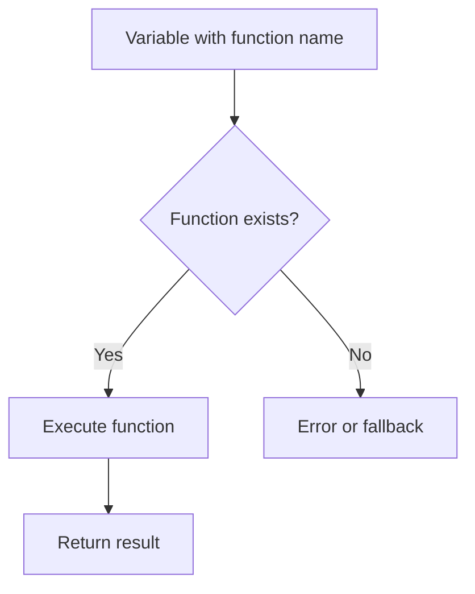

# PHP Variable Functions

## Introduction

PHP Variable Functions are a powerful feature that allows you to use a variable to call a function. If a variable name has parentheses appended to it, PHP will look for a function with the same name as the value of the variable and will attempt to execute it. This creates extremely flexible code and enables dynamic function calls based on runtime conditions.

This feature is particularly useful when:
- You need to call different functions based on user input
- You're building modular applications that require dynamic behavior
- You're implementing callback systems or event handlers
- You want to reduce repetitive switch/case or if/else statements

## Basic Syntax

The basic syntax for variable functions is straightforward:

```php
<?php
$functionName = "myFunction";
$functionName(); // This calls myFunction()
?>
```

## How Variable Functions Work

Let's break down the concept with a simple example:

```php
<?php
// Define a regular function
function sayHello() {
    echo "Hello, World!";
}

// Store the function name as a string in a variable
$func = "sayHello";

// Call the function using the variable
$func();  // Outputs: Hello, World!
?>
```

**Output:**
```
Hello, World!
```

In this example:
1. We define a regular function called `sayHello()`
2. We store the name of the function as a string in the variable `$func`
3. When we add parentheses to `$func`, PHP looks for a function named "sayHello" and executes it

## Passing Arguments to Variable Functions

You can also pass arguments to variable functions just like regular functions:

```php
<?php
// Define a function with parameters
function greet($name, $greeting = "Hello") {
    echo "$greeting, $name!";
}

// Store function name in a variable
$func = "greet";

// Call with arguments
$func("John");  // Outputs: Hello, John!
$func("Sarah", "Welcome");  // Outputs: Welcome, Sarah!
?>
```

**Output:**
```
Hello, John!
Welcome, Sarah!
```

## Variable Functions with Object Methods

Variable functions also work with object methods. Here's how you can use them:

```php
<?php
class Greeting {
    public function sayHello($name) {
        echo "Hello, $name!";
    }
    
    public function sayGoodbye($name) {
        echo "Goodbye, $name!";
    }
}

// Create object
$greeting = new Greeting();

// Choose method dynamically
$method = "sayHello";
$greeting->$method("John");  // Outputs: Hello, John!

// Change method on the fly
$method = "sayGoodbye";
$greeting->$method("John");  // Outputs: Goodbye, John!
?>
```

**Output:**
```
Hello, John!
Goodbye, John!
```

## Practical Examples

### Example 1: Simple Calculator

This example shows how variable functions can be used to create a simple calculator:

```php
<?php
// Define calculation functions
function add($a, $b) {
    return $a + $b;
}

function subtract($a, $b) {
    return $a - $b;
}

function multiply($a, $b) {
    return $a * $b;
}

function divide($a, $b) {
    if ($b == 0) {
        return "Cannot divide by zero";
    }
    return $a / $b;
}

// Function to execute calculations
function calculate($num1, $num2, $operation) {
    // Check if function exists
    if (function_exists($operation)) {
        return $operation($num1, $num2);
    } else {
        return "Invalid operation";
    }
}

// Examples
echo "Addition: " . calculate(5, 3, "add") . "<br>";
echo "Subtraction: " . calculate(5, 3, "subtract") . "<br>";
echo "Multiplication: " . calculate(5, 3, "multiply") . "<br>";
echo "Division: " . calculate(5, 3, "divide") . "<br>";
echo "Invalid: " . calculate(5, 3, "power") . "<br>";
?>
```

**Output:**
```
Addition: 8
Subtraction: 2
Multiplication: 15
Division: 1.6666666666667
Invalid: Invalid operation
```

### Example 2: Form Input Validation

Variable functions are excellent for form validation where different types of inputs need different validation methods:

```php
<?php
// Validation functions
function validateEmail($email) {
    return filter_var($email, FILTER_VALIDATE_EMAIL) ? true : "Invalid email format";
}

function validateUsername($username) {
    return preg_match('/^[a-zA-Z0-9_]{3,20}$/', $username) ? true : "Username must be 3-20 characters and contain only letters, numbers, and underscores";
}

function validatePassword($password) {
    return strlen($password) >= 8 ? true : "Password must be at least 8 characters long";
}

// Form data
$form_data = [
    'email' => 'user@example.com',
    'username' => 'john_doe',
    'password' => 'pass' // Short password
];

// Validate each field
foreach ($form_data as $field => $value) {
    $validator = "validate" . ucfirst($field);
    
    if (function_exists($validator)) {
        $result = $validator($value);
        echo "$field validation: " . ($result === true ? "Passed" : $result) . "<br>";
    } else {
        echo "No validator for $field<br>";
    }
}
?>
```

**Output:**
```
email validation: Passed
username validation: Passed
password validation: Password must be at least 8 characters long
```

### Example 3: Plugin System

Variable functions can be used to create a simple plugin or hook system:

```php
<?php
// Plugin functions
function pluginWelcome($user) {
    echo "Welcome to our website, $user!<br>";
}

function pluginFooter() {
    echo "This site is powered by PHP<br>";
}

function pluginAnalytics() {
    echo "Tracking user visit...<br>";
}

// Plugin manager
class PluginManager {
    private $plugins = [];
    
    public function register($hookName, $functionName) {
        $this->plugins[$hookName][] = $functionName;
    }
    
    public function execute($hookName, $params = []) {
        if (!isset($this->plugins[$hookName])) {
            return;
        }
        
        foreach ($this->plugins[$hookName] as $function) {
            call_user_func_array($function, $params);
        }
    }
}

// Create plugin manager
$pm = new PluginManager();

// Register plugins
$pm->register('header', 'pluginWelcome');
$pm->register('header', 'pluginAnalytics');
$pm->register('footer', 'pluginFooter');

// Execute plugins for different parts of the site
echo "--- Header ---<br>";
$pm->execute('header', ['John']);

echo "<br>--- Content ---<br>";
echo "Main page content goes here<br>";

echo "<br>--- Footer ---<br>";
$pm->execute('footer');
?>
```

**Output:**
```
--- Header ---
Welcome to our website, John!
Tracking user visit...

--- Content ---
Main page content goes here

--- Footer ---
This site is powered by PHP
```

## Important Considerations

When working with variable functions, keep these points in mind:

1. **Function Existence**: Always check if a function exists before calling it using `function_exists()` to avoid errors.

2. **Namespace Issues**: Variable functions don't work directly with language constructs like `echo`, `print`, `unset()`, etc. They only work with actual functions.

3. **Security Considerations**: Be careful when using user input to determine function names, as this could lead to security vulnerabilities if not properly sanitized.

4. **Performance**: Variable functions are slightly slower than direct function calls, though the difference is negligible for most applications.



## Comparison with Callbacks

Here's how variable functions compare with other callback methods in PHP:

| Method | Syntax | Use Case |
|--------|--------|----------|
| Variable Functions | `$func()` | Simple dynamic function calls |
| Anonymous Functions | `$func = function() { ... }; $func();` | One-time use functions |
| call_user_func() | `call_user_func($func, $param)` | When additional control is needed |
| call_user_func_array() | `call_user_func_array($func, $params_array)` | When arguments are in an array |

## Summary

PHP variable functions provide a powerful way to make your code more dynamic and flexible by allowing you to call functions whose names are stored in variables. This enables:

- Creating more modular and adaptable code
- Implementing plugin systems and hooks
- Reducing repetitive conditional blocks
- Building flexible APIs and frameworks

While they should be used with proper validation to avoid security issues, variable functions are an essential tool in your PHP toolkit that can help you write cleaner, more flexible code for many real-world applications.

## Additional Resources and Exercises

### Further Reading
- [PHP Official Documentation on Variable Functions](https://www.php.net/manual/en/functions.variable-functions.php)
- [PHP Callbacks and Callables](https://www.php.net/manual/en/language.types.callable.php)

### Exercises

1. **Basic Variable Function Practice**:
   Create a set of functions that perform different string operations (uppercase, lowercase, reverse, etc.) and then use variable functions to apply them based on user input.

2. **Advanced Calculator**:
   Extend the calculator example to include more operations like power, modulus, and square root. Add error handling and support for multiple operands.

3. **Custom Event System**:
   Build a simple event system where different functions can be registered to specific events and executed when those events are triggered.

4. **Form Builder**:
   Create a form builder that uses variable functions to generate different form elements (input, textarea, select, etc.) based on configuration data.

5. **Challenge: Template Engine**:
   Design a simple template engine that uses variable functions to replace placeholders in a template with dynamic content.