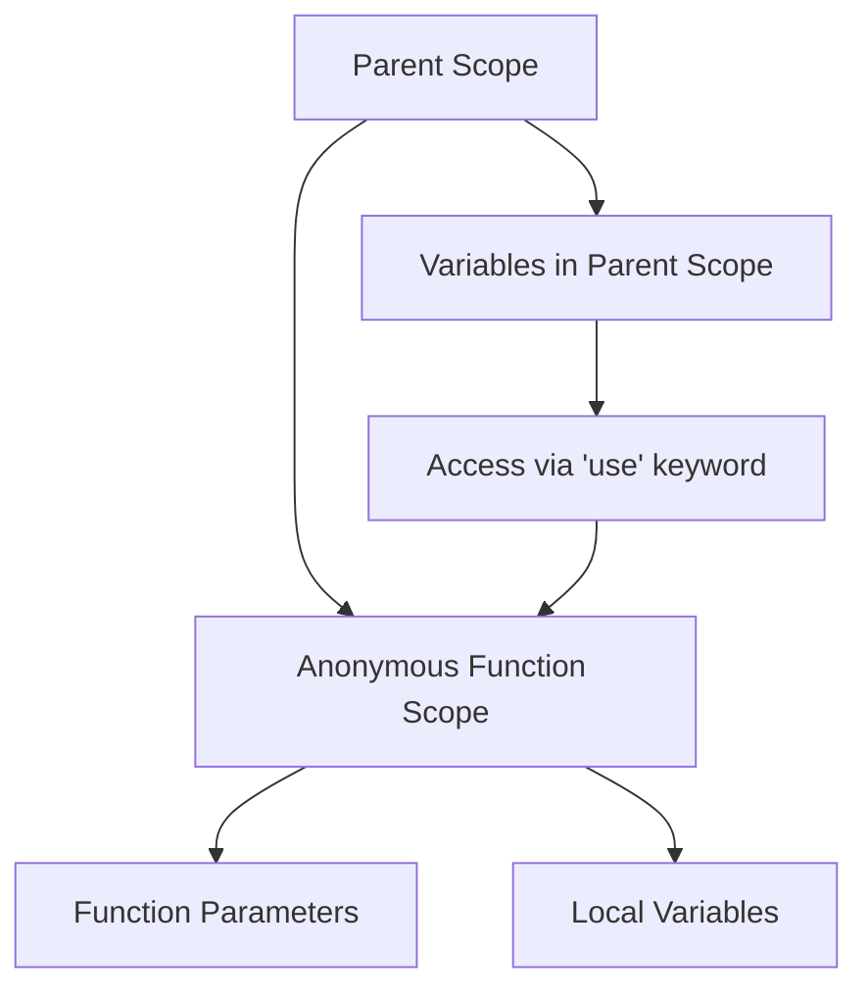

# PHP Anonymous Functions

## Introduction

Anonymous functions, also known as closures, are a powerful feature in PHP that allow you to create functions without specifying a name. Introduced in PHP 5.3, anonymous functions provide a way to create inline functions that can be assigned to variables, passed as arguments to other functions, or returned from another function.

These functions are particularly useful when you need a simple function for a specific task and don't want to define a separate named function that would only be used once. Anonymous functions play a crucial role in modern PHP programming, especially in callbacks, event handling, and functional programming approaches.

## Basic Syntax

Here's the basic syntax for creating an anonymous function in PHP:

```php
$functionName = function($parameters) {
    // function body
    return $value;
};
```

Notice a few key elements:
- The function is assigned to a variable (`$functionName`)
- The `function` keyword is used without a function name
- A semicolon (`;`) is required at the end of the function declaration
- The function can take parameters and return values like any regular function

## Simple Examples

### Example 1: Basic Anonymous Function

```php
// Creating an anonymous function and assigning it to a variable
$greet = function($name) {
    return "Hello, $name!";
};

// Calling the anonymous function
echo $greet("John");
```

**Output:**
```
Hello, John!
```

### Example 2: Anonymous Function with Multiple Parameters

```php
// Anonymous function that adds two numbers
$add = function($a, $b) {
    return $a + $b;
};

// Using the function
echo $add(5, 3);
```

**Output:**
```
8
```

## Passing Anonymous Functions as Arguments

One of the most common uses of anonymous functions is as callback functions. Here's how you can pass an anonymous function as an argument to another function:

### Example: Using an Anonymous Function with `array_map()`

```php
$numbers = [1, 2, 3, 4, 5];

// Using array_map with an anonymous function to double each value
$doubled = array_map(function($number) {
    return $number * 2;
}, $numbers);

// Display the result
print_r($doubled);
```

**Output:**
```
Array
(
    [0] => 2
    [1] => 4
    [2] => 6
    [3] => 8
    [4] => 10
)
```

## Closures: Accessing Outside Variables

Anonymous functions can access variables from the parent scope using the `use` keyword. This creates what is known as a closure:

```php
$message = "Hello";

// Creating a closure that uses the $message variable from the parent scope
$greet = function($name) use ($message) {
    return "$message, $name!";
};

echo $greet("Jane");
```

**Output:**
```
Hello, Jane!
```

### Example: Modifying Outside Variables

If you want to modify the outside variable inside the closure, you need to use the `&` (reference) operator:

```php
$counter = 0;

// Creating a counter function that increments the outside variable
$increment = function() use (&$counter) {
    $counter++;
    return $counter;
};

echo $increment() . "
";
echo $increment() . "
";
echo $increment() . "
";
echo "Final counter value: $counter";
```

**Output:**
```
1
2
3
Final counter value: 3
```

## Understanding the Scope

The following diagram illustrates the scope concept in closures:



## Practical Applications

Let's explore some practical real-world applications of anonymous functions in PHP:

### 1. Custom Sorting with `usort()`

```php
// Array of user data
$users = [
    ['name' => 'John', 'age' => 28],
    ['name' => 'Jane', 'age' => 25],
    ['name' => 'Bob', 'age' => 32],
    ['name' => 'Alice', 'age' => 22]
];

// Sort users by age using anonymous function
usort($users, function($a, $b) {
    return $a['age'] - $b['age'];
});

// Display sorted users
foreach ($users as $user) {
    echo $user['name'] . " - " . $user['age'] . " years
";
}
```

**Output:**
```
Alice - 22 years
Jane - 25 years
John - 28 years
Bob - 32 years
```

### 2. Event Handlers in Modern PHP Frameworks

Many modern PHP frameworks like Laravel use anonymous functions for event handling:

```php
// Example of a route definition in Laravel using an anonymous function
Route::get('/users', function() {
    // Get users from database
    $users = DB::table('users')->get();
    
    // Return view with users data
    return view('users.index', ['users' => $users]);
});
```

### 3. Creating Simple API Endpoints

```php
// Example of a simple API endpoint using anonymous functions
$app->get('/api/products', function($request, $response) {
    // Fetch products data
    $products = [
        ['id' => 1, 'name' => 'Laptop', 'price' => 999],
        ['id' => 2, 'name' => 'Smartphone', 'price' => 699],
        ['id' => 3, 'name' => 'Tablet', 'price' => 499]
    ];
    
    // Return JSON response
    $response->getBody()->write(json_encode($products));
    return $response->withHeader('Content-Type', 'application/json');
});
```

## Anonymous Functions vs. Arrow Functions

In PHP 7.4, arrow functions were introduced as a more concise syntax for simple anonymous functions:

```php
// Traditional anonymous function
$double = function($x) {
    return $x * 2;
};

// The same function using arrow function syntax
$double = fn($x) => $x * 2;

// Using both functions
echo $double(5); // Outputs: 10
```

Key differences:
- Arrow functions use the `fn` keyword instead of `function`
- They use `=>` syntax instead of a function body with curly braces
- They can access parent scope variables without the `use` keyword
- They are limited to a single expression (no multi-line body)

## Best Practices

When working with anonymous functions in PHP, consider these best practices:

1. **Keep them short and focused** - Anonymous functions should ideally perform a single task.

2. **Use arrow functions for simple operations** - For simple operations, use arrow functions for cleaner code.

3. **Be mindful of variable scope** - Remember that variables from the parent scope must be explicitly imported using `use` (except with arrow functions).

4. **Document complex anonymous functions** - If an anonymous function is complex, add comments to explain its purpose.

5. **Consider performance** - Creating many anonymous functions can impact performance, so use them judiciously.

## Summary

Anonymous functions in PHP provide a powerful way to create inline functions that can be assigned to variables, passed as arguments, or returned from other functions. They are particularly useful for callbacks, event handling, and functional programming patterns.

Key points to remember:
- Anonymous functions don't have a specified name
- They can be assigned to variables and called like regular functions
- They can access parent scope variables using the `use` keyword
- Arrow functions provide a more concise syntax for simple cases
- They are widely used in modern PHP programming and frameworks

## Exercises

1. Create an anonymous function that filters an array to only include even numbers.
2. Write a closure that keeps track of how many times it has been called.
3. Use an anonymous function with `array_reduce()` to calculate the sum of all elements in an array.
4. Create an arrow function that returns whether a number is prime or not.
5. Implement a simple callback system that executes different anonymous functions based on user input.

## Additional Resources

- [PHP Official Documentation: Anonymous Functions](https://www.php.net/manual/en/functions.anonymous.php)
- [PHP Arrow Functions](https://www.php.net/manual/en/functions.arrow.php)
- [Functional Programming in PHP](https://phptherightway.com/#functional-programming)
- [Closures and Lambda Functions in PHP](https://www.php.net/manual/en/class.closure.php)