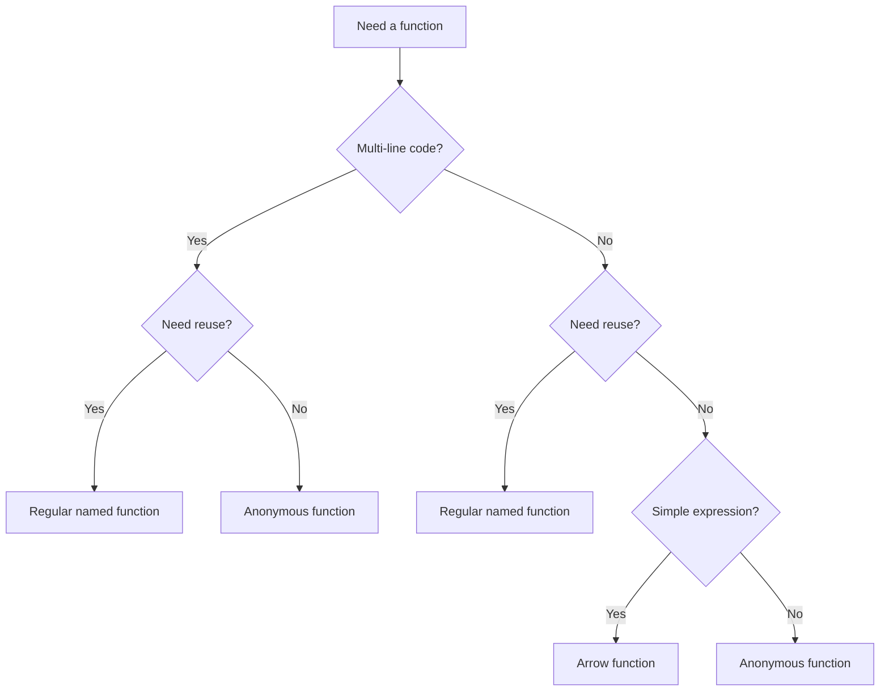

# PHP Arrow Functions

## Introduction

Arrow functions (also known as "short closures") were introduced in PHP 7.4 as a more concise way to define anonymous functions. They provide a simpler syntax for creating small, one-line functions, making your code more readable and maintainable.

If you've worked with JavaScript or other modern programming languages, you might already be familiar with the concept of arrow functions. In PHP, they offer a similar benefit: creating compact, single-expression functions without the verbosity of traditional anonymous functions.

## Basic Syntax

The syntax for arrow functions in PHP looks like this:

```php
$arrowFunction = fn(parameters) => expression;
```

Let's break down this syntax:

1. `fn` - The keyword that identifies an arrow function
2. `(parameters)` - Function parameters (like in regular functions)
3. `=>` - The arrow operator (similar to the "goes to" operator in other languages)
4. `expression` - A single expression that will be evaluated and returned

The most important point to understand is that **arrow functions automatically return the value of the expression** without needing an explicit `return` statement.

## Comparing with Traditional Anonymous Functions

To understand the benefits of arrow functions, let's compare them with traditional anonymous functions:

```php
// Traditional anonymous function
$traditional = function($x) {
    return $x * 2;
};

// Arrow function equivalent
$arrow = fn($x) => $x * 2;

// Both functions can be called the same way
echo $traditional(5);  // Output: 10
echo $arrow(5);        // Output: 10
```

As you can see, the arrow function is much more concise!

## Variable Scope in Arrow Functions

One important feature of arrow functions in PHP is their handling of variable scope. Arrow functions automatically inherit variables from the parent scope without requiring the `use` keyword, which is necessary for traditional anonymous functions.

```php
$multiplier = 3;

// Traditional anonymous function requires 'use'
$traditional = function($x) use ($multiplier) {
    return $x * $multiplier;
};

// Arrow function automatically inherits parent scope
$arrow = fn($x) => $x * $multiplier;

echo $traditional(5);  // Output: 15
echo $arrow(5);        // Output: 15
```

This "value capturing" is very convenient, but it's important to understand that the variables are captured by value, not by reference. This means that if you modify a captured variable inside an arrow function, the original variable remains unchanged.

## When to Use Arrow Functions

Arrow functions are ideal for:

1. **Simple, one-line operations** - Especially when working with array manipulation functions
2. **Callback functions** - When you need a quick function for methods like `array_map()`, `array_filter()`, etc.
3. **Reducing code verbosity** - When you want to make your code more concise and readable

However, they have limitations:

1. Arrow functions can only contain a single expression (no multi-line function bodies)
2. They automatically return the value of the expression (you can't have void functions)
3. You can't use statements like `if`, `for`, or `while` directly (though you can use ternary operators)

## Practical Examples

Let's explore some real-world examples where arrow functions shine:

### Example 1: Array Manipulation

```php
$numbers = [1, 2, 3, 4, 5];

// Double each number (traditional)
$doubled = array_map(function($n) {
    return $n * 2;
}, $numbers);

// Double each number (arrow function)
$doubled = array_map(fn($n) => $n * 2, $numbers);

print_r($doubled); // Output: Array ( [0] => 2 [1] => 4 [2] => 6 [3] => 8 [4] => 10 )
```

### Example 2: Filtering Data

```php
$products = [
    ['name' => 'Laptop', 'price' => 1200],
    ['name' => 'Phone', 'price' => 800],
    ['name' => 'Tablet', 'price' => 500],
    ['name' => 'Desktop', 'price' => 1500]
];

// Filter products over $1000 (traditional)
$expensiveProducts = array_filter($products, function($product) {
    return $product['price'] > 1000;
});

// Filter products over $1000 (arrow function)
$expensiveProducts = array_filter($products, fn($product) => $product['price'] > 1000);

print_r($expensiveProducts);
/* Output:
Array (
    [0] => Array ( [name] => Laptop [price] => 1200 )
    [3] => Array ( [name] => Desktop [price] => 1500 )
)
*/
```

### Example 3: Custom Sorting

```php
$people = [
    ['name' => 'John', 'age' => 28],
    ['name' => 'Jane', 'age' => 22],
    ['name' => 'Bob', 'age' => 35],
    ['name' => 'Alice', 'age' => 19]
];

// Sort by age (traditional)
usort($people, function($a, $b) {
    return $a['age'] <=> $b['age'];
});

// Sort by age (arrow function)
usort($people, fn($a, $b) => $a['age'] <=> $b['age']);

print_r($people);
/* Output:
Array (
    [0] => Array ( [name] => Alice [age] => 19 )
    [1] => Array ( [name] => Jane [age] => 22 )
    [2] => Array ( [name] => John [age] => 28 )
    [3] => Array ( [name] => Bob [age] => 35 )
)
*/
```

### Example 4: Using with User-Defined Functions

```php
function processItems(array $items, callable $processor) {
    $result = [];
    foreach ($items as $item) {
        $result[] = $processor($item);
    }
    return $result;
}

$items = [1, 2, 3, 4];

// Using arrow function as callback
$processed = processItems($items, fn($x) => $x * $x + 2);

print_r($processed); // Output: Array ( [0] => 3 [1] => 6 [2] => 11 [3] => 18 )
```

## Arrow Functions vs. Regular Functions vs. Anonymous Functions

Here's a comparison to help you understand when to use each type of function:



## Limitations and Considerations

When working with arrow functions, keep these limitations in mind:

1. **Single expression only** - Arrow functions can't contain multiple statements or complex logic
   ```php
   // This won't work:
   $invalid = fn($x) => {
       $y = $x * 2;
       return $y;
   };
   ```

2. **No statements allowed** - You can't use `if`, `switch`, loops, etc. directly
   ```php
   // This won't work:
   $invalid = fn($x) => if ($x > 0) return $x; else return 0;
   
   // Instead, use ternary operator:
   $valid = fn($x) => $x > 0 ? $x : 0;
   ```

3. **No reference return** - Arrow functions can't return by reference
   ```php
   // This won't work:
   $invalid = fn&($x) => $x;
   ```

4. **Variables captured by value** - Changes to inherited variables don't affect their originals
   ```php
   $counter = 0;
   $increment = fn() => $counter++; // This won't modify $counter
   $increment();
   echo $counter; // Still outputs 0
   ```

## Summary

PHP arrow functions provide a concise way to write simple, single-expression functions. They're especially useful for callbacks and array operations, helping you write more readable and maintainable code.

Key points to remember:
- Arrow functions use the syntax `fn(parameters) => expression`
- They automatically return the expression's value
- They inherit variables from the parent scope without needing `use`
- They're limited to a single expression
- They're ideal for simple operations but not for complex logic

## Practice Exercises

To solidify your understanding of arrow functions, try these exercises:

1. Create an arrow function that calculates the square of a number, then use it with `array_map()` to square all values in an array.

2. Write an arrow function to filter an array of strings, keeping only those longer than 5 characters.

3. Create an arrow function that uses a ternary operator to check if a number is even or odd, returning "even" or "odd" accordingly.

4. Use an arrow function with `usort()` to sort an array of strings by their length (shortest to longest).

## Additional Resources

- [PHP Official Documentation on Arrow Functions](https://www.php.net/manual/en/functions.arrow.php)
- [PHP 7.4 Release Notes](https://www.php.net/releases/7_4_0.php)
- [PHP Anonymous Functions Documentation](https://www.php.net/manual/en/functions.anonymous.php)