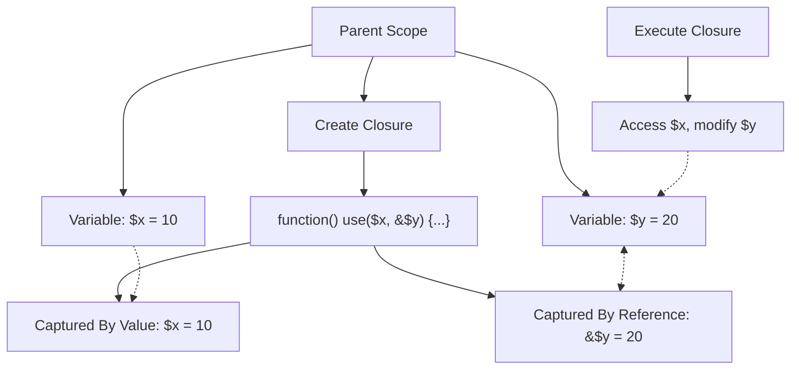

# PHP Closures

## Introduction

Closures are a powerful feature in PHP that allows you to create anonymous functions that can capture and use variables from the surrounding scope. Introduced in PHP 5.3, closures provide a way to create compact, reusable code blocks that can be passed around like variables and maintain access to their creation context.

In this tutorial, we'll explore PHP closures in depth, understand how they work, and see practical examples of how they can make your code more elegant and efficient.

## What Are Closures?

In PHP, a closure is an anonymous function (a function without a name) that can access variables from the scope in which it was created, even after that scope has finished executing. This is achieved through the `use` keyword, which allows the closure to "capture" variables from its parent scope.

Let's start with a simple example:

```php
<?php
// A basic anonymous function (not yet a closure)
$greet = function($name) {
    return "Hello, $name!";
};

// Using the anonymous function
echo $greet("World"); // Output: Hello, World!
?>
```

The above example shows an anonymous function, but it's not yet a closure because it doesn't capture any variables from its parent scope. Let's transform it into a closure:

```php
<?php
$greeting = "Hello";

// This is a closure - it captures the $greeting variable
$greet = function($name) use ($greeting) {
    return "$greeting, $name!";
};

// The closure maintains access to $greeting
echo $greet("World"); // Output: Hello, World!

// Even if we change $greeting afterward, the closure keeps its original value
$greeting = "Hi";
echo $greet("World"); // Output: Hello, World! (not "Hi, World!")
?>
```

## How Closures Work in PHP

To understand closures better, let's look at their key characteristics:

### 1. Variable Capturing with `use`

Closures capture variables from their parent scope using the `use` keyword:

```php
<?php
$message = "Welcome to";
$year = 2025;

$welcomeMessage = function($name) use ($message, $year) {
    return "$message PHP Closures in $year, $name!";
};

echo $welcomeMessage("Developer"); // Output: Welcome to PHP Closures in 2025, Developer!
?>
```

### 2. By-Value vs By-Reference Capturing

By default, closures capture variables by value (they get a copy). To capture by reference, use the `&` symbol:

```php
<?php
$counter = 0;

// Capture by value (default)
$incrementByValue = function() use ($counter) {
    $counter++;
    return $counter;
};

// Capture by reference
$incrementByReference = function() use (&$counter) {
    $counter++;
    return $counter;
};

echo $incrementByValue(); // Output: 1
echo $incrementByValue(); // Output: 1 (still 1 because it has its own copy)
echo $counter; // Output: 0 (original value unchanged)

echo $incrementByReference(); // Output: 1
echo $incrementByReference(); // Output: 2
echo $counter; // Output: 2 (original value modified)
?>
```

### 3. Closures as Objects

In PHP, closures are actually instances of the `Closure` class. This means they have methods like `bindTo()` and `call()` that allow you to change their scope:

```php
<?php
class Person {
    private $name;
    
    public function __construct($name) {
        $this->name = $name;
    }
    
    public function getGreeter() {
        // This returns a closure
        return function($greeting) {
            return "$greeting, {$this->name}!";
        };
    }
}

$john = new Person("John");
$greeter = $john->getGreeter();

// This would produce an error because $this->name is private
// echo $greeter("Hello"); 

// Bind the closure to $john with 'Person' scope
$boundGreeter = $greeter->bindTo($john, Person::class);
echo $boundGreeter("Hello"); // Output: Hello, John!
?>
```

## Practical Applications of Closures

Let's explore some common real-world use cases for PHP closures:

### 1. Callback Functions

Closures are perfect for callback functions in array functions like `array_map()`, `array_filter()`, and `usort()`:

```php
<?php
$numbers = [1, 2, 3, 4, 5];

// Using a closure with array_map to double each number
$doubled = array_map(function($num) {
    return $num * 2;
}, $numbers);

print_r($doubled); // Output: Array ( [0] => 2 [1] => 4 [2] => 6 [3] => 8 [4] => 10 )

// Using a closure with array_filter to keep only even numbers
$evens = array_filter($numbers, function($num) {
    return $num % 2 === 0;
});

print_r($evens); // Output: Array ( [1] => 2 [3] => 4 )

// Custom sorting with usort and a closure
$people = [
    ['name' => 'Alice', 'age' => 30],
    ['name' => 'Bob', 'age' => 25],
    ['name' => 'Charlie', 'age' => 35]
];

usort($people, function($a, $b) {
    return $a['age'] <=> $b['age']; // Using the spaceship operator for comparison
});

print_r($people);
// Output:
// Array (
//     [0] => Array ( [name] => Bob [age] => 25 )
//     [1] => Array ( [name] => Alice [age] => 30 )
//     [2] => Array ( [name] => Charlie [age] => 35 )
// )
?>
```

### 2. Event Handling

Closures are excellent for event handling and can capture the context needed for the handler:

```php
<?php
class EventDispatcher {
    private $events = [];
    
    public function addListener($eventName, $callback) {
        $this->events[$eventName][] = $callback;
    }
    
    public function dispatch($eventName, $data = null) {
        if (isset($this->events[$eventName])) {
            foreach ($this->events[$eventName] as $callback) {
                call_user_func($callback, $data);
            }
        }
    }
}

$dispatcher = new EventDispatcher();

// Current user context
$userId = 42;
$userRole = "admin";

// Add event listener using a closure that captures context
$dispatcher->addListener('user.login', function($data) use ($userId, $userRole) {
    echo "User #$userId ($userRole) received notification about login from: {$data['ip']}
";
});

// Dispatch the event
$dispatcher->dispatch('user.login', ['ip' => '192.168.1.1']);
// Output: User #42 (admin) received notification about login from: 192.168.1.1
?>
```

### 3. Creating Simple Template Engines

Closures can be used to create simple template systems:

```php
<?php
function createTemplate($template) {
    // Return a closure that will use the template
    return function($variables) use ($template) {
        // Extract variables to make them accessible in the template scope
        extract($variables);
        
        // Capture output
        ob_start();
        include $template;
        return ob_get_clean();
    };
}

// Create a template renderer
$renderUserProfile = createTemplate('templates/user_profile.php');

// Use the template with data
$html = $renderUserProfile([
    'username' => 'johndoe',
    'email' => 'john@example.com',
    'bio' => 'PHP developer and open-source enthusiast'
]);

echo $html;
?>
```

The template file (`templates/user_profile.php`) might look like:

```php
<div class="user-profile">
    <h2><?= htmlspecialchars($username) ?></h2>
    <p>Email: <?= htmlspecialchars($email) ?></p>
    <p>Bio: <?= htmlspecialchars($bio) ?></p>
</div>
```

### 4. Strategy Pattern Implementation

Closures can simplify implementation of design patterns like the Strategy Pattern:

```php
<?php
class Calculator {
    private $operations = [];
    
    public function registerOperation($name, $operation) {
        $this->operations[$name] = $operation;
    }
    
    public function calculate($name, $a, $b) {
        if (isset($this->operations[$name])) {
            return $this->operations[$name]($a, $b);
        }
        throw new Exception("Operation not found: $name");
    }
}

$calc = new Calculator();

// Register operations using closures
$calc->registerOperation('add', function($a, $b) {
    return $a + $b;
});

$calc->registerOperation('subtract', function($a, $b) {
    return $a - $b;
});

$calc->registerOperation('multiply', function($a, $b) {
    return $a * $b;
});

$calc->registerOperation('divide', function($a, $b) {
    if ($b == 0) {
        throw new Exception("Division by zero");
    }
    return $a / $b;
});

// Use the calculator
echo $calc->calculate('add', 5, 3);      // Output: 8
echo $calc->calculate('multiply', 4, 2); // Output: 8
?>
```

## Closure Scope Visualization

Here's a diagram showing how closures capture their parent scope:



## Advantages of Using Closures

1. **Cleaner Code**: Reduce the need for small, one-off named functions
2. **Encapsulation**: Keep related code together and hide implementation details
3. **Context Retention**: Capture and maintain state from their creation environment
4. **Flexibility**: Pass behavior as arguments to other functions
5. **Readability**: Make code intentions clearer, especially for callbacks

## Common Pitfalls and Best Practices

### Pitfalls to Avoid

1. **Memory Leaks**: Closures can cause memory leaks if they capture large objects and are stored for a long time
2. **Performance Impact**: Overusing closures can impact performance, especially for performance-critical code
3. **Debugging Challenges**: Anonymous functions can be harder to debug than named functions
4. **Recursion Complexity**: Recursive closures require special handling

### Best Practices

1. **Keep It Simple**: Use closures for simple, focused operations
2. **Be Mindful of Scope**: Only capture variables you actually need
3. **Prefer By-Value Capture**: Use by-reference capturing only when necessary
4. **Consider Readability**: Sometimes a regular named function is more readable
5. **Document Purpose**: Add comments explaining what complex closures do

## Summary

PHP closures are anonymous functions that can capture and maintain access to variables from their parent scope. They enable more functional programming styles, simplify callback handling, and provide elegant solutions for many common programming tasks.

Key points to remember:
- Use the `function() use()` syntax to create closures
- Variables are captured by value by default (use `&` for by-reference)
- Closures are instances of the `Closure` class with methods like `bindTo()`
- Common applications include callbacks, event handling, and implementing design patterns

## Exercises

1. Create a function that returns different sorters as closures (ascending, descending, by specific field)
2. Implement a simple event system using closures
3. Write a function memoizer using closures to cache expensive function results
4. Create a closure-based middleware system for filtering data

## Additional Resources

- [PHP Manual: Anonymous Functions](https://www.php.net/manual/en/functions.anonymous.php)
- [PHP Manual: Closure Class](https://www.php.net/manual/en/class.closure.php)
- [Functional Programming in PHP](https://phptherightway.com/#functional-programming)
- [Design Patterns with PHP Closures](https://refactoring.guru/design-patterns/php)