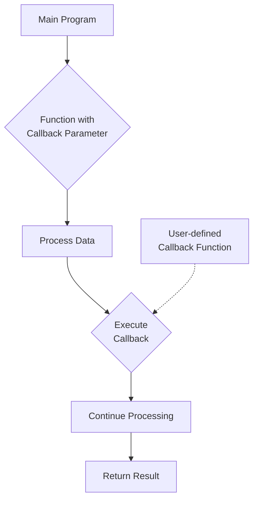

# PHP Callbacks

## Introduction

Callbacks are a powerful programming concept that allows you to pass functions as arguments to other functions. In PHP, callbacks enable you to create more flexible, reusable, and modular code by letting you define what happens at specific points in your program's execution.

Think of callbacks as instructions you give to someone to follow later. You're essentially saying, "When you reach this point, call this function to handle it." This approach is particularly useful for event-driven programming, custom sorting, and data processing.

## Understanding Callbacks in PHP

In PHP, a callback (also known as a callable) is a function that is passed as an argument to another function. The receiving function can then "call back" this function when needed.

### Types of PHP Callbacks

PHP supports several ways to create callbacks:

1. **Simple function names as strings**
2. **Anonymous functions (closures)**
3. **Array callbacks (object methods)**
4. **Static class methods**
5. **Arrow functions (PHP 7.4+)**

Let's explore each type with examples.

## Simple Function Callbacks

The most basic form of callback is passing a function name as a string.

```php
// Define a simple function
function greet($name) {
    return "Hello, $name!";
}

// Function that uses a callback
function processUser($name, $callback) {
    // Call the callback function
    return $callback($name);
}

// Use the callback
$result = processUser("John", "greet");
echo $result; // Output: Hello, John!
```

In this example:
1. We defined a `greet` function that takes a name parameter
2. We created a `processUser` function that accepts a name and a callback
3. We passed the name of our `greet` function as a string to `processUser`
4. The `processUser` function executed our callback with the provided name

## Built-in PHP Functions That Use Callbacks

PHP has many built-in functions that accept callbacks. Some common examples include:

### Array Manipulation with `array_map()`

The `array_map()` function applies a callback to each element of an array and returns a new array with the results.

```php
// Define an array of numbers
$numbers = [1, 2, 3, 4, 5];

// Define a function to double a number
function double($n) {
    return $n * 2;
}

// Use array_map to apply the function to each element
$doubled = array_map("double", $numbers);

// Display the result
print_r($doubled);
/*
Output:
Array
(
    [0] => 2
    [1] => 4
    [2] => 6
    [3] => 8
    [4] => 10
)
*/
```

### Filtering with `array_filter()`

The `array_filter()` function filters elements of an array using a callback function.

```php
// Define an array of numbers
$numbers = [1, 2, 3, 4, 5, 6, 7, 8, 9, 10];

// Define a function to check if a number is even
function isEven($n) {
    return $n % 2 === 0;
}

// Use array_filter to keep only even numbers
$evenNumbers = array_filter($numbers, "isEven");

// Display the result
print_r($evenNumbers);
/*
Output:
Array
(
    [1] => 2
    [3] => 4
    [5] => 6
    [7] => 8
    [9] => 10
)
*/
```

### Custom Sorting with `usort()`

The `usort()` function sorts an array using a user-defined comparison function.

```php
// Define an array of user data
$users = [
    ['name' => 'John', 'age' => 25],
    ['name' => 'Jane', 'age' => 30],
    ['name' => 'Bob', 'age' => 20]
];

// Define a comparison function to sort by age
function compareByAge($a, $b) {
    return $a['age'] - $b['age'];
}

// Sort the array using the callback
usort($users, "compareByAge");

// Display the sorted array
print_r($users);
/*
Output:
Array
(
    [0] => Array
        (
            [name] => Bob
            [age] => 20
        )
    [1] => Array
        (
            [name] => John
            [age] => 25
        )
    [2] => Array
        (
            [name] => Jane
            [age] => 30
        )
)
*/
```

## Anonymous Functions (Closures) as Callbacks

PHP 5.3+ allows you to use anonymous functions (also called closures) as callbacks. These are functions without names defined inline.

```php
// Define an array of numbers
$numbers = [1, 2, 3, 4, 5];

// Use an anonymous function with array_map
$squared = array_map(function($n) {
    return $n * $n;
}, $numbers);

// Display the result
print_r($squared);
/*
Output:
Array
(
    [0] => 1
    [1] => 4
    [2] => 9
    [3] => 16
    [4] => 25
)
*/
```

Anonymous functions are especially useful when you need a callback that you'll only use once, or when you want to access variables from the parent scope using the `use` keyword.

```php
// Parent scope variable
$multiplier = 3;

// Create a callback that uses the parent scope variable
$tripled = array_map(function($n) use ($multiplier) {
    return $n * $multiplier;
}, $numbers);

// Display the result
print_r($tripled);
/*
Output:
Array
(
    [0] => 3
    [1] => 6
    [2] => 9
    [3] => 12
    [4] => 15
)
*/
```

## Method Callbacks

You can also use object methods as callbacks by passing an array containing an object and the method name.

```php
// Define a class with a method
class Formatter {
    public function formatName($name) {
        return "Formatted: " . strtoupper($name);
    }
}

// Create an instance of the class
$formatter = new Formatter();

// Use the object method as a callback
$result = processUser("john", [$formatter, "formatName"]);
echo $result; // Output: Formatted: JOHN
```

## Static Method Callbacks

Similarly, you can use static class methods as callbacks:

```php
// Define a class with a static method
class Greeter {
    public static function sayHello($name) {
        return "Static hello to $name!";
    }
}

// Use the static method as a callback
$result = processUser("Jane", ["Greeter", "sayHello"]);
echo $result; // Output: Static hello to Jane!
```

## Arrow Functions (PHP 7.4+)

PHP 7.4 introduced arrow functions, which provide a more concise syntax for simple callbacks:

```php
// Traditional anonymous function
$doubled = array_map(function($n) {
    return $n * 2;
}, $numbers);

// Equivalent arrow function
$doubled = array_map(fn($n) => $n * 2, $numbers);
```

Arrow functions automatically capture variables from the parent scope without requiring the `use` keyword, making them even more convenient for simple callbacks.

## Callback Validation

Before executing a callback, it's good practice to verify that it's valid using the `is_callable()` function:

```php
function processWithValidation($data, $callback) {
    if (is_callable($callback)) {
        return $callback($data);
    } else {
        return "Error: Invalid callback provided";
    }
}

// Valid callback
echo processWithValidation("Test", "strtoupper"); // Output: TEST

// Invalid callback
echo processWithValidation("Test", "nonexistentFunction"); // Output: Error: Invalid callback provided
```

## Practical Examples

Let's explore some real-world applications of callbacks in PHP.

### Custom Event System

```php
class EventManager {
    private $events = [];
    
    // Register a callback for an event
    public function on($eventName, $callback) {
        if (!isset($this->events[$eventName])) {
            $this->events[$eventName] = [];
        }
        $this->events[$eventName][] = $callback;
    }
    
    // Trigger an event
    public function trigger($eventName, $data = null) {
        if (isset($this->events[$eventName])) {
            foreach ($this->events[$eventName] as $callback) {
                $callback($data);
            }
        }
    }
}

// Usage example
$eventManager = new EventManager();

// Register callbacks for the 'user.login' event
$eventManager->on('user.login', function($user) {
    echo "User {$user['name']} logged in!<br>";
});

$eventManager->on('user.login', function($user) {
    echo "Sending welcome email to {$user['email']}<br>";
});

// Trigger the event
$eventManager->trigger('user.login', [
    'name' => 'John Doe', 
    'email' => 'john@example.com'
]);

/*
Output:
User John Doe logged in!
Sending welcome email to john@example.com
*/
```

### Form Validation System

```php
class Validator {
    private $rules = [];
    
    // Add a validation rule
    public function addRule($field, $callback, $errorMessage) {
        $this->rules[$field][] = [
            'callback' => $callback,
            'message' => $errorMessage
        ];
    }
    
    // Validate form data
    public function validate($data) {
        $errors = [];
        
        foreach ($this->rules as $field => $fieldRules) {
            if (!isset($data[$field])) {
                $errors[$field][] = "Field '$field' is missing";
                continue;
            }
            
            foreach ($fieldRules as $rule) {
                if (!call_user_func($rule['callback'], $data[$field])) {
                    $errors[$field][] = $rule['message'];
                }
            }
        }
        
        return $errors;
    }
}

// Usage example
$validator = new Validator();

// Add validation rules
$validator->addRule('email', function($value) {
    return filter_var($value, FILTER_VALIDATE_EMAIL);
}, 'Invalid email format');

$validator->addRule('password', function($value) {
    return strlen($value) >= 8;
}, 'Password must be at least 8 characters');

// Validate form data
$formData = [
    'email' => 'invalid-email',
    'password' => 'short'
];

$errors = $validator->validate($formData);
print_r($errors);
/*
Output:
Array
(
    [email] => Array
        (
            [0] => Invalid email format
        )
    [password] => Array
        (
            [0] => Password must be at least 8 characters
        )
)
*/
```

## How Callbacks Work in PHP

Let's visualize how callbacks work in PHP:



The diagram shows how a callback function is passed to another function, which then executes the callback at a specific point in its process.

## Callback Best Practices

1. **Validate callbacks** with `is_callable()` before execution
2. **Document expected callback parameters** clearly
3. **Use type declarations** when possible (PHP 7+)
4. **Keep callbacks simple** and focused on a single responsibility
5. **Consider using arrow functions** for simple callbacks (PHP 7.4+)
6. **Be mindful of the execution context** - especially with closures that capture variables

## Common Pitfalls and Solutions

### Problem: Variable Scope

When using anonymous functions, you might need access to variables from the parent scope.

**Solution:** Use the `use` keyword to import variables from the parent scope:

```php
$prefix = "User: ";

$processName = function($name) use ($prefix) {
    return $prefix . $name;
};

echo $processName("John"); // Output: User: John
```

### Problem: Maintaining Object Context

When using object methods as callbacks, you may lose the `$this` context.

**Solution:** Use `Closure::bindTo()` or arrow functions (PHP 7.4+):

```php
class UserProcessor {
    private $prefix = "Processed: ";
    
    public function getProcessor() {
        // PHP 5.4+
        return function($name) {
            return $this->prefix . $name;
        )->bindTo($this);
        
        // Or in PHP 7.4+
        return fn($name) => $this->prefix . $name;
    }
}
```

## Summary

Callbacks are an essential concept in PHP that allows for more flexible and modular code. By passing functions as arguments to other functions, you can create reusable components and customize behavior without modifying the underlying code.

In this tutorial, we've covered:

- What callbacks are and why they're useful
- Different ways to create callbacks in PHP
- Built-in PHP functions that use callbacks
- Creating and using anonymous functions and closures
- Working with method callbacks
- Practical examples of callbacks in real applications
- Best practices and common pitfalls

## Exercises

1. Create a function that takes an array of strings and a callback, applies the callback to each string, and returns a new array with the results.

2. Write a custom sorting function using `usort()` that sorts an array of products by price and then by name if prices are equal.

3. Implement a simple middleware system using callbacks where each middleware function can either pass control to the next middleware or terminate the chain.

4. Create a simple event system with methods to register event listeners and trigger events with data.

## Additional Resources

- [PHP Documentation: Callbacks / Callables](https://www.php.net/manual/en/language.types.callable.php)
- [PHP Documentation: Anonymous Functions](https://www.php.net/manual/en/functions.anonymous.php)
- [PHP Documentation: Arrow Functions](https://www.php.net/manual/en/functions.arrow.php)
- [PHP Documentation: array_map()](https://www.php.net/manual/en/function.array-map.php)
- [PHP Documentation: array_filter()](https://www.php.net/manual/en/function.array-filter.php)
- [PHP Documentation: usort()](https://www.php.net/manual/en/function.usort.php)