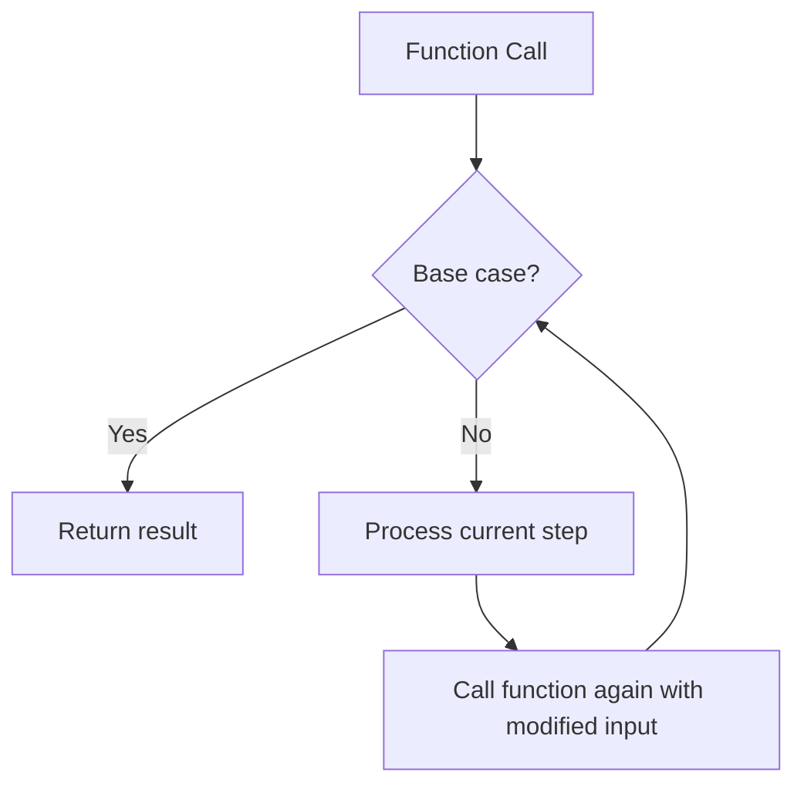
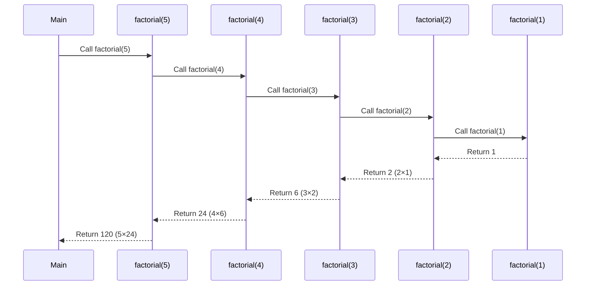

# PHP Recursion

## Introduction

Recursion is a powerful programming concept where a function calls itself to solve a problem. Think of it as a function looking in a mirror and seeing itself! In PHP, recursive functions can help you solve complex problems by breaking them down into smaller, identical sub-problems.

This tutorial will walk you through the concept of recursion in PHP, demonstrate how to implement recursive functions, and show you practical applications where recursion shines.

## Understanding Recursion

Recursion consists of two essential components:

1. **Base case**: A condition that stops the recursion (prevents infinite loops)
2. **Recursive case**: The part where the function calls itself with a modified input

Let's visualize the recursive process:



## Your First Recursive Function

Let's start with a simple example: calculating the factorial of a number.

The factorial of a number n (written as n!) is the product of all positive integers less than or equal to n.

For example:
- 5! = 5 × 4 × 3 × 2 × 1 = 120
- 3! = 3 × 2 × 1 = 6

Here's how we can implement this using recursion:

```php
function factorial($n) {
    // Base case: factorial of 0 or 1 is 1
    if ($n <= 1) {
        return 1;
    }
    
    // Recursive case: n! = n × (n-1)!
    return $n * factorial($n - 1);
}

// Testing our function
echo "Factorial of 5: " . factorial(5) . "
";  // Output: Factorial of 5: 120
echo "Factorial of 3: " . factorial(3) . "
";  // Output: Factorial of 3: 6
```

### How It Works

When we call `factorial(5)`, here's what happens:

1. Is 5 `<= 1?` No, so we calculate `5 × factorial(4)`
2. Is 4 `<= 1?` No, so we calculate `4 × factorial(3)`
3. Is 3 `<= 1?` No, so we calculate `3 × factorial(2)`
4. Is 2 `<= 1?` No, so we calculate `2 × factorial(1)`
5. Is `1 <= 1?` Yes, so `factorial(1)` returns `1`
6. Now we can calculate: `2 × 1 = 2`
7. Then: `3 × 2 = 6`
8. Then: `4 × 6 = 24`
9. Finally: `5 × 24 = 120`

## Practical Examples

### Example 1: Directory Structure Explorer

One practical use of recursion is to navigate through directory structures. Let's create a function that lists all files in a directory and its subdirectories:

```php
function listAllFiles($directory) {
    $files = [];
    
    // Get all items in the directory
    $items = scandir($directory);
    
    foreach ($items as $item) {
        // Skip . and .. directories
        if ($item == '.' || $item == '..') {
            continue;
        }
        
        $path = $directory . '/' . $item;
        
        if (is_dir($path)) {
            // If it's a directory, recursively scan it and add results
            $files = array_merge($files, listAllFiles($path));
        } else {
            // If it's a file, add it to our list
            $files[] = $path;
        }
    }
    
    return $files;
}

// Example usage
$allFiles = listAllFiles('/path/to/directory');
foreach ($allFiles as $file) {
    echo $file . "
";
}
```

### Example 2: Creating a Nested Menu from Database

Another common use case is building hierarchical structures, like menus:

```php
function buildMenu($menuItems, $parentId = 0) {
    $html = '<ul>';
    
    foreach ($menuItems as $item) {
        if ($item['parent_id'] == $parentId) {
            $html .= '<li>';
            $html .= '<a href="' . $item['url'] . '">' . $item['title'] . '</a>';
            
            // Check if this item has children
            $hasChildren = false;
            foreach ($menuItems as $childItem) {
                if ($childItem['parent_id'] == $item['id']) {
                    $hasChildren = true;
                    break;
                }
            }
            
            if ($hasChildren) {
                // Recursively build submenu
                $html .= buildMenu($menuItems, $item['id']);
            }
            
            $html .= '</li>';
        }
    }
    
    $html .= '</ul>';
    return $html;
}

// Example data (typically would come from a database)
$menuItems = [
    ['id' => 1, 'title' => 'Home', 'url' => '/', 'parent_id' => 0],
    ['id' => 2, 'title' => 'About', 'url' => '/about', 'parent_id' => 0],
    ['id' => 3, 'title' => 'Services', 'url' => '/services', 'parent_id' => 0],
    ['id' => 4, 'title' => 'Web Development', 'url' => '/services/web', 'parent_id' => 3],
    ['id' => 5, 'title' => 'Mobile Apps', 'url' => '/services/mobile', 'parent_id' => 3],
    ['id' => 6, 'title' => 'Team', 'url' => '/about/team', 'parent_id' => 2]
];

echo buildMenu($menuItems);
```

## Common Recursive Algorithms

### Fibonacci Sequence

The Fibonacci sequence is a series where each number is the sum of the two preceding ones (0, 1, 1, 2, 3, 5, 8, ...).

```php
function fibonacci($n) {
    // Base cases
    if ($n == 0) return 0;
    if ($n == 1) return 1;
    
    // Recursive case
    return fibonacci($n - 1) + fibonacci($n - 2);
}

// Example outputs
for ($i = 0; $i < 10; $i++) {
    echo "Fibonacci($i) = " . fibonacci($i) . "
";
}

/* Output:
Fibonacci(0) = 0
Fibonacci(1) = 1
Fibonacci(2) = 1
Fibonacci(3) = 2
Fibonacci(4) = 3
Fibonacci(5) = 5
Fibonacci(6) = 8
Fibonacci(7) = 13
Fibonacci(8) = 21
Fibonacci(9) = 34
*/
```

:::note
While this recursive implementation is clear and easy to understand, it's not efficient for large values of n because it recalculates the same values multiple times. For production code, consider using memoization or an iterative approach.
:::

### Binary Search

Binary search is an efficient algorithm for finding an element in a sorted array:

```php
function binarySearch($arr, $x, $left = null, $right = null) {
    // Initialize left and right on first call
    if ($left === null) $left = 0;
    if ($right === null) $right = count($arr) - 1;
    
    // Base case: element not found
    if ($left > $right) return -1;
    
    // Find the middle index
    $mid = floor(($left + $right) / 2);
    
    // Check if x is at mid
    if ($arr[$mid] == $x) return $mid;
    
    // If x is smaller, search the left half
    if ($arr[$mid] > $x) {
        return binarySearch($arr, $x, $left, $mid - 1);
    }
    
    // If x is larger, search the right half
    return binarySearch($arr, $x, $mid + 1, $right);
}

// Example
$sortedArray = [1, 2, 3, 4, 5, 6, 7, 8, 9, 10];
$position = binarySearch($sortedArray, 7);
echo "Element found at index: " . $position;  // Output: Element found at index: 6
```

## Understanding the Call Stack

When a function calls itself recursively, each call is added to the "call stack." The stack grows with each recursive call and shrinks as each call returns.

Let's visualize what happens in the factorial example:



## Recursion vs. Iteration

While recursion is elegant for certain problems, it comes with trade-offs:

| Recursion | Iteration |
|-----------|-----------|
| More elegant for tree-like structures | Usually more efficient |
| Can be less efficient (memory, speed) | More explicit control flow |
| More intuitive for divide-and-conquer | Better for simple repetitive tasks |
| Risk of stack overflow | No stack overflow risk |

## Preventing Stack Overflow

In PHP, the call stack has a limited size. If your recursion is too deep, you might encounter a "Maximum function nesting level reached" error.

You can adjust this limit with:

```php
ini_set('xdebug.max_nesting_level', 500);  // Increase limit if you have Xdebug enabled
```

Better approaches include:

1. **Tail recursion**: Restructuring your function so the recursive call is the last operation
2. **Memoization**: Storing previously calculated results to avoid duplicate calculations
3. **Converting to iteration**: For some problems, an iterative solution might be better

## Example: Improving the Fibonacci Function with Memoization

```php
function efficientFibonacci($n, &$memo = []) {
    // Check if we've already calculated this value
    if (isset($memo[$n])) {
        return $memo[$n];
    }
    
    // Base cases
    if ($n == 0) return 0;
    if ($n == 1) return 1;
    
    // Calculate and store the result
    $memo[$n] = efficientFibonacci($n - 1, $memo) + efficientFibonacci($n - 2, $memo);
    return $memo[$n];
}

// Test with a larger number
echo "Fibonacci(30) = " . efficientFibonacci(30);  // Much faster than the original version
```

## Summary

Recursion is a powerful technique in PHP programming that allows you to:

- Solve complex problems by breaking them into simpler, identical sub-problems
- Work elegantly with hierarchical data structures like directories, trees, and nested arrays
- Implement classic algorithms like factorial, Fibonacci, and binary search

When implementing recursion, always remember:

1. Define a clear base case to prevent infinite recursion
2. Ensure each recursive call moves closer to the base case
3. Consider performance implications for deep recursion
4. Use optimization techniques like memoization for efficiency

## Exercises

1. **Count Files by Extension**: Modify the directory explorer function to count files by their extension.
2. **Calculate Sum of Array**: Write a recursive function to calculate the sum of all elements in an array.
3. **Palindrome Checker**: Create a recursive function that checks if a string is a palindrome.
4. **Power Function**: Implement a recursive function to calculate x^n (x raised to the power of n).
5. **Tree Traversal**: If you have a nested array representing a tree structure, write functions to traverse it in pre-order, in-order, and post-order.

## Additional Resources

- [PHP Manual: Recursive Functions](https://www.php.net/manual/en/functions.user-defined.php)
- [Introduction to Algorithms](https://mitpress.mit.edu/books/introduction-algorithms-third-edition) by Cormen, Leiserson, Rivest, and Stein
- [PHP: The Right Way](https://phptherightway.com/)
- [Data Structures and Algorithms in PHP](https://github.com/TheAlgorithms/PHP)

Happy coding! Recursion might seem tricky at first, but with practice, you'll find it's an invaluable tool in your PHP programming toolkit.