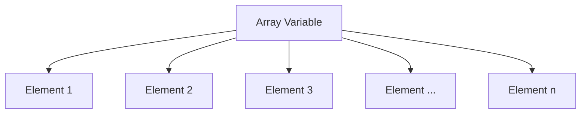

# PHP Arrays Basics

## Introduction

Arrays are one of the most powerful and essential data structures in PHP. They allow you to store multiple values in a single variable, making data organization and manipulation much more efficient. Whether you're building a simple contact form or a complex web application, understanding PHP arrays is crucial for your journey as a PHP developer.

In this tutorial, we'll explore the fundamentals of PHP arrays, including how to create them, access their elements, and perform basic operations. By the end, you'll have a solid foundation in working with arrays in PHP.

## What is an Array?

An array in PHP is a special variable that can hold multiple values under a single name. You can think of an array as a collection of related items, like a list of student names, product prices, or user information.



## Types of Arrays in PHP

PHP supports three main types of arrays:

1. **Indexed Arrays**: Arrays with numeric indices
2. **Associative Arrays**: Arrays with named keys
3. **Multidimensional Arrays**: Arrays containing one or more arrays

Let's examine each type in detail.

## Creating Arrays in PHP

### 1. Indexed Arrays

Indexed arrays use numeric indices that typically start at 0. There are several ways to create indexed arrays in PHP.

#### Method 1: Using the array() function

```php
<?php
// Creating an indexed array using array() function
$fruits = array("Apple", "Banana", "Cherry", "Orange");

// Print the array
print_r($fruits);
?>
```

**Output:**
```
Array
(
    [0] => Apple
    [1] => Banana
    [2] => Cherry
    [3] => Orange
)
```

#### Method 2: Using short array syntax (PHP 5.4+)

```php
<?php
// Creating an indexed array using short syntax
$fruits = ["Apple", "Banana", "Cherry", "Orange"];

// Print the array
print_r($fruits);
?>
```

**Output:**
```
Array
(
    [0] => Apple
    [1] => Banana
    [2] => Cherry
    [3] => Orange
)
```

#### Method 3: Defining indices explicitly

```php
<?php
// Creating an indexed array with explicit indices
$fruits = array();
$fruits[0] = "Apple";
$fruits[1] = "Banana";
$fruits[2] = "Cherry";
$fruits[3] = "Orange";

// Print the array
print_r($fruits);
?>
```

**Output:**
```
Array
(
    [0] => Apple
    [1] => Banana
    [2] => Cherry
    [3] => Orange
)
```

### 2. Associative Arrays

Associative arrays use named keys instead of numeric indices. This makes them extremely useful when you want to store data that can be associated with specific labels.

```php
<?php
// Creating an associative array
$employee = array(
    "name" => "John Smith",
    "age" => 35,
    "position" => "Web Developer",
    "department" => "IT"
);

// Print the array
print_r($employee);
?>
```

**Output:**
```
Array
(
    [name] => John Smith
    [age] => 35
    [position] => Web Developer
    [department] => IT
)
```

Using short syntax:

```php
<?php
// Creating an associative array with short syntax
$employee = [
    "name" => "John Smith",
    "age" => 35,
    "position" => "Web Developer",
    "department" => "IT"
];

// Print the array
print_r($employee);
?>
```

### 3. Multidimensional Arrays

Multidimensional arrays are arrays containing one or more arrays. They're useful for storing complex data structures like tables or matrices.

```php
<?php
// Creating a multidimensional array
$employees = [
    [
        "name" => "John Smith",
        "age" => 35,
        "position" => "Web Developer"
    ],
    [
        "name" => "Sarah Johnson",
        "age" => 28,
        "position" => "UX Designer"
    ],
    [
        "name" => "Michael Brown",
        "age" => 42,
        "position" => "Project Manager"
    ]
];

// Print the array
print_r($employees);
?>
```

**Output:**
```
Array
(
    [0] => Array
        (
            [name] => John Smith
            [age] => 35
            [position] => Web Developer
        )
    [1] => Array
        (
            [name] => Sarah Johnson
            [age] => 28
            [position] => UX Designer
        )
    [2] => Array
        (
            [name] => Michael Brown
            [age] => 42
            [position] => Project Manager
        )
)
```

## Accessing Array Elements

### Accessing Indexed Arrays

To access elements in an indexed array, you use the array name followed by the index in square brackets.

```php
<?php
$fruits = ["Apple", "Banana", "Cherry", "Orange"];

// Accessing array elements
echo "First fruit: " . $fruits[0] . "<br>";
echo "Second fruit: " . $fruits[1] . "<br>";
echo "Third fruit: " . $fruits[2] . "<br>";
?>
```

**Output:**
```
First fruit: Apple
Second fruit: Banana
Third fruit: Cherry
```

### Accessing Associative Arrays

For associative arrays, you use the named key instead of a numeric index.

```php
<?php
$employee = [
    "name" => "John Smith",
    "age" => 35,
    "position" => "Web Developer",
    "department" => "IT"
];

// Accessing array elements
echo "Name: " . $employee["name"] . "<br>";
echo "Age: " . $employee["age"] . "<br>";
echo "Position: " . $employee["position"] . "<br>";
?>
```

**Output:**
```
Name: John Smith
Age: 35
Position: Web Developer
```

### Accessing Multidimensional Arrays

To access elements in a multidimensional array, you need to use multiple indices.

```php
<?php
$employees = [
    [
        "name" => "John Smith",
        "age" => 35,
        "position" => "Web Developer"
    ],
    [
        "name" => "Sarah Johnson",
        "age" => 28,
        "position" => "UX Designer"
    ]
];

// Accessing elements in a multidimensional array
echo "First employee name: " . $employees[0]["name"] . "<br>";
echo "Second employee position: " . $employees[1]["position"] . "<br>";
?>
```

**Output:**
```
First employee name: John Smith
Second employee position: UX Designer
```

## Common Array Operations

### 1. Getting Array Length

The `count()` function returns the number of elements in an array.

```php
<?php
$fruits = ["Apple", "Banana", "Cherry", "Orange"];
echo "Number of fruits: " . count($fruits);
?>
```

**Output:**
```
Number of fruits: 4
```

### 2. Adding Elements to an Array

You can add elements to an array in several ways:

```php
<?php
// Method 1: Add element to the end of an indexed array
$fruits = ["Apple", "Banana", "Cherry"];
$fruits[] = "Orange"; // Adds to the end of the array

// Method 2: Using array_push() to add one or more elements
array_push($fruits, "Mango", "Grapes");

// Method 3: Add element to an associative array
$employee = [
    "name" => "John Smith",
    "age" => 35
];
$employee["position"] = "Web Developer"; // Adds a new key-value pair

print_r($fruits);
print_r($employee);
?>
```

**Output:**
```
Array
(
    [0] => Apple
    [1] => Banana
    [2] => Cherry
    [3] => Orange
    [4] => Mango
    [5] => Grapes
)
Array
(
    [name] => John Smith
    [age] => 35
    [position] => Web Developer
)
```

### 3. Removing Elements from an Array

PHP provides several functions to remove elements from arrays:

```php
<?php
$fruits = ["Apple", "Banana", "Cherry", "Orange", "Mango"];

// Remove the last element
$last = array_pop($fruits);
echo "Removed last element: $last<br>";

// Remove the first element
$first = array_shift($fruits);
echo "Removed first element: $first<br>";

// Remove a specific element (removes "Cherry" at index 1)
unset($fruits[1]);

print_r($fruits);
?>
```

**Output:**
```
Removed last element: Mango
Removed first element: Apple
Array
(
    [1] => Banana
)
```

### 4. Checking if an Element Exists

Use the `in_array()` function to check if a value exists in an array or `array_key_exists()` to check if a key exists.

```php
<?php
$fruits = ["Apple", "Banana", "Cherry", "Orange"];

// Check if value exists
if (in_array("Banana", $fruits)) {
    echo "Banana is in the fruits array.<br>";
}

// Check if key exists
$employee = ["name" => "John", "age" => 35];
if (array_key_exists("age", $employee)) {
    echo "Age key exists in the employee array.";
}
?>
```

**Output:**
```
Banana is in the fruits array.
Age key exists in the employee array.
```

## Practical Examples

### Example 1: Shopping Cart

A simple shopping cart using associative arrays:

```php
<?php
// Shopping cart items
$cart = [
    [
        "product_id" => 101,
        "name" => "PHP for Beginners Book",
        "price" => 29.99,
        "quantity" => 1
    ],
    [
        "product_id" => 202,
        "name" => "Web Development Course",
        "price" => 199.00,
        "quantity" => 1
    ],
    [
        "product_id" => 303,
        "name" => "Code Editor Pro License",
        "price" => 59.99,
        "quantity" => 2
    ]
];

// Calculate total
$total = 0;
echo "<h3>Shopping Cart</h3>";
echo "<ul>";
foreach ($cart as $item) {
    $itemTotal = $item["price"] * $item["quantity"];
    $total += $itemTotal;
    echo "<li>{$item["name"]} - {$item["quantity"]} x \${$item["price"]} = \$" . number_format($itemTotal, 2) . "</li>";
}
echo "</ul>";
echo "<strong>Total: \$" . number_format($total, 2) . "</strong>";
?>
```

**Output:**
```
Shopping Cart

• PHP for Beginners Book - 1 x $29.99 = $29.99
• Web Development Course - 1 x $199.00 = $199.00
• Code Editor Pro License - 2 x $59.99 = $119.98

Total: $348.97
```

### Example 2: Student Grades Tracker

Using arrays to store and calculate student grades:

```php
<?php
// Student grades
$students = [
    "John" => [85, 90, 78, 88, 95],
    "Sarah" => [92, 88, 94, 90, 89],
    "Michael" => [75, 80, 85, 72, 78]
];

// Calculate average grades
echo "<h3>Student Grade Averages</h3>";
echo "<table border='1' cellpadding='5'>";
echo "<tr><th>Student</th><th>Average Grade</th><th>Status</th></tr>";

foreach ($students as $name => $grades) {
    $average = array_sum($grades) / count($grades);
    $status = ($average >= 80) ? "Passed" : "Needs Improvement";
    $statusColor = ($average >= 80) ? "green" : "red";
    
    echo "<tr>";
    echo "<td>$name</td>";
    echo "<td>" . number_format($average, 1) . "</td>";
    echo "<td style='color: $statusColor'>$status</td>";
    echo "</tr>";
}

echo "</table>";
?>
```

**Output:**
```
Student Grade Averages

Student | Average Grade | Status
--------|---------------|--------
John    | 87.2          | Passed
Sarah   | 90.6          | Passed
Michael | 78.0          | Needs Improvement
```

## Summary

In this tutorial, we've covered the basics of PHP arrays, including:

- What arrays are and why they're important
- Different types of arrays (indexed, associative, and multidimensional)
- How to create arrays using various methods
- Accessing array elements
- Common array operations like adding, removing, and finding elements
- Practical examples demonstrating real-world applications

Arrays are fundamental to PHP programming and form the backbone of data manipulation in web applications. Mastering arrays will significantly enhance your ability to build dynamic and data-driven websites.

## Exercises

To practice your PHP array skills, try these exercises:

1. Create an indexed array of your five favorite movies and display them in an ordered list.
2. Create an associative array representing a book with properties like title, author, year, and genre, then display the information in a formatted way.
3. Create a multidimensional array to store information about three different countries (name, capital, population, languages) and display the data in a table.
4. Write a script that finds the maximum and minimum values in an array of numbers.
5. Create a simple to-do list application that stores tasks in an array and allows adding and removing tasks.

## Additional Resources

For more information about PHP arrays, check out these resources:

- [PHP Array Functions - Official PHP Documentation](https://www.php.net/manual/en/ref.array.php)
- [PHP Array Methods - W3Schools](https://www.w3schools.com/php/php_ref_array.asp)
- [Advanced Array Techniques in PHP](https://www.phptutorial.net/)