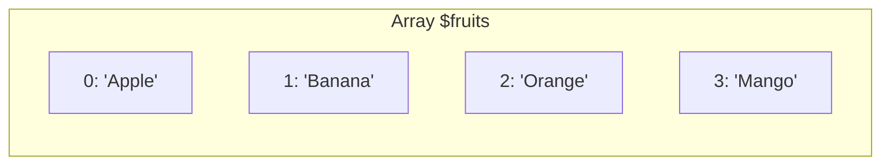

# PHP Indexed Arrays

## Introduction

Indexed arrays are one of the fundamental data structures in PHP that allow you to store multiple values in a single variable. Unlike variables that can hold only one value, arrays can store an ordered collection of data under a single name. In PHP, indexed arrays use numeric indices (keys) to access their elements, with the first element starting at index 0.

This guide will walk you through everything you need to know about PHP indexed arrays, from creation to manipulation, with practical examples that you can apply in your projects.

## What is an Indexed Array?

An indexed array in PHP is a type of array where each element is associated with a numeric index. You can think of an indexed array as a numbered list where:

- Each item in the list has a position (index)
- Indices typically start from 0 (zero-based indexing)
- Elements are stored in the order they were added (unless explicitly reordered)

Here's a visual representation of an indexed array:



## Creating Indexed Arrays in PHP

PHP offers multiple ways to create indexed arrays. Let's explore the most common methods:

### Method 1: Using the array() Function

The traditional way to create an array in PHP is using the `array()` function:

```php
$fruits = array("Apple", "Banana", "Orange", "Mango");

// Output the array
print_r($fruits);
```

**Output:**
```
Array
(
    [0] => Apple
    [1] => Banana
    [2] => Orange
    [3] => Mango
)
```

### Method 2: Using Square Brackets (Short Syntax)

Since PHP 5.4, you can use a shorter syntax with square brackets:

```php
$colors = ["Red", "Green", "Blue", "Yellow"];

// Output the array
print_r($colors);
```

**Output:**
```
Array
(
    [0] => Red
    [1] => Green
    [2] => Blue
    [3] => Yellow
)
```

### Method 3: Creating an Empty Array and Adding Elements

You can also create an empty array and add elements one by one:

```php
// Create an empty array
$numbers = [];

// Add elements
$numbers[] = 10;
$numbers[] = 20;
$numbers[] = 30;
$numbers[] = 40;

// Output the array
print_r($numbers);
```

**Output:**
```
Array
(
    [0] => 10
    [1] => 20
    [2] => 30
    [3] => 40
)
```

Notice that when you use `$array[] = value`, PHP automatically assigns the next available index to the new element.

## Accessing Elements in an Indexed Array

To access elements in an indexed array, you use the array name followed by the index in square brackets:

```php
$fruits = ["Apple", "Banana", "Orange", "Mango"];

// Accessing individual elements
echo "First fruit: " . $fruits[0] . "<br>";
echo "Second fruit: " . $fruits[1] . "<br>";
echo "Third fruit: " . $fruits[2] . "<br>";
echo "Fourth fruit: " . $fruits[3] . "<br>";
```

**Output:**
```
First fruit: Apple
Second fruit: Banana
Third fruit: Orange
Fourth fruit: Mango
```

## Modifying Elements in an Indexed Array

You can change the value of an existing element by referring to its index:

```php
$fruits = ["Apple", "Banana", "Orange", "Mango"];

// Before modification
echo "Before: " . $fruits[1] . "<br>";

// Modify the second element
$fruits[1] = "Strawberry";

// After modification
echo "After: " . $fruits[1] . "<br>";

// Output the entire modified array
print_r($fruits);
```

**Output:**
```
Before: Banana
After: Strawberry
Array
(
    [0] => Apple
    [1] => Strawberry
    [2] => Orange
    [3] => Mango
)
```

## Finding the Size of an Indexed Array

To determine how many elements an array contains, use the `count()` function:

```php
$fruits = ["Apple", "Banana", "Orange", "Mango"];
$count = count($fruits);

echo "The array contains " . $count . " elements.";
```

**Output:**
```
The array contains 4 elements.
```

## Looping Through Indexed Arrays

One of the most powerful features of arrays is the ability to process all elements using loops. There are several ways to iterate through an indexed array:

### Using a for Loop

```php
$fruits = ["Apple", "Banana", "Orange", "Mango"];
$count = count($fruits);

for ($i = 0; $i < $count; $i++) {
    echo "Element at index " . $i . " is: " . $fruits[$i] . "<br>";
}
```

**Output:**
```
Element at index 0 is: Apple
Element at index 1 is: Banana
Element at index 2 is: Orange
Element at index 3 is: Mango
```

### Using a foreach Loop

The `foreach` loop is specifically designed for arrays and is often more convenient:

```php
$fruits = ["Apple", "Banana", "Orange", "Mango"];

foreach ($fruits as $fruit) {
    echo $fruit . "<br>";
}
```

**Output:**
```
Apple
Banana
Orange
Mango
```

If you need both the index and value while iterating:

```php
$fruits = ["Apple", "Banana", "Orange", "Mango"];

foreach ($fruits as $index => $fruit) {
    echo "Index " . $index . ": " . $fruit . "<br>";
}
```

**Output:**
```
Index 0: Apple
Index 1: Banana
Index 2: Orange
Index 3: Mango
```

## Common Array Functions for Indexed Arrays

PHP provides many built-in functions to work with arrays. Here are some of the most useful ones for indexed arrays:

### Adding and Removing Elements

```php
$fruits = ["Apple", "Banana", "Orange"];

// Add an element to the end
array_push($fruits, "Mango");

// Add an element to the beginning
array_unshift($fruits, "Strawberry");

// Remove an element from the end
$last = array_pop($fruits);

// Remove an element from the beginning
$first = array_shift($fruits);

echo "Removed from beginning: " . $first . "<br>";
echo "Removed from end: " . $last . "<br>";
print_r($fruits);
```

**Output:**
```
Removed from beginning: Strawberry
Removed from end: Mango
Array
(
    [0] => Apple
    [1] => Banana
    [2] => Orange
)
```

### Sorting Arrays

```php
$numbers = [5, 3, 8, 1, 7];

// Sort in ascending order
sort($numbers);
echo "Ascending order: ";
print_r($numbers);

// Sort in descending order
rsort($numbers);
echo "Descending order: ";
print_r($numbers);
```

**Output:**
```
Ascending order: Array
(
    [0] => 1
    [1] => 3
    [2] => 5
    [3] => 7
    [4] => 8
)
Descending order: Array
(
    [0] => 8
    [1] => 7
    [2] => 5
    [3] => 3
    [4] => 1
)
```

### Checking if an Element Exists

```php
$fruits = ["Apple", "Banana", "Orange", "Mango"];

// Check if a value exists
$hasBanana = in_array("Banana", $fruits);
$hasKiwi = in_array("Kiwi", $fruits);

echo "Has Banana: " . ($hasBanana ? "Yes" : "No") . "<br>";
echo "Has Kiwi: " . ($hasKiwi ? "Yes" : "No") . "<br>";

// Find the index of a value
$orangeIndex = array_search("Orange", $fruits);
echo "Orange is at index: " . $orangeIndex;
```

**Output:**
```
Has Banana: Yes
Has Kiwi: No
Orange is at index: 2
```

## Practical Examples

Now let's look at some practical examples of how indexed arrays can be used in real-world applications:

### Example 1: Student Grades Calculation

```php
// Array of student grades
$grades = [85, 92, 78, 96, 88, 75];

// Calculate the average grade
$total = 0;
foreach ($grades as $grade) {
    $total += $grade;
}
$average = $total / count($grades);

// Find the highest and lowest grades
$highest = max($grades);
$lowest = min($grades);

echo "Grades: " . implode(", ", $grades) . "<br>";
echo "Average Grade: " . round($average, 2) . "<br>";
echo "Highest Grade: " . $highest . "<br>";
echo "Lowest Grade: " . $lowest . "<br>";
```

**Output:**
```
Grades: 85, 92, 78, 96, 88, 75
Average Grade: 85.67
Highest Grade: 96
Lowest Grade: 75
```

### Example 2: Simple Shopping Cart

```php
// Product catalog with prices
$products = ["Laptop" => 999.99, "Phone" => 499.50, "Tablet" => 299.75, "Headphones" => 149.25];

// Shopping cart (indexed array of product names)
$cart = ["Phone", "Headphones", "Headphones"];

// Calculate the total price
$totalPrice = 0;
foreach ($cart as $item) {
    if (isset($products[$item])) {
        $totalPrice += $products[$item];
    }
}

// Count items in cart
$itemCount = count($cart);
$uniqueItems = count(array_unique($cart));

echo "Shopping Cart (" . $itemCount . " items, " . $uniqueItems . " unique):<br>";
foreach (array_count_values($cart) as $item => $quantity) {
    echo "- " . $item . " x" . $quantity . ": $" . ($products[$item] * $quantity) . "<br>";
}
echo "Total: $" . number_format($totalPrice, 2);
```

**Output:**
```
Shopping Cart (3 items, 2 unique):
- Phone x1: $499.5
- Headphones x2: $298.5
Total: $798.00
```

### Example 3: Image Gallery

```php
// Array of image filenames
$gallery = ["sunset.jpg", "mountains.jpg", "beach.jpg", "forest.jpg"];

// Generate HTML for the gallery
echo "<div class='gallery'>
";
foreach ($gallery as $index => $image) {
    echo "  <div class='image-container'>
";
    echo "    
";
    echo "    <p>Image " . ($index + 1) . ": " . $image . "</p>
";
    echo "  </div>
";
}
echo "</div>";
```

**Output:**
```html
<div class='gallery'>
  <div class='image-container'>
    
    <p>Image 1: sunset.jpg</p>
  </div>
  <div class='image-container'>
    
    <p>Image 2: mountains.jpg</p>
  </div>
  <div class='image-container'>
    
    <p>Image 3: beach.jpg</p>
  </div>
  <div class='image-container'>
    
    <p>Image 4: forest.jpg</p>
  </div>
</div>
```

## Common Pitfalls and Best Practices

When working with indexed arrays in PHP, keep these tips in mind:

1. **Array indices start at 0**: The first element is at index 0, not 1.

2. **Watch out for non-continuous indices**: If you remove elements from an array using `unset()`, the indices won't be reindexed automatically:

   ```php
   $numbers = [10, 20, 30, 40, 50];
   unset($numbers[2]); // Removes the element at index 2 (value 30)
   print_r($numbers);
   ```

   **Output:**
   ```
   Array
   (
       [0] => 10
       [1] => 20
       [3] => 40
       [4] => 50
   )
   ```

   Notice that index 2 is missing. To reindex the array, use `array_values()`:

   ```php
   $numbers = array_values($numbers);
   print_r($numbers);
   ```

   **Output:**
   ```
   Array
   (
       [0] => 10
       [1] => 20
       [2] => 40
       [3] => 50
   )
   ```

3. **Check if an index exists**: Before accessing an element, check if the index exists to avoid warnings:

   ```php
   $fruits = ["Apple", "Banana", "Orange"];
   
   // Correct way to check if an index exists
   if (isset($fruits[5])) {
       echo $fruits[5];
   } else {
       echo "Index 5 does not exist";
   }
   ```

4. **Use array functions**: PHP has a rich set of built-in array functions. Learn to use them instead of reinventing the wheel.

## Summary

PHP indexed arrays are a powerful way to store and manipulate collections of data. In this tutorial, we've covered:

- Creating indexed arrays using different methods
- Accessing and modifying array elements
- Finding the size of an array
- Looping through arrays with `for` and `foreach`
- Using common array functions for manipulation and searching
- Real-world practical examples
- Common pitfalls and best practices

Indexed arrays are just the beginning of PHP's array capabilities. As you progress, you'll also learn about associative arrays (with named keys) and multidimensional arrays (arrays of arrays).

## Exercises

To solidify your understanding, try these exercises:

1. Create an indexed array of your favorite movies and output them in a numbered list.
2. Write a function that takes an array of numbers and returns a new array with only the even numbers.
3. Create a program that builds a pyramid pattern using a loop and an array.
4. Build a simple to-do list application that uses an indexed array to store tasks.
5. Create a function that merges two indexed arrays and sorts the result.

## Additional Resources

- [PHP Official Documentation on Arrays](https://www.php.net/manual/en/language.types.array.php)
- [PHP Array Functions Reference](https://www.php.net/manual/en/ref.array.php)
- [W3Schools PHP Array Tutorial](https://www.w3schools.com/php/php_arrays.asp)

Happy coding with PHP indexed arrays!