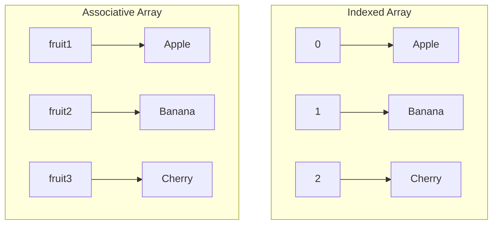

# PHP Associative Arrays

## Introduction

In PHP, arrays are versatile data structures that allow you to store multiple values in a single variable. While regular indexed arrays use numeric indices starting from 0, **associative arrays** use named keys that you assign yourself. This makes associative arrays a powerful tool for storing and retrieving related data in a more intuitive way.

Think of associative arrays as dictionaries or maps in other programming languages, where each value is associated with a specific key. This key-value pair structure allows for more descriptive and meaningful organization of data.

## What Are Associative Arrays?

An associative array is a collection of key-value pairs where:
- Each key is unique within the array
- Keys can be strings or numbers (automatically converted to strings)
- Values can be of any data type (including other arrays)
- The order of elements can be maintained (since PHP 7.0)

## Creating Associative Arrays

There are several ways to create associative arrays in PHP:

### Method 1: Using the array() Function

```php
<?php
// Creating an associative array of student scores
$studentScores = array(
    "John" => 85,
    "Sarah" => 92,
    "Mike" => 78,
    "Lisa" => 90
);
?>
```

### Method 2: Using Square Bracket Syntax (Short Array Syntax)

```php
<?php
// The same array using short syntax (PHP 5.4+)
$studentScores = [
    "John" => 85,
    "Sarah" => 92,
    "Mike" => 78,
    "Lisa" => 90
];
?>
```

### Method 3: Creating an Empty Array and Adding Elements

```php
<?php
// Start with an empty array
$studentScores = [];

// Add elements one by one
$studentScores["John"] = 85;
$studentScores["Sarah"] = 92;
$studentScores["Mike"] = 78;
$studentScores["Lisa"] = 90;
?>
```

## Accessing Array Elements

To access elements in an associative array, you use the key name inside square brackets:

```php
<?php
$studentScores = [
    "John" => 85,
    "Sarah" => 92,
    "Mike" => 78,
    "Lisa" => 90
];

// Accessing individual elements
echo "John's score: " . $studentScores["John"] . "<br>";
echo "Sarah's score: " . $studentScores["Sarah"] . "<br>";

// Output:
// John's score: 85
// Sarah's score: 92
?>
```

## Modifying Array Elements

You can modify existing elements by assigning a new value to a specific key:

```php
<?php
$studentScores = [
    "John" => 85,
    "Sarah" => 92,
    "Mike" => 78,
    "Lisa" => 90
];

// Updating an existing value
$studentScores["Mike"] = 82;

echo "Mike's updated score: " . $studentScores["Mike"] . "<br>";
// Output: Mike's updated score: 82
?>
```

## Adding New Elements

To add a new element to an existing associative array, simply assign a value to a new key:

```php
<?php
$studentScores = [
    "John" => 85,
    "Sarah" => 92,
    "Mike" => 78,
    "Lisa" => 90
];

// Adding a new student
$studentScores["Alex"] = 88;

// Displaying the new array
print_r($studentScores);

// Output:
// Array ( [John] => 85 [Sarah] => 92 [Mike] => 78 [Lisa] => 90 [Alex] => 88 )
?>
```

## Removing Elements

To remove an element from an associative array, use the `unset()` function:

```php
<?php
$studentScores = [
    "John" => 85,
    "Sarah" => 92,
    "Mike" => 78,
    "Lisa" => 90
];

// Remove Mike from the array
unset($studentScores["Mike"]);

// Displaying the updated array
print_r($studentScores);

// Output:
// Array ( [John] => 85 [Sarah] => 92 [Lisa] => 90 )
?>
```

## Checking If a Key Exists

Before accessing array elements, sometimes you need to check if a specific key exists. Use the `array_key_exists()` function or the `isset()` function:

```php
<?php
$studentScores = [
    "John" => 85,
    "Sarah" => 92,
    "Mike" => 78,
    "Lisa" => 90
];

// Method 1: Using array_key_exists()
if (array_key_exists("Sarah", $studentScores)) {
    echo "Sarah's score is found: " . $studentScores["Sarah"] . "<br>";
}

// Method 2: Using isset()
if (isset($studentScores["John"])) {
    echo "John's score is found: " . $studentScores["John"] . "<br>";
}

// Checking a non-existing key
if (!isset($studentScores["Alex"])) {
    echo "Alex's score is not found!<br>";
}

// Output:
// Sarah's score is found: 92
// John's score is found: 85
// Alex's score is not found!
?>
```

:::note
The difference between `array_key_exists()` and `isset()` is that `isset()` will return `false` if the key exists but has a `null` value, while `array_key_exists()` will return `true`.
:::

## Looping Through Associative Arrays

There are multiple ways to iterate through an associative array:

### Using foreach Loop

The most common way to loop through an associative array is using the `foreach` loop:

```php
<?php
$studentScores = [
    "John" => 85,
    "Sarah" => 92,
    "Mike" => 78,
    "Lisa" => 90
];

// Method 1: Accessing only values
echo "Student scores:<br>";
foreach ($studentScores as $score) {
    echo "Score: $score<br>";
}

// Method 2: Accessing both keys and values
echo "<br>Student names and scores:<br>";
foreach ($studentScores as $name => $score) {
    echo "$name scored $score<br>";
}

// Output:
// Student scores:
// Score: 85
// Score: 92
// Score: 78
// Score: 90
//
// Student names and scores:
// John scored 85
// Sarah scored 92
// Mike scored 78
// Lisa scored 90
?>
```

### Using each() and while Loop (Deprecated)

:::caution
The `each()` function is deprecated as of PHP 7.2 and removed in PHP 8.0. Use `foreach` instead.
:::

## Array Functions for Associative Arrays

PHP provides many built-in functions to work with associative arrays:

### Getting Keys and Values

```php
<?php
$studentScores = [
    "John" => 85,
    "Sarah" => 92,
    "Mike" => 78,
    "Lisa" => 90
];

// Get all keys
$names = array_keys($studentScores);
echo "Student names: " . implode(", ", $names) . "<br>";
// Output: Student names: John, Sarah, Mike, Lisa

// Get all values
$scores = array_values($studentScores);
echo "Scores: " . implode(", ", $scores) . "<br>";
// Output: Scores: 85, 92, 78, 90
?>
```

### Sorting Associative Arrays

PHP provides several functions to sort associative arrays:

```php
<?php
$studentScores = [
    "John" => 85,
    "Sarah" => 92,
    "Mike" => 78,
    "Lisa" => 90
];

// Sort by values while maintaining key associations (ascending)
asort($studentScores);
echo "Sorted by scores (ascending):<br>";
foreach ($studentScores as $name => $score) {
    echo "$name: $score<br>";
}
// Output:
// Mike: 78
// John: 85
// Lisa: 90
// Sarah: 92

// Sort by values in descending order
arsort($studentScores);
echo "<br>Sorted by scores (descending):<br>";
foreach ($studentScores as $name => $score) {
    echo "$name: $score<br>";
}
// Output:
// Sarah: 92
// Lisa: 90
// John: 85
// Mike: 78

// Sort by keys (alphabetically)
ksort($studentScores);
echo "<br>Sorted by names (A-Z):<br>";
foreach ($studentScores as $name => $score) {
    echo "$name: $score<br>";
}
// Output:
// John: 85
// Lisa: 90
// Mike: 78
// Sarah: 92

// Sort by keys in reverse order
krsort($studentScores);
echo "<br>Sorted by names (Z-A):<br>";
foreach ($studentScores as $name => $score) {
    echo "$name: $score<br>";
}
// Output:
// Sarah: 92
// Mike: 78
// Lisa: 90
// John: 85
?>
```

## Practical Examples

Let's look at some real-world applications of associative arrays:

### Example 1: User Profile Information

```php
<?php
// Storing user profile information
$userProfile = [
    "username" => "john_doe",
    "email" => "john@example.com",
    "first_name" => "John",
    "last_name" => "Doe",
    "age" => 28,
    "location" => "New York"
];

// Displaying user information
echo "<h3>User Profile</h3>";
echo "Username: " . $userProfile["username"] . "<br>";
echo "Name: " . $userProfile["first_name"] . " " . $userProfile["last_name"] . "<br>";
echo "Email: " . $userProfile["email"] . "<br>";
echo "Age: " . $userProfile["age"] . "<br>";
echo "Location: " . $userProfile["location"] . "<br>";

// Output:
// User Profile
// Username: john_doe
// Name: John Doe
// Email: john@example.com
// Age: 28
// Location: New York
?>
```

### Example 2: Shopping Cart

```php
<?php
// Shopping cart with products and quantities
$shoppingCart = [
    "Laptop" => 1,
    "Mouse" => 2,
    "Keyboard" => 1,
    "Headphones" => 3
];

// Product prices
$prices = [
    "Laptop" => 999.99,
    "Mouse" => 24.99,
    "Keyboard" => 59.99,
    "Headphones" => 79.99
];

// Calculate total
$total = 0;
echo "<h3>Shopping Cart</h3>";
echo "<table border='1' cellpadding='5'>";
echo "<tr><th>Product</th><th>Quantity</th><th>Price</th><th>Subtotal</th></tr>";

foreach ($shoppingCart as $product => $quantity) {
    $price = $prices[$product];
    $subtotal = $price * $quantity;
    $total += $subtotal;
    
    echo "<tr>";
    echo "<td>$product</td>";
    echo "<td>$quantity</td>";
    echo "<td>$" . number_format($price, 2) . "</td>";
    echo "<td>$" . number_format($subtotal, 2) . "</td>";
    echo "</tr>";
}

echo "<tr><td colspan='3'><strong>Total</strong></td><td><strong>$" . number_format($total, 2) . "</strong></td></tr>";
echo "</table>";

// Output:
// Shopping Cart (table with product details)
// Total: $1,349.94
?>
```

### Example 3: Configuration Settings

```php
<?php
// Application configuration
$config = [
    "db" => [
        "host" => "localhost",
        "username" => "root",
        "password" => "secret",
        "database" => "myapp"
    ],
    "app" => [
        "name" => "My PHP Application",
        "version" => "1.0.0",
        "debug" => true
    ],
    "paths" => [
        "uploads" => "/var/www/uploads",
        "logs" => "/var/www/logs"
    ]
];

// Accessing nested configuration
echo "<h3>Application Configuration</h3>";
echo "App Name: " . $config["app"]["name"] . "<br>";
echo "Database: " . $config["db"]["database"] . " on " . $config["db"]["host"] . "<br>";
echo "Debug Mode: " . ($config["app"]["debug"] ? "Enabled" : "Disabled") . "<br>";
echo "Upload Path: " . $config["paths"]["uploads"] . "<br>";

// Output:
// Application Configuration
// App Name: My PHP Application
// Database: myapp on localhost
// Debug Mode: Enabled
// Upload Path: /var/www/uploads
?>
```

## Differences Between Indexed and Associative Arrays

Here's a visual representation of the difference between indexed and associative arrays:



## When to Use Associative Arrays

Associative arrays are best used when:

1. Data has a natural key-value relationship
2. You need to reference data by meaningful names instead of numeric indices
3. You're working with structured data like configurations, user profiles, etc.
4. You want to group related data together in a logical way

## Summary

Associative arrays in PHP provide a powerful way to store and manage related data using descriptive keys. They allow for more intuitive data access and manipulation compared to regular indexed arrays. Key points to remember:

- Associative arrays use named keys instead of numeric indices
- Keys must be unique within the array
- They can be created using `array()` or the short `[]` syntax
- Elements can be accessed, modified, added, or removed easily
- Several built-in functions help manipulate and work with associative arrays
- They are ideal for structured data like configurations, user profiles, and more

## Exercises

1. Create an associative array to store contact information (name, email, phone, address) for at least three people.
2. Write a script that counts and displays how many items in your shopping cart cost more than $50.
3. Create a multi-dimensional associative array to store information about three different books (title, author, year, genre, price).
4. Write a function that takes an associative array of products and prices, then returns the most expensive product.
5. Create a web form that submits to a PHP script, then display the form data using an associative array (hint: use the `$_POST` superglobal).

## Additional Resources

- [PHP Official Documentation: Arrays](https://www.php.net/manual/en/language.types.array.php)
- [PHP Array Functions](https://www.php.net/manual/en/ref.array.php)
- [W3Schools PHP Arrays](https://www.w3schools.com/php/php_arrays.asp)